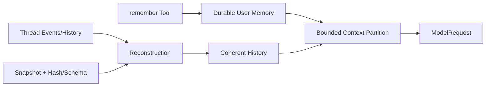

# Memory、Snapshot 与恢复

简体中文 | [English](../../en/05-context-engineering/05-memory-and-snapshot.md)

## 学习目标

区分 User Memory、Conversation History、Compact Summary、Session Metadata 与 State
Snapshot，并理解哪些数据会进入 Model Context。

## 五种不同的持久化概念

| 概念 | 目的 | Model 可见 |
| --- | --- | --- |
| User Memory | 显式长期 Preference/Fact | 受限且 Opt-in |
| Thread History | 因果 User/Assistant/Tool Exchange | 是，直到 Compaction |
| Compact Summary | 旧 History 的确定性替代 | 是 |
| Session Metadata | 组织 Thread/Workspace | 通常否 |
| Snapshot | 经过校验的恢复/Checkpoint Payload | Reconstruction 后按需 |

全部称作“记忆”会掩盖各自的 Authority 与 Retention Rule。



## User Memory

`remember` Tool 向配置 Store 追加简短 Note。它是声明 Memory Resource 的 Write Tool，
并明确禁止存储 Secret。Memory 仅在启用时注入，受 `MaxPromptBytes` 限制，并生成
Partition Receipt。

Memory 是 User Data，不是 Constitution；它可以表达 Preference，不能授予 Authority。

## Memory Write/Read Boundary

Governed Tool 验证 Note Size、拒绝 Likely Secret、声明 Memory Write Resource，并序列化
Concurrent Append。Store 保持在 Configured Root 内，拒绝 Symlink/Path Escape。

Secret Detection 是 Preventive Heuristic，不是完整 DLP。用户不得要求 Agent 持久化
Credential、Token、Private Key 或 Sensitive Repository Content；泄漏后仍需 Rotation/
Deletion。

Read 时 Store 区分 Disabled、Missing、Present、Truncated，并用 Source/Provenance 包装
内容，再应用独立 Prompt Budget。因此 Persisted Bytes 与 Model-visible Bytes 不相同。

## Retention/Authority Matrix

| Data | Retention Owner | Invalidated By | Authority |
| --- | --- | --- | --- |
| User Memory | User/Configured Store | Explicit Edit/Delete | Preference Data |
| Thread History | Runtime/Event Lifecycle | Revert/Compaction View | Causal Fact |
| Compact Summary | Runtime | Later Compaction/Revert | Derived Context |
| Session Metadata | Session Repository | User/Session Lifecycle | Organization |
| Snapshot | Snapshot Repository/CAS | Newer Event/Schema Policy | Restore Hint |

数据不会因为保存更久就变成 Policy。

## Snapshot 与 Reconstruction

Snapshot Repository 存储带 Schema Version 与 Content Hash 的 Payload；加载时拒绝
Corruption 与 Unsupported Schema。Runtime Reconstruction 组合 Durable Event 与
Snapshot，只保留已完成且 Tool-paired 的 History。

Snapshot 加速恢复，但不能覆盖更晚 Event，也不能使 Incomplete Turn 变得有效。Resume
与 Recovery 规则仍属于 Application Runtime。

Snapshot Validation 分层：

1. Schema/Version 证明 Payload Shape 可理解；
2. Content Hash 证明 Stored Bytes 与 Digest 一致；
3. Identity 证明属于 Requested Thread/Turn；
4. Event Reconstruction 保证不覆盖 Later Fact；
5. Semantic Reconstruction 删除 Incomplete Tool Exchange。

Hash Integrity 证明 Byte Equality，不证明 Freshness/Truth。

## 代码地图

| 关注点 | 源码 |
| --- | --- |
| User Memory Store | `internal/adapter/memory` |
| Remember Tool | `internal/adapter/tool/memory` |
| Memory Partition | `promptcontext/context.go` |
| Session Metadata | `internal/persist/session` |
| Snapshot Integrity | `internal/persist/snapshot` |
| History Reconstruction | `runtime/app/reconstruct.go` |

## 设计取舍

自动提取 Memory 方便，却可能持久化 Prompt Injection 或 Secret。CodeHelper 使用显式
Governed Tool 和 Bounded Injection。Event-only Replay 权威但昂贵；Snapshot 提升速度，
Hash/Schema Check 防止盲目信任。

## 失败模式与安全边界

- 未配置时 Memory 不启用。
- Note Size 与 Prompt Partition 分别限额。
- 不得存储 Secret。
- Snapshot Hash/Schema 不匹配被拒绝。
- Incomplete Tool Pair 不进入 Reconstructed History。
- Session Metadata 不自动对 Model 可见。

## 测试与验证

```bash
go test ./internal/adapter/tool/memory
go test ./internal/persist/snapshot ./internal/persist/session
go test ./internal/runtime/app -run TestReconstructThread
```

## 动手实验

阅读 `TestSnapshotRoundTripVerifiesSchemaAndHash`，在测试临时 Payload 中修改一个字节并
观察拒绝；再与 `TestReconstructThreadCommitsOnlyCompletedPairedToolHistory` 的语义
完整性检查比较。

## 复习问题

1. User Memory 为什么不是 Policy Authority？
2. Snapshot Integrity 能证明什么，不能证明什么？
3. Memory 写入为什么应是显式 Governed Tool？
4. Persisted Memory 为什么可以大于 Model-visible Memory？
5. Snapshot Hash Validation 仍不能证明什么？

## 延伸阅读

- [Context Quality 的度量](./06-context-quality.md)

## 事实来源与验证

| 项目 | 值 |
| --- | --- |
| Catalog ID | `context-memory-snapshot` |
| 状态 | `verified` |
| 最后验证 | 2026-08-06 |
