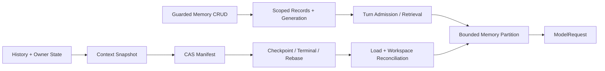

# Memory、Snapshot 与恢复

## 学习目标

区分 User Memory、Truth Capsule、Semantic Narrative、Conversation History、Context
Manifest、Checkpoint 与 Usage Accounting，并理解它们各自的 Authority、更新时机和
恢复语义。

## 前置知识

阅读 [Token Budget、Compaction 与信息损失](./04-budget-and-compaction.md) 与
[Resume、Recovery 与幂等边界](../03-runtime-kernel/06-resume-and-recovery.md)。

## 不同的持久化概念

| 概念 | 目的 | Model 可见 |
| --- | --- | --- |
| User Memory Record | 跨 Turn 保存显式 Preference/Convention/Fact | 检索命中且预算允许时 |
| Truth Capsule | 保存 Runtime 可验证的当前事实 | 是，Mandatory 优先 |
| Semantic Narrative | 保存设计动机与隐含语义 | 可选且非权威 |
| Recent Raw Tail | 保存近期完整因果消息 | 是 |
| Session Metadata | 组织 Thread/Workspace | 通常否 |
| Context Snapshot | 表示一个可恢复的完整 Context 状态 | Reconstruction 后按需 |
| Context Manifest | 用 CAS Base/Tail/Delta 引用持久化 Snapshot | 否 |
| Accounting Delta | 单调累计 Usage/Cost | 否 |

全部称作“记忆”会掩盖各自的 Authority 与 Retention Rule。

## Data Flow



## User Memory

Memory v2 使用带稳定 ID 的 `MemoryRecord`，每条记录包含 Scope、Category、Text、
Source、创建/更新时间、可选过期时间和内容 Digest。Store 每次成功变更递增
Generation；重复 `remember` 按 Digest 幂等返回已有记录。

Scope 分为 `user`、`workspace` 和 `repository`。后两者绑定规范化 Workspace/Repository
Identity，读取、更新和删除都不能越过当前绑定。Category 分为 `preference`、
`convention` 和 `fact`。这些仍是 User Data，不是 Constitution，不能授予 Authority。

## Turn 级 Memory 检索

Memory 不再作为进程启动时的整文件静态前缀。Runtime 在每个 Turn Admission 时以用户
请求作为 Query，冻结该 Turn 的 Memory Snapshot。确定性排序依次考虑：

1. 显式 Pin 顺序；
2. 精确 Scope；
3. 词法匹配分数；
4. 更新时间；
5. 稳定 Record ID。

候选数和 Prompt Bytes 分别受 `memory.max_candidates` 与
`memory.max_prompt_bytes` 限制。Partition Receipt 记录 Generation、Candidate Count、
Selected IDs 和 Truncation。Turn 中执行 Memory 写操作不会改变已冻结输入，只会影响
下一 Turn，避免一次 Turn 内前后 Sample 看到不同长期记忆。

`semantic_rerank` 尚未接线，因此配置为 `true` 会被拒绝，不能伪装成已启用。

## Memory CRUD 与 Guard

`remember`、`memory_list`、`memory_get`、`memory_update` 和 `forget` 都是 Registry 中
的 Tool，按读写能力声明 Memory Resource 并经过统一 Guard。Store 验证 UTF-8、长度、
Scope、Category、Expiry 与 Digest，拒绝 Symlink Escape 和明显 Credential Material，
并通过临时文件、`fsync` 与 Rename 提交记录文件。完整读改写区间由同路径 OS 文件锁
保护，多个 Session、Store 实例或进程不能静默覆盖彼此的 Generation。注入 Prompt 前
还会转义 Memory 正文和 Source 中的分区元字符，记录不能闭合 `<user_memory>` 边界。

Secret Detection 是 Preventive Heuristic，不是完整 DLP。用户不得要求 Agent 持久化
Credential、Token、Private Key 或 Sensitive Repository Content；泄漏后仍需 Rotation
和 Deletion。

## Retention/Authority Matrix

| Data | Retention Owner | Invalidated By | Authority |
| --- | --- | --- | --- |
| User Memory Record | User/Configured Store | Update/Delete/Expiry | Non-authoritative User Data |
| Truth Capsule | Runtime Owner Snapshot | Owner Update/Rebase | Runtime Fact |
| Semantic Narrative | Runtime Context Maintenance | Fence 失配/Expiry/Rebase | Derived Context |
| Recent Raw Tail | Runtime/Event Lifecycle | Revert/Rebase | Causal Fact |
| Session Metadata | Session Repository | User/Session Lifecycle | Organization |
| Context Manifest | Runtime/CAS/SQLite | Newer Revision/Schema Policy | Restore State |
| Usage/Cost | Accounting Owner | 不随 Restore 回退 | Monotonic Fact |

数据不会因为保存更久就变成 Policy。

## Context Snapshot

`ContextSnapshot` 不只保存 History。它同时封装：

- Epoch、Revision、Turn 和 Message Turn；
- Working Set、Evidence、Failures 和 Plan；
- World Baseline、Compaction State 与 Token Window；
- Workspace Identity、Journal Revision、Repository Head 和 Sparse Bound Path Digest。

Snapshot 有独立 Schema Version 与 Digest。它恢复 Model Context 的完整语义状态，但不
包含独立的 Usage/Cost Accounting，也不包含待重放的 Tool Side Effect。

## Context Manifest 与写放大

每个 Terminal 或 Checkpoint 都复制完整 History 会让长期 Session 的写入量随历史长度
增长。`ContextManifest` 将 History 拆为一个 Base Ref 和有界 Tail Refs；Working Set、
Evidence、Failures 与 Plan 各自使用 Base Ref 和有界 Replacement Delta Refs。Owner
内容未变化时直接复用已有 Ref。

Tail 或 Owner Delta 超过 Segment/Byte 上限时生成新 Base。每个 Ref 同时校验 CAS Handle、
SHA-256 Digest 和物理字节数；正常恢复只需读取一个 Base 和有界数量的 Delta。Terminal
路径先 Stage CAS 内容，再提交引用它的 SQLite Terminal 事实；提交失败时释放本次新增
Ref，避免半提交 Manifest 成为可达状态。

Checkpoint v2 保存 Context Manifest 和 Profile，不再重复嵌入完整 Context。对外读取
Checkpoint History 时才从 Manifest 重建兼容投影。

## Workspace-aware Restore/Fork

Restore 和 Fork 先按 Checkpoint 的 Sparse Bound Paths 重新捕获当前 Workspace Binding。
Workspace Identity 或文件 Digest 不匹配时：

- 旧 Change 的 `verified` 被清除；
- 相关 Change、Fact 和 Read 标记为 stale；
- History 中已压缩的 Truth Capsule 同步重建，旧 Narrative 和旧 Workspace
  验证措辞不能继续进入模型输入；
- Result 返回 `exact_context`、`workspace_claims_valid`、`invalidated_claims` 和
  `stale_claims`。

Restore 创建高于当前值和 Checkpoint 值的新 Epoch/Revision；Fork 从新 Thread 的
Epoch/Revision 1 开始。两者都创建新 Token Window，不继续旧 Window 的累计预算。
Receiving Engine 的 Usage/Cost 保持单调，不随 Context 回退；Checkpoint 恢复也明确返回
`side_effects_replayed=false`。API 返回成功前，恢复后的 Snapshot 必须成为
`context_current` 指向的新 Manifest；Fork 的子 Thread 行与初始 Context 基线在同一
SQLite 事务建立。Restore/Fork Event 引用该 Commit 的 ID、Digest、Revision 和 Epoch，
因此没有后续 Turn 时重启也能恢复相同 Context。

## Validation 与 Reconstruction

持久化和恢复分层校验：

1. Schema/Version 证明 Payload Shape 可理解；
2. Ref Digest/Bytes 证明 CAS 内容完整；
3. Manifest Digest 与 Context Digest 绑定结构和重建结果；
4. Thread/Turn/Epoch/Revision 证明对象 Identity；
5. Workspace Reconciliation 重新验证文件相关声明；
6. Causal History Validation 保持 Tool Call/Result 配对。

Hash Integrity 证明 Byte Equality，不证明 Freshness/Truth。

## 代码地图

| 关注点 | 源码 |
| --- | --- |
| Memory Record/Selection | `internal/adapter/memory/records.go` |
| Guarded Memory CRUD | `internal/adapter/tool/memory/memory.go` |
| Turn Memory Snapshot | `runtime/agent/engine/turncontext.go` |
| Context Snapshot/Binding | `runtime/agent/context/session_context.go` |
| Base/Tail/Owner Manifest | `runtime/agent/context/session_manifest.go` |
| Checkpoint CAS | `internal/persist/snapshot/artifact.go` |
| Restore/Fork | `persist/artifact/service.go` |

## 设计取舍

自动提取 Memory 方便，却可能持久化 Prompt Injection 或 Secret。CodeHelper 使用显式
Governed CRUD、Scoped Retrieval 和 Bounded Injection。语义向量检索可能提高 Recall，
但在索引、版本和可重放契约未完成前，确定性词法排序更容易审计。

Event-only Replay 权威但昂贵；每 Turn 全量 Snapshot 又有线性写放大。Manifest 在保持
完整恢复语义的同时复用未变化内容，并把正常加载链限制在有界 Segment 数量内。

## 失败模式与安全边界

- 未配置时 Memory 不启用。
- Record Size、Candidate Count 与 Prompt Partition 分别限额。
- Workspace/Repository Memory 不能跨绑定访问。
- 不得存储 Secret。
- Snapshot/Manifest/CAS Digest 或 Schema 不匹配被拒绝。
- Workspace 不匹配使文件相关验证声明失效，而不是静默沿用。
- Restore/Fork 不重放 Tool Side Effect，也不回退 Usage/Cost。
- Incomplete Tool Pair 不能跨 Rebase Boundary。
- Session Metadata 不自动对 Model 可见。

## 测试与验证

```bash
go test ./internal/adapter/memory ./internal/adapter/tool/memory
go test ./internal/runtime/agent/context
go test ./internal/runtime/agent/engine -run 'Test.*ContextSnapshot'
go test ./internal/persist/snapshot
go test ./internal/runtime/app -run 'Test.*Checkpoint'
```

## 动手实验

阅读 `TestContextManifestReusesHistoryBaseAndBoundsDeltas`，观察追加 History 时 Base Ref
如何保持不变；再修改 Workspace Bound Path，运行 Context Checkpoint 测试并观察
`verified` Claim 被清除。

## 复习问题

1. User Memory 为什么不是 Policy Authority？
2. 为什么 Memory 写入只影响下一 Turn？
3. Context Manifest 如何避免每 Turn 重写完整 History？
4. Workspace Binding 不匹配时为什么必须让 `verified` 失效？
5. Checkpoint Restore 为什么不能回退 Usage/Cost 或重放 Tool Side Effect？
6. Snapshot Hash Validation 仍不能证明什么？

## 延伸阅读

- [Context Quality 的度量](./06-context-quality.md)

## 事实来源与验证

| 项目 | 值 |
| --- | --- |
| Catalog ID | `context-memory-snapshot` |
| 状态 | `draft` |
| 最后验证 | 尚未验证 |
