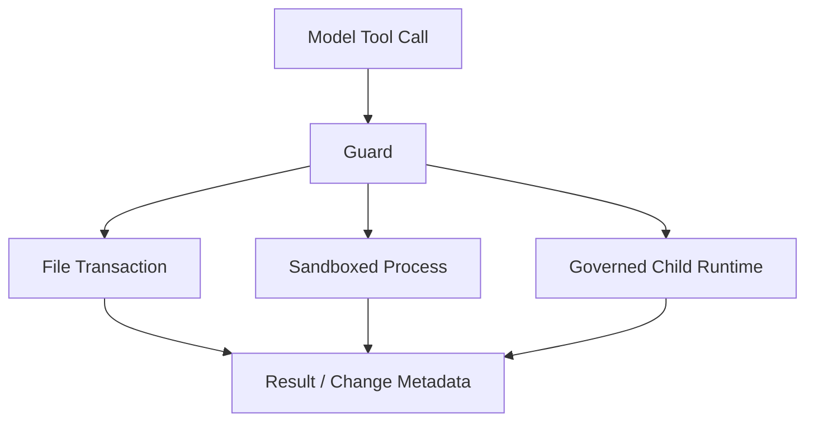

# File、Shell 与 Agent Tool

简体中文 | [English](../../en/06-tools-and-execution/02-file-shell-agent-tools.md)

## 学习目标

理解主要 Built-in Tool Family、Declared Resource，以及它们为何必须通过 Registry/Guard。

## Built-in Construction

`builtin.NewWithIndex` 要求注入 Sandbox Backend 与 Process Manager，将 Backend 绑定到
Workspace Policy，再注册 File、Search、Web、Git、LSP、Content、Shell、Quality、
GitHub、Result 与 Handle Tool。缺失的可选能力显示为 Unavailable，而不是静默消失。

## File Tool

| Tool | 语义 |
| --- | --- |
| `file_read` | 有界 UTF-8 Range 或 PDF Page |
| `file_list` | 有界结构化 Directory Pagination |
| `file_write` | Atomic Full-text Write |
| `file_edit` | Atomic Exact Replacement |
| `file_apply` | Validate-then-commit Multi-file Transaction |
| `file_patch` | Strong Sandbox 下 Atomic Unified Diff |

Path 经 Guard 重写为 Workspace-relative。Transaction 先在内存组合全部 Change，所有
Precondition 通过后才写入；Dry-run 返回同一 Exact Diff，不写磁盘。

## Resource 与 Effect Envelope

| Tool Family | Typical Resource | Effect Boundary |
| --- | --- | --- |
| File Read/Search | File/Tree Read | Bounded Workspace Observation |
| File Write/Edit/Apply/Patch | Explicit File/Tree Write | Mediated Filesystem Transaction |
| Shell/Terminal | Workspace Tree + Process Session | Sandbox Profile 内任意 Command |
| Web/GitHub | Network Host + Logical Object | Governed Remote Effect |
| Agent Spawn/Merge | Child Slot/Worktree + Target Files | Child Runtime/Explicit Merge |
| Result/Handle | Content Object Read | Bounded Retrieval |

Resource Declaration 同时服务 Policy、Approval、Claim、Journal Scope、Receipt Attribution。
Under-declare 是 Security Defect；Over-declare 会导致不必要 Serialization/Approval。

Hierarchical Claim 允许 Read/Read Overlap，但阻止 Canonical Target 上的 Write/Tree
Conflict。`ParallelSerial` 即使参数指向不同 File，也增加 Synthetic Serial Claim。

## Shell 与 Agent Tool

`shell_run`/`terminal_run` 声明 Process Capability、Serial Policy、Whole-workspace/
Process Resource 与 Strong Sandbox。执行包含 Validated CWD、Sanitized Environment、
Timeout/Cancellation、Bounded Streaming 和 Exit Metadata。

Shell Tool 不会因 Argument Schema 合法就安全。Command Language 很宽，因此必须同时有
Strong OS Sandbox、Sanitized Environment、Canonical CWD、Process-group Cancellation、
Output Limit 与 Explicit Network Policy。Platform 无法满足 Strength 时 Fail Closed。

Agent Tool 通过 Orchestration Manager/Governor 实现 spawn、wait、followup、interrupt、
close 与 merge，约束 Depth、Parallelism、Token、Cost、Wall-clock、Stance、Worktree
和 Merge。Child Receipt 区分 Pending/Self-report 与 Gate-proven Verification。



## 代码地图

| 关注点 | 源码 |
| --- | --- |
| Built-in Wiring | `tool/builtin/builtin.go` |
| File | `tool/file` |
| Process/Session | `tool/shell` |
| Child Agent/Merge | `tool/agent` |
| Process Backend | `internal/platform/process` |

## 设计取舍

直接调用 `os`/`exec` 虽短，却绕过 Path、Sandbox、Approval、Journal 与 Observability。
Built-in 提供 Narrow Structured Operation，并在所有 Host 复用同一 Guard。

## 失败模式与安全边界

- Traversal、Unsafe Object、Binary Edit、Stale Read 失败。
- Multi-file Validation Failure 不写任何内容。
- 缺少 Strong Sandbox 时 Process Tool Fail Closed。
- Timeout/Cancel 终止 Process Group。
- Agent Depth/Concurrency/Budget 超限拒绝 Admission。
- Agent Merge 检查 Baseline Drift 与 File Claim。

## 测试与验证

```bash
go test ./internal/adapter/tool/file ./internal/adapter/tool/shell
go test ./internal/adapter/tool/agent ./internal/adapter/tool/builtin
```

## 动手实验

对比 `file_apply` Dry-run 与 Commit Test，确认两条路径使用相同 Plan、Precondition、
Resource 与 Change Metadata。

## 复习问题

1. Optional Tool 为什么应显示为 Unavailable？
2. Shell Serialization 为什么也表示为 Resource Claim？
3. Agent Merge 为什么属于 Workspace Write？
4. Tool Under/Over-declare Resource 会导致什么？
5. 合法 Shell Schema 为什么仍要求 Strong Sandbox？

## 延伸阅读

- [Edit Plan、Journal 与 Receipt](./04-edit-journal-receipt.md)

## 事实来源与验证

| 项目 | 值 |
| --- | --- |
| Catalog ID | `tool-builtins` |
| 状态 | `verified` |
| 最后验证 | 2026-08-06 |
