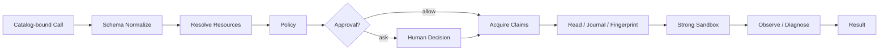

# Tool Guard 执行管线

简体中文 | [English](../../en/06-tools-and-execution/03-tool-guard-pipeline.md)

## 学习目标

追踪 Tool Call 从 Catalog Resolution 到 Validation、Policy、Approval、Resource Claim、
Sandbox Execution、Journal 与 Diagnostics 的全过程。

## Pipeline



Policy 只接收 `Validated: true` Invocation，因此规则判断的是 Canonical Tool Identity、
Normalized Argument 与 Explicit Resource，而不是模型自述。

## Preparation

`prepare` 解析 Sampled Catalog Binding，修复 Fenced JSON，按 Schema Normalize，执行
Trusted Argument Expansion，重写允许的 Absolute Workspace Path，解析 Resource，为
Serial Tool 增加 Claim，并验证 Injected Strong Sandbox。

## Trust Transition

| Stage | Input Trust | Output Guarantee |
| --- | --- | --- |
| Sampled Call | Untrusted Name/JSON | 无 |
| Bound Resolution | Catalog Identity | Exact Advertised Descriptor/Executor |
| Schema Normalize | Model Argument | Canonical Typed JSON |
| Resource Resolve | Normalized Argument | Canonical Effect Target |
| Policy | Validated Invocation | Deny/Hold/Ask/Allow |
| Approval | Human/Hook Decision | Scoped/Expiring Authority |
| Claims | Canonical Resource | Exclude Conflicting Effect |
| Sandbox/Egress | Authorized Attempt | OS/Network Boundary |
| Observation | Result + Actual State | Change/Diagnostic/Receipt Evidence |

后续 Guarantee 不能提前假设：Schema-valid 不等于 Authorized，Approved 不等于 Sandbox
Execution 成功。

## Policy 与 Approval

Policy 合并 Repository Rule、Tool Grant、Mode、Permission Posture 和 Granular Surface。
Deny/Hold 立即失败；Ask 可命中与 Argument/Resource/Scope/Expiry 绑定的 Cache，或异步
请求 Host。Replacement Argument 必须重新 Prepare/Evaluate。Edit Plan 是 One-shot；
Network Redirect 与 Sandbox Escalation 需要新的 Host/Unsandboxed Resource Authority。

Approval Cache Reuse 是 Canonical Tool、Argument、Resource、Scope、Expiry 的 Subset
Check。Deny 始终优先；更宽 Mode/Permission 不能削弱 Constitution/Repository Denial。
需要 Interaction 但无 Async Approval Host 时 Fail Closed。

## Execution 与 Observation

Resource Claim 序列化冲突访问，Hook 包围执行。写操作建立 Before-image/Fingerprint，
经 Registry 执行后观察实际磁盘变化并运行 Diagnostics。Strong Sandbox Denial 只有在
显式 Reapproval 后才能 Unsandboxed Retry。

Claim 在 Authority 已知后 Acquire，并在 Cancellation 等所有 Return Path Release。它
协调 Concurrent Call，但不能替代 Filesystem Precondition/Journal Fingerprint，因为
External Process 仍可能修改 Workspace。

## 代码地图

| 关注点 | 源码 |
| --- | --- |
| Pipeline | `tool/guard/guard.go` |
| Escalation | `tool/guard/escalation.go` |
| Policy | `security/policy/policy.go` |
| Approval Cache | `security/policy/approval.go` |
| Sandbox | `security/sandbox` |
| Egress | `security/egress` |

## 设计取舍

每个 Tool 内自行检查 Permission 会重复并产生漏洞；Schema/Resource Resolution 前授权，
又会让 Malformed Call 影响规则。Central Guard 统一全部 Host 并 Fail Closed。

## 失败模式与安全边界

- 缺少 Call ID、Registry、Policy 或 Strong Backend 时失败。
- Malformed Argument 在 Policy 前失败。
- Unknown Mode/Posture/Capability 被拒绝。
- Approval 绑定 Call、Argument、Resource、Scope、Expiry。
- Replacement Argument 从头验证。
- Sandbox Escalation/New Host 需要独立 Authority。
- 所有返回路径释放 Claim。

## 测试与验证

```bash
go test ./internal/adapter/tool/guard
go test ./internal/security/policy ./internal/security/sandbox ./internal/security/egress
```

## 动手实验

追踪 `TestSandboxStrongApprovalDoesNotCoverEscalate`，列出 Strong Attempt 与 Unsandboxed
Retry 的 Resource 和 Policy Decision。

## 复习问题

1. Policy 为什么必须位于 Resource Resolution 之后？
2. Replacement Argument 为什么要从头评估？
3. Sandbox Escalation 为什么需要新 Approval？
4. Tool Call 在哪个 Stage 首次获得 Authorization？
5. Resource Claim 为什么不能替代 Read-before-edit Fingerprint？

## 延伸阅读

- [Approval、Constitution 与 Sandbox](../07-security-governance/03-approval-constitution-sandbox.md)

## 事实来源与验证

| 项目 | 值 |
| --- | --- |
| Catalog ID | `tool-guard-pipeline` |
| 状态 | `draft` |
| 最后验证 | 尚未验证 |
