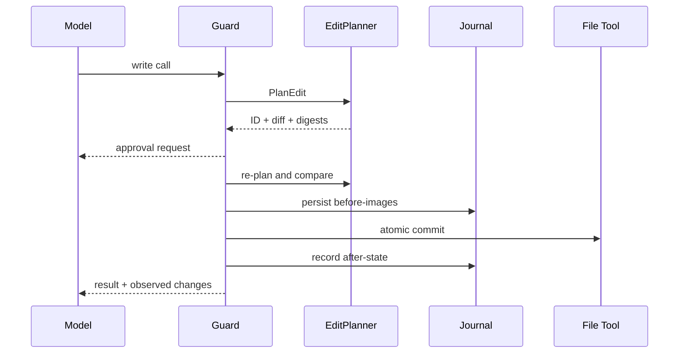

# Edit Plan、Journal 与 Receipt

## 学习目标

理解 Preview-bound Edit、Read-before-edit Fingerprint、Durable Before-image、
Observed Turn Diff、Rollback Conflict 与 Audit Receipt。

## Write Lifecycle



## Edit Plan

`EditPlan` 是无副作用 Preview，包含精确 File、Before/After Content/Digest 与 Unified
Diff。Approval 指定 Plan ID；执行前 Guard 重新 Plan，Workspace 变化产生
`edit_plan_stale`。Plan Approval 为 One-shot。

## Read-before-edit 与 Journal

`file_read` 记录 Content 与 Filesystem Identity。Mediated Edit 前，现有文件必须仍匹配
Fingerprint。Journal 在写入前保存该 Turn 的 First Before-image，之后记录 After
Fingerprint。Durable Ledger Entry 先于所描述的 Write 落盘。

Rollback 仅在 Current State 仍等于 Expected After-state 时恢复；External Edit 形成
Conflict，绝不覆盖。

## Write Crash Window

| Crash Point | Durable Fact | Recovery Action |
| --- | --- | --- |
| Plan/Approval 前 | 无 | 无 Write |
| Approval 后、Journal 前 | Approval | 不声称 File Effect |
| Before-image 后、Write 前 | Before-image + Owner | Safe Settle/Restore |
| Multi-file Commit 中 | Before-image + Partial After | Transaction Recovery |
| Write 后、Turn Commit 前 | Expected After Fingerprint | Dead Owner 可 Rollback |
| Turn Commit 后 | Committed Journal | 保留 Write |
| External Later Edit 后 | Fingerprint Mismatch | Report Conflict，不覆盖 |

Journal 保留一个 Turn 中每个 Path 的 First Before-image。因此即使多个 Tool 连续修改同一
File，Line Count/Rollback 仍相对 Turn Starting Content。

## Observation 与 Receipt

Declared Write Resource 决定 Snapshot 范围，实际 Before/After Content 决定是否变化。
Turn Diff 记录 Path、Tool、Created/Modified/Deleted 与累计 Line Count。

Execution Receipt 汇总 Change、Rollback Conflict、Read Path、Approval、Verification、
Evidence、Context、Catalog、Usage/Cost/Latency 与 Unresolved Issue。未测量不等于零。
其中 `model_execution.sample_reasons` 区分普通采样、续写、修复和收敛等原因；
`tool_execution` 分别统计业务、控制、验证和失败调用，避免把 `turn_complete` 或
`update_plan` 计成业务工具成本。

Verification 是 Attempt History，不是单个 Final Badge。每次 Attempt 记录 Scope、
Command、Derivation、Outcome 与 Failure Category。Repair Round 追加新 Attempt，并再次
验证最终 Workspace；后续 Write 会使之前的 Passing Evidence 失效。Receipt 还记录
Repair Count、Rollback/Revert Result、Conflict 与最终 Workspace Outcome，使“模型结束”、
“文件仍有改动”和“验证通过”不会折叠成同一状态。

## Evidence Scope

- Edit Plan：某 Workspace State 下 Proposed Content；
- Approval：User 授权的 Scope/Expiry；
- Journal：Before/Expected-after 与 Recovery Ownership；
- Observed Change：Execution 后实际 Byte Difference；
- Verification Receipt：实际运行的 Check/Outcome；
- Execution Receipt：将上述 Fact 投影到一个 Turn。

Joined Receipt 方便查询，但不替代 Source Record。没有 Journal 时即使 Tool Result 声称
成功，也无法承诺 Rollback。

## 代码地图

| 关注点 | 源码 |
| --- | --- |
| EditPlan | `adapter/tool/tool.go` |
| Transaction/Plan | `adapter/tool/file/apply.go` |
| Change Observation | `adapter/tool/guard/guard.go` |
| Journal/Recovery | `persist/workspacejournal` |
| Turn Diff | `agent/turnkernel/turn_diff.go` |
| Receipt | `observability/receipt/receipt.go` |

## 设计取舍

基于 Argument 的变更报告会漏掉 Patch 与隐藏副作用；Executor 自报可能意外失真。
比较 Fingerprint 观察 Workspace；Journal Before-image 额外使 Rollback 成为可能。

## 失败模式与安全边界

- Existing File 要求 Fresh Read。
- Plan ID Mismatch/Workspace Drift 在执行前失败。
- Before-image Store Failure 阻止写入。
- Multi-file Transaction All-or-nothing。
- Rollback 不覆盖 External Post-turn Edit。
- Binary/Unavailable Line Count 保持缺失，不伪装为零。
- 不声称 Non-file Side Effect 已回滚。

## 测试与验证

```bash
go test ./internal/adapter/tool/file -run 'Test(FileApply|ForcedEditPlan|ReadBeforeEdit)'
go test ./internal/persist/workspacejournal
go test ./internal/runtime/app -run TestReceiptReportsLineStatsAndRollbackConflicts
```

## 动手实验

运行 `TestJournalRollbackNeverClobbersAnExternalEdit`，画出 Before、Expected-after 与
Current Fingerprint，解释为何产生 Conflict。

## 复习问题

1. Approved Diff 为什么在执行前重算？
2. Guard 为什么观察磁盘而不信任 Tool Output？
3. Journal Rollback 可以安全承诺什么？
4. 同一 Turn 多次编辑时为什么保留 First Before-image？
5. 哪种 Record 分别证明 Proposal、Authorization、Actual Change、Verification？

## 延伸阅读

- [Verification Gate 与证据](./05-verification-and-evidence.md)

## 事实来源与验证

| 项目 | 值 |
| --- | --- |
| Catalog ID | `tool-edit-journal-receipt` |
| 状态 | `draft` |
| 最后验证 | 尚未验证 |
