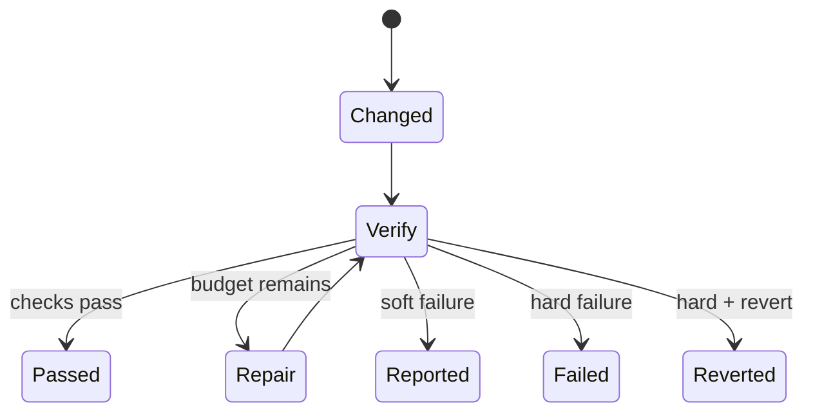

# Verification Gate 与证据

简体中文 | [English](../../en/06-tools-and-execution/05-verification-and-evidence.md)

## 学习目标

理解 Post-edit Diagnostics、Scoped Verification、Repair Round、Soft/Hard Outcome、
Rollback，以及 Evidence 与 Claim 的区别。

## Gate Lifecycle



Gate 仅在已配置且 Turn 实际改变 File 时运行。Changed Path 来自 Turn Diff，因此也覆盖
Argument 中不直接包含 Path 的 Tool。

## Diagnostics 与 Verification

Guard 对每个 Mediated File 执行 Post-edit Diagnostics。Final Gate 通过 `verify.Runner`
检查 Diagnostics 或 Repository Scope，并支持 Timeout。Check Receipt 包含 Status、
Command、Exit Code、Bounded Output、Error 与 Warning。

Soft Mode 记录 Failed/Unavailable 而不改变 Turn Outcome；Hard Mode 要求 Runner 可用，
最终 Fail 或 Revert。Repair Round 使用独立 Step Allowance，通过有界 `[verify]` User
Message 反馈，不伪造 Tool Call/Result。

## Verification Status 不是 Boolean

| Status | Meaning | 可清除 Risk？ |
| --- | --- | --- |
| Not Evaluated | 无 Applicable Check | 否 |
| Unavailable | Intended Check 无法运行 | 否 |
| Failed | Check 运行并失败 | 否 |
| Passed | Named Check 在 Stated Scope 通过 | 仅 Covered Path/Scope |

这样避免将“No Runner”“No Changed Files”“Tests Passed”折叠为同一个 False。

## Evidence Strength

```text
model/self-report
  < tool success metadata
  < observed filesystem change/read digest
  < diagnostics for file/version
  < configured verification receipt for named scope
```

该顺序依赖 Context，并非绝对：Repository Check 仍可能遗漏 Behavior，Search Fact 也可能
是 Symbol Location 的正确证明。每项 Claim 必须说明 Scope/Provenance。

## Evidence Ledger

Search Result 贡献 Typed Fact；Observed Write 在 Passing Diagnostics/Verification 覆盖前
形成 Risk；Write-before-read 单独标记；Repeated Call/Unconsumed Handle 产生 Reminder。

只有 Passing Verification 清除 Unverified-change Gap。Unavailable/Failed Check 保持显式
Evidence。Child Agent Self-report 不升级为 Gate-proven Status。

Repair Round 使用独立 Bounded Allowance，但仍计入 Overall Spend/Latency。Repair 可能
产生新 Change，因此 Gate 必须再次验证 Final State；Later Write 后不可复用 Earlier
Passing Receipt。

## 代码地图

| 关注点 | 源码 |
| --- | --- |
| Gate/Action | `agent/engine/verify.go` |
| Runner/Scope | `observability/verify` |
| Evidence | `agent/evidence` |
| Metadata Fold | `agent/engine/evidence.go` |
| Protocol Receipt | `runtime/app/receipt.go` |

## 设计取舍

总是运行全套测试强但昂贵；只跑 Diagnostics 快却不完整。Configurable Scope 与显式
Status 避免把“未运行”呈现为“通过”。

## 失败模式与安全边界

- No Changed Bytes 不产生 Verification Claim。
- Runner Error 在 Soft Mode 为 Unavailable，在 Hard Mode 为 Terminal。
- Repair Feedback 有界且来源准确。
- New Write 使 Earlier Verification 失效。
- Passing Check 仅证明其 Path/Scope。
- Revert Conflict 保持 Unresolved Issue。

## 测试与验证

```bash
go test ./internal/runtime/agent/engine -run 'TestVerifyGate|Test.*Evidence'
go test ./internal/observability/verify
go test ./internal/runtime/app -run 'TestReceiptReportsVerification|TestVerificationData'
```

## 动手实验

运行 Repair-round 与 Hard-revert Test，对比 Verification Receipt、Model Feedback、
Step Accounting 与最终 Workspace State。

## 复习问题

1. Unavailable Runner 与 Failed Check 有何区别？
2. Verification Feedback 为什么不是 Tool Result？
3. 什么操作会清除 Unverified-change Risk？
4. Not-evaluated、Unavailable、Failed、Passed 为什么不同？
5. Repair Round 为什么必须重新验证 Final State？

## 延伸阅读

- [Tool Failure 如何反馈给模型](./06-failure-feedback.md)

## 事实来源与验证

| 项目 | 值 |
| --- | --- |
| Catalog ID | `tool-verification` |
| 状态 | `draft` |
| 最后验证 | 尚未验证 |
