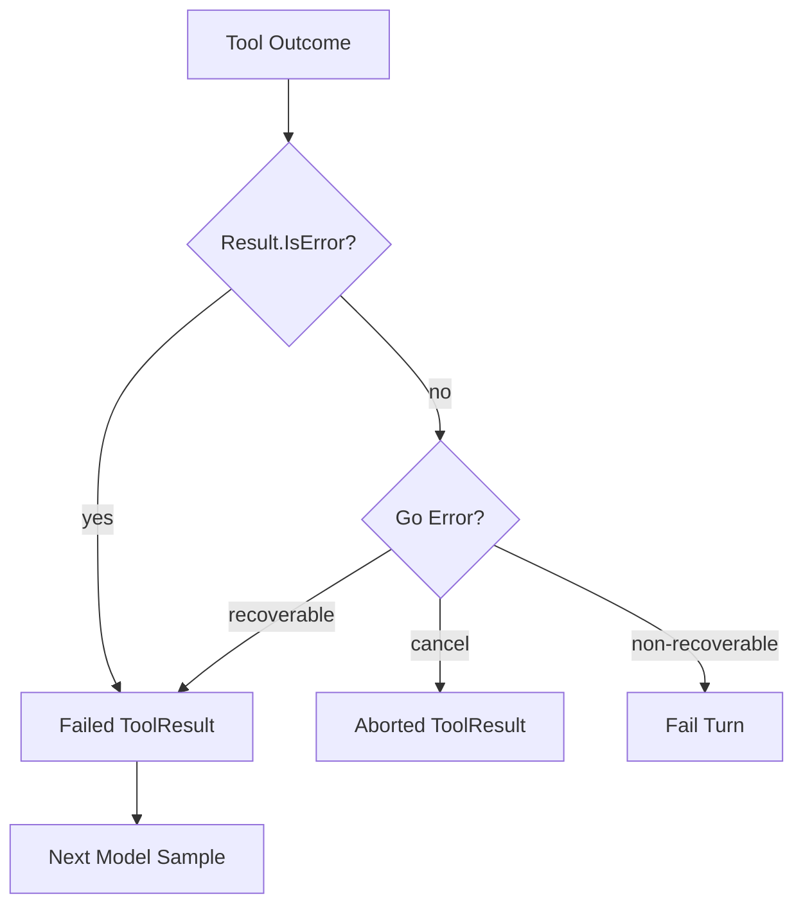

# Tool Failure 如何反馈给模型

## 学习目标

区分 Recoverable Call Feedback、Soft Tool Result、Cancellation 与 Terminal
Guard/Runtime Failure，避免诱导模型反复探测边界。

## Failure Channels



Tool Result 可用 `IsError` 表示 Soft Failure，同时保持 Call/Result Pairing。Go Error 必须
分类，因为一部分可安全由模型修正，另一部分代表 Security/Infrastructure Boundary。

## Recoverable Failure

Engine 仅反馈模型能通过不同调用修正且不会重复副作用的错误：

- Invalid Argument、Unknown/Unavailable Tool；
- Stale/Revoked/Deferred Catalog；
- Missing/Stale Read Fingerprint，并附修正提示；
- 明确保证未写入的 `ErrPrecondition`；
- 部分 MCP Availability/Circuit 与 Skill Dependency Error；
- Operator Approval Denial。

Stable `error_category` 用于 Model/Telemetry 分类。

## Classification Decision

| Question | No | Yes |
| --- | --- | --- |
| Call Identity/History Pairing 完整？ | Fail Turn | Continue |
| Runtime 能证明无 Side Effect？ | Terminal/Reconcile | Continue |
| 新 Argument/Later Availability 可修复？ | Terminal | Candidate |
| Feedback 可安全 Sanitized？ | Terminal | Continue |
| Next Sample 在 Step/Budget 内？ | Fail Turn | Failed Tool Result |

`ErrPrecondition` 是“没有任何 Change”的 Semantic Promise，只能在 First Effect 前返回；
将 Partial Write 标成 Precondition Failure 是 Correctness/Safety Bug。

Stale/Revoked Catalog 可恢复，是因为旧 Executor 在进入前已被 Fence，而不是 Dynamic
Replacement 普遍安全。

## Terminal Failure

大多数 Policy Decision、Sandbox Failure、Journal Failure 和 Unclassified Executor
Error 会终止 Turn。将它们反馈重试可能复制 Effect 或鼓励 Permission Probing。
Cancellation 在并发 Tool 完成清理后返回带归属的 Aborted Result。

## Feedback Payload

Failed Tool Result 包含 Original Call ID、Tool、Stable `error_category` 和 Bounded
Corrective Message；不得包含 Raw Credential、Unrestricted Path、Stack Trace、Hidden
Policy Rule 或无助于下一有效 Action 的 Backend Detail。

Failure Feedback 会进入 Model-visible History 与 Evidence/Compaction。它解释 Boundary，
绝不是削弱 Boundary 的指令。

## Pairing 与 Scheduling

每个 Result 保留 Call ID。Scheduler 遵守 Serial/Concurrent Policy，并在返回前 Join
全部 Goroutine。Executed Map 以 Call ID 防止 Turn 内重复执行；Recoverable Failure
进入 History，下一 Sample 可修正。

## 代码地图

| 关注点 | 源码 |
| --- | --- |
| Classification | `agent/engine/tool_failure.go` |
| Parallel Execution | `adapter/tool/batch.go` |
| Result Recovery | `adapter/tool/result/recovery.go` |
| Error Category | `adapter/tool/catalog.go`、`adapter/mcp` |
| Failure Evidence | `agent/engine/evidence.go` |
| Tool Result Block | `adapter/provider/types.go` |

## 设计取舍

所有 Tool Error 都终止会浪费模型修正 Call Shape 的能力；全部反馈又会造成 Loop、Boundary
Probing 与 Duplicate Effect。QCode 使用“无副作用或可安全修正”的保守 Allowlist。

## 失败模式与安全边界

- Policy/Sandbox Denial 通常不可恢复。
- `ErrPrecondition` 只能在任何 Write 前使用。
- Partial Side-effect Failure 不得标为 Safe Retry。
- Unknown Error 终止 Turn。
- Tool Call/Result Identity 保持配对。
- Repeated Failure 进入 Evidence/Compaction。

## 测试与验证

```bash
go test ./internal/runtime/agent/engine \
  -run 'Test(RecoverableToolFailure|RunTools|EngineDoesNotExecuteUnadvertised)'
go test ./internal/adapter/tool -run TestFaultInjectionToolCancelReleasesClaim
```

## 动手实验

使用 `TestRecoverableToolFailureClassification` 分类 Invalid Argument、Stale Read、
Policy Denial 与 Arbitrary Executor Error，解释哪些会成为 Failed Tool Result。

## 复习问题

1. 什么使 Failure Feedback 可安全重试？
2. 大多数 Policy Denial 为什么是 Terminal？
3. Precondition Error 为什么必须保证 Workspace 未改变？
4. Stale Catalog 为什么可恢复，而 Arbitrary Executor Failure 不可？
5. Model-visible Failure Feedback 必须移除哪些信息？

## 延伸阅读

- [Streaming、Cancellation 与 Error](../03-runtime-kernel/05-streaming-cancellation-errors.md)

## 事实来源与验证

| 项目 | 值 |
| --- | --- |
| Catalog ID | `tool-failure-feedback` |
| 状态 | `draft` |
| 最后验证 | 尚未验证 |
