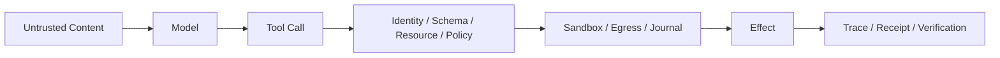

# Agent Runtime Threat Model

## 学习目标

识别本地 Coding Agent Runtime 的 Asset、Authority Root、Untrusted Input、Trust
Boundary、Attacker Goal 与 Residual Risk。

## Asset 与 Authority Root

| Asset | Required Property |
| --- | --- |
| Workspace/Git State | Bounded/Attributed Mutation |
| Credential/Signing Key | Confidentiality/Rotation |
| User Intent/Approval | Integrity/Narrow Scope |
| Policy/Constitution | Non-bypassable Enforcement |
| Event/Journal/Receipt | Integrity/Recovery |
| Log/Trace/Provider Dump | Redaction/Access Control/Bounded Retention |
| Host Process/Network | Model-selected Effect Isolation |
| MCP/Skill | Identity/Integrity/Revocation |

Local Operator、Reviewed Config、OS Account、Trusted Release Key 是 Authority Root，但
Operator Mistake、Compromised Dependency、Malicious Repository 仍在 Scope 内。

## Untrusted Input

User Prompt、Repository Text、Generated Code、Model Output、Tool Argument、Provider/MCP
Response、Skill、Hook、Host Protocol Request、Archive、Symlink、Environment、
Foreign Persisted State、Process Output 都是不可信输入。



Prompt Role 不产生 Authority。即使 Repository Instruction 被渲染为 System Message，它
仍是 Repository Data；Authority 由 Guard、Policy、Constitution、Sandbox、Egress
机械强制。

## Threat/Control Map

| Threat | Primary Control |
| --- | --- |
| Prompt Injection 驱动 Tool | Mode、Policy、Approval、Constitution |
| Traversal/Symlink Race | Canonical Workspace、Relative I/O |
| Command Escape | Strong Sandbox、Sanitized Environment |
| Credential Exfiltration | Reference、Redaction、Egress Gate |
| Tool TOCTOU Replacement | Catalog Binding/Authority Token |
| Stale Approval | Argument/Resource Fingerprint、Expiry |
| Partial Write | Edit Plan、Atomic Tool、Journal |
| Malicious Extension Update | Signature/Digest/Receipt/Revocation |
| Misleading Success | Observed Change/Verification Receipt |
| Telemetry 泄露 Prompt/Path/Secret | Pre-write Privacy Policy、Capture Mode、Low-cardinality Allowlist |

## Non-goal 与 Residual Risk

CodeHelper 不会让任意 Approved Code 在语义上安全，不证明 Provider Confidentiality，
不能阻止 Authorized User 授予危险权限，也不保证所有 Platform 都有 Strong Isolation。
Passing Test 也不证明没有漏洞。

Residual Risk 必须通过 Unavailable Capability、Approval Scope、Receipt、Diagnostic 和
Operational Guidance 显式呈现，不能藏在“Secure”标签后。

## 验证

```bash
make security-test
make sandbox-attack-test
make secret-leak-test
```

## 复习问题

1. Model Output 与 Repository Instruction 为什么都不可信？
2. 哪些 Control 分别保护 Authority、Isolation、Recovery、Correctness？
3. User Approve Command 后还剩哪些风险？

## 延伸阅读

- [Mode、Posture、Policy 与 Permission](./02-mode-posture-policy.md)
- [安全手册](../../../zh-CN/security.md)

## 事实来源与验证

| 项目 | 值 |
| --- | --- |
| Catalog ID | `security-threat-model` |
| 状态 | `draft` |
| 最后验证 | 尚未验证 |
