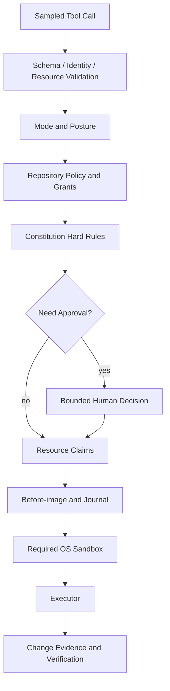

# Guard、Approval、Constitution 与 Sandbox

简体中文 | [English](../../en/07-security-governance/03-approval-constitution-sandbox.md)

## 学习目标

理解 Agent Security 为什么需要多层控制、Tool Call 如何经过 Guard、Approval
何时有效、Constitution 增加了什么，以及 Sandbox Availability 为什么是 Enforcement
Fact 而不是 UI Option。

## 前置知识

阅读 [CodeHelper 全局架构](../02-codehelper-overview/02-system-architecture.md)。

## 问题背景

Tool Call 是概率模型根据不可信 Context 生成的。单纯展示确认框并不完整：

- 用户批准后 Argument 可能变化；
- Remembered Approval 可能范围过大；
- Allowed Command 可能逃离 Working Directory；
- Repository 可能包含 Prompt Injection；
- Sandbox 缺失时，隔离可能静默变成 unrestricted execution。

不同安全层回答不同问题，不能互相替代。

## 分层控制模型



Approval 表达 Intent，Sandbox 限制 Process，Journal 支持 Recovery，Verification
检查 Outcome。

## Authority/Enforcement Matrix

| Control | Can Grant | Cannot Grant |
| --- | --- | --- |
| Mode/Grant | Class/Resource Eligibility | User Consent/OS Isolation |
| Constitution | Deny/Hold Constraint | New Execution Authority |
| Approval | Scoped User Consent | Bypass Hard Deny/Missing Sandbox |
| Resource Claim | Temporary Concurrency Exclusion | External Filesystem Integrity |
| Sandbox | OS Effect Boundary | Semantic Correctness |
| Journal | File Recovery Evidence | Network/Process Rollback |
| Verification | Scoped Outcome Evidence | Retroactive Authorization |

Later Successful Control 不能补偿 Earlier Missing Control。

## Guard：单一 Tool Boundary

`Guard.ExecuteBound` 依次执行：

1. 解析 Canonical Tool 与 Catalog Binding；
2. 验证 Argument 和 Resource；
3. 评估 Policy；
4. 获取 Permission Hook 与 Human Approval；
5. Preview 并重新验证 File Edit；
6. 获取 Resource Claim；
7. 执行 Lifecycle Hook；
8. 保存 Before-image 和 Expected Write；
9. 在要求的 Sandbox 中执行；
10. 观察 Read、Write、Egress 与 Result Metadata；
11. 在任何结果下释放 Claim。

Registry 可以运行 Prepared Tool，但 Agent 路径由 Wiring 强制经过 Guard。单一 Security
Boundary 比每个 Tool 各自实现不完整策略更可审计。

## Policy、Mode 与 Posture

Policy 评估包含 Call ID、Tool、Argument、Resource、Capability 与 Repository Rule
的 Validated Invocation：

- `plan` 只允许 Read Capability；
- `act`、`operate` 允许更广能力，但仍受 Rule 控制；
- Grant 确定 Tool/Resource 是否在 Scope；
- Repository Rule 可以 Deny、Hold、Ask 或 Allow；
- Permission Posture 决定 Automatic 与 Interactive Handling；
- Granular Surface 只能收紧，不能弱化 Hard Denial。

Policy 缺失、Capability Unknown、Invocation 未验证或 Grant 缺失时全部拒绝。

## Constitution

Constitution 读取 User 和 Repository 的 `constitution.json`，将 Protected Write Glob、
Deny/Hold Tool 编译成 Policy Rule，也可以向 Model 注入说明。Priority 相同时 Repo Rule
优先。普通 Session Config 不能把 Mechanical Hold 变成允许，因此 `.env`、`secrets/`
等目录可以在宽松 Posture 下继续受到保护。

## Approval 语义

Approval Fingerprint 绑定 Tool、Argument、Resource、Capability 与 Scope：

- `once`：只消费一次；
- `session`：Expiry 前复用相同有界 Resource；
- `always`：只在 Tool/Policy 允许时持久化。

File Write 显示 Edit Plan，且只允许 One-shot Approval。执行前 Guard 重新计算 Plan；
Plan ID 改变时以 Stale 失败。Replacement Argument 必须重新 Validation/Evaluation。

Pending Request 有 ID、Expiry、Cancellation，以及 Duplicate/Late Decision 检查。
Approval Host 不在线时，Ask 不能变成 Allow。

## Sandbox Enforcement

Tool Descriptor 声明 Sandbox Requirement。Strong Execution 会验证：

- Backend 可用且 Strength 为 Strong；
- Workspace Policy Identity 匹配；
- Working Directory 被 Pin；
- Executable Resolution 明确；
- Environment 已 Sanitized；
- Prepared Command 仍携带已验证 Strength。

平台能力不同，Probe 必须如实报告。要求 Strong Isolation 但不可用时返回
`sandbox_unavailable`。

可选 Escalation 只有在独立 Approval 明确包含 `sandbox:none` Resource 后，才允许
Unsandboxed Retry；Strong Execution 的 Approval 不覆盖 Escalation。

## Journal 与 Verification

写入前 Guard 保存 Expected Path 与 Before-image，执行后比较 Observed Change，并产生
Turn Receipt 使用的 Metadata。中断 Process 可由 Workspace Journal 恢复。

Verification 是执行后的证据，不是授权。被授权 Command 仍可能测试失败；测试通过也不能
追认未获批写入。

## 代码地图

| Control | 源码 |
| --- | --- |
| Tool Boundary | `internal/adapter/tool/guard/guard.go` |
| Sandbox Escalation | `internal/adapter/tool/guard/escalation.go` |
| Policy/Approval Cache | `internal/security/policy` |
| Repository Hard Rule | `internal/security/constitution` |
| Sandbox Backend | `internal/security/sandbox` |
| Process Enforcement | `internal/platform/process` |
| Edit Recovery | `internal/persist/workspacejournal` |

## 设计取舍与替代方案

Per-Tool Permission Check 容易添加但不一致。统一 Guard 增加 Security Boundary 的耦合，
却使执行顺序可审计。Always Ask 容易导致 Approval Fatigue；Scoped Cache 在减少 Prompt
的同时保留 Resource Identity 与 Expiry。

## 失败模式与安全边界

- Unknown Alias 和 Stale Catalog Binding 在执行前失败。
- Unanswered、Denied、Canceled、Expired 或 Mismatched Approval 失败。
- Edit Plan Drift 使 Approval 失效。
- Cancellation/Error 下 Resource Claim 仍被释放。
- Unexpected Write 或 Before-image 缺失时写入失败。
- Sandbox Denial 不静默转为 unrestricted retry。
- Egress Retry 需要 Host-scoped Approval。
- `bypass` 不绕过 Constitution 或 Required Sandbox。

Approval UI 属于 Security Boundary，必须显示 Canonical Tool、Resource、Argument Change、
Expiry/Scope，以及存在时的 Edit Plan。模糊的“允许命令？”无法形成 Informed Consent。

## 测试与验证

```bash
go test ./internal/security/policy
go test ./internal/adapter/tool/guard \
  -run 'Test(ApprovalOnceSessionExpiryAndModifiedArguments|PendingApprovalExpiresFailClosed|SandboxEscalateRequiresReapproval|SandboxStrongApprovalDoesNotCoverEscalate)'
go test ./internal/platform/process \
  -run 'Test(RunFailsClosedWithoutStrongSandbox|RunUsesInjectedStrongSandboxBackend)'
```

## 动手实验

```bash
make build
./bin/codehelper sandbox status
./bin/codehelper sandbox probe
```

比较 Approval Denial 与 Sandbox-unavailable：它们都会停止执行，但属于不同 Control Layer，
产生不同 Evidence。

## 复习问题

1. 为什么 Approval 不能替代 Sandbox？
2. 为什么 Replacement Argument 必须重新评估？
3. `sandbox:none` Resource 代表了什么额外权限？
4. Passing Verification 为什么不能修复 Missing Authorization？
5. Approval UI 必须显示哪些 Canonical Fact？

## 延伸阅读

- [安全手册](../../../zh-CN/security.md)
- [为什么需要受治理 Runtime](../01-agent-engineering/05-why-governed-runtime.md)

## 事实来源与验证

| 项目 | 值 |
| --- | --- |
| Catalog ID | `security-approval-sandbox` |
| 状态 | `draft` |
| 最后验证 | 尚未验证 |
