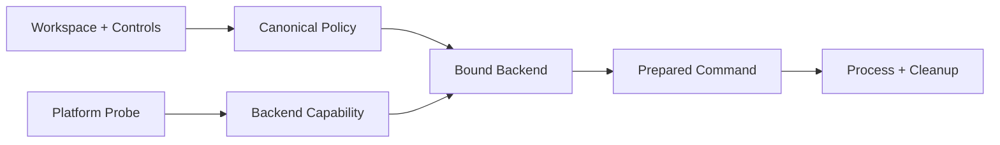

# OS Sandbox 与 Process Isolation

简体中文 | [English](../../en/07-security-governance/04-process-isolation.md)

## 学习目标

理解 Capability Probe、Policy Binding、Platform Backend、Safe Workspace I/O、Process
Cleanup，以及 Declared Isolation 与 Proven Isolation 的区别。

## Capability 与 Policy

`sandbox.Probe` 报告 Backend、Strength、Availability、Reason。`BuildPolicy` Canonicalize
Workspace、Runtime/Toolchain Read Root、Writable Root、Private Temp、Network Control；
`BindPolicy` 将其绑定到 Backend。Process Tool 使用 Wiring 注入的 Backend，不能自行
构造或关闭 Sandbox。



`RequireStrong` 拒绝 Missing/Partial Capability。Backend 名称含“sandbox”不等于满足
Strong Isolation。

## Platform Backend

- macOS Seatbelt 生成显式 Root/Network Mode 的 SBPL；
- Linux Bubblewrap 提供 Namespace/Mount Isolation，并可通过不含 Secret 的 Helper
  Protocol 增加 Landlock；
- Unsupported/Failed Probe 返回带 Reason 的 Unavailable Backend，执行 Fail Closed。

Platform Parity 指 Equivalent Documented Guarantee，不是相同 Command Line。启动命令所需
Runtime/Toolchain Root 只能 Read-only，不能扩大为 Host Root。

## Workspace Filesystem Safety

`sandbox.Workspace` 固定 Root Identity，拒绝 Traversal、Wrong Case、Unsafe Link、
Special File，并持续 Revalidate Root。Descriptor-relative Open/Create/Write/Remove
抵抗 Concurrent Symlink Swap/Racing Creator。先 Validate、后用 Path `os.Open` 不足够。

## Process Lifecycle

执行从 Sanitized Environment 解析 Executable，Pin CWD，限制 Output，传播 Context
Cancellation，并 Kill Process Group/Tree。PTY/Non-PTY 必须共享 Policy/Cleanup。

Sandbox 不是 VM、Malware Analysis 或 Semantic Validation；仍需 Version Control/Backup。

## 验证

```bash
go test ./internal/security/sandbox
go test ./internal/platform/process/...
make sandbox-attack-test
```

## 复习问题

1. Backend Name 为什么不能证明 Strong Isolation？
2. Workspace I/O 为什么使用 Descriptor-relative Operation？
3. 哪些 Guarantee 不属于 Sandbox？

## 延伸阅读

- [Fail-closed 与平台能力声明](./07-fail-closed.md)
