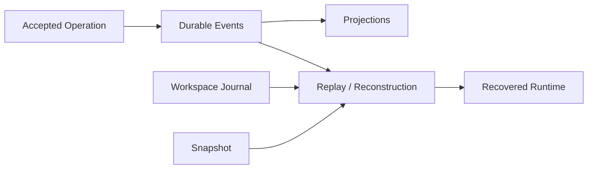

# Durable State 的必要性

简体中文 | [English](../../en/08-state-observability/01-why-durable-state.md)

## 学习目标

解释哪些 Runtime Fact 必须跨 Process Loss 保留、Replay 与 Retry 的区别，以及 Durable
State 如何支持 Audit/Recovery。

## 从内存循环到 Runtime

单进程存活时 Agent 可能看起来正确；真实 Runtime 还必须保证 Accepted Operation、
Event、Thread/Turn Identity、Pending Approval、Tool Pair、Usage 与 Workspace Effect
在 Crash/Restart 后保持一致。



Event Sequence/Terminal Outcome 说明发生了什么；Projection 支持 Session/Task/Usage/Trace
查询；Snapshot 加速恢复；CAS 保存 Immutable Payload；Journal 保存 Before-image；
Lease 区分 Live Owner 与 Abandoned Work。

## Authority/Lifetime Matrix

| Record | Authority | Lifetime/Use |
| --- | --- | --- |
| Accepted Operation | Request Identity/Idempotency | Admission/Duplicate Detection |
| Event Sequence | Canonical Lifecycle Fact | Replay/Host/Audit |
| SQLite Projection | Derived Query View | List/Filter/Aggregate |
| Snapshot | Integrity-checked Checkpoint | Accelerate Reconstruction |
| Workspace Journal | Filesystem Effect Evidence | Rollback/Recovery |
| Trace/Usage | Measured Observation | Diagnosis/Accounting |
| Execution Receipt | Turn-level Joined Projection | Explanation |

Derived Record 不高于 Source：Projection 可从 Event 重建；Snapshot 不覆盖 Later Event；
Receipt 不能让 Unobserved Effect 消失。

## Acceptance 不等于 Completion

```text
submit -> durable acceptance/reservation -> engine work
       -> durable events/projections -> commit receipt -> terminal event
```

每个 Boundary 的 Crash 含义不同。Recovery 可恢复 Bookkeeping 或标记 Interrupted Work，
但不能仅因 Caller 未收到 Terminal Response 就重跑 Agent。

Durability 不是序列化所有对象。Subscriber、Network Stream、Mutex 与 Process Handle
属于 Ephemeral State，只能重建或明确丢失。

## 正确性与取舍

Durable Write 需要 Atomicity、Ordering、Integrity、Idempotent Projection 和
Indeterminate Outcome。Recovery 不能仅因为 Result 未被观察就再次执行 Agent Turn。

Event-only Replay 权威但可能慢；Snapshot-only 快却缺少审计。CodeHelper 组合 Ordered
Event、Typed Projection、Integrity-checked Snapshot 与 Side-effect Journal。

## 失败与安全边界

- Accepted Work 必须有唯一 Durable Terminal Accounting。
- Sequence Gap/Committed Corruption Fail Closed。
- Recovery 保留健康 Foreign Lease。
- Missing Measurement 不解释为零。
- Rollback 不覆盖后续 External Edit。

## 测试与验证

```bash
go test ./internal/persist/state/...
go test ./internal/runtime/app/wire -run TestPersistentRuntime
```

## 动手实验

阅读 `TestPersistentRuntimeRestartIsIdempotentAndKeepsOneTerminal`，找出防止 Restart
重复运行 Turn 的 Durable Record。

## 复习问题

1. Replay 为什么不等于 Retry？
2. 哪些 State 有意不持久化？
3. 为什么 Event 与 Journal 都需要？
4. 哪些 Durable Record 是 Canonical，哪些是 Derived？
5. Missing Client Acknowledgement 为什么不授权 Retry Turn？

## 延伸阅读

- [SQLite、Event Log 与 Projection](./02-sqlite-event-projection.md)

## 事实来源与验证

| 项目 | 值 |
| --- | --- |
| Catalog ID | `state-why-durable` |
| 状态 | `verified` |
| 最后验证 | 2026-08-06 |
