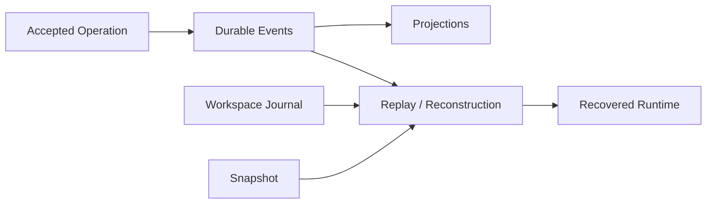

# Durable State 的必要性

简体中文 | [English](../../en/08-state-observability/01-why-durable-state.md)

## 学习目标

解释哪些 Runtime Fact 必须跨 Process Loss 保留、Replay 与 Retry 的区别，以及 Durable
State 如何支持 Audit/Recovery。

## 从内存循环到 Runtime

单进程存活时 Agent 可能看起来正确；真实 Runtime 还必须保证 Accepted Operation、
Event、Thread/Turn Identity、Pending Approval、Tool Pair、Usage 与 Workspace Effect
在 Crash/Restart 后保持一致。



## Durable Facts

Event Sequence/Terminal Outcome 说明发生了什么；Projection 支持 Session/Task/Usage/Trace
查询；Snapshot 加速恢复；CAS 保存 Immutable Payload；Journal 保存 Before-image；
Lease 区分 Live Owner 与 Abandoned Work；Domain Fact 以 State Digest 记录每个被接受的
Kernel Transition；Effect 持有 Durable Payload、Lifecycle、Attempt 与 Idempotency
Identity；带 Digest 的 `TerminalMeasurementSnapshot` 只冻结一次 Usage/Latency；
Terminal Envelope 原子封存 Final Kernel State、Domain Facts、Measurement、Session
Delta、Receipt、Operation Commit 与 Projection Outbox；版本化 Observation Envelope
保存脱敏因果证据，但不获得执行权威。

## Authority/Lifetime Matrix

| Record | Authority | Lifetime/Use |
| --- | --- | --- |
| Accepted Operation | Request Identity/Idempotency | Admission/Duplicate Detection |
| Turn Domain Fact | 权威 Reducer Transition/State Digest | Restart/Invariant Audit |
| Pending Effect | Executable Intent/Payload/Idempotency | Conditional Continuation |
| Terminal Measurement | Frozen Usage/Latency Fact | Receipt/Trace/Terminal 一致性 |
| Event Sequence | Canonical Lifecycle Fact | Replay/Host/Audit |
| Observation Journal | 脱敏因果证据 | Diagnosis/Telemetry/Semantic Replay |
| SQLite Projection | Derived Query View | List/Filter/Aggregate |
| Snapshot | Integrity-checked Checkpoint | Accelerate Reconstruction |
| Workspace Journal | Filesystem Effect Evidence | Rollback/Recovery |
| Trace/Usage | Measured Observation | Diagnosis/Accounting |
| Execution Receipt | Turn-level Joined Projection | Explanation |

Derived Record 不高于 Source：Projection 可从 Event 重建；Snapshot 不覆盖 Later Event；
Receipt 不能让 Unobserved Effect 消失。Observation Writer/Exporter Failure 会进入
Observation Health，但不能改写业务 Turn Result。

## Acceptance 不等于 Completion

```text
submit -> durable acceptance/reservation -> engine work
       -> durable events/projections -> commit receipt -> terminal event
```

每个 Boundary 的 Crash 含义不同。Missing Client Acknowledgement 永远不授权执行。
Pending Turn 只有在具备合法 Domain Facts、可 Claim Lease 与受支持 Durable Effect
Route 时才继续。Running Effect 在 Dispatch 前先持久化为 Requeued；已保留的 Result
Command 只重交 State Machine，不重复 External Execution。

Durability 不是序列化所有对象。Subscriber、Network Stream、Mutex 与 Process Handle
属于 Ephemeral State，只能重建或明确丢失。

## Correctness Properties

Durable Write 需要 Atomicity、Ordering、Integrity、Idempotent Projection、Renewable
Ownership Lease 和显式 Indeterminate Outcome。Recovery 必须区分“Requested 但未
Started”“Started 但无 Accepted Result”“Result 已保留但 State Append 失败”，三者
不能共享一个 Retry 规则。

## 设计取舍

Event-only Replay 权威但可能慢；Snapshot-only 快却缺少审计。CodeHelper 组合 Ordered
Event、Typed Projection、Integrity-checked Snapshot 与 Side-effect Journal。

## 失败与安全边界

- Accepted Work 必须有唯一 Durable Terminal Accounting。
- Sequence Gap/Committed Corruption Fail Closed。
- Recovery 保留健康 Foreign Lease。
- Missing Measurement 不解释为零。
- Receipt、Trace 与 Terminal Envelope 共享同一 Measurement Digest。
- Observation Failure 与业务执行隔离。
- Rollback 不覆盖后续 External Edit。

## 测试与验证

```bash
go test ./internal/persist/state/...
go test ./internal/observability/...
go test ./internal/runtime/app/wire -run TestPersistentRuntime
go test ./internal/runtime/app -run 'Test(C5|C6|Phase4R)'
go test ./internal/runtime/agent/turnkernel
```

## 动手实验

阅读 `TestC5RuntimeDispatchesAcceptedTurnWithDomainFacts` 与 Phase 4R Restart Test，
找出哪些 Fact 授权 Continuation、Effect 何时 Requeue，以及哪个 Identity 保证
Terminal Projection 幂等。

## 复习问题

1. Replay 为什么不等于 Retry？
2. 哪些 State 有意不持久化？
3. 为什么 Event 与 Journal 都需要？
4. 哪些 Durable Record 是 Canonical，哪些是 Derived？
5. Missing Client Acknowledgement 为什么不授权 Retry Turn？

## 延伸阅读

- [SQLite、Event Log 与 Projection](./02-sqlite-event-projection.md)

## 事实来源与验证

| 项目 | 值 |
| --- | --- |
| Catalog ID | `state-why-durable` |
| 状态 | `verified` |
| 最后验证 | 2026-08-17 |
