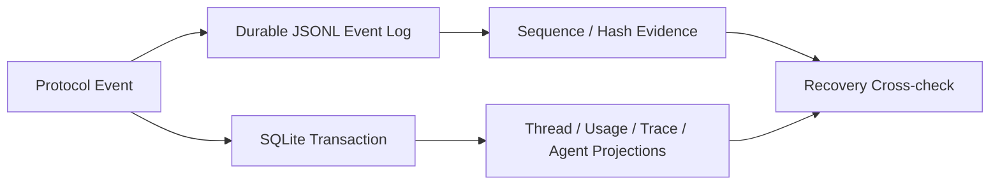

# SQLite、Event Log 与 Projection

## 学习目标

理解 SQLite Schema、权威 Runtime Event Evidence 与 Transactional Projection。

## Storage Roles



SQLite 负责 Relational Query State；Event Log 负责 Ordered Durable Evidence；
Projection 将 Event 转为当前查询视图，不改变 Event 语义。

## SQLite Store

`sqlite.Open` 解析 Absolute Path，启用 Foreign Key、Busy Timeout、WAL，原子创建
Schema v1，验证 Pragma 并运行 `quick_check`。Newer Schema 在任何写入前被拒绝；
Multi-statement Write 使用 `WithTx`。

## 共享 Repository Kit（sqlkit）

`internal/persist/sqlkit` 持有持久化 Repository 共享的 Domain-neutral SQL Helper。
`WithTx` 在单个事务中运行一个 Callback（不 Retry、不嵌套；Panic 时 Rollback，
Rollback 失败会 Join 进 Error）。`ScanAll` 逐行 Scan 并验证迭代错误。
`CanonicalObject`/`CanonicalJSON` 通过 Single-value Decoder 校验并紧凑化 JSON 值，
保留 Number Precision 并拒绝 Trailing JSON；`NullableString`/`NullableTime`/
`Timestamp` 归一化空值；`RequireAffected` 校验 Optimistic 或 Identity-bound Write
承诺的精确行数，并返回带 Actual/Expected 的类型化 `AffectedRowsError`，供调用方
分类冲突。

SQL 文本、状态转换与领域错误仍归各 Repository 所有。`sqlite.Store.WithTx` 委托给
`sqlkit.WithTx` 并保留其错误分类。Session、Agent Topology、Repository Index 与
Context Rebase Repository 共享同一套 Helper，Migration-guard Test
（`ownership_test.go`）在它们重新实现时会失败。

Repository Read 也属于 Contract：Agent Topology、Snapshot 与 Session 读路径会
Canonicalize 并校验其返回的存储 JSON，遇到 Malformed Stored Value 时 Fail Closed
（绝不静默修复）——Migration-guard Test（`TestRepositoryFailsClosedOnMalformedStoredJSON`）
用 `PRAGMA ignore_check_constraints` 注入损坏行并断言所有读路径报错。

## Event Log

Event Append 校验 Next Cursor，并记录 Offset/Size/Digest Evidence。Replay 校验 Committed
Bytes。Torn Final Write 可以安全截断，Committed Region Corruption 必须 Fail Closed；
Append Rollback 也失败时返回 Indeterminate。

`ShouldPersist` 省略部分 Noise Stream Event，但保留 Lifecycle/Audit Fact。

## Projection Rules

Projection 以
Event Identity/Sequence 幂等执行；Metadata Patch 与 Event Append 保持独立。Recovery
拒绝没有对应 Durable Event 的 Committed Projection。

## Reservation/Reconciliation Protocol

`state.Store` 协调两个 Durable System，但不假装它们共享 Transaction：

```text
reserve sequence in sqlite
 -> append durable event log record/evidence
 -> project event in sqlite transaction
 -> mark reservation committed
```

Startup Reconciliation 比较 Reservation、Event Evidence、Projection：

- Durable Event + Incomplete Projection 可 Replay；
- Projection 无 Matching Event 属于 Corruption；
- Reserved Sequence 无 Durable Byte 保留 Visible Gap；
- Append Rollback 也失败属于 Indeterminate，停止推进。

该协议显式表达 Crash Window，而不是声称 SQLite/Filesystem 跨域 Atomic。

## Persistence Policy

Live Stream Delta 不必全部持久化。`ShouldPersist` 删除可重建 Noise，但保留 Lifecycle、
Tool、Approval、Usage、Receipt、Compaction、Terminal Fact。Elision 不能移除建立
Ownership、Effect、Accounting、Outcome 所需的信息。

## 失败与安全边界

- Foreign-key/Integrity Failure 阻止 Open。
- Newer Schema 不静默降级。
- Duplicate/Out-of-order Cursor 被拒绝。
- Torn Tail 只在 Uncommitted End 修复。
- Projection Replay 不填补 Sequence Gap。
- Trace 与 Usage Projection 不能成为执行权威。

## 测试与验证

```bash
go test ./internal/persist/state/sqlite
go test ./internal/persist/state/eventlog
go test ./internal/persist/state
go test ./internal/persist/sqlkit
go test ./internal/observability/trace ./internal/observability/usage
```

## 动手实验

运行 Torn-tail 与 Committed-corruption Test，解释前者为何可修复、后者为何停止启动。

## 复习问题

1. 为什么同时使用 SQLite 与 Event Log？
2. Projection Replay 如何保持幂等？
3. Append 何时是 Indeterminate？
4. Event Log Append 前为什么需要 Reservation？
5. 哪些 Event Kind 可安全 Elide？

## 延伸阅读

- [Session、Snapshot、CAS 与 Workspace Journal](./03-session-snapshot-journal.md)

## 事实来源与验证

| 项目 | 值 |
| --- | --- |
| Catalog ID | `state-sqlite-event-projection` |
| 状态 | `draft` |
| 最后验证 | 尚未验证 |
