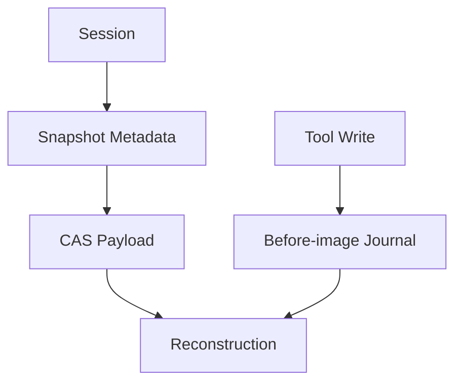

# Session、Snapshot、CAS 与 Workspace Journal

## 学习目标

区分 Session Metadata、Snapshot Checkpoint、Immutable Content Store 与 Workspace
Side-effect Recovery。

## Four Complementary Stores

| Store | Identity | Purpose |
| --- | --- | --- |
| Session Repository | Session/Workspace/Thread ID | Lifecycle/Profile/Lineage/List |
| Snapshot Repository | Snapshot/Thread/Sequence | Fast Restore |
| CAS | Content Hash | Deduplicated Immutable Bytes |
| Workspace Journal | Turn/Path Fingerprint | Rollback/Crash Recovery |



Snapshot 带 Schema、Sequence、Content Handle、Size 与 Digest。Save 在提交 Metadata 前
Retain CAS；Read 验证 Hash/Schema。CAS 验证 ID-content 一致性、Regular-file Layout、
Reference Metadata、Atomic Write 与 Cross-process Lock。

Journal 记录 Turn 内每个 Path 的 First Before-image 与 After Fingerprint；Durable
Ledger 先于对应 Workspace Write 落盘。Recovery 跳过 Live Owner，只在 Current State
匹配时恢复 Abandoned Work，并保留 Conflict 供重试。

Session Checkpoint 与 Structured Plan Artifact 复用 Snapshot Metadata/CAS，但仍是
Runtime-owned Typed Artifact。Checkpoint 绑定已验证的 Model-visible History Baseline、
Session Profile Revision、Source Thread/Turn 与 Integrity Metadata。Restore 只选择
该 State，不执行历史 Event；Fork 在运行新 Turn 前写入 Parent Session、Parent Thread
与 Source Checkpoint Lineage。

Session Lifecycle State 还包括 Title、Pin/Archive、Active Thread、Latest Turn、Pending
Activity 与 Optimistic Revision。Host 只能缓存 Binding/Cursor；Canonical Session State
通过 Runtime Operation 查询和修改。

Lifecycle Transition 在 `sqlkit.WithTx` 内执行；Optimistic Revision 递增与
Identity-bound Update 用 `RequireAffected` 校验精确行数，避免 Stale Session 静默覆盖
并发修改。Session 与 Snapshot Repository 复用共享 `sqlkit` Helper（`CanonicalObject`、
`Timestamp`、`NullableTime`）并在读取时 Canonicalize 存储 Metadata；Profile Update
同样在 `WithTx` 内执行，把行数不匹配映射为类型化的 `ProfileRevisionConflictError`。

## Commit/Reference Window

Snapshot Save 先保证 Content，再提交 Metadata：

```text
normalize payload -> compute/verify content id -> cas put/retain
                  -> sqlite snapshot metadata commit
```

Retain 后 Metadata 前失败可能留下 Reclaimable Content；反向排序会产生指向缺失内容的
Committed Snapshot。CAS Reference Change 使用 Cross-process Lock/Atomic Replace。

Journal 是 Side-effect 对应协议：

```text
durable owner/before-image -> workspace write -> after fingerprint -> turn commit
```

两者都宁可留下 Recoverable Leftover，也不创建 Dangling Authoritative Reference。

## Identity Boundary

Session 标识 Workspace Lifecycle；Thread/Turn 标识 Causal History；Checkpoint/Plan ID
标识不可变 User-visible Artifact；Snapshot Sequence 标识 Reconstruction Point；CAS ID
标识 Byte；Journal Turn/Path 标识 Effect。分离这些 Identity 可防止 Cross-workspace
Restore、伪造 Fork Lineage 与错误 Rollback。

## 设计取舍

大 Payload 放 SQLite 会增加 Churn；CAS 分离 Immutable Byte，SQLite 管 Reference。
Git 无法覆盖 Untracked File、Partial Turn 和 Non-Git Workspace，因此 Journal 仍必要。

## 失败与安全边界

- Snapshot Corruption/Schema Mismatch 被拒绝；Repository Read 遇到 Malformed
  Stored Metadata 也 Fail Closed（Integrity Error），而非静默修复。
- CAS Tampering、Symlink、Invalid ID/Reference Fail Closed。
- Last-reference Release 删除内容。
- CAS Retention 不删除仍被引用的 Object。
- Before-image Failure 阻止 Edit。
- Recovery 不覆盖 External Edit。
- State-only Restore 不能重放 Tool、Command、Network 或 File Effect。
- Profile Revision/Lineage Stale 时 Fork/Plan Execution 失败。

## 测试与验证

```bash
go test ./internal/runtime/app -run 'Test(SessionCheckpoint|Restore|Fork|Plan)'
go test ./internal/persist/session ./internal/persist/snapshot
go test ./internal/persist/state/cas ./internal/persist/workspacejournal
go test ./internal/persist/sqlkit
```

## 动手实验

追踪 Snapshot Save 的 CAS Retain/Metadata Commit，再与 Journal Before-image 比较，列出
两者各自能恢复什么。

## 复习问题

1. Snapshot Metadata 为什么与 CAS Byte 分离？
2. Git 为什么不足以承担 Turn Journal？
3. 自动 Rollback 的前提是什么？
4. CAS Retain 为什么先于 Snapshot Metadata Commit？
5. 哪些 Identity 防止 Cross-workspace Recovery Mistake？
6. Session Checkpoint 为什么不是 Workflow Progress Checkpoint？
7. Checkpoint Fork 重启后必须保留哪些 Lineage Fact？

## 延伸阅读

- [从失败运行还原系统行为](./06-reconstructing-failures.md)

## 事实来源与验证

| 项目 | 值 |
| --- | --- |
| Catalog ID | `state-session-snapshot-journal` |
| 状态 | `draft` |
| 最后验证 | 尚未验证 |
