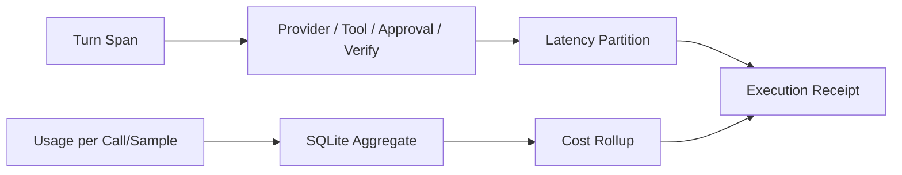

# Trace、Span、Usage 与 Cost

简体中文 | [English](../../en/08-state-observability/04-trace-usage-cost.md)

## 学习目标

理解 Phase Span、Latency Rollup、Multi-sample Usage Projection、Pricing Provenance 与
Redacted Telemetry。

## Observation Model



Trace Recorder 将 Phase Span 嵌套在 Turn 下，记录 Status/Attribute、First Output，并
显式关闭 Unfinished Span。Latency 分离 Total、Provider、First-token、Tool、Approval
Wait 与 Verification。

Usage Projection 要求 Turn Context，并按 Event 幂等。同一 Call 内 Usage 是 Cumulative，
因此 Latest Report 替换 Previous；不同 Call/Sample 相加。Cached/Reasoning Token 分离。

Cost 使用实际 Sample Route。Rollup 区分 Priced/Unpriced：Unknown Price 不是 Free，
Empty Query 也不是 Zero-cost Work。Trace Rollup 按 Thread/Turn/Time Window Scope，
Percentile 只使用完整 Measurement。

Telemetry Metric 使用 Atomic Counter；Structured Logger 递归 Redact Credential，并
传播 Writer Failure。

## Observation Type 与 Cardinality

| Signal | Identity/Cardinality | Suitable Use |
| --- | --- | --- |
| Metric | Bounded Label/Counter | Health/Rate/Saturation |
| Log | Timestamp + Structured Field | Sanitized Diagnosis |
| Span | Turn/Parent/Phase ID | Causal Timing |
| Usage Row | Turn/Call/Sample/Purpose/Route | Accounting |
| Receipt | One Terminal Turn Projection | User-facing Audit |

Path、Prompt、Tool Argument、Raw Error Body 放入 Metric Label 会造成 Unbounded
Cardinality/Leakage，应进入受限、Redacted Record。

## Clock 与 Aggregation

Span Duration 使用同一 Recorder Clock/Parent Identity，Wall-clock Timestamp 用于 Ordering/
Query Window。Rollup：

- 统计 Open Span，但不纳入 Completed-duration Percentile；
- 拒绝 Backward Window；
- 区分 Foreign Turn 与 Untraced Turn；
- 仅对 Comparable Completed Phase 计算 Percentile。

Latency Phase 可能 Overlap，因此 Phase Sum 是 Diagnostic Partition，不保证等于 Wall-clock
Total。

Usage Identity 包含 Call/Sample，避免 Retry/Tool-side Model Call 相互覆盖；Purpose/
Actual Route 解释 Spend 来源。

## 失败与安全边界

- Unfinished Span 可见，不在 Rollup 中伪造 Duration。
- Missing Trace/Usage 是 Absent，不是 Zero。
- Cumulative Usage 不重复计数。
- Unknown Pricing 不变成 Known Cost。
- Raw Secret 不进入 Log/Attribute。

## 测试与验证

```bash
go test ./internal/observability/trace
go test ./internal/observability/usage
go test ./internal/observability/telemetry
```

## 动手实验

构造含两个 Provider Call、每个 Call 两次累计报告的 Turn，先预测 Token/Cost Rollup。

## 复习问题

1. 为什么 Call 内 Replace、Call 间 Sum？
2. 为什么 Untraced 不等于 Zero Latency？
3. `CostKnown` 表达什么？
4. 哪些 Data 不应成为 Metric Label？
5. Phase Latency Sum 为什么可能不等于 Wall-clock Total？

## 延伸阅读

- [从失败运行还原系统行为](./06-reconstructing-failures.md)

## 事实来源与验证

| 项目 | 值 |
| --- | --- |
| Catalog ID | `state-trace-usage-cost` |
| 状态 | `verified` |
| 最后验证 | 2026-08-10 |
