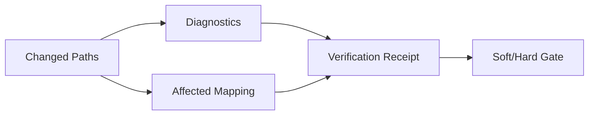

# Diagnostics、Maturity 与 Verification

简体中文 | [English](../../en/08-state-observability/05-diagnostics-and-verification.md)

## 学习目标

区分 Diagnostics 与 Verification，理解 Affected-test Mapping，以及 Passed、Failed、
Unavailable、Not-evaluated 对 Maturity Claim 的含义。

## Evidence Levels

| Level | 含义 |
| --- | --- |
| Observed Change | Byte 改变，无正确性声明 |
| Diagnostics Passed | File-local Check 无问题 |
| Affected Verification | Changed Path 映射的 Check 通过 |
| Repository Verification | Repository Command 通过 |



Diagnostics Runner 将 File Type 映射到 Sandboxed Command，并返回 Range/Severity。
Verify Runner 支持 Diagnostics、Affected、Repository Scope，检测 Build Manifest，
映射 Changed Path，固定 Workspace Root 执行并限制 Feedback。

Unavailable 表示无法建立 Verdict，例如 Module Proxy 环境故障；普通 Test Failure/
Timeout 仍是 Failed。Not Evaluated 表示 Gate 未运行。三者都不能折叠成 Pass。

## State 与 Invalidation

```text
not_evaluated -> running -> passed | failed | unavailable
                                      |
                                      +-> invalidated by later write
```

Diagnostics 绑定 File/Version；Verification 绑定 Changed Path、Command、Scope、Final
Workspace State。Later Write 使对应 Passing Evidence 失效。Soft Gate 可带 Failed/
Unavailable Evidence 完成；Hard Gate 改变 Outcome 或 Revert。

Affected Scope 将 Changed Go Directory 映射到 Package，将 Source Path 映射到 Related
Test，报告 Unmapped Path，使用 Quoted Relative Path 扩展 Configured Command，并从
Canonical Root 执行。它限制成本，但不证明完整 Dependency Analysis。

Repository Test Topology 覆盖 Go、JavaScript/TypeScript、Python 和 Rust。每条
Selected Command 都包含 Derivation Reason。Manifest Change 会扩大到
Repository/Module Command；Unsupported 与 Unmapped Path 保持显式，不会静默返回空
Test List。

## Maturity Claims

Feature/Chapter/Receipt 的成熟度只能达到实际 Verification Scope。Diagnostics Pass
不能声称 Repository Test Pass；单包通过不能声称全平台通过。

Maturity 是 Tuple，不是 Badge：

```text
(platform, revision, scope, command, outcome, observed_at)
```

任何元素变化都可能使 Claim 失效。

## Observation Health 不是业务 Outcome

Observation Health 分别统计 Accepted/Dropped Record、Queue Pressure、Privacy
Rejection、Journal Failure、Payload Loss 与 Exporter Failure。这些 Fact 用于诊断证据
质量，不能把 Completed Turn 改成 Failed，也不能把 Failed Turn 改成 Completed。

每种 Observation Kind 来自同一 Trait Manifest，声明 Owner、Durability、Payload
Policy、Retention Class、必需 Correlation、OpenTelemetry Mapping 与 Queue Priority。
Manifest、Go Table、TypeScript Table 与公开 JSON Schema 的漂移会使构建失败：

```bash
make observation-traits-check
```

这相当于 Observability 的 Protocol Schema Drift：新增 Kind 却没有 Privacy、
Retention 与 Projection 决策，属于不完整实现。

## 失败与安全边界

- Unknown Scope 被拒绝。
- Affected Mapping 报告 Unmapped Path。
- Workflow Output Check 不信任 External Schema Reference。
- Sandbox/Process Failure 显式保留。
- Hard Mode 不接受 Unavailable Runner。
- Observation Health 不能解释为 Turn Lifecycle Authority。
- 新 Observation Kind 缺少 Generated Trait 时验证失败。

## 测试与验证

```bash
go test ./internal/observability/diagnostics ./internal/observability/verify
go test ./internal/observability/health ./internal/observability/privacy
go test ./internal/runtime/agent/engine -run TestVerifyGate
make observation-traits-check
make benchmark-v2
```

## 动手实验

对比 Dependency Network Outage 与真实 Test Timeout，解释它们为何得到不同 Status。

## 复习问题

1. Diagnostics Pass 为什么弱于 Repository Verification？
2. Unavailable 表示什么？
3. Affected Verification 如何限制成本？
4. 什么 Event 会使 Passing Verification 失效？
5. Unmapped Changed Path 为什么必须可见？

## 延伸阅读

- [Verification Gate 与证据](../06-tools-and-execution/05-verification-and-evidence.md)

## 事实来源与验证

| 项目 | 值 |
| --- | --- |
| Catalog ID | `state-diagnostics-verification` |
| 状态 | `draft` |
| 最后验证 | 尚未验证 |
