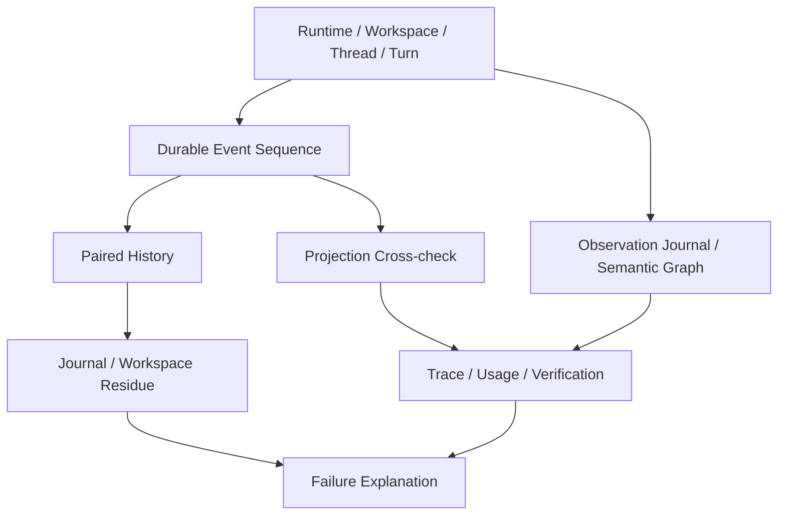

# 从失败运行还原系统行为

简体中文 | [English](../../en/08-state-observability/06-reconstructing-failures.md)

## 学习目标

使用 Event、Projection、Snapshot、Journal、Trace、Usage、Evidence 与 Receipt 还原
Failure，避免猜测。

## Reconstruction Order



先确定 Stable Identity 与 Terminal Event。History 只接纳完整 Assistant Tool Call/
Tool Result Pair；Orphan Result 与 Interrupted Partial Turn 不进入 Model History，并按
顺序应用 Compaction/Fork/Revert Event。

随后比较 Projection/Event Evidence，检查 Active/Committed Journal，判断 Workspace
Byte 是 Restored 还是 Conflicted；最后关联 Provider、Tool、Approval、Verification
Span、Usage 与 Execution Receipt。

## Observation Evidence 与 Semantic Replay

Raw Observation Journal 按顺序保留通过 Privacy Admission 的 Envelope。Semantic
Reducer 确定性 Fold 为 Entity、Causal Edge、Attempt、Failure 与 Terminal
Explanation。Reducer Output 是可重建 Projection，不能授权 Retry 或覆盖 Runtime
Lifecycle Fact。

使用 Observation ID、Trace/Span ID、Parent Observation ID 与 Domain Correlation
连接 Provider、Tool、WorkGraph、Extension 与 Process Evidence。Capture Mode 限制
可得结论：Metadata-only Record 有意省略 Raw Payload；过期 Payload Reference 保持为
Unavailable Content，不能伪造成 Empty Data。

内部 Support Bundle Builder 选择有界记录，对 Summary/Payload 再次脱敏，默认排除
Payload，并以 mode `0600` 写入私有 Archive。Bundle 只是 Evidence Transport，不高于
其包含的 Source Record。

## Failure Class

- **Rejected before effect**：Schema/Policy/Lease/Precondition。
- **Effect observed and reverted**：Rollback 成功。
- **Effect unresolved**：Conflict 或 Non-file Side Effect。
- **Interrupted ownership**：Expired Lease/Dead Journal Owner。
- **Indeterminate persistence**：Append 与 Rollback 都失败。
- **Unavailable observation**：Check/Trace 未建立 Verdict。

## Evidence Precedence

Record 冲突时，优先使用最接近 Claim 的 Evidence：

```text
durable runtime event / workspace journal bytes
  > transactional projection with matching event
  > raw observation journal envelope
  > deterministic semantic projection
  > observed trace/usage/verification
  > execution receipt projection
  > model/child self-report
```

它不是 Universal Truth Order：Journal 对 File Effect 最强；Event Sequence 对 Runtime
Lifecycle 最强；Verification 对 Named Check Scope 最强。每个结论必须说明 Domain。

## Investigation Worksheet

| Question | Evidence |
| --- | --- |
| Work 是否只 Accept 一次？ | Operation ID/Idempotency/Reservation |
| 哪些 Lifecycle Fact Durable？ | Event Cursor/Kind/Hash |
| Query State 是否一致？ | Projection Sequence/Row |
| Tool Effect 是否发生？ | Call/Result、Journal、Observed Change |
| 是否 Authorized？ | Policy/Approval/Edit Plan |
| 是否 Reverted？ | Expected/Current Fingerprint |
| Cost？ | Per-call/Sample Usage/Actual Route |
| Time？ | Completed/Open Phase Span |
| 哪些 Causal Link 存在？ | Observation ID、Trace Context、Semantic Edge |
| Evidence 是否被 Drop？ | Observation Health/Capture Mode |
| 建立何种 Correctness？ | Verification Status/Scope/Command |
| 哪些 Unknown？ | Gap/Unavailable/Conflict |

先按 Cursor 构造 Monotonic Timeline，再附 Timestamp。Wall Clock 可能 Skew，不能重排
Canonical Event Sequence。

说明必须分别列出 Evidence 与 Uncertainty。缺少 Terminal Event 不能证明 Tool 未产生
Effect，还需检查 Journal 与 External Side Effect。

## 安全边界

- 不为诊断而重跑 Engine。
- 不从 Absent Diagnostics/Test 推断 Pass。
- 不丢弃 Sequence Gap/Journal Conflict。
- 不把 Child Self-report 当作 Gate-proven。
- Redact Credential，同时保留 ID/Category。
- Metadata Capture/Retention 下缺少 Payload 不能解释为空的成功证据。
- Semantic Projection/Support Bundle 不能成为执行权威。

## 测试与验证

```bash
go test ./internal/runtime/app -run TestReconstructThread
go test ./internal/runtime/app/wire -run TestPersistentRuntime
go test ./internal/persist/workspacejournal
go test ./internal/observability/semantic
go test ./internal/observability/supportbundle
```

## 动手实验

对 Interrupted Write Fixture 生成包含 Event Cursor、Tool Pair、Journal Fingerprint、
Recovery Action 与 Unresolved Claim 的 Timeline。

## 复习问题

1. Orphan Tool Result 为什么不进入 History？
2. 哪些 Evidence 区分 Reverted 与 Unresolved？
3. 何时诊断必须保持 Indeterminate？
4. Timeline 为什么先用 Event Cursor，再用 Timestamp？
5. File Effect 与 Lifecycle 分别以什么 Evidence 为 Authority？

## 延伸阅读

- [Task、Worker 与 Executor](../09-task-orchestration/01-task-worker-executor.md)

## 事实来源与验证

| 项目 | 值 |
| --- | --- |
| Catalog ID | `state-reconstruct-failure` |
| 状态 | `draft` |
| 最后验证 | 尚未验证 |
