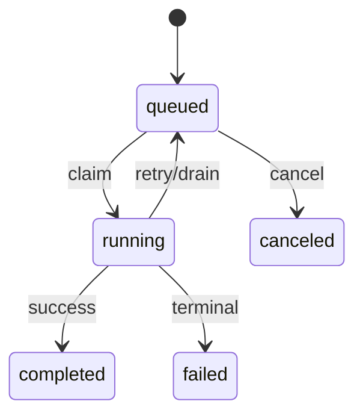

# Task、Worker 与 Executor

简体中文 | [English](../../en/09-task-orchestration/01-task-worker-executor.md)

## 学习目标

理解 Durable Task State、Worker Scheduling、Executor Contract，以及 Background Work
为何仍必须进入 Production Runtime。

## Lifecycle



Task 记录 Executor、Payload、Workspace/Session Identity、Attempt、Lease Owner/Expiry、
Schedule、Result、Failure Reason 与 Version。Repository 校验 `CanTransition` 并追加
Lifecycle Entry；Transition 与 Session/Execution Write 在 `sqlkit.WithTx` 内执行，
Optimistic Version Update 用 `RequireAffected` 校验精确行数。

Worker Scheduler 只广告有限 Executor Set，只 Claim 匹配 Task，遵守 `MaxParallel`，
启动 Heartbeat，在 Cancellation 下运行 Executor，再 Settle Success/Failure/Retry/
Drain。Duplicate Executor 与 Unknown Task Executor 在构造/Create 时失败。

Production Executor 将 Agent Turn、Shell、Workflow 送入 Guard、Policy、Runtime、
Journal 与 Receipt。Host 只 Submit/Observe Task，不执行 Provider/Tool Logic。

## 三层 Identity

| Identity | Meaning | 可重复？ |
| --- | --- | --- |
| Task ID | Durable Requested Work | 否 |
| Attempt | Leased Execution Opportunity | 有界重复 |
| Thread/Turn ID | Attempt 产生的 Runtime Execution | 每次新建 |

Task State 是 Scheduling Authority；Attempt 解释 Ownership/Retry；Runtime Event/Receipt
解释 Agent Execution。混用会让 Retried Turn 看似 Duplicate Task Completion。

## Executor Contract

Executor 广告 Stable Name，并返回区分 Success、Retryable、Terminal、Drain 的 `Outcome`。
它必须响应 Context Cancellation，在 Effect 前验证 Payload，报告 Turn Identity，并说明
Retry Safety。Scheduler 而非 Executor 拥有 Task Transition/Lease Settlement。

构造时验证 Finite Executor Set，防止 Worker Claim Opaque Work 后才发现无法执行。

## 正确性边界

- Claim 受 Workspace Scope 限制且只有一个 Winner。
- Execution 前记录 Running Attempt。
- Scheduler Close 在安全时把 Work 放回 Queue。
- Unsupported Payload 不盲目 Retry。
- Writing Child Result 通过 Guarded File Merge。
- In-memory Limit 与 Durable Lease Fence 共同工作。
- 存储的 Task Payload/Result 在读取时 Canonicalize 并校验；Malformed Stored
  JSON Fail Closed 而非静默修复。

## 测试与验证

```bash
go test ./internal/orchestration/task ./internal/orchestration/worker
go test ./internal/runtime/app/wire -run 'TestScheduler|TestQueuedTask'
```

契约测试覆盖重复身份、乐观冲突、取消上下文、缺失 Schema 与真实重启/重开行为：Task
与 Automation 状态在真实数据库重开后存活，定时 Tick 恰好执行一次。

## 动手实验

追踪一个 `agent_turn` Task 从 Create、Claim 到 Child Runtime Turn 和最终 Receipt/Settle。

## 复习问题

1. 哪些信息属于 Task State，哪些只属于 Worker Memory？
2. Executor Name 为什么参与 Claim？
3. Background Shell 为什么仍需 Guard？
4. Task、Attempt、Turn Identity 有何区别？
5. 为什么 Scheduler 而非 Executor 负责 Settlement？

## 延伸阅读

- [Lease、Heartbeat、Retry 与幂等性](./02-lease-heartbeat-retry.md)

## 事实来源与验证

| 项目 | 值 |
| --- | --- |
| Catalog ID | `task-worker-executor` |
| 状态 | `draft` |
| 最后验证 | 尚未验证 |
