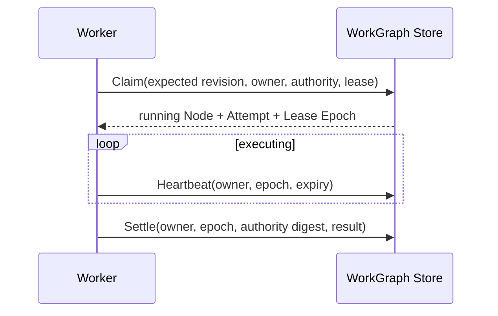

# Lease、Heartbeat、Retry 与幂等性

简体中文 | [English](../../en/09-task-orchestration/02-lease-heartbeat-retry.md)

## 学习目标

理解 Ownership Fencing、Lease Loss、Attempt Accounting、Bounded Backoff 与 Retry
Safety 的边界。

## Ownership Protocol



Running Work 的每次 Mutation 都校验 Current Owner、Lease Epoch、Authority Digest 与
Expected Revision。Expired Lease 可由新 Owner 以新 Epoch Reclaim/Requeue；旧 Owner
被 Fence，下一次 Heartbeat/Settle 失败，并触发 Worker Cancellation。

普通 Retry 与 Lease Expiry 消耗 Attempt；Graceful Drain 返还 Attempt。Backoff 递增并
封顶；Attempt 用尽后 Requeue 转为 Failed。

Lease Fence 防止两个 Owner 提交 Task State，却不能撤销 Lease Loss 前已产生的 External
Side Effect。Retried Executor 必须 Intrinsically Idempotent、使用 Idempotency Key，
或拒绝 Retry。Shell Background Task 明确要求 Idempotent Declaration。

## Idempotency

Recovery Requeue 可执行 Interrupted Work，Fail 无有效 Executor/Retry Path 的 Work，
并保留 Healthy Foreign Lease。

## Lease 是 Time-bounded Fence

Lease 只证明 Repository 在 Stored Expiry 前承认一个 Owner；不证明 Process Alive、Work
Progress，也不保证 External System 遵守 Fence。

```text
claim: ready -> running, owner, epoch, expiry, Attempt + Effect
heartbeat: require owner + epoch + unexpired lease, extend expiry
settle: require owner + epoch + authority digest, append one transition
reclaim: require expired lease, close Attempt, increment epoch, fence old owner
```

Heartbeat Cadence 必须显著短于 Lease Duration。另一个 Owner Reclaim 后，Late Heartbeat
不能恢复 Ownership。

## Retry Safety Matrix

| Effect | Safe Retry Condition |
| --- | --- |
| Pure Read/Compute | Deterministic/Harmless Repeat |
| Runtime Turn | Durable Idempotency/Admission |
| File Write | Journal/Transaction 证明 Rollback/Target State |
| Remote API | Service Idempotency Key/Stable Request ID |
| Shell | Explicit Idempotency Contract |
| Unknown/Partial Effect | 不自动 Retry |

## 失败与安全边界

- Stale Owner 的 Heartbeat/Settle 被拒绝。
- Stale Lease Epoch/Authority Digest 的 Heartbeat/Settle 被拒绝。
- Claim 不跨 Normalized Workspace。
- Healthy Lease 不被抢占。
- Retry Count/Delay 有界。
- Task Durability 不自动证明 Side-effect Idempotency。
- Duplicate Settlement 不产生两个 Terminal。

## 测试与验证

```bash
go test ./internal/orchestration/kernel ./internal/orchestration/store
go test ./internal/orchestration/task -run 'Test(Claim|Settle|Reclaim|Recovery|Backoff)'
go test ./internal/orchestration/worker -run 'Test.*(Lease|Retry|Takeover)'
```

## 动手实验

让第二个 Owner Reclaim Expired Lease，再用旧 Owner Heartbeat/Settle，解释每个 Fence。

## 复习问题

1. Lease 能证明什么？
2. Graceful Drain 为什么返还 Attempt？
3. Fence 为什么不足以保证 External Side-effect Idempotency？
4. Late Heartbeat 为什么不能恢复 Ownership？
5. Retry Partial Effect 前需要什么 Evidence？

## 延伸阅读

- [Checkpoint 与恢复](./04-checkpoint-and-recovery.md)

## 事实来源与验证

| 项目 | 值 |
| --- | --- |
| Catalog ID | `task-lease-retry` |
| 状态 | `verified` |
| 最后验证 | 2026-08-17 |
