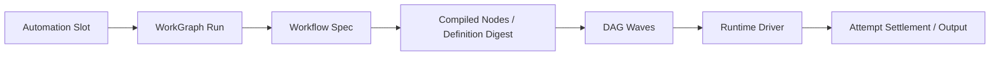

# Automation 与 Workflow

## 学习目标

理解 Recurring Automation Slot、DAG Workflow、Capability Default、Structured Output
与 Deterministic JavaScript Host。

## Automation

Automation 保存 Trigger、Canonical RRULE Subset、Creation Anchor、Next Run、Status、
Payload、Version 与 Run Record。`Tick` 在 Transaction 中为每个 Due Slot 只创建一次，
即使 Concurrent Process/Restart；Resume 使用 Persisted Creation Anchor，不漂移 Schedule。

Logical Dedup Key 是 Automation Identity + Scheduled Slot，而不是 Worker Tick Time。
Pause/Resume 改 Eligibility，不改变 Anchor；`RunNow` 创建 Explicit Run Identity。

## Workflow



Workflow `Spec` 校验 Unique Node、Dependency、Acyclicity、Condition、Retry、Timeout、
Permission 与 Budget。Ready Independent Node 以 Bounded Parallel Wave 运行；Join 等待，
Failed Dependency 跳过 Descendant，Compensation 可按 Condition 运行。

Spec 会编译成带 Stable Digest 的 WorkGraph Definition。Workflow Checkpoint 已退休：
每个 Claim、Attempt、Effect、Result 与 Terminal Transition 都是 Revision-checked
Kernel Command。Store 原子提交 Aggregate Snapshot、Ordered Fact、Command Receipt、
Effect Outbox 与兼容 Projection。

Permission 默认 Deny Host Capability。Task Response Schema 不允许 External Reference。
JS VM 移除 Nondeterministic Host Access，限制 Environment/Workspace Read，强制 Timeout，
并 Cancel Outstanding Task。

## DAG Semantics

Node Array Order 不是 Execution Order，Dependency Edge 决定 Ready。Bounded Wave 包含当前
Ready Independent Node，受 `MaxParallel` 限制。Join 观察 Terminal Dependency Result。
Failed Dependency 跳过普通 Descendant，Explicit Failure Condition 可触发 Compensation。

Node 有独立 Attempt/Timeout/Retry，但共享 Workflow Budget。Retry 不擦除 Earlier Attempt
Evidence。Structured Output 验证后才能进入 Downstream Node。

Resume Replay Ordered Fact，只执行未完成 Node。Succeeded Node 复用稳定
`workgraph://.../nodes/...` Result Reference；同一 Run ID 携带不同 Definition Digest
会在执行前失败。

## Determinism Boundary

Definition Digest 覆盖 Executable Graph Semantics。JS Host 移除 Clock/Random/Global Process，
只开放 Allowlisted Env/Workspace Read，并通过 Driver Spawn。External Task 仍可能
Nondeterministic，其 Durable WorkGraph Result 与 Effect-specific Idempotency Evidence
才是 Replay Boundary。

## 失败与安全边界

- Concurrent Tick 不重复 Schedule Slot。
- Invalid Graph/Fingerprint 在 Run/Resume 前拒绝。
- Snapshot/Fact Drift 显式报告，Repair 只能重建 Snapshot。
- Node Retry/Timeout 有界。
- Failed Dependency 不被当作 Empty Output。
- Secret Environment/Workspace Escape 被拒绝。
- Unsupported Profile/Schema 在 Production Turn 前失败。

## 测试与验证

```bash
go test ./internal/orchestration/automation
go test ./internal/orchestration/kernel ./internal/orchestration/store
go test ./internal/orchestration/workflow/...
```

## 动手实验

运行 Parallel Wave、Failed Dependency 与 Compensation Test，画出 Node Status Graph。

## 复习问题

1. Automation 如何防止 Duplicate Slot？
2. Workflow Permission 为什么 Default Deny？
3. JS Host 如何支持确定性恢复？
4. 什么 Key 防止 Duplicate Automation Slot？
5. Structured Output 为什么在 Downstream 前验证？

## 延伸阅读

- [Checkpoint 与恢复](./04-checkpoint-and-recovery.md)

## 事实来源与验证

| 项目 | 值 |
| --- | --- |
| Catalog ID | `task-automation-workflow` |
| 状态 | `draft` |
| 最后验证 | 尚未验证 |
