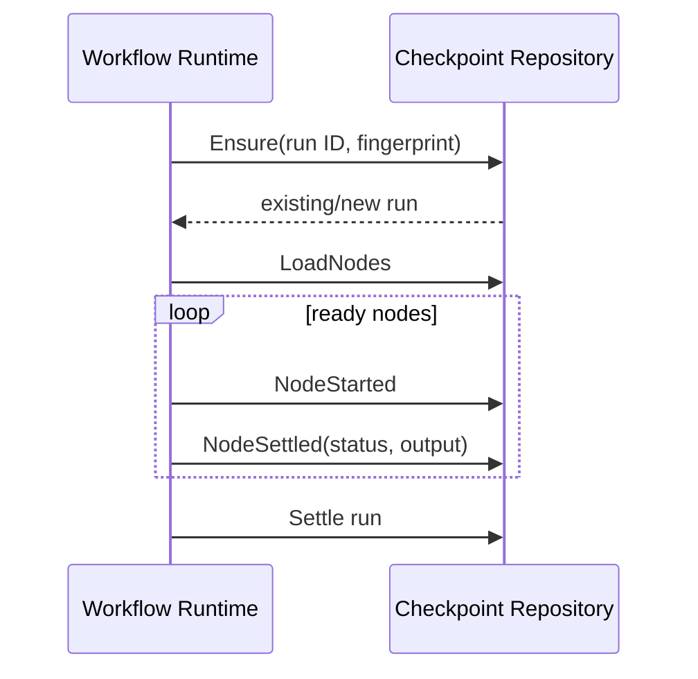

# Checkpoint 与恢复

简体中文 | [English](../../en/09-task-orchestration/04-checkpoint-and-recovery.md)

## 学习目标

理解 Workflow Fingerprint、Node Checkpoint、Output Handle 与 Resume-only-unfinished。



`Ensure` 仅在 Workflow Fingerprint 一致时创建或 Adopt Run。Node Record 跨 Restart
保存并原位更新。Large Output 放在 Content Handle 后；Missing Output 与 Node Status
分开报告。

Resume 不重跑 Completed Terminal Node；Failed/Skipped Dependency Semantics 保留，
只执行 Unfinished Eligible Node。Node Attempt、Retry、Timeout 与 Output Validation
在 Recovery 后仍有效。

## Node Commit Window

```text
node_started durable
 -> driver external/runtime execution
 -> validate output
 -> store output handle
 -> node_settled durable
```

`NodeStarted` 后 Settlement 前 Crash 留下 Unfinished Node；能否重跑取决于 Effect/
Idempotency Contract，而非只看 Checkpoint。Output Store 后 Settlement 前可能留下
Reclaimable Content；Settlement 不能指向 Store Failure。

Status/Output Handle 分离，使系统可表达“Completed but Output Unavailable”，而不是篡改为
“Not Run”。

## Resume Decision

| Node Record | Behavior |
| --- | --- |
| Terminal + Valid Output | Reuse |
| Terminal + Missing Output | Preserve Status/Report Missing |
| Started/Non-terminal | 按 Retry/Effect Policy 恢复 |
| Absent + Dependency Ready | Next Wave Eligible |
| Failed Dependency Skip | Preserve |
| Fingerprint Mismatch | Refuse Resume |

Task Recovery 恢复 Ownership/Queue；Workflow Checkpoint 恢复 Graph Progress；Runtime
Event 恢复 Child Turn；Workspace Journal 恢复 File Effect。它们协调但互不替代。

## 失败与安全边界

- Changed Workflow Fingerprint 拒绝 Resume。
- Non-terminal Status 不能 Settle Node。
- Output Store Failure 不伪装 Success。
- Missing Output 不擦除 Terminal Status。
- Resume 不重跑 Completed Node。
- Checkpoint 不自动使 External Effect 幂等。

## 测试与验证

```bash
go test ./internal/orchestration/workflow/checkpoint
go test ./internal/orchestration/workflow -run 'TestResume|TestFingerprint'
```

## 动手实验

在一个 Node Settle 后停止 DAG，重开 Checkpoint Repository，确认只执行剩余 Wave。

## 复习问题

1. Checkpoint 为什么绑定 Spec Fingerprint？
2. Output 为什么与 Node Status 分开存储？
3. 哪个 Recovery Layer 处理 Workspace Byte？
4. 什么 Crash Window 会留下 Stored/Unreferenced Output？
5. Started Node 为什么不一定可安全重跑？

## 延伸阅读

- [Lease、Heartbeat、Retry 与幂等性](./02-lease-heartbeat-retry.md)

## 事实来源与验证

| 项目 | 值 |
| --- | --- |
| Catalog ID | `task-checkpoint-recovery` |
| 状态 | `verified` |
| 最后验证 | 2026-08-10 |
