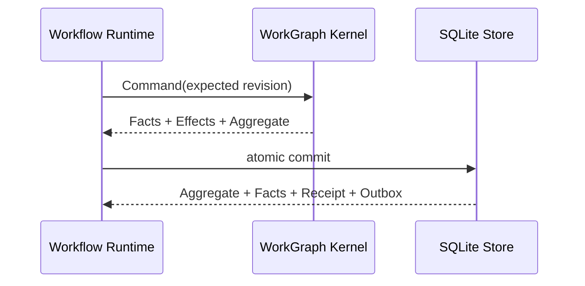

# Checkpoint 与恢复

简体中文 | [English](../../en/09-task-orchestration/04-checkpoint-and-recovery.md)

## 学习目标

理解 WorkGraph Fact、Snapshot、Command Receipt、Effect Outbox、Fingerprint
校验与只恢复未完成节点的语义。

## Durable Contract

Workflow Checkpoint 已退出生产架构。Workflow Spec 编译为一个 Durable WorkGraph，
所有生命周期变化都通过 Kernel Command 完成。



同一事务提交 Aggregate Snapshot、Ordered Facts、Command Receipt 与 Effect Outbox。
Snapshot 用于加速读取，Facts 是重建权威。同一 Run ID 搭配不同 Definition Digest
时必须 Fail Closed。

## Node Commit Window

```text
Claim Node + create Attempt + queue Effect
 -> bind Runtime/Process execution
 -> validate output and usage
 -> settle Attempt and Node
 -> queue terminal Effect
```

事务提交前 Crash 不会留下局部生命周期状态。Claim 后、Settlement 前 Crash 会留下带
Lease 的 Attempt；恢复过程依据 Lease Epoch、Retry 与 Effect Idempotency Policy
处理。新的 Epoch 接管后，旧 Worker 不能再提交结果。

Node Result 与稳定的 `workgraph://.../nodes/...` 引用随 Settlement Fact 持久化。
Fleet 和 Host 只能投影这些状态。

## Resume Decision

| Durable State | Resume Behavior |
| --- | --- |
| Succeeded Node | 复用，不再执行 |
| Failed Retryable Node | 创建新 Attempt |
| Active Attempt + Live Lease | 保留当前 Owner |
| Expired Lease | 通过 Fenced Command Release/Reclaim |
| Dependency-ready Node | 可进入 Claim |
| Definition Digest Mismatch | 拒绝整个 Run |
| Snapshot/Fact Drift | 报告 Drift，仅修复 Snapshot |

## Audit 与 Repair

`Store.Audit` 在同一 Read Transaction 中比较 Snapshot Digest 与 Replay Digest，并
报告 Pending Effect。`RepairSnapshot` 在单个事务中只重建
`work_runs.aggregate_json`、Revision、State 与更新时间，不改写 Fact、Command
Receipt 或 Outbox。

## Recovery Layers

WorkGraph Recovery 恢复 Run/Node/Attempt/Effect；Runtime Event Recovery 恢复 Child
Turn；Workspace Journal 恢复文件 Effect。Session Checkpoint 仍是独立的用户历史与
Fork 能力，不是 Workflow 执行权威。

## 失败与安全边界

- Revision CAS 拒绝并发过期 Command。
- Lease Epoch 拒绝过期 Settlement。
- Definition Digest Drift 拒绝 Resume。
- Terminal Settlement 与 Terminal Outbox 原子提交。
- Snapshot Repair 不能改写 Durable Fact 或 Receipt。
- Recovery 不会自动让 External Effect 幂等。

## 测试与验证

```bash
go test ./internal/orchestration/kernel ./internal/orchestration/store
go test ./internal/orchestration/workflow -run 'TestDurable|TestSpecDrift'
```

## 动手实验

让 Workflow 在一个 Node 成功后失败，重开 SQLite Store，以相同 Run ID Resume，
确认只有失败节点获得新 Attempt。随后篡改 Aggregate Snapshot，通过 Audit/Repair
从 Facts 重建。

## 复习问题

1. Ordered Facts 为什么比 Snapshot 更权威？
2. 哪些记录与生命周期 Command 原子提交？
3. 过期 Lease Epoch 为什么不能 Settle？
4. Snapshot Repair 可以修改哪些数据？
5. Session Checkpoint 与 Workflow Recovery 有何区别？

## 延伸阅读

- [Lease、Heartbeat、Retry 与幂等性](./02-lease-heartbeat-retry.md)

## 事实来源与验证

| 项目 | 值 |
| --- | --- |
| Catalog ID | `task-checkpoint-recovery` |
| 状态 | `verified` |
| 最后验证 | 2026-08-16 |
