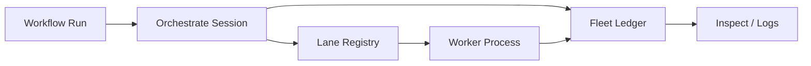

# Lane、Fleet 与调度

简体中文 | [English](../../en/09-task-orchestration/05-lane-fleet-scheduling.md)

## 学习目标

理解 Lane Process Placement、Fleet Durable Projection、Profile Limit，以及它们与
Workflow Execution 的 Bridge。

- **Lane**：管理 Inline/Tmux Worker 的 Start/Stop/Status/Attach/Log，绑定 Worktree
  与 NDJSON Contract。
- **Fleet**：Append-only Run/Task/Terminal Ledger 和 Replay Inspection View。
- **Profile**：Concurrency、Lease Timeout、Heartbeat Alert 与 Worker Setting。
- **Orchestrate Session**：在 Workflow Driver 周围创建 Fleet/Lane Context。



Lane State 持久化，但 Persisted Record 不证明 Process 存活；Status Check 负责 Reconcile。
Inline/Tmux Backend 显式报告 Availability。Environment 经过 Filter，Secret-shaped
Variable 被拒绝。

Fleet Ledger 将 Concurrent Append 序列化为 Monotonic Sequence，修复 Torn Final Line，
Replay 当前 Run/Task State，并兼容 Retired Record Kind。Inspection 是 Projection，
不是 Execution Authority。

## Control Plane、Placement 与 Evidence

| Component | Owns | Does Not Prove |
| --- | --- | --- |
| Profile | Desired Limit/Timeout | Active Enforcement/Liveness |
| Lane Registry | Process Placement/Control | Task Ownership |
| Worker Lease | Current Task Fence | Process Progress |
| Fleet Ledger | Audit Sequence | Execution Authority |
| Workflow Checkpoint | Node Progress | OS Process Liveness |

Lane `Status` 将 Persisted Metadata 与 Backend Reconcile；只有 Backend 支持时才返回 Attach。
Log 使用 Bounded NDJSON，便于关联 Placement，且不把 Arbitrary Output 当 Control Message。

## Scheduling Layer

Workflow 选择 Dependency-ready Work；Profile 限制 Desired Parallelism；Worker Capacity
Admission；Repository Claim 授予 Durable Ownership；Lane 放置 Process。每层可降低
Concurrency，但不能扩大 Policy/Task Payload 的 Authority。

Fleet Sequence 保证 Concurrent Writer 下 Deterministic Inspection。读取 Retired Record
是 Compatibility，不授权创建 Legacy Work。

## 失败与安全边界

- 缺少 tmux 时 Fail Closed。
- Worktree Binding/Command Contract 被验证。
- Secret Environment 被拒绝。
- Concurrent Append 获得不同 Sequence。
- Torn-tail Repair 不容忍 Committed Corruption。
- Profile Limit 不证明 Live Lease。

## 测试与验证

```bash
go test ./internal/orchestration/lane ./internal/orchestration/fleet
go test ./internal/orchestration/workflow/orchestrate
```

## 动手实验

在 Fixture 启动 Inline Lane、读取 NDJSON Log、Stop，再 Replay Fleet State，对比 Process
State 与 Projected Task State。

## 复习问题

1. Lane 与 Worker 有何区别？
2. Fleet Inspection 为什么不是 Authority？
3. Persisted Lane Record 能证明什么？
4. 哪个 Component 授予 Durable Task Ownership？
5. Scheduling Layer 为什么只能降低而不能扩大 Authority？

## 延伸阅读

- [Subagent、Worktree 与拓扑关系](./06-subagent-worktree-topology.md)

## 事实来源与验证

| 项目 | 值 |
| --- | --- |
| Catalog ID | `task-lane-fleet` |
| 状态 | `verified` |
| 最后验证 | 2026-08-06 |
