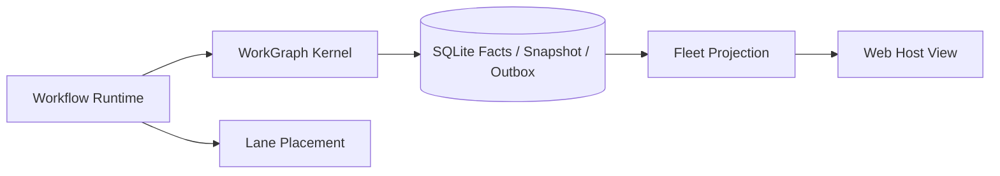

# Lane、Fleet 与调度

## 学习目标

理解 Lane Placement、Fleet WorkGraph Projection、Profile Limit 与唯一执行权威。

## Responsibilities

- **Lane**：记录 Durable Placement Metadata；受控 Process Adapter 可启动或控制
  Inline/Tmux Process。
- **Fleet**：读取 WorkGraph Aggregate/Facts，构建 Host View，审计 Snapshot Drift，
  并且只修复可重建 Snapshot。
- **Profile**：声明 Concurrency、Lease、Heartbeat 与 Worker Setting。
- **Orchestrate Session**：把 Workflow Run 绑定到一个 WorkGraph Controller、Budget
  Ledger 与 Lane Placement。



Fleet 不提供 Append、Enqueue、Claim、Settle 或 Resume Writer。Inspection 与 Logs
只是 WorkGraph State 和 Ordered Facts 的 Projection。`Audit` 比较 Snapshot 与 Fact
Replay；`Repair` 不能修改 Facts、Command Receipts 或 Outbox。

Workflow Orchestrate 使用 `Lane.Place`：同一 Run 与 Placement 幂等，冲突 Placement
Fail Closed；它不会启动 Dummy Process，也不会创建第二 Scheduler。

## Control Plane、Placement 与 Evidence

| Component | Owns | Does Not Prove |
| --- | --- | --- |
| WorkGraph Kernel | Lifecycle Transition | External Process Liveness |
| Worker Claim | 当前 Lease/Epoch Ownership | Future Progress |
| Lane Registry | Placement 与显式 Process Adapter Metadata | Lifecycle Authority |
| Fleet | Read Model、Audit、Snapshot Repair | Execution Authority |
| Profile | Desired Limit/Timeout | Active Lease Ownership |

Task Projection 可以与 WorkGraph Facts 在同一 SQLite 事务更新，但不能独立 Transition。
Host 读取同一个 Run View：Run、Node、Attempt、Effect、Authority Digest、Permission
Digest、Lane ID 与稳定 Result Reference。

## Scheduling Layer

Kernel 推导 Dependency-ready Node；Hierarchical Fair Selector 对
Workspace/Session/Run Candidate 排序；Worker 保持唯一 Claim Authority。Budget
Admission 与 Profile Capacity 可以降低并发，但不能扩大 WorkGraph Command 或
Security Profile 授予的 Authority。

## 失败与安全边界

- 显式 tmux 执行缺少 tmux 时 Fail Closed。
- 冲突 Durable Lane Placement 被拒绝。
- Fleet 不能创建或修改 Run。
- Snapshot Drift 可见，Repair 只修改 Snapshot Cache。
- 过期 Revision 或 Lease Epoch 不能 Settle。
- Profile Limit 是配置，不证明 Live Lease。

## 测试与验证

```bash
go test ./internal/orchestration/lane ./internal/orchestration/fleet
go test ./internal/orchestration/workflow/orchestrate
```

## 动手实验

使用持久化 Data Directory 运行 Workflow，通过 Fleet Inspect；然后以相同 Run
重新打开，验证 Lane Placement 幂等及 Node Attempt 可恢复。只篡改 Snapshot，
确认 Audit 检出并修复 Drift。

## 复习问题

1. 哪个 Component 拥有 Lifecycle Transition？
2. Fleet Inspection 为什么不是 Authority？
3. Lane Placement 在什么条件下幂等？
4. 哪个 Component 授予 Durable Task Ownership？
5. Snapshot Repair 可以修改哪些 Evidence？

## 延伸阅读

- [Subagent、Worktree 与拓扑关系](./06-subagent-worktree-topology.md)

## 事实来源与验证

| 项目 | 值 |
| --- | --- |
| Catalog ID | `task-lane-fleet` |
| 状态 | `verified` |
| 最后验证 | 2026-08-16 |
