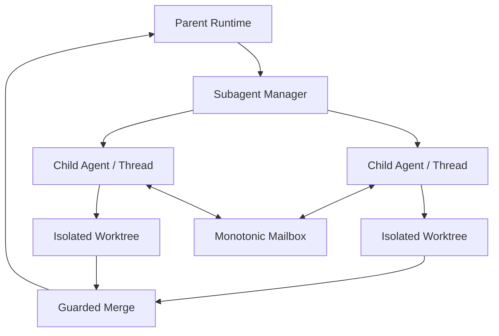

# Subagent、Worktree 与拓扑关系

简体中文 | [English](../../en/09-task-orchestration/06-subagent-worktree-topology.md)

## 学习目标

理解 Child Agent Role、Topology、Mailbox/Control、Budget、Isolated Worktree、Write
Claim 与 Guarded Merge。



Manager 解析有限 Role，映射 Profile/Stance，限制 Depth/Concurrency，Provision
Worktree，记录 Graph Edge/Status，并通过 Gate 路由 Tool。RuntimeHost 拥有真实 Child
Turn。

Control 支持 List、Wait、Follow-up、Interrupt、Complete/Fail、Close。Mailbox Delivery
Monotonic/Ordered。Result 记录 Usage、Artifact、Verification Status 与 Write Path。

Writing Child 使用 Isolated Git Worktree。Path Claim 检测重叠写入。Merge 将 Child
Result 展开为 Parent Concrete File Resource，检查 Baseline Drift，Preview/Dry-run，
再通过 Guarded File Transaction Apply。Serialized Strategy 可共享 Host Workspace/
Journal；Isolated Worktree 不可共享。

## Authority Inheritance

Child 继承 Bounded Context/Shared Accounting，不继承 Parent Full Authority。Role 选择
Profile/Stance；Budget 只能收紧 Depth、Concurrency、Token、Cost、Wall-clock。Child Tool
仍通过 Guard/Policy。Takeover/Writing Stance 不能制造 Missing Sandbox、Git Workspace、
Approval Host。

Durable Graph Edge 跨 Restart 记录 Parent/Child Identity/Status。Mailbox Sequence 只排序
Message；除非 Control Contract 规定，否则 Delivery 不自动 Start Turn。

## Merge 两阶段集成

```text
child settles result + write paths + baseline
 -> parent expands concrete resources
 -> check claims and parent drift
 -> preview/dry-run + approval
 -> guarded atomic apply in parent workspace
 -> verification + receipt
```

Child Completion 不等于 Parent Integration。即使 Child Result 有效，Path Claim Conflict/
Parent Drift 仍可拒绝；只有 Guarded Apply 修改 Parent Byte。

Worktree 隔离 Filesystem Mutation，Write Claim 协调 Semantic Merge Target。两个 Branch
可独立编辑同一路径，但不能 Blind Merge。

## 失败与安全边界

- Unknown Role/Profile/Stance 在执行前失败。
- Depth/Parallel/Token/Cost/Wall-clock Budget 被强制。
- 无有效 Git Isolation 时拒绝 Writing Stance。
- Cleanup 不删除 Sibling Worktree。
- Overlapping Write Claim 冲突。
- Child Self-report 不是 Gate-proven。
- Parent Drift 阻止 Merge。

## 测试与验证

```bash
go test ./internal/orchestration/subagent
go test ./internal/adapter/tool/agent
go test ./internal/runtime/app/wire -run 'Test.*(Child|Worktree|Agent)'
```

## 动手实验

运行两个 Writing Child Conflict Test，追踪 Worktree Identity、Claimed Path、Baseline
Fingerprint 与 Guarded Merge Decision。

## 复习问题

1. Child 为什么是 Real Runtime Turn？
2. 何时 Child 可以共享 Parent Journal？
3. 有 Worktree 后为什么仍需 Write Claim？
4. Child 可继承哪些 Authority，哪些必须重新获得？
5. Child Change 在哪一步成为 Parent Workspace Change？

## 延伸阅读

- [File、Shell 与 Agent Tool](../06-tools-and-execution/02-file-shell-agent-tools.md)

## 事实来源与验证

| 项目 | 值 |
| --- | --- |
| Catalog ID | `task-subagent-worktree` |
| 状态 | `verified` |
| 最后验证 | 2026-08-06 |
