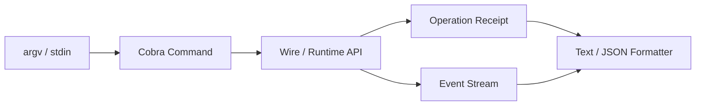

# CLI 与 Machine-readable Output

## 学习目标

理解 CLI Command Surface、Formal JSON Output、Streaming Execution、Config
Precedence 与 Host/Runtime Ownership Boundary。

## Host Flow



CLI 解析输入，通过 Wire 构造 Session，提交 Runtime Operation 并渲染 Event/Receipt。
Architecture Test 禁止依赖 Provider、Tool Executor 或 Sandbox Implementation。

Formal Command 提供稳定 Machine-readable Output 与 Structured Problem Code。Human Text
可以演进；JSON Identity、Business Error Code 与 Exit Status 构成 Automation Contract。
可以显示 Credential Reference，不能显示 Value。

`exec` Streaming Model、Tool、Approval、Verification 和 Terminal Event，并支持
Persistence/Resume。`exec` 与 `quickstart` 在渲染前通过共享的 `eventview` Projection
处理每个 Event：分类来自 Protocol Traits，Text/JSON Formatter 消费同一 Typed
Update，因此新 Event Kind 在 Host 代码中被处理或显式忽略，而不是被每个 Renderer
重新分类。Config、Model、Auth、Thread、Task、Workflow、Fleet/Lane、MCP、Skill、
Plugin、Metrics 等命令只调用共享 Runtime/Repository。

## Setup、Readiness 与命令事实

Onboarding Path 是可执行契约：

- `setup` 以交互或脚本模式配置 Provider、Model、Credential Reference、Probe、
  Sandbox 和 Fixture；
- `config profile` 选择 `minimal`、`recommended` 或 `advanced` Disclosure；
- `config explain FIELD` 返回 Value、Source、Default、Risk 和 Impact；
- `quickstart` 在无网络、无 Secret 条件下运行带 Verification 与 Receipt 的受治理 Turn；
- Readiness 返回 `ready`、`degraded` 或 `blocked` 及 Repair Action。

Cobra 是命令事实源。Root Help 与中文命令清单由 `make command-docs-check` 生成和检查；
只增加隐藏实现而不更新 Command Tree，不构成受支持的 CLI Feature。

## 三个 Output Channel

| Channel | Contract |
| --- | --- |
| stdout | Requested Human/Machine Result/Event |
| stderr | Bounded Diagnostic/Guidance |
| exit status | Process-level Classification |

Machine Mode 的 stdout 必须可解析，Diagnostic 不得混入 JSON/NDJSON。Process Exit 0
不制造 Completed Turn，Business Outcome 仍由 Terminal Event/Problem 表达。Output Writer
Failure 必须显式，因为 Truncated Receipt 会破坏 Automation。

## Idempotency/Resume

CLI Identity/Idempotency Input 进入 Runtime Operation。Persistent `exec` 从 Durable
Thread/Turn/Event 恢复，不通过重提 Prompt 重建 Output。Text/JSON Formatter 消费这些
Event 投影出的同一 Typed Update，不改变 Execution Semantics。

Config Precedence 也是 Provenance：Default/File/Environment/Flag 在 Wire 前解析，
Diagnostic 说明 Winning Source，但不打印 Secret Value。

## 失败与安全边界

- Invalid Flag 在 Session 前失败。
- Config Source/Override Precedence 显式可查。
- Machine Error 保留 Business Code。
- Budget Failure 不产生 Completed Terminal。
- JSON Log Redact Secret。
- CLI 不是 Alternate Execution Engine。
- Event 只经 `eventview` Projection 一次，Host 不本地重新分类。

## 测试与验证

```bash
go test ./internal/host/cli
make cli-smoke
make command-docs-check
```

## 动手实验

分别以 Text/JSON 运行同一 Fixture Turn，对比 Operation ID、Event Sequence、Terminal 与
Receipt。

## 复习问题

1. 哪类 CLI Output 是 Compatibility Contract？
2. CLI 为什么通过 Wire 构造？
3. Secret 如何安全呈现？
4. Diagnostic 为什么不能进入 Machine-readable stdout？
5. Resume 为什么 Replay State 而非重新 Submit Prompt？

## 延伸阅读

- [ACP Stdio 与编辑器互操作](./04-acp.md)

## 事实来源与验证

| 项目 | 值 |
| --- | --- |
| Catalog ID | `host-cli` |
| 状态 | `draft` |
| 最后验证 | 尚未验证 |
