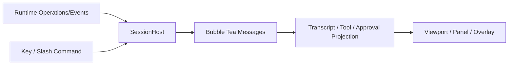

# TUI State Projection

简体中文 | [English](../../en/10-hosts-protocols/02-tui.md)

## 学习目标

理解 Runtime Event 如何成为 Bubble Tea Interactive Model，而不把 Business Logic 移入
Terminal UI。



`SessionHost` 提交 Operation、打开 Cursor Event Stream、Pump Event，并通过 Narrow
Facade 暴露 Policy/Session Service。`Model` 投影 Output、Reasoning、Tool Lifecycle、
Approval Queue、Input、Plan、Usage 与 Terminal Receipt。

Live/Settled State 分离。Streaming Markdown 保留 Incomplete Tail；Tool Output 有界；
Approval FIFO；Final Receipt 覆盖临时 Usage Glance。Empty/Unmeasured Panel 如实说明。

Slash Command 通过 Host Method 改变 Runtime Policy 或提交 Operation。Session Snapshot
保存 UI Preference/Binding，但 CLI Explicit Posture 优先于恢复值。

## Event Reducer Invariant

TUI 是 Projection Reducer：

```text
(previous ui state, validated event) -> next ui state + optional paint
```

- Event ID/Cursor 使 Duplicate Delivery Harmless；
- Output Delta 只追加到 Matching Live Item；
- Tool/Approval 按 Identity 配对；
- Terminal Receipt Settle 临时 Card/Accounting；
- Unknown Event 可 Inspect，但不发明 Behavior。

Session Reopen 先 Page Durable History，再从 Replay Boundary 应用 Live Event。UI Snapshot
只恢复 Preference/Binding；Canonical Turn Truth 来自 Runtime。

## Backpressure/Rendering

Event Consumption 与 Terminal Paint 速率不同。Host 持续消费 Bounded Event，同时 Coalesce
Paint。Streaming/Pagination/Overlay 有显式 Cap，避免 Slow Renderer 变成 Runtime
Backpressure。真实 Subscription Gap 是 Protocol Error，不能猜测 State。

## 交互与 Accessibility 契约

Header、Transcript、Composer 和 Context/Task Detail 分别拥有明确职责。Reasoning 与
Tool Detail 渐进披露；Approval、Input、Verification、Failure、Recovery 和 Receipt
保持为可见 Lifecycle State。Responsive Golden 在 80、120、160 列验证同一信息层级。

Send、Cancel、Approve/Reject、Input、Panel Navigation、Scroll 与 Transcript Access
都可仅用键盘完成。Reduced/Still Motion 不丢失信息。CLI-only 或 No-op Slash Command
不在 TUI 注册；`/context` 保持为可操作命令。

`turn.canceled` 投影为 Failed/Recoverable State，不能成为 Successful Completion。
Host Journey Contract 通过真实 Reducer 验证 Start、Stream、Approve、Input、Cancel、
Verify、Recover 和 Receipt。

## 失败与安全边界

- Cursor Gap 显式报告。
- Pending Approval Queue 未清空不恢复 Turn。
- Unknown/Unavailable 不显示为零。
- Paint Coalesce 且保留 Scroll。
- Panel Inspect Fleet/Task 不创建 Work。
- UI 不直接 Execute Tool。

## 测试与验证

```bash
go test ./internal/host/tui/...
go test ./internal/host/tui -run HostJourney
make tui-smoke
```

## 动手实验

追踪 Fixture Event 从 `SessionHost.pump` 到 Transcript、Tool Card、Approval Overlay 与
Final Receipt。

## 复习问题

1. Live/Settled Tool State 为什么分离？
2. Cursor 保护什么？
3. Empty Panel 为什么区分 Absent 与 Zero？
4. Restart 后哪类 TUI State 才是 Authority？
5. Event Consumption/Paint Scheduling 为什么分离？

## 延伸阅读

- [VS Code Native Agent Chat](./06-vscode.md)

## 事实来源与验证

| 项目 | 值 |
| --- | --- |
| Catalog ID | `host-tui` |
| 状态 | `verified` |
| 最后验证 | 2026-08-06 |
