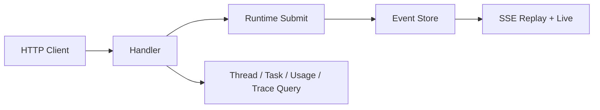

# HTTP/SSE Runtime API

简体中文 | [English](../../en/10-hosts-protocols/03-http-sse.md)

## 学习目标

理解 REST Submission/Read Model、SSE Replay/Live Delivery、Problem Response 与
Workspace-scoped Contract。



Mutation Endpoint 创建 Thread 并提交 Start、Steer、Cancel、Retry、Undo、Compact、
Approval、Dynamic Tool Operation。Read Endpoint 投影 Thread、Task、Agent、Snapshot、
Usage、Trace 与 MCP Health。

Request Strict Decode 且有界。Accepted Operation 返回 Receipt Identity，不同步等待全部
Work。SSE 从 Cursor Replay Durable Event，再无序差地切换 Live。Slow/Gapped Consumer
得到显式 Failure。

Problem 使用稳定 Code/Status，不泄漏 Secret。Workspace/Thread Identity 约束所有 Query
和 Stream。HTTP 与 ACP 运行同一 Protocol Contract Suite。

## Submission/Idempotency

HTTP Acceptance 在 Submit 前验证 Method、Content Type、Body、Workspace/Thread Reference、
Operation Payload。Idempotency Key 在 Namespace 内派生 Stable Operation Identity；
相同 Key 配 Incompatible Content 会 Refuse，不执行第二次 Mutation。

HTTP Status 回答 Transport/Admission；Operation Receipt 回答 Accepted Work；Event 回答
Execution/Terminal Outcome，三者不能折叠为同步结果。

## Replay-to-live Handoff

```text
parse requested cursor
 -> subscribe and establish live boundary
 -> replay durable events after cursor
 -> suppress overlap by monotonic cursor
 -> forward live events
```

围绕 Replay 建立 Subscription，避免 History Query 后、Live Attach 前丢 Event。Overlap
按 Cursor 而非 Arrival Timestamp 排序。`Last-Event-ID` 与 Explicit Cursor 是同一 Resume
Contract。

Slow Subscriber 有界且可被 Drop；Client 从 Last Processed Cursor 重连，Server 不保留
Unbounded Private Queue。

## 失败与安全边界

- Unknown Field/Malformed ID 被拒绝。
- Method/Content-type/Body Limit 强制。
- Cursor Gap 显式。
- Dynamic Tool Completion 绑定 Catalog/Call。
- Observe Query 不修改 Runtime。
- Shutdown 关闭 Subscription/Resource。

## 测试与验证

```bash
go test ./internal/host/runtimeapi/http/...
make api-contract
make protocol-contract
```

## 动手实验

提交 Fixture Turn，从 Cursor 0 分页，再从 Last Cursor 接 SSE，确认无重复/缺失 Event。

## 复习问题

1. 为什么 Terminal 前返回 Operation Receipt？
2. Replay-to-live 如何避免 Race？
3. Cursor Gap 应如何处理？
4. HTTP Acceptance Response 不能证明什么？
5. 为什么在 Replay 周围建立 Live Subscription？

## 延伸阅读

- [ACP Stdio](./04-acp.md)

## 事实来源与验证

| 项目 | 值 |
| --- | --- |
| Catalog ID | `host-http-sse` |
| 状态 | `verified` |
| 最后验证 | 2026-08-06 |
