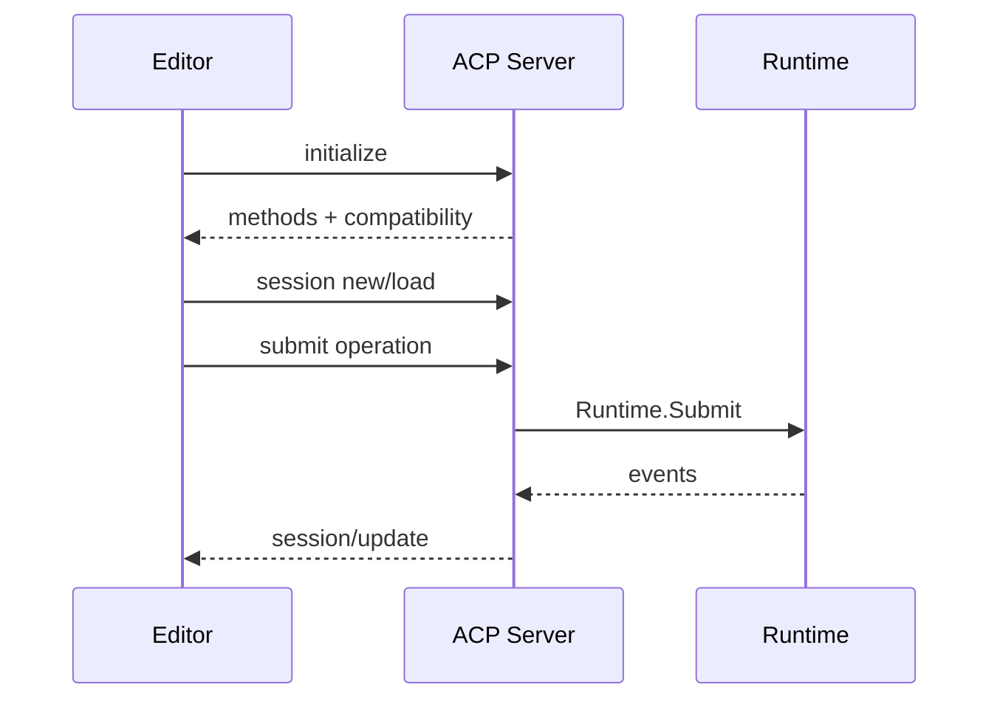

# ACP Stdio 与编辑器互操作

简体中文 | [English](../../en/10-hosts-protocols/04-acp.md)

## 学习目标

理解 Stdio JSON-RPC Framing、Initialize/Capability Negotiation、Session Binding、
Concurrent Call、Notification 与 Clean Shutdown。



ACP 使用 Newline-delimited JSON-RPC。Synchronized Writer 防止并发 Response/
Notification Frame 交错。Initialize 只广告已实现 Method 并绑定 Compatibility。
Session 绑定 Exact Workspace、Provider/Model、Thread 与 Event Cursor。

Server 使用与 HTTP 相同的 Operation/Event Contract 支持 Mutation、Read Query、
Dynamic Tool 和 Notification。Replay Page/Live Notification 保持 Cursor 语义。

EOF/Shutdown 具有状态：Reject Final Half-line，按协议处理 Active Turn，给 Pending Call
Terminal Error，并确定性关闭 Resource。

## Connection State Machine

```text
connected/uninitialized
 -> initialized with negotiated surface
 -> workspace-bound sessions
 -> active request/notification/event flows
 -> draining/shutdown
 -> closed
```

Initialization 是 Connection-scoped；Session Binding 是 Workspace-scoped；Active Turn 是
Thread-scoped。Method 是否有效取决于 State。Request ID 对应一个 Response，Notification
无 Response。

## Concurrency/Ordering

Request 可并发，Frame Writer 序列化完整 JSON Line。Response Order 不是 Global Execution
Order；Runtime Event Cursor 提供 Causal Stream Order，RPC ID 仅关联 Call。

Server 记录 Highest Forwarded Cursor。Reconnect/Restart 后先 Page Durable Replay，再
Resume Notification。Desync 保留 State 并报告 Gap，不清空 Editor View。

Compatibility 广告 Implemented Method/Required Feature Version。Unknown Future Event 可作
Read-only Data 保留；Required Mutation Method 缺失则拒绝 Session。

## 失败与安全边界

- Initialize 前 Request 被拒绝。
- Malformed/Oversized Frame 安全失败。
- Workspace Event 仅对绑定 Host Workspace 可见。
- Concurrent Request 保留 Response ID。
- Unknown Method 返回 JSON-RPC Error。
- Compatibility Manifest 匹配 Advertised Surface。

## 测试与验证

```bash
go test ./internal/host/runtimeapi/acp/...
make acp-interop
make protocol-contract
```

## 动手实验

运行两个 Concurrent RPC Call 加 Streaming Turn，验证 Correlation、Notification、
Replay 与 Shutdown。

## 复习问题

1. Frame Write 为什么同步？
2. Initialize 协商什么？
3. ACP 如何保持 Workspace Isolation？
4. RPC ID 与 Event Cursor 分别排序什么？
5. Initialization 为什么不同于 Session Binding？

## 延伸阅读

- [VS Code Context Bridge](./06-vscode.md)

## 事实来源与验证

| 项目 | 值 |
| --- | --- |
| Catalog ID | `host-acp` |
| 状态 | `verified` |
| 最后验证 | 2026-08-06 |
