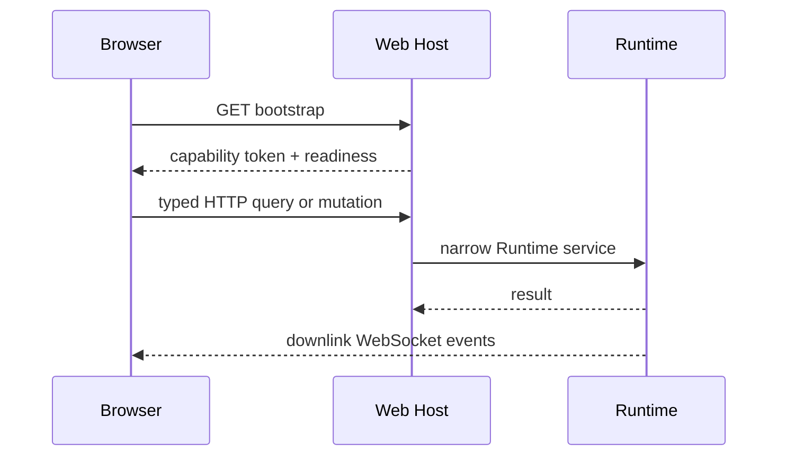

# 本机 Web Transport 与 Runtime Authority

## 学习目标

理解 QCode 如何以单进程 localhost Web 作为主交互入口，同时保持 Runtime 对
Session、Operation、Event、审批、工具和持久化状态的唯一权威。

## Transport



Web Host 只绑定 `127.0.0.1`。Bootstrap 返回进程内随机 Capability Token，其余 Unary
请求必须携带 Bearer Token；Host、Origin 与 Fetch Metadata Fence 共同防止 DNS
Rebinding、CSRF 和跨站 WebSocket 劫持。WebSocket 只允许客户端发送一次认证帧，之后
是纯下行 Event Stream。

启动分为 Boot Surface 和 Runtime Activation 两阶段。静态页面先可用，配置、状态恢复
或 Runtime 构造失败时由 Bootstrap 暴露结构化 Problem；只有 Activation 成功后才接受
Mutation。关闭时先进入 Draining，再关闭 HTTP、Runtime、Store 和 Owner Lease。

## Runtime Authority

Session 创建、激活、生命周期、Profile、Checkpoint、Plan、Recovery、Merge 和 Export
均通过 `internal/runtime/app` 的窄化服务执行。Web Handler 只做严格 JSON 解码、鉴权、
DTO 映射和错误投影，不运行 Provider、Tool、Policy 或 Sandbox 逻辑。

浏览器先获取 `SessionPresentationSnapshot` 的高水位，再从该 Cursor 连接 WebSocket。
Sequence 只要求严格单调；只有 Server 明确报告 Retention Gap 时才进入 Desync。
刷新页面不会重新提交 Prompt，也不会根据界面文本推断 Runtime 状态。

## Workspace 与 Credential

Workspace Browse、Search 和 Resource Query 通过 `workspacequery.Service`，复用
`sandbox.Workspace` 的根目录、符号链接、大小和 UTF-8 检查。浏览器不能提交绝对路径，
也不能绕过 Runtime 读取任意文件。

Credential API 只操作启动配置中固定的引用。Keyring Set 请求不接受客户端自定义账户
名，响应只返回 configured/validation 状态，不返回 Secret。环境变量和文件引用保持
外部管理。

## 测试与验证

```bash
go test ./internal/host/runtimeapi/web ./internal/runtime/app
npm --prefix web run check
npm --prefix web test
make web-build
```

## 复习问题

1. 为什么 Bootstrap 可以先于 Runtime Ready？
2. Capability Token 为什么仍需 Host 与 Origin Fence？
3. Snapshot Watermark 与 WebSocket Cursor 分别解决什么问题？
4. Workspace Resource 为什么必须在服务端重新校验路径？

## 事实来源与验证

| 项目 | 值 |
| --- | --- |
| Catalog ID | `host-web-transport` |
| 状态 | `verified` |
| 最后验证 | 2026-08-22 |
