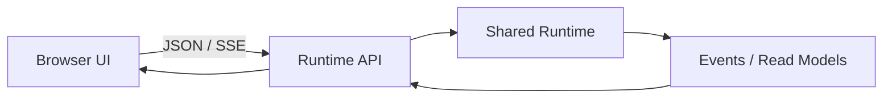

# Web Control Surface

简体中文 | [English](../../en/10-hosts-protocols/05-web.md)

## 学习目标

理解 Embedded Web UI、HTTP API Boundary、Browser Security Policy，以及 Web 为何仍是
Projection/Control Host。



Embedded UI 提供 Static Asset，并调用 Mounted HTTP Runtime API。它创建/加载 Thread、
提交 Operation、订阅 SSE、渲染 Projection、发送 Approval/Input Decision。Provider、
Tool、Sandbox、Persistence 仍位于 Runtime/Wire 后。

Asset 使用 Restrictive CSP 与 Explicit Content Type。Browser 只获得 Protocol/Read
Model，不获得 Raw Credential/File Authority。API 保持 Workspace Scope、Strict Decode
与 Problem Response。

新增 Web Feature 应先新增/复用 Runtime Operation 或 Read Model，再在 Browser 投影，
不能创建第二套 Backend。

## Browser/Deployment Trust Boundary

| Boundary | Required Control |
| --- | --- |
| Static Asset -> Browser | Fixed Content Type、CSP |
| Browser Input -> API | Strict Finite Decode/Identity |
| API -> Runtime | Shared Operation/Policy/Workspace |
| Runtime Event -> DOM | Safe Text/Structured Render |
| Listener -> User | Loopback 或 Authenticated Gateway |

CSP 降低 Script Injection/Framing Risk，但不认证 Non-loopback Deployment，不授权 Runtime
Operation，也不自动 Sanitized Server Data。

## Projection Recovery

Browser State 可丢弃。Reconnect 时 Reload Read Model、从 Stored Cursor Resume SSE、
Deduplicate Overlap，并以 Terminal Receipt 为 Settled Truth。Pending Approval/Input 从
Runtime 重建，不信任 Local Browser Storage。

Optimistic UI 可确认 Click，但不能在 Runtime Event 前标记 Tool/Edit/Turn Success。
Static/API Route 使用 Explicit Precedence，避免 Fallback 把 API Typo 变成 HTML Success。

## 失败与安全边界

- CSP 阻止 Arbitrary Script Origin/Unsafe Embed。
- Browser Input Untrusted 且 Bounded。
- UI 不在 Terminal Event 前声称 Tool Success。
- Network Exposure 使用 API Auth/Deployment Boundary。
- Static Route 不遮蔽 Runtime API。

## 测试与验证

```bash
go test ./internal/host/webui
go test ./internal/host/runtimeapi/http -run TestServeBinaryContract
```

## 动手实验

Mount Web UI/API，在页面创建 Thread，确认 Request 进入 Shared Runtime 而非 Web-specific
Executor。

## 复习问题

1. Web UI 为什么不是 Execution Backend？
2. CSP 保护什么？
3. 新 Web Mutation 应先在哪里实现？
4. CSP 不提供什么 Security Property？
5. 哪些 Web State 可丢弃并重建？

## 延伸阅读

- [新增 Host 而不复制 Runtime](../11-extension-ecosystem/05-adding-host.md)

## 事实来源与验证

| 项目 | 值 |
| --- | --- |
| Catalog ID | `host-web` |
| 状态 | `verified` |
| 最后验证 | 2026-08-06 |
