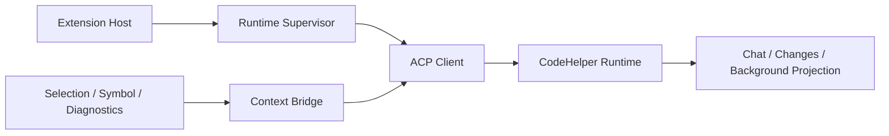

# VS Code Context Bridge、Trust 与 Compatibility

简体中文 | [English](../../en/10-hosts-protocols/06-vscode.md)

## 学习目标

理解 Runtime Supervision、ACP Negotiation、Exact Workspace Identity、Editor Context
Capture、Trust Gate 与 Binary Compatibility。



Workspace Extension Host 发现/验证或管理 Runtime Binary，以 Argv Spawn 启动，协商
Protocol/Feature Compatibility，并绑定 Exact Local/Remote Workspace Identity。Crash
Recovery 有界，并保留 Last-known-good Binary。

Context Bridge 捕获 Explicit File、Selection、Symbol、Diagnostics，携带 Canonical URI、
Document Version、Digest、Bounded Range/Content 与 Omission Count。Runtime 再次验证；
Stale Capture 失败而非编辑新内容。

Untrusted Workspace 强制 Read-only，不能选择 Executable 或批准 Mutation。Webview 使用
Nonce-only CSP、Finite Message Decoder、Safe DOM Sink 与 Read-only Receipt。Edit
Preview 绑定 Runtime Plan ID。

## Supervisor/Session Recovery

```text
discover/verify binary
 -> negotiate version + target + protocol + features
 -> bind exact workspace identity
 -> create/load session
 -> page replay from persisted cursor
 -> attach live notifications
 -> bounded restart on crash
```

Supervisor 可 Restart Process，但 Session Recovery 决定 Load Durable State；Crash 不会
变成 Prompt Resubmission。Managed Update 失败时回退 Verified Last-known-good Binary；
Crash Loop 有界并显式报告。

Cursor 按 Exact Workspace/Session Binding Monotonic Persist。Replay 分页；Filtered
Workspace Event 仍推进 Connection Cursor；Live Event 排在 In-flight Replay 后。Gap 保留
Projected State 供诊断。

## Multi-root/Remote Identity

每个 Workspace Root 独立绑定 Canonical Editor URI、Runtime Path、Remote Authority。
UI-selected Root 不能伪造 Binding；Context/Command 路由到 Owning Root。

Compatibility 包含 Binary Version、OS/Architecture Target、ACP Protocol、Required Feature；
Binary 能启动不代表 Compatible。

## 失败与安全边界

- Local/Remote Workspace Identity 不可伪造/混用。
- Protocol/Version/Target/Required Feature 必须兼容。
- Runtime Launch/Stderr 有界。
- Webview Message/Context Payload 有界。
- Untrusted Workspace 在 Capture/Submit 前阻止 Mutation。
- Cursor Gap 保留 State 供诊断。

## 测试与验证

```bash
cd extensions/vscode
npm run check
npm test
```

## 动手实验

追踪 Fix Selection：VS Code Capture、ACP `turn.start`、Runtime Digest Validation、
Approval-bound Edit Plan 与 Changes Projection。

## 复习问题

1. Editor Context 为什么由 Runtime 再验证？
2. Untrusted Workspace 改变什么？
3. Compatibility 为什么绑定 Target/Protocol？
4. Process Restart 为什么不意味着 Prompt Resubmission？
5. Multi-root Routing 如何防止 Cross-root Authority Confusion？

## 延伸阅读

- [新增 Host 而不复制 Runtime](../11-extension-ecosystem/05-adding-host.md)

## 事实来源与验证

| 项目 | 值 |
| --- | --- |
| Catalog ID | `host-vscode` |
| 状态 | `verified` |
| 最后验证 | 2026-08-06 |
