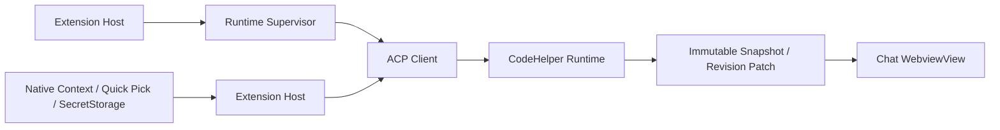

# VS Code Native Agent Chat 与 Runtime Authority

简体中文 | [English](../../en/10-hosts-protocols/06-vscode.md)

## 学习目标

理解 Native Agent Chat 如何在集成 Session 管理、Composer、Editor Context、增量渲染、
恢复工作流、Trust Gate 和发布证据的同时，保持 Runtime Authority。

## Integration Path



本地 UI Extension Host 发现/验证或管理 Runtime Binary，以 Argv Spawn 启动，协商
Protocol/Feature Compatibility，并绑定 Exact Local Workspace Identity。Crash
Recovery 有界，并保留 Last-known-good Binary。

Context Bridge 捕获显式 File、Selection、Symbol、Diagnostics、Image、Terminal Output
和 Git Diff。File-backed Context 携带 Canonical URI、Document Version、Digest、
Bounded Range/Content 与 Omission Count。Runtime 再验证 Workspace Membership、
Content Identity、Media Signature 与 Bounds。Terminal/Git Diff 是显式 Native Capture，
不是隐式 Shell Authority。

Untrusted Workspace 强制 Read-only，不能选择 Executable 或批准 Mutation。Webview 使用
Nonce-only CSP、Finite Message Decoder、Safe DOM Sink 与 Read-only Receipt。Edit
Preview 绑定 Runtime Plan ID。

## Workbench 与 Lifecycle Experience

Setup、Repair、Quickstart 是由 Runtime Readiness 支持的一等命令。Chat Surface 组合
Virtualized Session Rail、Incremental Transcript、Structured Lifecycle Card 与
Composer。Native Diff、Quick Pick、InputBox、Progress、Tree View、Editor Navigation
和 SecretStorage 承担平台行为，不在 Webview 中重复实现。

Lifecycle Strip 区分 Setup、Empty、Loading、Streaming、Approval、Verify、Failure、
Recovery、Completed，并显示可用的下一步动作。`Ctrl+Enter`/`Cmd+Enter` 发送，
`Escape` 先关闭最上层 Overlay，再停止 Turn。IME Composition、Visible Focus、
Screen-reader Live Region、Light、Dark、High Contrast、Forced Colors、Reduced
Motion 和约 200% Zoom 都是被测试的契约，不是可选样式。

CodeHelper 只贡献一个 `WebviewView`。VS Code 可以把同一个 View 在 Sidebar 与 Panel
之间移动；产品不注册或宣称独立 Full Editor Chat。

## Session Profile 契约

Session Profile 是 Runtime-owned Durable State。VS Code 通过 ACP 严格解码 Profile、
Revision、Capability 和 Prompt Cache Reset 结果，不把它们复制到 BindingStore 或
Webview State。更新使用乐观并发控制，Owning Thread 存在 Active Turn 时拒绝；只有
当前 Runtime 广告为 Mutable 的字段可以变化。

Composer 从该 Projection 渲染 Mode、Provider、Model、Thinking、Tool Allowlist、
Credential Status、Approval Posture 与不可变 Local Execution Environment。Mutable
Field 使用带 Revision 的 ACP Update。Model Capability 明确选择是否需要 Runtime
Restart；Host 不伪装支持 Hot Switch。

Credential 只在原生 Password InputBox 中输入，并按 Exact Workspace/Provider Identity
保存到 VS Code SecretStorage。`codehelper.toml` 只保存生成的 Environment Reference，
只有本地 Runtime Child 收到 Secret；Webview Snapshot 只包含 Status，不包含 Secret 或
Reference。Untrusted Workspace 禁用 Credential 与 Approval Escalation；Runtime 的
Read-only Startup 同时是恢复 Durable Profile 时不可突破的 Permission Ceiling。

## Session Rail 与增量 Transcript

Runtime 拥有 Session Summary、Status、Search Match、Profile、Active Thread、Lineage、
Checkpoint 和 Lifecycle Transition。Rail 可以创建、切换、重命名、置顶、归档、复制、
删除、搜索和过滤 Session，但每个 Mutation 都是带 Revision 校验的 Typed Runtime
Request。Durable Summary 与带 Stable Turn ID 的瞬时 Search Match 保持分离。

Host 在 Hydration、重新可见、Session Switch 或 Stale Revision Resync 时发送 Full
Snapshot；后续只发送有限 Typed Patch，且 `baseRevision` 必须匹配 Webview Store。
Patch 原子应用；Stale Patch 不修改任何 State，而是请求新 Snapshot。

Transcript 使用 Session、Turn、Tool Call、Approval 和 Input Request ID，而不是展示
文本作为 Identity。Bounded Virtual Window 在 State 中保留完整 Transcript，同时限制
DOM Node；每次 Patch 后恢复 Expanded Card、Focus 与 Relative Scroll Anchor。

## Chat Projection

Chat Projection 消费生成的 Event Traits，并通过 Stream、Tool、Interaction、Evidence、
Terminal 与 Snapshot 领域模块分发。`projector/index.ts` 拥有 Sequence 与 Turn
Identity；`turn-projector.ts` 对生成的 Event Class Union 做 Exhaustive Switch，
新增 Class 缺少 Domain Decision 时 TypeScript 编译失败。根 `projector.ts` 只保留
Compatibility Re-export。

Traits 来自 Protocol Manifest，而不是 Host 本地分类。新 Event Kind 必须由领域模块
处理或显式忽略，绝不会在 Host 中被静默重新分类；缺少 Traits 的 Event 会让 Schema
与 TypeScript 生成直接失败。

## Checkpoint、Plan 与 Turn Recovery

Checkpoint 是不可变 Runtime Artifact。Restore 只恢复 State：重建已验证的
Model-visible History 与 Profile Baseline，不重放 Tool、Command、Network 或 File
Side Effect。Fork 创建显式 Parent Session/Thread/Checkpoint Lineage，并可在重启后恢复。

Structured Plan Artifact 可在 Current Session、Profile-preserving New Session 或
Checkpoint Fork 中实施。Webview 不从 Display Text 拼接 Implementation Prompt；
Runtime 校验 Plan、Profile Revision、Destination 与 Lineage。

Retry/Continue 提交 ACP `turn/recover` 并创建新 Turn。Retry 复用原 Model-visible
Request；Continue 可追加 Guidance；两条路径都不复制或重放已完成 Side Effect。

## 原生资源导航

Runtime 确认的 Context Receipt、Context Selection 与 Edit Plan 在 Chat Projection
中转换为 Opaque Resource ID。Webview 只能回传 ID；Extension Host 从当前 Snapshot
解析 ID，校验 Exact Workspace Root 与相对路径，再通过固定 API 打开 Editor Range、
Definition、Diagnostic、Explorer 或 Diff。

任意 URI Scheme、`command:`、Absolute/Traversing Path、Cross-root Definition、
Stale ID 与伪造 Diff Identity 都会 Fail Closed。模型输出中的路径文本只有在唯一匹配
Runtime 确认资源时才具备交互能力。

## Runtime-owned Extension View

Extensions Tree 对每个 Workspace Runtime 查询 ACP `extension/list`，展示 Plugin/Skill
Version、Trust、Enabled State 与 Health。Enable/Disable 使用唯一 Operation ID 提交
版本化 `extension/control` Mutation。Extension Host 不扫描 Extension Directory，也不
编辑 Enablement File。

Runtime 拥有 Source Resolution、Permission Digest、Plan Revision、Generation、
Capability、Lifecycle Effect、Receipt、Idempotency 与 Restart Reconciliation。同一
Operation ID/Payload 返回已提交结果，冲突复用失败。Disable Drain 所属 Effect，Revoke
Fence 已加载 Generation。Tool Catalog Refresh 是独立 Runtime Projection，不授予
Permission。

当前 Tree 提供 List、Enable、Disable 与 Refresh，不为 Runtime/CLI 拥有的 Install、
Rollback、Trust、Permission 或 Receipt Workflow 创建不完整 Webview 实现。

## Supervisor/Session Recovery

```text
discover/verify binary
 -> negotiate version + target + protocol + features
 -> bind exact workspace identity
 -> create/load session
 -> page replay from persisted cursor
 -> attach live notifications
 -> bounded restart on crash
```

Supervisor 可 Restart Process，但 Session Recovery 决定 Load Durable State；Crash 不会
变成 Prompt Resubmission。Managed Update 失败时回退 Verified Last-known-good Binary；
Crash Loop 有界并显式报告。

Cursor 按 Exact Workspace/Session Binding Monotonic Persist。Replay 分页；Filtered
Workspace Event 仍推进 Connection Cursor；Live Event 排在 In-flight Replay 后。Gap 保留
Projected State 供诊断。

Runtime Capture 将 Host/ACP/Process Supervision 视角以 mode `0600` 写入私有 Workspace
Storage。它与 Go Runtime Observation Journal 及 `CODEHELPER_OBSERVATION_CAPTURE`
不同；两种 Artifact 都可能包含敏感 Workspace 数据，分享前必须检查。

## Multi-root/Local Identity

每个 Workspace Root 独立绑定 Canonical Local Editor URI 与 Runtime Path。
UI-selected Root 不能伪造 Binding；Context/Command 路由到 Owning Root。

Extension 是 Local UI Extension，只接受 Local `file:` Workspace。Remote SSH、Dev
Container、Codespaces 和 Remote Extension-host Authority 不在产品边界内；Local
Single-root 与 Multi-root 继续支持。

Compatibility 包含 Binary Version、OS/Architecture Target、ACP Protocol、Required Feature；
Binary 能启动不代表 Compatible。

## 失败与安全边界

- 只接受 Canonical Local `file:` Workspace Identity。
- Protocol/Version/Target/Required Feature 必须兼容。
- Runtime Launch/Stderr 有界。
- Webview Message/Context Payload 有界。
- Resource Navigation 不能提交 URI、Command 或 Cross-root Target。
- Untrusted Workspace 在 Capture/Submit 前阻止 Mutation。
- Cursor Gap 保留 State 供诊断。
- Stale Transcript Patch 不会部分修改 Webview State。
- Restore、Fork、Retry、Continue 不会重放历史 Side Effect。
- Extension UI 不能成为 Lifecycle/Tool Authority。
- Host Runtime Capture 与 Runtime Observation Capture 是独立、显式治理的证据路径。

## 测试与验证

```bash
make vscode-check
make vscode-runtime-integration
make vscode-integration
make vscode-rosetta-integration
make vscode-rc
```

## 动手实验

追踪一条 Native Journey：Context Capture、ACP `turn.start`、Runtime Receipt、
Incremental Patch 与 Resource Navigation。再追踪 Canceled Turn 的 Retry/Continue，
证明新 Turn 不重放 Side Effect。

## 复习问题

1. Editor Context 为什么由 Runtime 再验证？
2. Untrusted Workspace 改变什么？
3. Compatibility 为什么绑定 Target/Protocol？
4. Process Restart 为什么不意味着 Prompt Resubmission？
5. Multi-root Routing 如何防止 Cross-root Authority Confusion？
6. Stale Patch 为什么必须请求 Snapshot，而不能部分应用？
7. Restore 与 Retry 为什么是不同 Runtime Operation？
8. 根 Projector 为什么自己不分类 Event？

## 延伸阅读

- [新增 Host 而不复制 Runtime](../11-extension-ecosystem/05-adding-host.md)

## 事实来源与验证

| 项目 | 值 |
| --- | --- |
| Catalog ID | `host-vscode` |
| 状态 | `draft` |
| 最后验证 | 尚未验证 |
