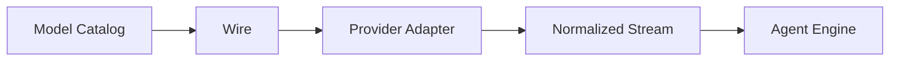

# 新增 Provider

简体中文 | [English](../../en/11-extension-ecosystem/01-adding-provider.md)

## 学习目标

新增 Provider Adapter，同时保持 Credential、Capability、Streaming 与 Failure Contract，
不把 Wire-specific Behavior 泄漏到 Engine。

## 扩展步骤

1. 在 Catalog 声明 Stable Provider/Model ID、Wire Protocol、Capability、Limit、Pricing
   Provenance 与 Credential Reference。
2. 实现 `provider.Provider.Stream(ModelRequest)` 与 Normalized `Stream`。
3. 编码 Normalized Message/Tool。
4. 解码 Text、Reasoning、Tool Fragment、Usage、Terminal 与 Error。
5. 复用 Governed HTTP Client 的 Credential/Limit/Timeout/Retry/Dump。
6. 在 `internal/runtime/app/wire` 注册 Construction。
7. 先补 Hermetic Streaming/Error Fixture，再运行 Live Smoke。



Adapter 拥有远端协议差异；Engine 只看 Normalized Request/Event。Capability 保守声明，
Probe Observation 可收紧它。

## Provider Identity/Construction

Provider ID、Model ID、Wire Protocol、Endpoint、Credential Reference、Capability/Pricing
Provenance 组成 Resolved Route；Display Name 不是 Identity。Wire 按 Session Purpose
Resolve 并注入 Adapter，Provider 不在之后读取任意 Host Config。

```text
catalog declaration
 -> route/capability validation
 -> credential reference resolution at use
 -> governed client construction
 -> normalized stream
```

Catalog Metadata 是 Declarative Evidence；Probe 是 Observed Evidence；Live Response 是
Request Evidence。Probe 可收紧 Unsupported Capability；扩大 Authority 需要 Explicit
Trust Policy。

## Stream Commit Point

Meaningful Output 前的 Transient Failure 可按 Policy Retry；接受 Text、Reasoning、Tool
Fragment 或 Usage 后，Transparent Retry 可能重复 Output/Tool Call。Adapter 必须保留
Failure Phase 与 Partial-output Fact。

Cancellation 关闭 Response Body/Decoder。Terminal、Usage、Finish Reason 只发一次；
无 Valid Terminal 的 EOF 不转为 Success。

## 失败与安全边界

- Raw Credential 到 HTTP 使用前仍是 Reference。
- Unknown Capability/Limit 在 Request 前失败。
- Tool Call 完整组装/验证后才执行。
- Meaningful Partial Stream 不盲目 Retry。
- Usage 保持 Per-sample/Call。
- Debug Dump Redact 敏感内容。

## 测试与验证

```bash
go test ./internal/adapter/provider/...
go test ./internal/adapter/model
go test ./internal/runtime/app/wire -run 'Test.*Model'
```

## 动手实验

实现 Fixture-only Decoder，覆盖 Text、Tool、Usage 与 Malformed Frame，无网络验证。

## 复习问题

1. 哪些行为属于 Adapter 而非 Engine？
2. Capability 为什么保守起步？
3. Provider Retry 何时不安全？
4. 哪些字段组成 Stable Provider Route？
5. 什么 Event 标志 Stream Retry Boundary？

## 延伸阅读

- [Provider Failure](../04-model-and-provider/06-provider-failures.md)

## 事实来源与验证

| 项目 | 值 |
| --- | --- |
| Catalog ID | `extension-provider` |
| 状态 | `verified` |
| 最后验证 | 2026-08-06 |
