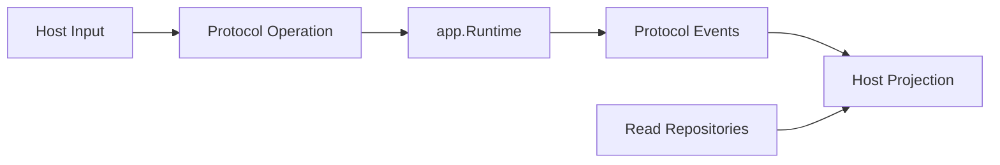

# 新增 Host 而不复制 Runtime

简体中文 | [English](../../en/11-extension-ecosystem/05-adding-host.md)

## 学习目标

将新 UI/Transport 构建为 Operation Submitter 与 Event/Read-model Projector，同时保持
Single Runtime。

## Host Contract



1. 优先选择 Existing Operation/Read Model。
2. 通过 Wire 构造或 ACP 连接。
3. Validate/Bound Host-specific Input。
4. 使用 Idempotency Identity 提交 Operation。
5. 从 Cursor Replay，再消费 Live Event。
6. 安全投影 Unknown Event 与 Terminal Problem。
7. 确定性关闭 Subscription/Resource。
8. 运行 Shared Protocol Contract。

Host 可拥有 Presentation State、Transport Framing、User Interaction 与 Platform Context
Capture；不得 Sample Model、Execute Tool、Resolve Credential、Construct Sandbox 或
实现第二套 Turn Loop。

## Extension Decision Test

| Behavior | Owner |
| --- | --- |
| New Business Mutation | Runtime Operation/Agent Loop |
| New Durable Query | Projection/Repository + DTO |
| Presentation/Control | Host |
| Platform Context | Host Capture + Runtime Revalidate |
| Execution Capability | Governed Adapter/Tool |
| Construction Choice | Wire |
| Extension Query/Mutation | `extension/list` / `extension/control` Runtime Operation |

若两个 Host 都需要某 Behavior，它不能只存在于一个 Host。Shared Contract 验证产品
Host 的 Start、Stream、Approve、Input、Cancel、Verify、Recover、Receipt、Terminal
Uniqueness 与 Cursor Continuity。

## Compatibility/Unknown Data

Host 声明 Protocol Version、Method、Required Feature、Limit。Required Behavior 缺失时，
必须在 Mutation 前失败。Additive Unknown Event 可作为 Generic Read-only Record；
Unknown Operation 不可猜测。

Transport DTO/Framing 可不同，但 Operation/Event Identity、One Terminal、Cursor Replay、
Workspace Scope、Approval Binding、Problem Code 必须一致。

Extension State 遵循同一规则。Host 查询 Runtime-owned Source、Trust、Generation、
Capability、Health 与 Receipt State。Mutation 携带唯一 Operation ID，不能编辑
Enablement File 或 Staging Artifact。幂等 Replay 返回已提交结果；冲突复用失败。

Shutdown 先停止 Admission，再 Drain/Cancel Active Interaction，关闭 Subscription，最后
释放 Shared Session；不能关闭仍由其他 Host 拥有的 Runtime Resource。

## 失败与安全边界

- Workspace/Thread Identity 显式。
- Slow Consumer/Cursor Gap 有定义。
- Host Restart Replay 而非 Rerun。
- Approval/Input Decision 绑定 Request。
- Unknown Event 不误分类。
- Host-only State 不成为 Runtime Authority。
- Host Extension UI 不能绕过 Lifecycle Receipt、Generation Fence 或 Tool Guard。

## 测试与验证

```bash
go test ./internal/runtime/app
make host-journey-contract
```

## 动手实验

实现 In-memory Test Host，支持 Start、Replay、Cancel、Unknown Event Projection，且不
Import Adapter Executor。

## 复习问题

1. Host 可拥有何种 State？
2. Restart 为什么 Replay 而非 Rerun？
3. 何时应扩展 Protocol？
4. 如何判断 Behavior 属于 Host、Runtime 还是 Adapter？
5. 哪些 Semantics 必须跨 Transport 一致？

## 延伸阅读

- [CodeHelper 全局架构](../02-codehelper-overview/02-system-architecture.md)

## 事实来源与验证

| 项目 | 值 |
| --- | --- |
| Catalog ID | `extension-host` |
| 状态 | `draft` |
| 最后验证 | 尚未验证 |
