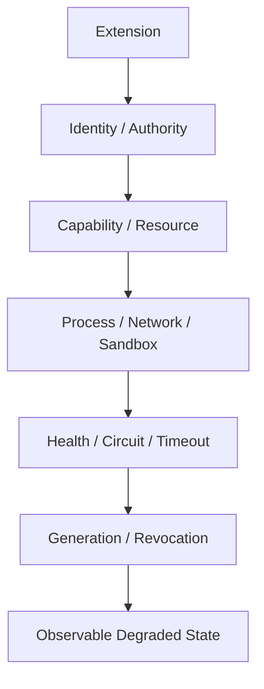

# Extension Failure 与隔离策略

简体中文 | [English](../../en/11-extension-ecosystem/06-failure-isolation.md)

## 学习目标

设计 Extension Failure Domain、Stable Error Category、Revocation、Timeout、Resource
Cleanup 与 Degraded Operation。

## Isolation Layers



MCP 隔离每个 Server Connection/Circuit；Failed Server 不隐藏 Healthy Catalog。Probe
测试恢复但不 Replay Business Call。Plugin Authority 可 Revoke，Cancel In-flight Work
并使 Loaded Generation 失效。Skill 在 Context Injection 前完成 Bounded Discovery/
Resolution。Hook 受 Timeout/Cancellation 约束且 Fail Closed。

Stable Error Category 区分 Unavailable、Circuit-open、Stale Catalog、Dependency
Conflict、Signature/Tamper 与 Policy Denial。Recoverable Category 可反馈模型；
Security/Unknown Failure 为 Terminal。

Degraded Mode 必须显式：Unavailable Descriptor、Health Snapshot、Issue、Lifecycle
Receipt 与 Log 说明缺失。Silent Removal 会让模型/Operator 错误推断 Capability。

## Unified Extension Lifecycle

```text
discovered -> validated -> authorized -> active(generation)
           -> draining -> disabled/revoked
           -> failed/quarantined -> probe/revalidate -> active(new generation)
```

Validation 证明 Shape/Integrity；Authorization 授予 Bounded Capability；Activation 发布
一个 Generation。每个 In-flight Call 绑定该 Identity。Disable 停止 New Admission 并可
Drain；Security Revoke 立即优先，Cancel Call、移除 Authority、Fence Cached Handle。

Runtime 通过 `EffectOwner` 跟踪每个 Live Effect。Plan Revision/Permission Digest
防止旧 Authority 下解析的 Source 静默重启。Control Mutation 使用 Durable
Prepare/Commit Receipt 与幂等 Operation ID；Startup 在发布 Healthy State 前协调
Committed Intent 与 Owned Effect。

## Failure Domain Matrix

| Failure | Containment | Recovery |
| --- | --- | --- |
| Provider | One Sample/Route | Meaningful Output 前 Retry |
| Tool | One Bound Call/Turn | 按 Effect Phase Feedback/Terminal |
| MCP | One Server Circuit/Source/Effect Owner | Probe/Reconnect/New Generation |
| Skill | One Dependency Plan | Repair Lock/Reload |
| Plugin | One Generation | Verified Rollback/Update |
| Hook | One Callback | Kill Tree/Failure Policy |
| Host | One Transport | Cursor Replay |

Bulkhead 同时需要 Resource/Authority Isolation：独立 Timeout、Process/Connection、Output
Limit、Catalog Source、Cancellation、Generation Fence。

## Feedback/Observability

Model Feedback 只包含 Stable、Actionable、Sanitized Category 和 Retry Safety。Operator
Record 保留 Extension Identity、Source、Plan Revision、Permission Digest、Generation、
Effect Owner、Transition、Bounded Cause 与 Affected Call。Unknown、Tamper、
Partial-effect Failure 不转成 Retry Advice。

Lifecycle Fact 也以脱敏 Evidence 进入 Observation Router。Observation/Exporter Failure
不能让 Failed Extension 变成 Healthy，也不能改变 Call 的业务结果。

Health 不是 Authority。Healthy Process + Revoked Generation 仍不可运行；Optional
Extension Unhealthy 不影响无关 Runtime Function。

## 失败与安全边界

- Extension 不能运行时扩大 Capability。
- Revocation 高于 Cached/Loaded Authority。
- Cancellation 关闭 Process Group/Transport。
- Retry 有界且不重复 Meaningful Work。
- Source Reconcile 不替换其他 Source Tool。
- Error/Log Bounded/Redacted。
- Disable/Revoke 不能遗留无归属 Live Effect。
- Receipt/Observation Projection 不能成为 Lifecycle Authority。

## 测试与验证

```bash
go test ./internal/adapter/mcp -run 'Test(Pool|Circuit)'
go test ./internal/adapter/plugin
go test ./internal/adapter/skill ./internal/adapter/hooks
go test ./internal/runtime/extension ./internal/runtime/app/extension
```

## 动手实验

分别制造 MCP Server Failure、Running Plugin Revoke、Skill Lock Drift，对比 Catalog
Visibility、Cancellation 与 Model Feedback。

## 复习问题

1. 为什么显式 Unavailable 而非静默隐藏？
2. Revocation 必须使什么失效？
3. 哪些 Extension Failure 可安全反馈模型？
4. Disable、Drain、Security Revoke 有何区别？
5. Isolation 为什么还需要 Generation Fence？

## 延伸阅读

- [Tool Failure 如何反馈给模型](../06-tools-and-execution/06-failure-feedback.md)

## 事实来源与验证

| 项目 | 值 |
| --- | --- |
| Catalog ID | `extension-failure-isolation` |
| 状态 | `draft` |
| 最后验证 | 尚未验证 |
