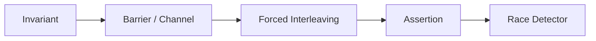

# 并发测试、Race 与确定性同步

简体中文 | [English](../../en/12-engineering-practice/03-concurrency-and-race.md)

## 学习目标

确定性构造 Interleaving，并正确理解 Race Detector 的证据边界。

并发风险包括 Submit/Close、Strict Event Sequence、Unique Terminal、Tool Claim、
Catalog Replace During Load、Lease Takeover、Automation Tick、CAS Lock、Hook State 与
Child Budget。



测试使用 Channel、Fake Clock、Lease 与 Barrier；Timeout 只负责 Bound，不建立 Ordering。
断言 Durable Invariant，而非 Scheduler Luck。`-race -p 1` 降低环境压力。

## 从 Linearization Point 开始

| Operation | Linearization Evidence |
| --- | --- |
| Runtime Submit | Accepted Operation 的 Unique Sequence |
| Tool Claim | Claim Table 的单一 Owner |
| Task Claim | Transactional Queued-to-running Lease |
| Catalog Replace | Generation Compare-and-swap |
| Automation Tick | Unique Automation/Slot Insert |
| Event Append | Durable Sequence/Evidence Commit |

Test 在该点前后 Pause，并强制 Competitor 进入同一 Window。既断言 Safety（无双 Owner/
Terminal），也断言 Liveness（Winner 完成，Loser Release 或 Bounded Error）。

## Cancellation/Cleanup Protocol

Context Close 不代表 Cleanup 完成。Test 等待 Child Process、Claim、Lease、Goroutine、
Transport、Temp Worktree Settle。Leak Check 依赖 Completion Channel/Repository State，
而非 Sleep。

先重复运行 Deterministic Test 查 Ordering，再用 Race 查 Unsynchronized Memory。
Deadlock/Starvation 还需要 Timeout、Progress Assertion、Load/Fairness Experiment。

## 失败边界

- TempDir Cleanup 抖动与 Behavior Failure 分开精确重跑。
- Race-free 不证明无 Deadlock/Ordering Bug。
- Atomic Counter 不使 Compound State 原子。
- Cancellation Test 等待 Cleanup。

## 验证

```bash
go test -race -p 1 ./...
go test ./internal/runtime/app -run 'TestRuntimeConcurrent|TestRuntimeSubmitCloseRace'
```

## 复习问题

1. Linearization Point 是什么？
2. Context Cancellation 为什么不是 Cleanup Evidence？
3. Race-free 为什么不证明无 Deadlock？

## 事实来源与验证

| 项目 | 值 |
| --- | --- |
| Catalog ID | `practice-concurrency-race` |
| 状态 | `draft` |
| 最后验证 | 尚未验证 |
