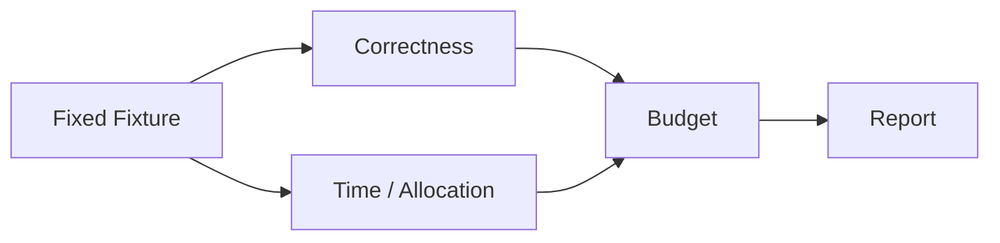

# Benchmark、性能预算与回归

## 学习目标

用 Deterministic Scenario 和 Explicit Budget 发现回归，不把噪声 Timing 当作正确性。

Hermetic Coding Suite 覆盖 Context Truncation、Compaction、Working Set、Evidence、
Index Degradation、Edit Transaction 与 Verification Gate；每个 Task 具有 Assertion。
Catalog Benchmark 测量大 Tool Set 的时间与 Allocation。Web Gate 约束 10k Delta、
1000 Background Row、Runtime Ready、Incremental Transcript、Hidden View 与 Electron
Interaction。



同硬件/Runtime 比较并保存 Raw Report。更快但违反 Evidence/Verification 仍是失败。

## Measurement Protocol

记录 Source Revision、Dirty State、OS/Arch、Go/Node Version、CPU、Power Mode、Fixture
Version、Warmup、Sample、Concurrency 与 Command。比较 Distribution/Repeated Sample，
而非一次 Favorable Run。

| Metric | Risk |
| --- | --- |
| Wall/CPU Time | Latency/Throughput |
| Allocation/Bytes | GC/Catalog/Context Scale |
| Peak Concurrency | Scheduler/Resource Budget |
| Output/Context Size | Truncation/Transport Pressure |
| Correctness Counter | Fast but Incomplete Execution |

Microbenchmark 隔离 Algorithm；Scenario 包含 Runtime Interaction；E2E 包含 Process/UI。
不同层结果不可互相替代。

## Budget Governance

Budget 包含 Metric、Percentile/Sample Rule、Fixture Scale、Environment Class、Failure
Action。提高 Budget 必须有 Causal Explanation、Before/After Raw Evidence、Correctness
Parity 与 Review。先按 Trace/Profile 优化 Dominant Phase。

Cache 需要 Invalidation/Capacity；Parallelism 需要 Cancellation/Admission；Deferred
Loading 必须保持 Catalog Authority。

## Native Chat Performance Contract

Release Gate 同时测量行为和耗时：

| Metric | RC Budget |
| --- | --- |
| Extension Activation | 小于 20 ms |
| First Interactive Chat | 小于 300 ms，不含 Runtime Startup |
| 200-Turn Full Snapshot | 小于 100 ms |
| Single-Turn Patch | 小于 100 ms，且 Byte 小于 Snapshot 四分之一 |
| Affected/Virtual DOM | 最多 2 个 Affected Turn、30 个 Virtual Turn Node |
| Scroll-anchor Error | 最多 1 px |
| Hidden Webview Post | 必须为 0 |
| Hidden Resume | 小于 300 ms |
| 1000-Session Search/Virtual Paint | 小于 150 ms |
| Runtime Ready P95 | 小于 5 s |

RC 先要求每个 Metric 存在且为有限非负数，再比较 Budget，避免缺失 JSON Field 因比较
语义意外通过。Patch Operation、Payload Byte、Affected Node、Virtual Node 与 Scroll
Stability 是不同证据；即使耗时快，重建完整 DOM 仍应失败。

## 失败边界

- Warmup/Sample Count 显式。
- 排除 Network/Live Provider。
- 未测 Phase 不是零。
- 调整 Budget 需要 Review/Evidence。

## 验证

提交的 Benchmark V2 Manifest 定义六条产品 Journey：

| Journey | Lane | Required Capability |
| --- | --- | --- |
| Cross-file Edit | Platform Capability | Strong Sandbox |
| Affected-test Selection | Platform Capability | Strong Sandbox |
| Approval | Platform Capability | Strong Sandbox |
| Budget Exhaustion | Platform Capability | Strong Sandbox |
| Crash Recovery | Hermetic | 无 |
| Host Replay | Integration | 无 |

每条 Journey 都声明 Evidence 与 Executable Command。Validator 拒绝缺失 Evidence 或错误
的 Lane/Capability Claim。

```bash
make benchmark-v2
make bench
make catalog-bench
make web-build
make web-build
```

Platform-capability Journey 只在声明的 Sandbox 前置条件可用时运行。Capability 缺失要
报告为 Unavailable，不能通过关闭 Sandbox Enforcement 转成 Passed。Electron/
Runtime-ready Budget 同样保持为 Environment-acquired Gate。

## 复习问题

1. 什么 Metadata 使 Benchmark 可比较？
2. Microbenchmark 为什么不能替代 E2E Gate？
3. 提高 Budget 需要哪些 Evidence？
4. RC 为什么必须先验证 Metric Presence？

## 事实来源与验证

| 项目 | 值 |
| --- | --- |
| Catalog ID | `practice-benchmark` |
| 状态 | `draft` |
| 最后验证 | 尚未验证 |
