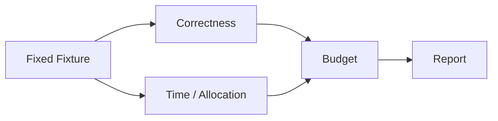

# Benchmark、性能预算与回归

简体中文 | [English](../../en/12-engineering-practice/04-benchmark-and-performance.md)

## 学习目标

用 Deterministic Scenario 和 Explicit Budget 发现回归，不把噪声 Timing 当作正确性。

Hermetic Coding Suite 覆盖 Context Truncation、Compaction、Working Set、Evidence、
Index Degradation、Edit Transaction 与 Verification Gate；每个 Task 具有 Assertion。
Catalog Benchmark 测量大 Tool Set 的时间与 Allocation。VS Code Gate 约束 10k Delta、
1000 Background Row、Runtime Ready 与 Electron Interaction。



同硬件/Runtime 比较并保存 Raw Report。更快但违反 Evidence/Verification 仍是失败。

## Measurement Protocol

记录 Source Revision、Dirty State、OS/Arch、Go/Node Version、CPU、Power Mode、Fixture
Version、Warmup、Sample、Concurrency 与 Command。比较 Distribution/Repeated Sample，
而非一次 Favorable Run。

| Metric | Risk |
| --- | --- |
| Wall/CPU Time | Latency/Throughput |
| Allocation/Bytes | GC/Catalog/Context Scale |
| Peak Concurrency | Scheduler/Resource Budget |
| Output/Context Size | Truncation/Transport Pressure |
| Correctness Counter | Fast but Incomplete Execution |

Microbenchmark 隔离 Algorithm；Scenario 包含 Runtime Interaction；E2E 包含 Process/UI。
不同层结果不可互相替代。

## Budget Governance

Budget 包含 Metric、Percentile/Sample Rule、Fixture Scale、Environment Class、Failure
Action。提高 Budget 必须有 Causal Explanation、Before/After Raw Evidence、Correctness
Parity 与 Review。先按 Trace/Profile 优化 Dominant Phase。

Cache 需要 Invalidation/Capacity；Parallelism 需要 Cancellation/Admission；Deferred
Loading 必须保持 Catalog Authority。

## 失败边界

- Warmup/Sample Count 显式。
- 排除 Network/Live Provider。
- 未测 Phase 不是零。
- 调整 Budget 需要 Review/Evidence。

## 验证

```bash
make bench
make catalog-bench
make vscode-performance
```

2026-08-06 在 macOS arm64 的验证记录：100、500、1000 个 Tool 的 Catalog Scale
Benchmark 通过；Coding Suite 通过 18/23，另外 5 个 Verification-gate 场景因本机
Seatbelt Probe 返回 `strength=none` 而 Fail Closed。不得关闭 Sandbox Enforcement
来制造通过结果。VS Code Projector Budget 已通过；Electron/Runtime-ready Budget
仍属于需要外部环境的门禁。

## 复习问题

1. 什么 Metadata 使 Benchmark 可比较？
2. Microbenchmark 为什么不能替代 E2E Gate？
3. 提高 Budget 需要哪些 Evidence？

## 事实来源与验证

| 项目 | 值 |
| --- | --- |
| Catalog ID | `practice-benchmark` |
| 状态 | `verified` |
| 最后验证 | 2026-08-06 |
