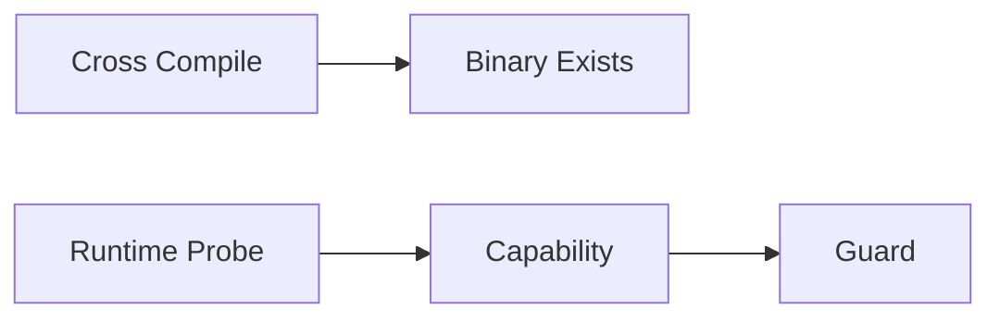

# 跨平台构建与能力探测

简体中文 | [English](../../en/12-engineering-practice/05-cross-platform.md)

## 学习目标

区分 Compile Support 与 Runtime Capability，并显式表达平台降级。

`cross-build` 编译 Linux amd64/arm64 与 Windows amd64，但不声称通过 Runtime Sandbox
Test。Platform File 实现 Process Group、Filesystem Identity、Lock 与 Workspace
Safety。Sandbox `Probe` 报告 Backend/Strength；Consequential Tool 调用
`RequireStrong`，Partial Capability 时 Fail Closed。



VS Code 绑定本地 `file:` Workspace Identity，并打包 Target-specific Binary。
Remote Editor Environment 不在插件产品范围内。

## 三层 Platform Evidence

| Level | Evidence |
| --- | --- |
| Buildable | Target Compile |
| Runnable | Binary Start + Core Protocol Smoke |
| Supported | Security/Persistence/Process/Path/Upgrade/Host Matrix |

文档与 Release Manifest 必须声明 Level；Cross Compile 不能把 Target 提升为 Supported。

## Platform Abstraction Review

OS-specific Code 通过窄 Contract 封装 Process Group、Signal、Lock、Secure File Open、
Canonical Path、Sandbox Backend、Workspace Identity。Common Caller 消费 Capability/
Result，而非 Platform Command String。

Fallback 分类：

- Equivalent Implementation 可继续；
- Weaker Observable Behavior 仅用于 Non-consequential Path；
- Missing Required Security Capability Fail Closed；
- Unknown Capability 不视为 Available。

Cross-platform Test 包含 Compile Matrix 和 Native Runner。Windows Path/Link、Unix Process
Tree、Linux Landlock、macOS Seatbelt、Remote URI、Target Package 需要 Native Evidence。

## 失败边界

- Compile Success 不等于 Runtime Support。
- Strong Sandbox 不可静默降级。
- Path/File Identity 具有 OS 差异。
- Platform-limited Test 报告 Target/Backend。

## 验证

```bash
make cross-build
go test ./internal/security/sandbox ./internal/platform/process
```

## 复习问题

1. Runnable 与 Supported 有何区别？
2. Platform Fallback 何时可继续？
3. 为什么 Cross Compile 不证明 Runtime Security？

## 事实来源与验证

| 项目 | 值 |
| --- | --- |
| Catalog ID | `practice-cross-platform` |
| 状态 | `draft` |
| 最后验证 | 尚未验证 |
