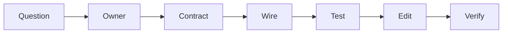

# 如何阅读和修改大型 Agent 工程

## 学习目标

按 Ownership/Contract 导航，先取得 Evidence 再编辑，并按风险扩大验证。

## Working Method

1. 读 `AGENTS.md`、README、Architecture、Nearest Test、Makefile 与 Status。
2. 找 Stable Contract：Protocol、Descriptor、Repository 或 Interface。
3. 沿 `internal/runtime/app/wire` 查看 Construction。
4. 追踪一条 Success Path 和 Failure Path。
5. 阅读 Ordering、Persistence、Security、Platform Test。
6. 做最小 Ownership-aligned Change。
7. 添加 Focused Test，再按 Blast Radius 扩大。
8. 执行 Docs/Book/Diff Check，并同步中文文档事实。



优先按 Symbol/Event/Tool ID 搜索。Generated Protocol、Compatibility、Navigation 使用
仓库命令。保留无关 Worktree Change。

## Hypothesis/Evidence Ledger

Edit 前记录 Claim、Owner、Invariant 与 Disconfirming Evidence：

| Field | Example |
| --- | --- |
| Claim | Replace Catalog Entry 会 Fence Prior Call |
| Owner | Tool Registry Generation Binding |
| Success Evidence | New Call Resolve New Revision |
| Failure Evidence | Stale Bound Call Rejected |
| Side Effect | Catalog Event/In-flight Handle |
| Gate | Package/Race/Protocol/Docs |

这避免 Agent 把第一条 Plausible Path 当成 Truth。Source/Test 否定 Hypothesis 时更新 Ledger。

## Change Loop

```text
observe -> hypothesize -> locate authority -> reproduce
 -> edit smallest owner -> focused verify -> adversarial verify
 -> inspect diff -> update Chinese docs/evidence
```

Reproduction 保留 Identity、Input、Environment、Failure Phase。Static Defect 用 Focused
Test；Runtime Defect 先收集 Sanitized Event/Receipt/Trace/Journal，再 Instrument。

Final Diff 检查 Authority Expansion、Secret Path、Unbounded IO、Partial-effect Retry、
Cleanup Ownership、Generated Drift、Accidental Compatibility。

## Verification by Blast Radius

Local Change 从 Package 开始；Shared Interface 增加所有 Implementer/Contract；Protocol/
Persistence/Security 增加 Schema、Replay、Fault Injection、Race、Host；Release 验证
Artifact Byte 与 Install/Rollback，而不只验证 Script。

## 失败边界

- 不把 Business Loop 放入 Host。
- 不绕过 Guard/Policy/Sandbox/Journal。
- 不按名称猜测行为。
- 不借窄问题扩大 Refactor。
- 如实报告 Environment-limited Validation。

## 验证

```bash
go test ./path/to/changed/package
make docs-check
make book-check
git diff --check
```

## 复习问题

1. 什么 Evidence 会否定 Implementation Hypothesis？
2. 哪些 Review 问题可发现 Accidental Authority Expansion？
3. Blast Radius 如何决定 Verification Breadth？

## 事实来源与验证

| 项目 | 值 |
| --- | --- |
| Catalog ID | `practice-reading-codebase` |
| 状态 | `draft` |
| 最后验证 | 尚未验证 |
