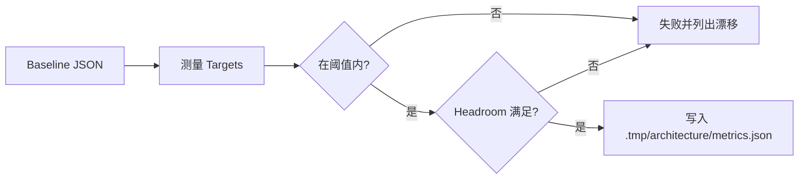

# 架构度量与回归棘轮

简体中文 | [English](../../en/12-engineering-practice/08-architecture-ratchet.md)

## 学习目标

本章之后，读者可以：

- 解释为什么结构预算需要单调 Ratchet；
- 说出 Ratchet 测量的每个 Metric 与 Target 类型；
- 在本地运行测量与 Ratchet；
- 只通过 Relaxation 与 Retirement 契约修改阈值。

## 问题背景

受治理的 Agent Runtime 由许多小改动累积而成。测试能发现行为回归，但发现不了缓慢的
结构退化：包吸收更多内部依赖、热点文件持续膨胀、协议 Event 的 Switch 站点越来越多。
没有显式的结构预算，架构会悄悄漂移，直到一次重构成为整个团队的负担。

## 核心概念

- **Target**：Ratchet 测量的范围，可以是 Package、File 或 Repository。
- **Metric**：Target 的可计数属性，例如行数或依赖数。
- **Limit**：Baseline 中允许的当前最大值。
- **Baseline**：`docs/architecture-metrics-baseline.json`，Schema Version 1、
  Requirement ID `ARCH-RATCHET-001` 的已提交契约。
- **Relaxation**：允许提高某指标阈值的书面理由。
- **Retirement**：删除某个 Target 或 Metric 的书面理由。
- **Headroom**：测量值低于阈值多少以内才不算阈值过期。

## CodeHelper 设计

两个互补契约约束架构。`docs/hotspot-baseline.json` 把职责绑定到 Package Symbol 与
Owner File，职责丢失或错位、未审阅内部依赖、热点增长和测试资产删除都会使其失败。
`docs/architecture-metrics-baseline.json` 约束可测量的形态：直接内部 Package Fanout、
生产代码行数、Options/Mutex 字段、热点文件/函数体积，以及重复的 Protocol Event
Switch 站点。

`scripts/architecturemetrics` 测量每个 Target，漂移即失败，并可用 `-report` 输出测量
报告。Makefile 暴露 `make architecture-metrics`（仅测量）与 `make
architecture-ratchet`（测量并执行）；Ratchet 已加入 `make verify` 和
`architecture-freeze`。

`make architecture-size-budget BASE_REF=origin/main` 独立比较完整 Ownership Closure
与 Git Base。它排除 Test、Docs、Fixture、Generated Source 与 Build Output，并报告
Base、Head、Added、Deleted、Net Production Lines。Stage D 合入时消费了显式批准的
`+847` Relaxation，随后默认值恢复为零；后续新增第 `+1` 行就会失败，除非再次记录
明确决策。

## 指标

| Metric | Target 类型 | 含义 | Headroom |
| --- | --- | --- | --- |
| `internal_fanout` | package | 直接导入的内部包数量 | 0 |
| `production_lines` | package | 非测试 Go 文件行数 | 100 |
| `options_fields` | package | `*Options` 结构体字段数 | 0 |
| `mutex_fields` | package | `sync.Mutex`/`sync.RWMutex` 字段数 | 0 |
| `lines` | file | 文件总行数 | 20 |
| `max_function_lines` | file | 最长函数行数 | 5 |
| `event_switch_sites` | repository | 分发协议事件的 Switch 语句数 | 0 |

离散计数不留 Headroom：阈值等于测量值才是稳态。行数类指标保留 Headroom，避免正常
编辑频繁改动 Baseline，同时仍能发现阈值悄悄过期。

## Ratchet 规则

阈值只能单调收紧。提高阈值必须为对应指标填写非空 `relaxations` 理由；删除 Target
或 Metric 必须填写显式 `retirements` 理由。过期条目会使 Ratchet 失败，避免临时额度
静默变成永久例外。设置 `ARCHITECTURE_BASE_REF`（默认 `origin/main`）时，命令会读取
该 Ref 的旧 Baseline，并在两个版本之间校验单调性与退休记账。

## 执行流程



命令先校验 Baseline 本身：Schema 版本、Requirement ID、Target ID 唯一性、Kind
合法性、路径安全、非负阈值以及 Relaxation/Retirement 一致性。测量错误与过期
Headroom 汇总为排序后的漂移列表，命令以非零退出码结束。

## 代码地图

| 关注点 | 来源 | 重要性 |
| --- | --- | --- |
| 测量与执行 | `scripts/architecturemetrics/main.go` | 基于 AST 的 Package/File/Repository 计数 |
| 阈值契约 | `docs/architecture-metrics-baseline.json` | 阈值的唯一事实来源 |
| Make 目标 | `Makefile` | `architecture-metrics`、`architecture-ratchet`、`architecture-freeze` |
| 测试 | `scripts/architecturemetrics/main_test.go` | Baseline 校验、漂移、Headroom 与 Ratchet 用例 |
| Ownership Size Budget | `scripts/architecturesize` | Base/Head Production LOC 与精确 Relaxation |

## 失败模式与安全边界

- Target 路径消失时测量失败，而不是静默通过。
- 未写 Retirement 就从 Limit 中删除 Metric，Ratchet 失败。
- 即使所有阈值都满足，过期的 Relaxation/Retirement 也会失败。
- Baseline 路径被限制在仓库内；绝对路径与 `..` 路径会被拒绝。

## 测试与验证

```bash
go test ./scripts/architecturemetrics
make architecture-ratchet
make architecture-size-budget BASE_REF=origin/main
make book-check
```

Ratchet 不需要网络，也不需要真实 Provider，属于 Hermetic。测量报告写入
`.tmp/architecture/metrics.json`，不纳入版本管理。

## 复习问题

1. 为什么阈值只能单调收紧，而不是自动更新？
2. Relaxation 与 Retirement 有什么区别？
3. Headroom 检查在什么时候失败，它阻止了什么？
4. `ARCHITECTURE_BASE_REF` 比较如何约束版本之间的契约？

## 事实来源与验证

| 项目 | 值 |
| --- | --- |
| Catalog ID | `practice-architecture-ratchet` |
| 状态 | `draft` |
| 最后验证 | 尚未验证 |
