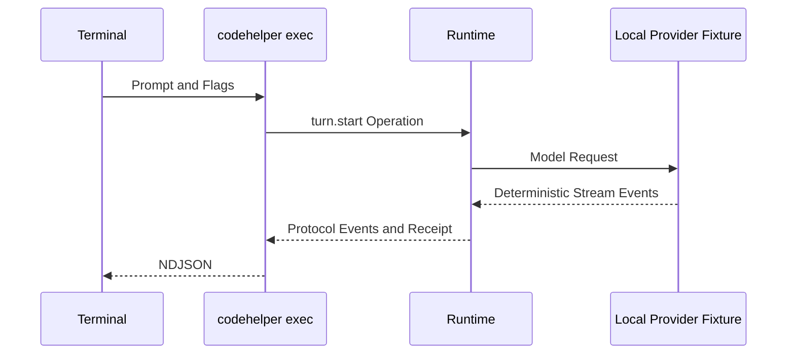

# 构建并追踪第一个 Agent Turn

简体中文 | [English](../../en/13-hands-on-labs/01-first-agent-turn.md)

## 学习目标

编译 CodeHelper，通过真实 Runtime 运行无网络 Turn，阅读 Event Stream，将 Event
映射回源码，并区分 Fixture Evidence 与 Live Provider Test。

## 前置知识

- Go 1.26+、Git、Make；
- CodeHelper 本地仓库；
- 核心阅读路径中的四篇基础概念章节；
- 不需要 API Key 或网络。

## 为什么先使用 Fixture

Live Provider 会引入 Credential、Network、Rate Limit、Model Drift 和 Cost，掩盖本实验
要学习的 Runtime 行为。Fixture 启动确定性的本地 HTTP Server，但仍经过：

- CLI Parsing 与 Host Projection；
- Runtime Operation/Event Lifecycle；
- Model Route 与 Provider Stream；
- Agent Engine 与 Context；
- Receipt、Usage 与 Terminal State。

它只替代 Provider 边界，不 Mock 整个应用。

## 实验拓扑



## 1. 检查工作区

```bash
git status --short
go version
```

实验不应修改 Tracked File。已有 Change 属于用户，不能 Reset。

## 2. 编译

```bash
make build
./bin/codehelper version
```

Binary 会包含 Version、Commit、Build Date、Go Version、OS 与 Architecture。

## 3. 检查能力

```bash
./bin/codehelper doctor
./bin/codehelper sandbox status
```

Capability Output 只描述本机事实，不授予 Permission，也不保证 Strong Sandbox 可用。

## 4. 运行 Turn

```bash
tmp="$(mktemp -d)"
./bin/codehelper exec \
  --provider-fixture ./testdata/providers/openai \
  --provider openai \
  --model gpt-fixture \
  --workspace . \
  --data-dir "$tmp/state" \
  --output-format stream-json \
  "say hello"
rm -rf "$tmp"
```

临时 Data Directory 隔离 Durable State。命令应成功退出，并按行输出 JSON Event。

## 5. 阅读 Event Stream

可能出现：

- `turn.started`：Provider、Model、Mode、Posture、Workspace；
- `output.delta`：增量回答；
- `usage`：Fixture Usage；
- `turn.receipt`：Context、Route、Budget、Latency、Verification；
- `turn.completed`：唯一成功 Terminal Event。

安装 `jq` 时：

```bash
tmp="$(mktemp -d)"
./bin/codehelper exec \
  --provider-fixture ./testdata/providers/openai \
  --provider openai \
  --model gpt-fixture \
  --workspace . \
  --data-dir "$tmp/state" \
  "say hello" >"$tmp/events.ndjson"
jq -r '.kind' "$tmp/events.ndjson"
jq -c 'select(.kind == "turn.receipt")' "$tmp/events.ndjson"
rm -rf "$tmp"
```

不要假定本章字段永远正确，应将实际 Event 与 `internal/runtime/protocol/message.go` 对照。

## 6. 将事实映射回源码

| 观察事实 | 源码入口 |
| --- | --- |
| CLI Flag/Output | `internal/host/cli/exec.go` |
| Operation/Event | `internal/runtime/protocol/message.go` |
| Queue/Sequence | `internal/runtime/app/runtime.go` |
| Turn/Receipt Adapter | `internal/runtime/app/application.go`、`receipt.go` |
| Model/Tool State Machine | `internal/runtime/agent/engine/engine.go` |
| Fixture Server | `internal/adapter/provider/fixture` |

```bash
rg 'EventTurnStarted|EventExecutionReceipt|EventTurnCompleted' internal/runtime
```

## 7. 运行聚焦测试

```bash
go test ./internal/host/cli -run 'TestRunMachine'
go test ./internal/runtime/protocol -run TestOperationTaggedUnionRoundTrip
go test ./internal/runtime/app -run TestRuntimeConcurrentSubmitHasStrictSequenceAndUniqueTerminal
go test ./internal/runtime/agent/engine -run TestEngineExecutesToolAndFeedsResultOnce
```

它们分别验证 Host Output、Protocol Encoding、Lifecycle Ordering 与 Tool Loop。

## 预期结果

- Binary 正确报告 Build Metadata；
- Fixture Turn 无 API Key 且 Exit Code 为 0；
- Event 使用稳定 Operation/Thread/Turn Identity；
- 存在 Receipt；
- 只有一个 Terminal Event；
- 聚焦测试通过；
- 实验不产生新的 Tracked Modification。

## 失败诊断

| 症状 | 原因 | 处理 |
| --- | --- | --- |
| Fixture 目录不存在 | 不在 Repository Root | 回到仓库根目录 |
| Unknown Model/Route | Flag 与 Fixture 不匹配 | 使用 `openai`、`gpt-fixture` |
| NDJSON Malformed | Stdout 混入非 Machine Output | 保持 `stream-json` |
| Sandbox Unavailable | 平台不满足 Strong Boundary | 查看 Status，不静默 Bypass |
| Test Cleanup Error | 临时 Process/Git Handle 未关闭 | 单独重跑并检查 Lifecycle |

## 清理

示例会删除 Temp Directory。实验不修改本机 DeepSeek Credential Runbook。

## 从 Fixture 到 Live Provider

Fixture 路径通过后再配置 Credential Reference 和 Live Model。Live Call 验证
Network/Provider Compatibility，不能替代确定性 Runtime Test。

```bash
make deepseek-init
```

遵循[本机 DeepSeek 指南](../../../zh-CN/deepseek-local.md)，不在 Tracked Doc 或 Output
中写入 Raw Key。

## 复习问题

1. Provider Fixture 下仍运行了哪些真实 Runtime Component？
2. 为什么 Receipt 比 Assistant Prose 更强？
3. 切换 Live Provider 后增加了哪些变量？

## 延伸阅读

- [Turn 生命周期](../02-codehelper-overview/05-turn-lifecycle.md)
- [Model、Context 与 Tool](../02-codehelper-overview/06-model-context-and-tool.md)
- [快速开始](../../../zh-CN/getting-started.md)

## 事实来源与验证

| 项目 | 值 |
| --- | --- |
| Catalog ID | `lab-first-turn` |
| 状态 | `draft` |
| 最后验证 | 尚未验证 |
