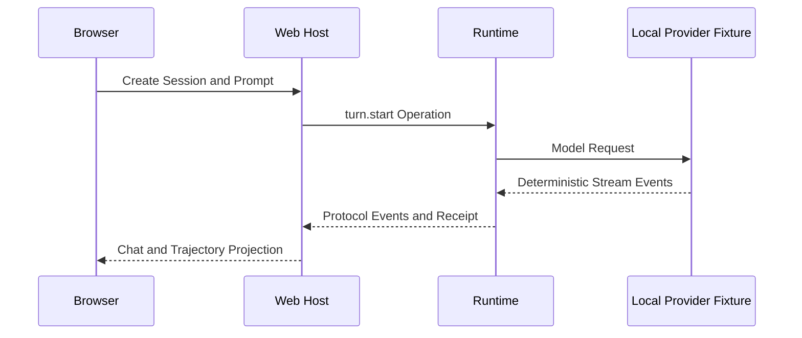

# 构建并追踪第一个 Agent Turn

## 学习目标

编译 QCode，通过真实 Web Host 运行无网络 Turn，在 Chat 与 Trajectory 中观察
Event，并区分 Fixture Evidence 与 Live Provider Test。

## 前置知识

- Go 1.26+、Git、Make；
- QCode 本地仓库；
- 不需要 API Key 或网络。

## 为什么先使用 Fixture

Live Provider 会引入 Credential、Network、Rate Limit、Model Drift 和 Cost。Fixture
启动确定性的本地 HTTP Server，但仍经过 Web Transport、Runtime Operation/Event、
Agent Engine、Guard、Receipt、Usage 和 Terminal State。

## 实验拓扑



## 1. 编译

```bash
git status --short
make web-build
make build
./bin/qcode --version
```

## 2. 启动 Fixture-backed Web

```bash
tmp="$(mktemp -d)"
./bin/qcode \
  --provider-fixture ./testdata/providers/openai \
  --provider openai \
  --model gpt-fixture \
  --workspace . \
  --data-dir "$tmp/state" \
  --no-open
```

打开终端输出的 Runtime Ready URL，创建 Session 并发送 `say hello`。实验结束后中断
进程并删除临时目录。

## 3. 检查事实

在 Chat 与 Trajectory 中确认：

- `turn.started` 绑定 Provider、Model、Workspace 与稳定 Identity；
- `output.delta` 形成增量回答；
- Usage 与 Receipt 在终态前闭合；
- 只出现一个 `turn.completed`、`turn.failed` 或 `turn.canceled`；
- 刷新页面不会重新提交 Prompt。

## 4. 映射源码

| 观察事实 | 源码入口 |
| --- | --- |
| Web 启动 | `internal/host/web/launcher.go` |
| HTTP/WebSocket | `internal/host/runtimeapi/web/server.go` |
| Operation/Event | `internal/runtime/protocol/message.go` |
| Queue/Sequence | `internal/runtime/app/runtime.go` |
| Model/Tool Loop | `internal/runtime/agent/engine` |
| Fixture Server | `internal/adapter/provider/fixture` |

## 5. 聚焦验证

```bash
go test ./internal/host/web -run TestRunContextStartsAndStopsWebHost
go test ./internal/host/runtimeapi/web -run TestWebHostMeetsTheRuntimeContract
go test ./internal/runtime/protocol -run TestOperationTaggedUnionRoundTrip
go test ./internal/runtime/app -run TestRuntimeConcurrentSubmitHasStrictSequenceAndUniqueTerminal
```

## 预期结果

- Fixture Turn 不使用 API Key；
- Web 展示稳定 Operation/Thread/Turn Identity；
- Receipt 与唯一 Terminal Event 可检查；
- 页面重连后由 Snapshot 和 Event Replay 恢复；
- 实验不产生新的 Tracked Modification。

## 失败诊断

| 症状 | 原因 | 处理 |
| --- | --- | --- |
| Fixture 目录不存在 | 不在 Repository Root | 回到仓库根目录 |
| Unknown Model/Route | 启动参数与 Fixture 不匹配 | 使用示例参数 |
| Runtime 未 Ready | 配置、State 或 Sandbox 初始化失败 | 查看 Boot Failure Surface |
| 无 Terminal | Provider Parser 或 Runtime 状态机问题 | 运行聚焦测试 |

## 从 Fixture 到 Live Provider

Fixture 路径通过后，可在 Web 中配置真实 Provider 和 Credential Reference。Live Call
验证 Network/Provider Compatibility，不能替代确定性 Runtime Test。

## 复习问题

1. Provider Fixture 下仍运行了哪些真实 Runtime Component？
2. 为什么 Receipt 比 Assistant Prose 更强？
3. 刷新页面为什么不会重复提交 Prompt？

## 延伸阅读

- [Turn 生命周期](../02-qcode-overview/05-turn-lifecycle.md)
- [Model、Context 与 Tool](../02-qcode-overview/06-model-context-and-tool.md)
- [快速开始](../../../zh-CN/getting-started.md)

## 事实来源与验证

| 项目 | 值 |
| --- | --- |
| Catalog ID | `lab-first-turn` |
| 状态 | `draft` |
| 最后验证 | 尚未验证 |
