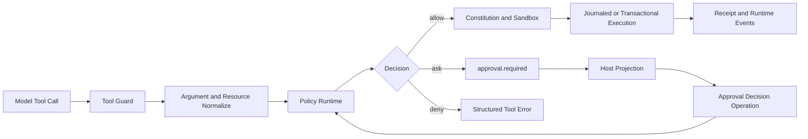

# Approval Architecture Upgrade

[简体中文](../zh-CN/approval-architecture-upgrade.md) | English

> Status: A0 was completed on 2026-08-13. A1-A4 are target design and are not
> claims about shipped behavior.
>
> Scope: Tool Guard policy, durable grants, approval protocol, Runtime recovery,
> ACP routing, VS Code presentation, and approval observability.

## 1. Executive Summary

CodeHelper already has the correct security ownership: consequential tools pass
through one Guard, approvals are Runtime requests, decisions are durable
operations, and child approvals retain authoritative Thread and Turn identity.
The problem is that the decision model is too coarse and the editor
presentation is too noisy.

Today, `suggest` generally asks for every non-read capability, lifecycle tools
carry unconditional `ask` grants, and only `file_write` has a narrow
low-risk exception. The approval cache and persisted permissions then reuse
generic resource or command-prefix keys that are not precise enough to explain
what future operation was authorized. VS Code presents both a transcript card
and a blocking modal with raw request detail.

The target is one monotonic decision pipeline:

```text
Authority Ceiling
  -> Hard Deny
  -> Effect Normalize
  -> Deterministic Risk
  -> Existing Typed Grant
  -> Bounded Auto Review
  -> Human Approval
```

An allow may remove an unnecessary prompt, but may never override the
authority ceiling, a deny, the constitution, or the sandbox. Low-risk,
reversible, sandboxed coding work should proceed automatically. High-risk
operations remain explicit, and critical operations fail closed.

## 2. Current Architecture

### 2.1 Authoritative Flow



The ownership boundaries must remain:

| Concern | Owner |
| --- | --- |
| schema, argument, and resource validation | `internal/adapter/tool/guard` |
| mode, posture, repository rules, and grants | `internal/security/policy` |
| durable workspace permissions | `internal/security/permissions` |
| approval request and resolution truth | `internal/runtime` |
| child request authority and routing | Runtime and ACP |
| host presentation | CLI, TUI, VS Code, and ACP projections |
| mutation rollback and evidence | Journal, tool adapter, and receipt |

Hosts must not execute tools or reinterpret security decisions.

### 2.2 Current Decision Semantics

The current postures are:

| Posture | Current behavior |
| --- | --- |
| `never` | read-only; side effects must be denied |
| `suggest` | reads are allowed; most side effects ask |
| `auto` | reads and writes are allowed; process/network/plugin often ask |
| `bypass` | broad automatic authority, still below hard denies and sandbox |

Repository rules support `allow`, `ask`, `deny`, and `hold`. Approval scopes are
`once`, `session`, and `always`. Pending approval requests and child approval
proxies survive restart.

## 3. Audit Findings

### 3.1 P0: Persisted Allow Can Cross the `never` Ceiling

`policy.Runtime.Evaluate` currently checks a matching repository allow before
it evaluates the permission posture. A workspace
`.codehelper/permissions.toml` allow can therefore return `allow` without
executing the `never` side-effect denial.

VS Code starts an untrusted workspace with `posture=never`, while Runtime wiring
still loads that workspace's permissions. This makes the ordering defect a real
trust-boundary issue.

Required invariant:

```text
allow_effective =
  authority_permits
  AND no_hard_deny
  AND grant_permits
  AND (policy_allows OR valid_approval)
```

No rule, cache entry, approval, or persisted amendment may increase authority.

### 3.2 P1: Capability Is Too Coarse

The policy treats every invocation primarily as one of `read`, `write`,
`process`, `network`, or `plugin`. It cannot distinguish:

- a journaled edit from an irreversible external write;
- a network-isolated `go test` from an unrestricted process;
- a message to an existing child from spawning a writing child;
- one workspace file from a broad tree mutation;
- a reversible local delete from a destructive remote operation.

This causes both excessive prompts and weak explanations.

### 3.3 P1: Default Lifecycle Rules Force Prompts

Lifecycle grants mark agent communication, agent lifecycle, task cancellation,
automation mutation, and GitHub mutation as `ask`. A specific ask wins over the
wildcard grant even under `auto` and `bypass`.

These operations need effect-specific classification. Ordinary messaging to an
existing child is not equivalent to creating a writing child or mutating a
remote repository.

### 3.4 P1: Reusable Grants Are Not Typed

Session and persistent grants are keyed by generic resources. Persisted shell
permission currently stores only the first command token, so approval of
`go test` can become a rule for all commands beginning with `go`. Other tools
may fall back to `resource="*"`.

A reusable decision must describe the exact future authority it grants and be
shown to the user before persistence.

### 3.5 P2: VS Code Duplicates and Overloads Approval UI

VS Code currently renders a transcript card and opens a blocking modal. The
modal exposes long request details and five equally prominent actions. This
duplicates state, interrupts the editing flow, and makes the primary risk hard
to identify.

### 3.6 P2: Ungoverned Debug Side Effects

Approval summary formatting and file edit mismatch handling contain
fire-and-forget loopback HTTP debug posts. Production paths must not emit
undeclared local network traffic.

## 4. Reference Findings

### 4.1 Codex

The Codex design provides four useful ideas:

1. Approval policy is explicit and separate from the sandbox.
2. Known-safe and known-dangerous command classification occurs before asking.
3. Restricted execution relies on the sandbox for ordinary operations instead
   of asking for every process.
4. Reusable approval returns a typed policy amendment rather than a generic
   boolean.

Codex also uses a Guardian review session with read-only permission,
`approval_policy=never`, structured output, and unnecessary capabilities
disabled. CodeHelper can adopt this only as a bounded fallback after
deterministic classification, not as a replacement for policy.

CodeHelper retains its stronger properties: canonical resources, Constitution,
Journal, durable Runtime requests, child authority ceilings, and receipts.

### 4.2 VS Code Native Agent UI

A disposable VS Code workspace was driven through Chrome DevTools Protocol to
trigger a real native approval without executing the operation. The observed
card used:

- one short question;
- a one-line risk explanation;
- syntax-highlighted command content;
- `Allow` as the primary action;
- `Skip` as the secondary action;
- broader authorization in a dropdown;
- rule details behind an information affordance;
- a carousel for multiple pending approvals.

CodeHelper should reproduce these interaction principles with its own Runtime
facts. It must not scrape native UI or let the Webview infer risk.

## 5. Target Decision Model

### 5.1 Authority Ceiling

The ceiling is evaluated first and can only narrow:

```text
effective posture = min(requested posture, host ceiling, parent ceiling,
                        role ceiling, workspace trust ceiling)
```

Examples:

- an untrusted VS Code workspace remains `never`;
- a read-only child remains `never` even if the parent is `bypass`;
- Plan mode remains read-only;
- a Host cannot turn a denied request into an approval prompt.

### 5.2 Normalized Effect

Every validated invocation is normalized into a protocol-independent internal
effect:

```go
type Effect struct {
    Kind          EffectKind
    Targets       []CanonicalTarget
    Access        AccessSet
    Network       NetworkEffect
    Sandbox       SandboxStrength
    Reversibility Reversibility
    Scope         EffectScope
}
```

Initial effect kinds:

- `workspace.read`
- `workspace.edit`
- `process.read_only`
- `process.mutating`
- `network.read`
- `network.mutating`
- `agent.message`
- `agent.lifecycle`
- `external.mutation`

Effect normalization belongs beside Guard resource resolution. Policy consumes
the normalized result; Hosts only project it.

### 5.3 Deterministic Risk

Risk is an output of explicit facts:

| Risk | Typical effect | Default |
| --- | --- | --- |
| `low` | read, journaled edit, isolated test, child message | allow |
| `medium` | bounded reversible process or network read | allow or auto review |
| `high` | broad write, credential use, remote mutation | human approval |
| `critical` | authority escalation or destructive uncontrolled action | deny |

Risk does not grant authority. A low-risk side effect under `never` is still
denied.

### 5.4 Typed Grant and Amendment

Each approval kind creates its own canonical grant key:

| Kind | Key material |
| --- | --- |
| shell | normalized argv, cwd class, declared write set, network effect |
| file | canonical path set and access |
| network | protocol, normalized host, method/effect |
| agent | Agent ID/path and lifecycle action |
| external | provider, repository/object, mutation kind |

The Runtime generates a proposed amendment. The Host can only select one of the
decisions supplied by Runtime.

Rules:

- `once` binds to request fingerprint and expiry;
- `session` stores a typed in-memory grant;
- `always` persists the exact displayed amendment;
- if a narrow amendment cannot be generated, `always` is unavailable;
- deny, hold, Constitution, sandbox, and authority ceiling are never
  amendable.

### 5.5 Bounded Auto Review

Auto review is optional and applies only when deterministic classification
returns an uncertain low/medium risk. The reviewer:

- runs read-only with `approval_policy=never`;
- receives normalized effect data, not arbitrary secrets;
- has no process, network, MCP, memory, or subagent authority unless explicitly
  required;
- returns schema-validated risk, authorization, outcome, and rationale;
- times out quickly and fails closed to human approval;
- can never approve high/critical risk or override a deny.

## 6. Protocol Evolution

`approval.required` remains the durable request. It should gain:

```text
effect_kind
risk_level
reversibility
title
summary
reason_code
rule_source
available_decisions
grant_preview
```

`available_decisions` is authoritative and approval-kind specific. A later
protocol revision should replace the ambiguous `approved + scope` combination
with explicit decisions such as:

```text
allow_once
allow_session
apply_amendment
deny
cancel_turn
```

Compatibility changes must use repository generation commands and update Go,
TypeScript, schema, traits, and goldens together.

## 7. VS Code Target Experience

The approval surface moves to one inline composer-adjacent carousel:

```text
[High risk] Run shell command?
Deletes one tracked file; journal recovery is available.

rm src/legacy.go

[Allow] [Skip] [v] [i]
```

Presentation rules:

- one sentence states the consequence, not the tool schema;
- command or target is bounded and syntax-highlighted;
- risk badge uses text and color;
- primary and secondary decisions are stable;
- session/persistent grants live in the dropdown;
- the information view shows reason code, rule source, resources, and proposed
  amendment;
- full file changes remain in Changes/Diff;
- dismissal is not approval;
- multiple requests use a carousel without losing Agent source;
- the Approvals Tree remains navigation, not a second decision authority.

The projector must reject malformed risk or decision data. The Webview must not
reclassify an invocation.

## 8. Observability and Release Gates

Approval telemetry uses low-cardinality fields only:

```text
approval_evaluated_total
approval_auto_allowed_total
approval_human_required_total
approval_denied_total
approval_grant_hit_total
approval_reviewer_latency_ms
approval_wait_latency_ms
```

Allowed dimensions include effect kind, risk, reason code, posture, host
surface, and outcome. Raw commands, paths, arguments, prompts, credentials, and
resource IDs are prohibited.

Release targets:

| Metric | Target |
| --- | --- |
| approval reduction in normal coding fixture | at least 70% |
| low-risk edit/read-only test/child message prompts | zero |
| repeated prompt after matching grant | below 2% |
| `never` or deny bypass | zero |
| automatic high/critical approval | zero |
| card first render | below 50 ms |
| decision to Runtime resume | below 200 ms |

## 9. Implementation Plan

Each phase uses an independent semantic branch and merges with `--no-ff` after
acceptance. Across the complete upgrade, production code must have net growth
`<= 0`; obsolete cache, modal, and formatting paths are removed as replacements
land.

### A0: Safety Foundation

Implementation status (2026-08-13): `completed`.

- evaluate Mode and Permission ceiling before any allow;
- preserve repository/Constitution deny and hold precedence;
- prove untrusted workspace persisted allows cannot cross `never`;
- remove loopback debug HTTP posts;
- repair the native Electron fixture baseline;
- add no new protocol abstraction.

Acceptance:

- focused Policy, Permission, Guard, Wire, ACP, and VS Code tests pass;
- relevant Race tests pass;
- native and subagent Electron approval scenarios pass;
- architecture, docs, book, and diff checks pass;
- production code has negative net growth.

### A1: Effect and Risk Kernel

- introduce normalized effects at the Guard/Policy boundary;
- classify file, shell, network, agent, and external effects;
- remove `file_write` and lifecycle name-based exceptions;
- add deterministic risk tables and reason codes;
- preserve current protocol while comparing old/new decisions in shadow mode.

### A2: Typed Grants and Amendments

- replace generic approval cache resource keys;
- parse shell commands structurally;
- generate and validate typed grant previews;
- disable persistent approval when no narrow rule exists;
- migrate the pre-release permission format directly without compatibility
  scaffolding unless a real consumer requires it.

### A3: VS Code Approval Surface

- extend protocol data through generated contracts;
- replace the blocking modal and duplicate transcript controls;
- implement inline card, details, dropdown, and carousel;
- retain Diff preview and Agent source;
- add projector, accessibility, snapshot, and Electron tests.

### A4: Auto Review and Rollout

- add bounded reviewer behind a feature flag;
- add decision funnel telemetry and dashboards;
- run shadow evaluation before enabling automatic outcomes;
- gate release on security invariants and approval reduction;
- provide a kill switch that returns uncertain cases to human approval.

## 10. Verification Matrix

| Layer | Required evidence |
| --- | --- |
| Policy | full mode/posture/capability/effect truth tables |
| Permission | amendment round trip, canonical keys, no wildcard escalation |
| Guard | validate-before-policy, deny precedence, pause/resume, stale plan |
| Runtime | request identity, duplicate/late decision rejection, restart |
| ACP | authoritative owner binding and cross-session rejection |
| Multi-Agent | child ceiling, approval proxy, restart recovery |
| VS Code unit | strict decode, projection, actions, accessibility |
| Electron | native approval, denial, session grant, child approval, carousel |
| Observability | funnel counters, latency, no sensitive labels |
| Architecture | ratchet, size budget, docs, book, protocol, race |

The Electron acceptance records Runtime JSONL events and UI screenshots for the
same request. UI success without `approval.required`/`approval.resolved`
correlation is not sufficient.

## 11. Rollback

- A0 is a direct security correction and is not feature-flagged.
- A1 runs in shadow comparison before changing outcomes.
- A2 can disable reusable grants while retaining allow-once.
- A3 can fall back to one inline basic card, not the blocking modal.
- A4 has independent reviewer and automatic-outcome kill switches.

Rollback must never widen authority. On uncertainty, CodeHelper returns to
human approval or denial.

## 12. Final Acceptance

The upgrade is complete only when:

1. authority is monotonic across Host, workspace, parent, child, and role;
2. all allows are explained by deterministic effect/risk or a typed grant;
3. ordinary reversible coding work no longer prompts;
4. high-risk decisions remain explicit and critical effects fail closed;
5. persisted authorization exactly matches the rule shown to the user;
6. one Runtime request projects consistently in CLI, TUI, ACP, and VS Code;
7. restart preserves the request without duplicate execution;
8. telemetry proves both lower prompt volume and zero security bypass;
9. native and child Electron workflows pass with correlated backend and UI
   evidence;
10. production code across A0-A4 has net growth `<= 0`.
