# Multi-Agent Architecture Upgrade

[简体中文](../zh-CN/multi-agent-architecture-upgrade.md) | English

> Status: target architecture and implementation proposal. This document does
> not claim that the current release already ships every capability described
> below.
>
> Scope: the CodeHelper runtime, subagent orchestration, persistence, security
> boundaries, and the common Multi-Agent facts projected by CLI, TUI, VS Code,
> and ACP.

## 1. Executive Summary

CodeHelper already has a trustworthy subagent execution foundation. A child is
a real Runtime Turn that passes through the Provider, Tool Guard, Journal,
Sandbox, Verification, and Receipt paths. A writing child can run in an
isolated Git worktree and return through a governed merge.

The remaining problem is not whether CodeHelper can start a child. The problem
is whether it can provide a mature, recoverable, and explainable Multi-Agent
product:

- the model has no explicit delegation policy, so it does not consistently
  identify parallel work;
- parent context mostly relies on manually assembled text instead of a reliable
  history fork or minimal Task Capsule;
- control responsibilities are distributed across Manager, Child Runtime,
  Graph, Mailbox, and Merge;
- the parent must poll for completion instead of receiving an automatic
  completion message;
- the durable graph primarily records topology and cannot fully recover agents,
  messages, results, and integration state;
- child approvals cannot reach the host, so ordinary `suggest` sessions fail
  closed;
- VS Code has no Agent Tree, per-child timeline, or global cross-agent
  timeline;
- the default eight-step limit only supports small investigations, while
  roles, budgets, and model routing do not form one coherent catalog.

This proposal does not copy Codex's shared working-directory model. It adopts
the stronger ideas of explicit delegation policy, controlled history forks,
automatic completion delivery, canonical Agent Paths, a durable Agent Tree,
and lazy recovery. It retains CodeHelper's stronger Guard, Receipt, worktree,
and governed integration model.

The goal is not to maximize the number of agents:

> Create a child only when boundaries are clear, parallel benefit exceeds
> coordination cost, and authority and budget permit it. Keep every child's
> context, actions, approvals, results, timing, and integration recoverable,
> verifiable, and projectable.

## 2. Current Architecture Baseline

### 2.1 Existing Execution Path

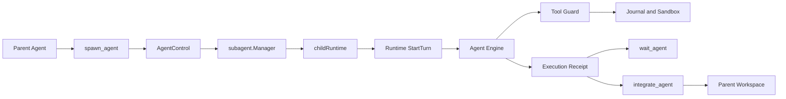

Current sources of truth:

| Capability | Current owner |
| --- | --- |
| Role, Stance, Depth, Parallel Budget | `internal/orchestration/subagent` |
| Model-visible Agent tools | `internal/adapter/tool/agent` |
| Child Session, Turn, and event pump | `internal/runtime/app/wire` |
| Writing-child worktree | `internal/runtime/app/wire` and platform Git capabilities |
| Merge preview and apply | `internal/adapter/tool/agent` |
| Runtime Turn, Receipt, and recovery | `internal/runtime/agent` and `internal/runtime/app` |
| VS Code Event projection | `extensions/vscode/src/chat/projector` |

### 2.2 Existing Strengths

1. A child is a real Runtime Turn, not an unguarded model request.
2. Consequential tools still pass through Policy, Approval, Constitution,
   Journal, and Sandbox.
3. Writing agents can be isolated in worktrees instead of mutating the parent
   workspace directly.
4. Results can refer to real Diff, Evidence, Verification, and Usage facts.
5. Depth, parallelism, token, cost, and wall-time limits already exist.
6. Agent tools share the Registry and Guard with ordinary tools, so there is no
   second privileged execution path.

### 2.3 Principal Gaps

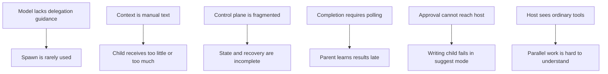

## 3. Goals, Non-Goals, and Principles

### 3.1 Goals

- Let the model distinguish local execution, reuse of a resident agent, and a
  new spawn.
- Give context forks structured, testable, budgeted semantics.
- Persist complete agent lifecycle, messages, results, and integration state.
- Deliver bounded completion automatically while retaining explicit wait.
- Route child approvals through existing Runtime Operations to the host.
- Preserve writing-child worktree isolation and atomic parent integration.
- Apply unified depth, authority, and tree budgets to nested agents.
- Project the same protocol facts in every host, with a complete VS Code view.
- Eliminate permanent false `running` state, lost completion, and duplicate
  apply after crash and restart.

### 3.2 Non-Goals

- The Runtime does not secretly create agents from keyword heuristics.
- Agent count is not a quality metric.
- Children never bypass Guard, Sandbox, Journal, or Verification.
- VS Code does not become a second orchestration control plane.
- Writing children do not share one directory by default.
- Parent transcripts and tool outputs are never copied without bounds.
- Unpublished persisted formats do not receive long-lived compatibility
  migrations.

### 3.3 Principles

1. **One Runtime:** parent and child differ only in Scope, Context, and
   Authority.
2. **Structured facts first:** state comes from Operations, Events, Receipts,
   and Projections.
3. **Authority only narrows:** child authority is the intersection of parent
   authority and role policy.
4. **Bounded result, addressable detail:** summaries enter the parent; full
   detail is loaded by handle.
5. **Parallel writes require ownership:** writing tasks declare owned paths or
   receive an exclusive worktree.
6. **Recovery is a normal path:** every asynchronous boundary defines its crash
   behavior.
7. **Hosts submit intent:** follow-up, interrupt, close, and integrate remain
   Runtime Operations.

## 4. Target Architecture

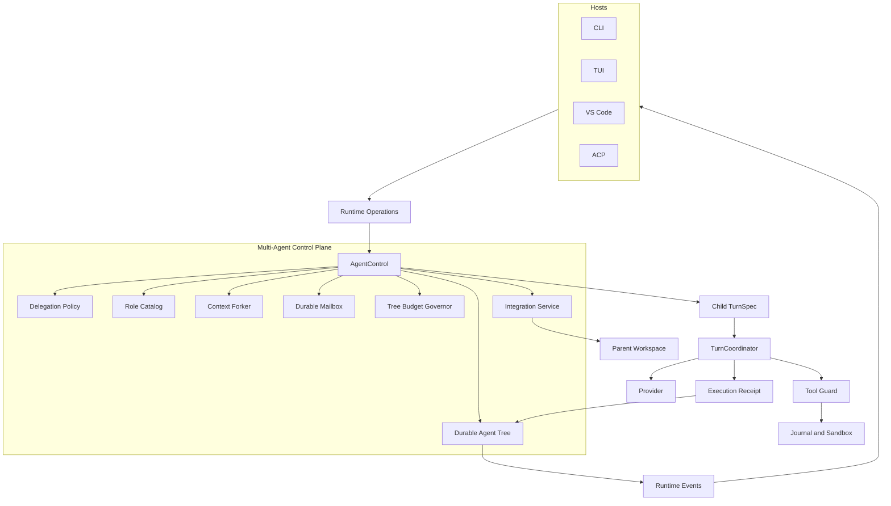

### 4.1 Package Ownership

| Package | Target responsibility |
| --- | --- |
| `internal/orchestration/subagent` | AgentControl, roles, policy, tree, mailbox, budgets, state machine |
| `internal/runtime/agent` | Execution semantics shared by parent and child Turns |
| `internal/runtime/app` | Agent Operation handlers, Events, terminal commit, recovery |
| `internal/runtime/app/wire` | Construct AgentControl, Context Forker, Child Factory, and stores |
| `internal/adapter/tool/agent` | Model-visible tool adapters only, with no business state |
| `internal/security` | Authority derivation and child approval policy |
| `internal/persist` | Agent Node, Message, Result, and Integration projections |
| `internal/runtime/eventview` | Host-independent Agent semantic views |
| `extensions/vscode` | Agent Tree, timeline, and operation projections |

`AgentControl` is the unified entry, but coordinates narrow interfaces rather
than becoming a service locator:

```go
type AgentControl struct {
    roles        RoleCatalog
    policy       DelegationPolicy
    contexts     ContextForker
    store        AgentStore
    mailbox      MailboxStore
    children     ChildTurnFactory
    budgets      TreeBudgetGovernor
    integrations IntegrationService
}
```

## 5. Delegation Policy and Spawn Timing

### 5.1 Policy Modes

```go
type DelegationMode string

const (
    DelegationDisabled DelegationMode = "disabled"
    DelegationExplicit DelegationMode = "explicit"
    DelegationAdaptive DelegationMode = "adaptive"
    DelegationCustom   DelegationMode = "custom"
)
```

| Mode | Behavior |
| --- | --- |
| `disabled` | Do not expose spawn capability to the model |
| `explicit` | Spawn only when the user, a Skill, or a trusted rule authorizes it |
| `adaptive` | The model may delegate under structured guidance; Runtime admission still applies |
| `custom` | Load workspace-managed delegation rules |

Initial rollout uses `explicit`. An `act` profile may opt into `adaptive` after
evaluation, cost, and false-positive thresholds are met. `bypass` is a
permission posture and never changes delegation mode by itself.

### 5.2 Spawn Decision

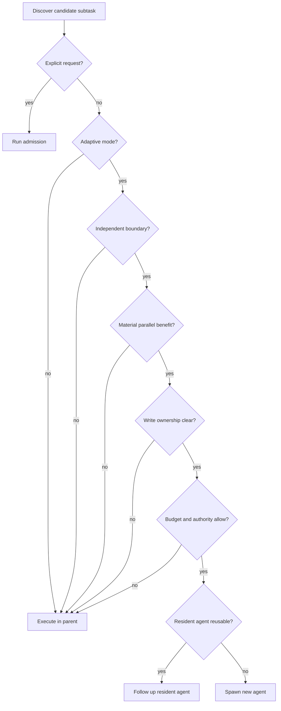

Good spawn candidates:

- two or more independent codebase questions;
- implementations in different packages with disjoint file ownership;
- independent review or verification while the parent has useful work;
- long waits delegated to an awaiter;
- an explicit request for independent perspectives or parallel execution.

Poor spawn candidates:

- a simple task requiring only a few tool calls;
- one linear critical path;
- a result the parent must immediately block on with no other work;
- work requiring frequent implicit-state sharing or edits to the same file;
- work requiring continuous user interaction;
- a task cheaper than spawn, context, and integration overhead.

### 5.3 Delegation Intent

Spawn accepts structured intent instead of only free text:

```go
type DelegationIntent struct {
    TaskName       string
    Role           RoleID
    Objective      string
    ExpectedOutput string
    OwnedPaths     []string
    ContextMode    ContextMode
    ParentAgent    AgentPath
    Limits         LimitOverride
}
```

Runtime admission validates role, depth, concurrency, tree budget, authority,
owned paths, workspace mode, and context budget. The model proposes delegation;
it does not grant it.

## 6. Tool Surface and Role Catalog

### 6.1 Tool API

Use tools with one clear semantic and familiar model priors:

| Tool | Meaning |
| --- | --- |
| `spawn_agent` | Create an asynchronous child |
| `send_message` | Enqueue a message without starting a Turn |
| `followup_task` | Give a resident agent another task and start a Turn |
| `wait_agent` | Wait for one agent or the next tree update |
| `list_agents` | Query a tree snapshot |
| `interrupt_agent` | Interrupt a running child Turn |
| `close_agent` | Release a resident Runtime and workspace |
| `integrate_agent` | Preview or apply child changes |

The pre-release unified `agent` tool and duplicate control tools are replaced,
not retained as a second long-lived surface.

### 6.2 Role Catalog

```go
type RoleSpec struct {
    ID               RoleID
    Description      string
    Prompt           string
    ModelRoute       string
    ReasoningEffort  string
    Stance           Stance
    AllowedTools     []string
    DefaultLimits    Limits
    CanDelegate      bool
    WorkspacePolicy  WorkspacePolicy
    OutputContract   OutputContract
}
```

Built-in roles:

| Role | Purpose | Default workspace |
| --- | --- | --- |
| `explorer` | Locate code and establish narrow facts | Read-only shared snapshot |
| `planner` | Cross-module design and risk analysis | Read-only shared snapshot |
| `implementer` | Implement within declared owned paths | Isolated worktree |
| `reviewer` | Independently review Result, Diff, and contracts | Read-only snapshot |
| `verifier` | Run checks and inspect evidence and failures | Snapshot or target worktree |
| `awaiter` | Wait for long-running work and summarize terminal state | No write |
| `general` | Explicit miscellaneous task, not adaptive default | Policy-defined |

Workspace role extensions are allowed but can never enlarge parent authority.

## 7. Context Forking and Task Capsules

### 7.1 Context Modes

```go
type ContextMode string

const (
    ContextFresh       ContextMode = "fresh"
    ContextTaskCapsule ContextMode = "task_capsule"
    ContextLastNTurns  ContextMode = "last_n_turns"
    ContextFull        ContextMode = "full"
)
```

`task_capsule` is the default. `full` requires explicit request or role policy.

### 7.2 Task Capsule

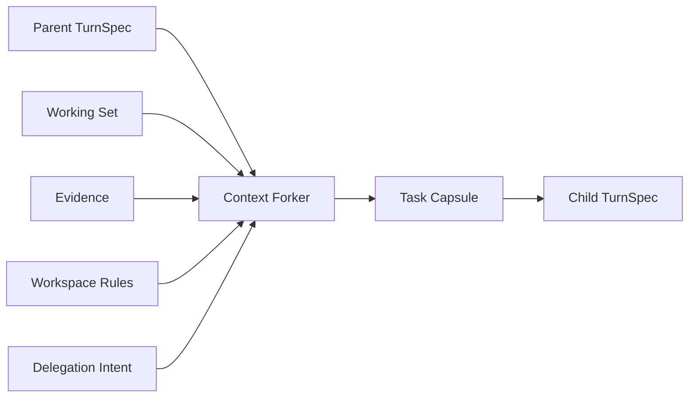

A Task Capsule contains:

- parent goal and current user request;
- child objective, expected output, and completion criteria;
- role prompt, authority snapshot, and limits;
- owned paths and relevant files;
- summaries and handles for verified evidence;
- applicable workspace rules;
- optionally the last N relevant Turns;
- explicit exclusions and prohibited actions.

It does not directly copy:

- unrelated parent transcript;
- complete tool output;
- secret values;
- unverified model reasoning;
- unrelated working-set entries;
- parent-only tool call/result pairs.

### 7.3 Context Receipt

Every fork produces a receipt:

```go
type ContextReceipt struct {
    Version       int
    Mode          ContextMode
    SourceThread  string
    SourceTurn    string
    Included      []ContextItem
    Excluded      []ContextItem
    Bytes         int
    MaxBytes      int
    TokenEstimate int
    MaxTokens     uint64
    Digest        string
}
```

`Digest` is the SHA-256 of the final capsule prompt. The receipt explains why a
child saw a file and proves that actual bytes and estimated tokens stayed within
the frozen budget.

## 8. Lifecycle and State Machine

### 8.1 Canonical Agent Path

Each agent has both an immutable ID and a readable path:

```text
/root
/root/explore_subagent
/root/explore_runtime
/root/implement_storage
/root/implement_storage/verify_recovery
```

Paths serve UI, logs, and message addressing. Stable IDs serve persistence and
idempotency.

### 8.2 State Machine

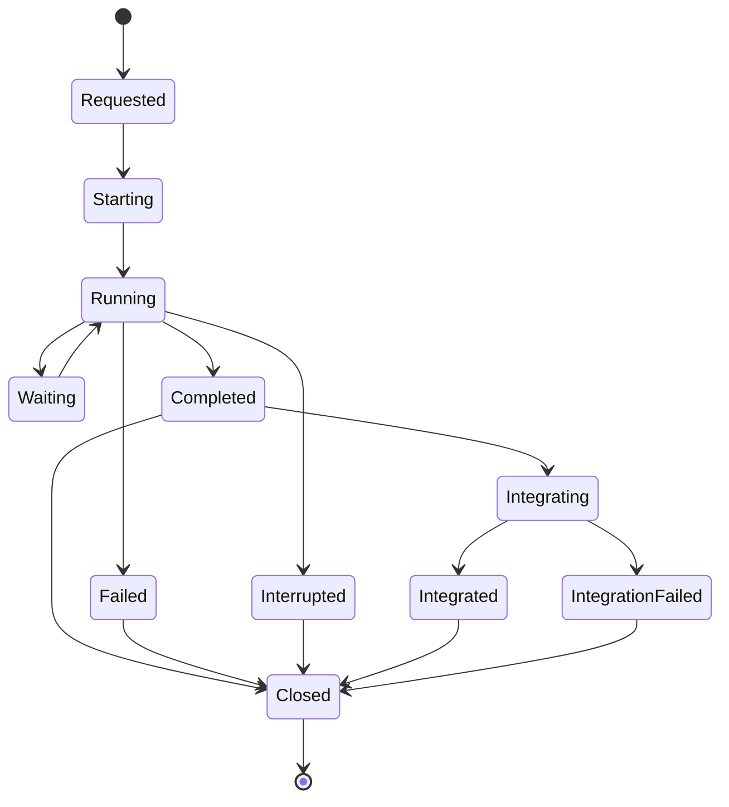

Each transition records a stable Operation ID, expected revision, source Agent
and actor, timestamp, reason, Event ID, and any Receipt or Problem handle.
Compare-and-swap in the store rejects invalid transitions; in-memory locking is
not sufficient.

## 9. Mailbox, Follow-Up, and Result Delivery

### 9.1 Message Model

```go
type AgentMessage struct {
    ID          string
    Sequence    uint64
    From        AgentPath
    To          AgentPath
    Kind        MessageKind
    PayloadRef  string
    TriggerTurn bool
    CreatedAt   time.Time
    DeliveredAt *time.Time
}
```

- `send_message` only queues context or status;
- `followup_task` queues work that starts another Turn;
- completion, approval, interrupt, and integration results use system kinds;
- sequence increases monotonically within an Agent Mailbox;
- delivery is at least once and consumers deduplicate by Message ID.

### 9.2 Automatic Completion

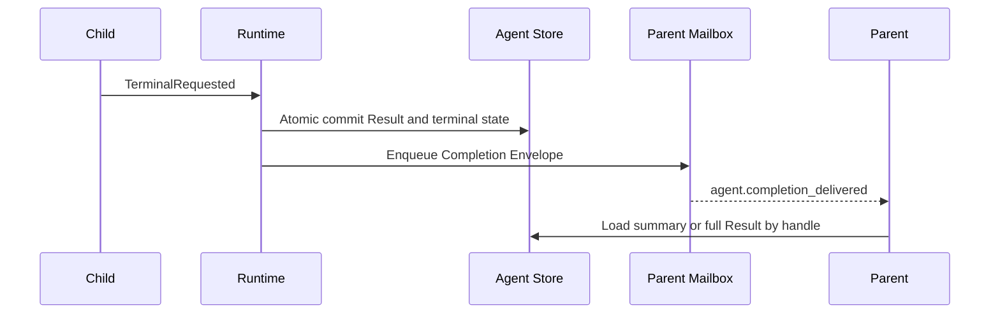

The envelope is bounded:

```go
type CompletionEnvelope struct {
    AgentPath        AgentPath
    Status           AgentStatus
    Summary          string
    ResultRef        string
    ReceiptRef       string
    ChangedPaths     []string
    Verification     VerificationSummary
    Usage            UsageSummary
    IntegrationReady bool
}
```

`wait_agent` remains useful for explicit synchronization and external hosts,
but is no longer the only path to terminal results.

## 10. Durable Agent Tree and Recovery

### 10.1 Persistence Model

| Projection | Principal fields |
| --- | --- |
| `agent_nodes` | ID, Path, Parent, Thread, Role, Status, Depth, Workspace, Base Revision |
| `agent_messages` | Sequence, From, To, Kind, Payload Ref, Delivery |
| `agent_results` | Terminal Turn, Summary, Receipt Ref, Usage, Verification |
| `agent_integrations` | Candidate, Preview Digest, Conflict, Approval, Apply Receipt |
| `agent_budget_ledger` | Reserved, Spent, and Released Token/Cost/Time slots |

Runtime Events are facts; relational tables are query and recovery projections.
Critical state and terminal results commit in one SQLite transaction.

### 10.2 Restart Reconciliation

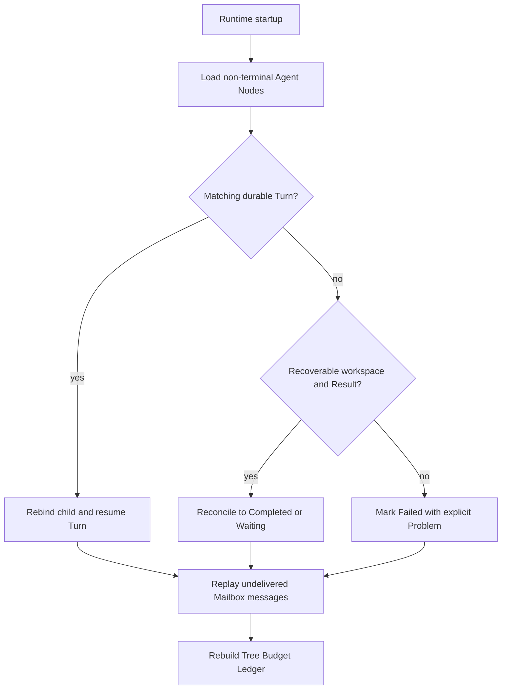

Recovery covers crashes around spawn commit, accepted StartTurn, result commit,
completion delivery, orphaned worktrees, integration preview, journaled apply,
and close. It must not leave false running state, restart completed children,
double-charge budgets, duplicate non-idempotent follow-up, or reapply a diff
without validation.

## 11. Authority, Approval, and Security

### 11.1 Authority Derivation

```text
Child Authority =
    Parent Authority
    ∩ Role Tool Policy
    ∩ Workspace Policy
    ∩ Delegation Policy
    ∩ Session Constitution
```

`bypass` skips ordinary interaction only for locally permitted actions. It does
not bypass Constitution, required Sandbox strength, secret policy, or workspace
boundaries.

### 11.2 Child Approval Proxy

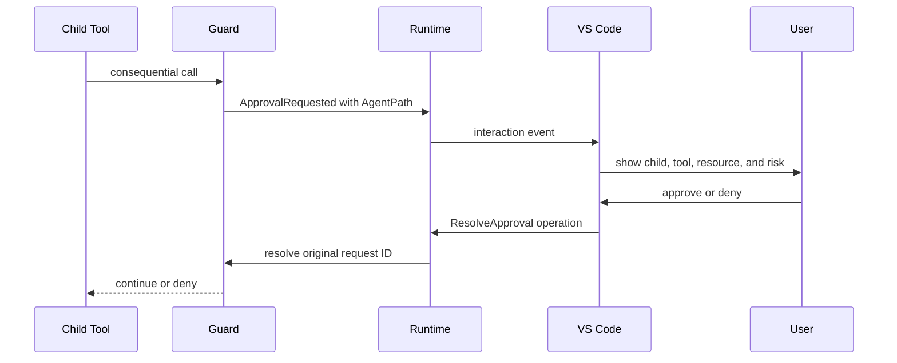

The UI shows parent and child paths, role and objective, tool, resource, risk,
workspace, worktree isolation, authority provenance, and memory scope. Children
do not create a second approval protocol, and recovery preserves the original
Request ID.

## 12. Workspace Isolation and Integration

### 12.1 Workspace Policy

| Stance | Default |
| --- | --- |
| Read-only | Shared Snapshot |
| Write with disjoint paths | Isolated Worktree |
| Write without ownership | Reject adaptive spawn |
| Serialized compatibility work | Same Workspace Serialized, explicitly enabled |

### 12.2 Integration Pipeline

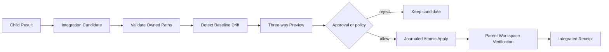

`integrate_agent` supports `preview`, `apply`, `discard`, and `retry`. Apply is
bound to a Preview Digest so content cannot change between review and apply.
Default policy does not auto-apply. A future `auto_verified_disjoint` policy
requires disjoint ownership, no baseline drift, passed child verification,
explicit parent policy, passed parent verification, and journal recovery.

## 13. Nested Agents and Tree Budgets

A child receives a scoped view of the same AgentControl instead of constructing
another Manager:

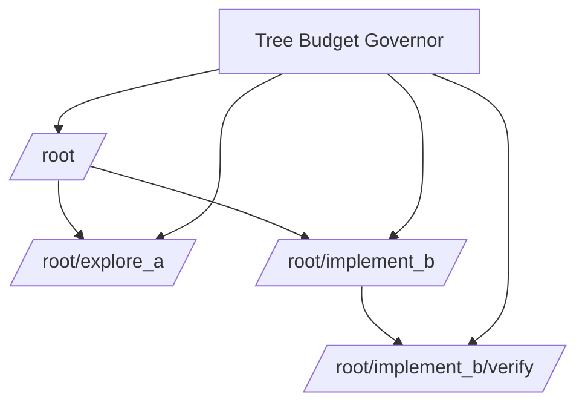

| Level | Limits |
| --- | --- |
| Per Agent | Steps, Tokens, Cost, Wall Time, Tool Spend |
| Agent Tree | Running, Resident, Total Spawn, Depth, Tokens, Cost, Wall Time |

A child can only narrow the remaining parent budget. Reservation occurs at
spawn; terminal or close settles and releases it. The budget ledger is durable.

Proposed initial defaults:

```toml
[execution.subagent]
delegation = "explicit"
max_depth = 3
max_parallel = 4
max_resident = 8
max_total = 16
default_context = "task_capsule"
max_steps = 24
max_tokens = 0
max_cost_usd = 0
wall_time = "10m"
workspace = "auto"
completion_summary_tokens = 800
```

## 14. VS Code Information Architecture

### 14.1 Three Presentation Layers

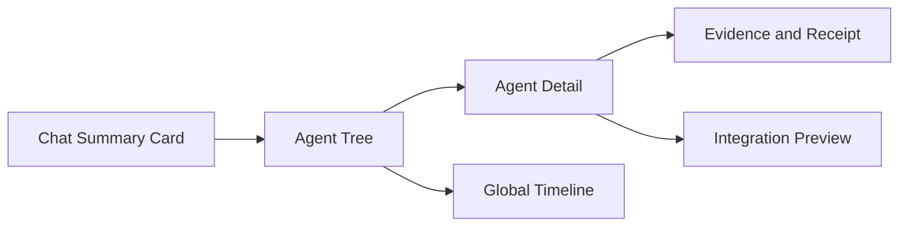

1. **Chat Summary Card:** counts, status, important completion, and failures.
2. **Agent Tree:** parent/child topology, role, task, state, timing, and budget.
3. **Agent Detail:** the structured timeline for one agent.
4. **Global Timeline:** all agent events ordered by wall clock and optionally
   displayed as parallel lanes.

Example tree:

```text
root                                      running
├── explore/subagent                      completed  43s
├── explore/runtime                       completed  37s
└── implement/persistence                 running    step 11/24
    └── verify/recovery                    waiting    approval
```

Nodes expose path, role, objective, status, current step, last tool, token,
cost, wall time, workspace, worktree, owned paths, approval, verification,
integration, Result, Receipt, Diff, and Trace links.

### 14.2 Timeline Contract

```go
type AgentTimelineEvent struct {
    Sequence    uint64
    Timestamp   time.Time
    AgentPath   string
    ParentPath  string
    ThreadID    string
    TurnID      string
    OperationID string
    Kind        EventKind
    Summary     string
    DetailRef   string
    Duration    time.Duration
}
```

Core events:

```text
agent.requested
agent.spawned
agent.status_changed
agent.message_sent
agent.turn_started
agent.tool_started
agent.tool_completed
agent.approval_requested
agent.evidence_added
agent.result_committed
agent.completion_delivered
agent.integration_started
agent.integrated
```

Event Traits continue to generate Go, schema, TypeScript, and golden artifacts
from one manifest. The VS Code projector uses Event Class and Traits and never
infers status from free text.

Timeline details, Diff, and Receipt content load lazily. A snapshot carries
`last_sequence`, incremental replay follows, and virtual lists protect the
Extension Host from large sessions. UI controls only submit Runtime Operations.

## 15. Protocol and Configuration Impact

Proposed Operations:

```text
SpawnAgent
SendAgentMessage
FollowupAgent
WaitAgent
InterruptAgent
CloseAgent
PreviewAgentIntegration
ApplyAgentIntegration
```

Model tool adapters and hosts call the same Application ports. Agent Events
carry Agent ID, Path, Parent, Session, Thread, Turn, Operation ID, Causation ID,
Revision, Sequence, Traits, bounded summary, and detail handle.

Every new configuration field enters the complete `internal/config` default,
TOML, environment, validation, and provenance chain. VS Code does not maintain
independent defaults.

## 16. Implementation Plan

The upgrade is delivered as six independently accepted changes. Each uses a
semantic branch and merges with `--no-ff`. There is no hard zero-net-production-
line gate. Persistence, protocol, and recovery may add necessary code, but
duplicate control planes cannot remain indefinitely.

### MA1: Unified Control Plane and Model Discoverability

Deliver AgentControl, DelegationPolicy, DelegationIntent, admission, Role
Catalog, the new tool surface, explicit model instructions, and
characterization tests. Exit when explicit prompts reliably spawn asynchronous
explorers, simple fixtures do not spawn, adapters own no lifecycle state, and
the old tool surface is removed.

Implementation status (2026-08-13): `completed`.

- AgentControl, delegation policy, the role catalog, eight independent Agent
  tools, prompt instructions, and the complete configuration chain are live.
- The unified `agent` tool and legacy `agent_*` names are removed.
- `make vscode-subagent-integration` submits this explicitly authorized prompt
  through a real VS Code Electron Extension Host:

  ```text
  Explicitly delegate two read-only explorers to inspect independent aspects
  of context.ts. Use two spawn_agent calls now, then report that both
  delegated tasks started.
  ```

- The scenario verifies two Chat approvals, parent `turn.completed`, two
  `agent.spawned` events, and two child `agent.status=completed` events.
- Acceptance also fixed persistent child thread seeding, atomic Agent Event
  sequence allocation, one durable and live event publication path, and macOS
  `/var` path canonicalization.
- Agent Events currently carry the Runtime hook session identity. Exact
  attribution to the originating ACP Chat Session belongs to the MA3 Durable
  Agent Tree and is not fabricated in MA1.

### MA2: Context Forking and Task Capsules

Deliver all context modes, a frozen parent snapshot, Context Receipt, budgets,
redaction, and removal of manual `parent_context`. Exit when goldens prove
inclusion and exclusion, tool call/result pairs remain valid, secrets and
irrelevant outputs do not leak, and capsules have deterministic limits.

Implementation status (2026-08-13): `completed`.

- The parent Runtime freezes a structured snapshot from the current TurnSpec,
  history, working set, evidence, and prompt partitions. Provider reasoning,
  opaque data, images, and search payloads do not enter the snapshot.
- Runtime injects the authoritative parent Thread and Turn identity into tool
  context. Context lookup reads only an existing Engine, TurnSpec freezes
  parent history, and unknown Threads or missing/drifted Turns fail closed.
- `spawn_agent` produces `task_capsule` by default, legacy `fork_context` and
  `parent_context` fields are removed, and model spawns and durable workers use
  the same capsule path.
- Unit and race coverage protects redaction, complete tool call/result pairs,
  UTF-8-safe truncation, stable ordering, deterministic budgets, and SHA-256
  digests. Model-provided `task_name` is also redacted and bounded.
- A four-mode golden freezes inclusion, exclusion, complete tool pairs, and
  secret redaction for `fresh/task_capsule/last_n_turns/full`; `full` accepts
  only an explicit trigger or role policy.
- A durable-worker contract test freezes capsule mode, digest, and budgets in
  the persisted worker result.
- `go test ./...`, focused `go test -race`, the ACP Protocol Contract, the
  43/43 Architecture Ratchet, VS Code check and 220 tests, documentation, and
  book gates pass.
- `make vscode-subagent-integration` verifies two asynchronous explorers,
  parent `source_turn`, the real `user_request`, default `task_capsule`, its
  digest, and `bytes <= max_bytes` in real Electron.

### MA3: Durable Agent Tree and Automatic Completion

Deliver Node, Mailbox, Result, and Budget Ledger stores, CAS revisions, atomic
terminal result plus completion outbox, startup reconciliation, and canonical
paths. Exit when every MA3-owned crash point converges to one state, completion
is durable and idempotent, false running state is absent, and wait observes the
same facts.

Implementation status (2026-08-13): `completed`.

- Schema V2 uses `agent_nodes`, `agent_messages`, `agent_results`, and
  `agent_budget_ledger`; no pre-release compatibility migration is introduced.
- Canonical Agent Path, Revision, stable Operation ID, actor, reason, Event ID,
  and SQLite CAS form the only state-machine write path.
- Terminal Result, budget settlement, and Completion Outbox commit in one Agent
  Event transaction. The outbox publishes idempotently by Message ID.
- Mailboxes provide per-target sequence and at-least-once `Receive/Ack`.
  `send_message` only queues, while `followup_task` starts a Turn only after its
  Task Message is durable.
- Startup reconciliation covers spawn commit, accepted StartTurn,
  result/outbox, unacknowledged completion, false running state, orphaned
  worktree, and close. Integration preview/apply crash points belong to MA5.
- A post-acceptance recovery audit now rebuilds active child Turn observation
  and starts the Runtime event pump before interrupted operations replay. A
  recovered `waiting` child therefore resumes and settles instead of remaining
  a false active node.
- ACP and VS Code Agent views expose path, parent path, revision, and thread.
  Real Electron verifies automatic completion from two children without a
  parent `wait_agent` call.
- `go test ./...`, focused race tests, ACP/protocol contracts, the 43/43
  Architecture Ratchet, VS Code check, and all 220 tests pass.

### MA4: Authority and Approval Proxy

Deliver authority derivation, child approval routing, source-aware host UI,
restart recovery, and contract tests for all postures. Exit when a writing child
can wait in `suggest`, authority never expands, request IDs survive restart, and
denial produces a structured Problem.

Implementation status (2026-08-13): `completed`.

- Permission derivation clamps every posture with
  `never < suggest < auto < bypass`; unknown values fail closed. A child gets
  only the parent tool catalog intersected with its Role Contract, and each
  child owns an independent approval cache.
- `approval.required` and `approval.resolved` carry canonical Agent source,
  role, Session, and host workspace identity. ACP and VS Code project only
  source-bound child interactions across unbound child Threads.
- The host submits the original Request ID through the parent Session. Runtime
  resolves the durable pending request, rewrites Thread and Turn to the child,
  preserves the decision Item identity, and transitions the Agent
  `running -> waiting -> running`.
- Pending Guard requests, Runtime pending approvals, and waiting Agent nodes
  survive restart. Denial emits a structured Problem and child-readable
  `approval_denied` tool feedback.
- A post-acceptance recovery contract drives the production `ThreadManager`
  path: recovered Approval/Input waits rebuild the Turn Kernel and request
  ledger without duplicate host events, preserve the original Request ID, and
  safely queue a decision that arrives before Tool replay reaches its wait.
- VS Code approval cards and the Approvals Tree identify the Agent path, parent
  path, and role. Real Electron verifies a writing child waits under `suggest`,
  receives a parent-proxied decision, resumes, verifies its change, and
  completes without a parent `wait_agent` call.
- All Go tests, focused race tests, Protocol Contract, the 43/43 Architecture
  Ratchet, VS Code check, all 222 tests, docs checks, and the Electron scenario
  pass.

### MA5: Workspace Integration and Nested Agents

Deliver Integration Candidate, Preview Digest, owned paths, baseline drift,
parent verification, scoped nested control, and persistent tree budgets. Exit
when disjoint changes integrate independently, same-path conflict fails before
apply, stale previews cannot apply, and limits govern the full tree.

Implementation status (2026-08-13): `completed`.

- `integrate_agent` now exposes `preview`, `apply`, `discard`, and `retry`.
  Preview persists an immutable Candidate and exact changes; Apply requires its
  SHA-256 Preview Digest and regenerates the plan before Guard authorization.
  Child content, Result Turn, selected paths, or parent baseline drift makes the
  old digest fail closed before a workspace write.
- Owned Paths and live write claims reject out-of-scope or same-path changes.
  Disjoint candidates remain independently previewable and apply through the
  existing Guard resource claims, Workspace Journal, expected-write
  fingerprints, and atomic file transaction.
- `agent_integrations` projects Candidate revisions and
  `previewed -> applying -> applied|failed` or `previewed -> discarded`.
  Startup reconciliation converges interrupted Apply to explicit failure after
  Journal recovery, and completes an already-applied Candidate whose Agent
  status commit was interrupted. Owned Paths and write claims also rebuild
  after restart.
- Apply records an Integration Receipt with changed paths, apply time, and
  Parent Workspace Verification. A failed or unavailable verification verdict
  remains distinct from whether bytes were applied.
- A nested caller is resolved from authoritative Child Thread identity.
  Parent ID forgery and sibling or ancestor control fail closed; a Child may
  operate only its descendant subtree. Delegating roles retain Agent lifecycle
  tools without gaining ordinary write tools, read-only descendants inherit
  the parent worktree, and descendant integration targets that parent
  workspace.
- Tree admission durably enforces depth, active parallelism, resident nodes,
  total spawns, and token/cost reservations. Each Child may only narrow its
  Parent step/token/cost ceiling; terminal and close release reservations while
  spend and total spawn remain charged across restart.
- The generated `agent.integration` retained Event is shared by Go, JSON
  Schema, ACP, and TypeScript. VS Code replays Candidates and Receipts, renders
  nested Agent nodes as a real tree, and shows digest, paths, conflicts,
  verification, and applied changes beneath the owning Agent.
- Unit and persistence contracts cover stale Child and Parent previews,
  pre-Apply same-path conflict, discard/retry, Parent Verification, Candidate
  CAS, applying/applied crash recovery, nested scope, inherited execution root,
  and persistent Tree Budget admission.
- Serial `go test -p 1 ./...`, focused Race, Protocol Contract, 43/43
  Architecture Ratchet, VS Code check and all 223 tests, docs/book gates, and
  `make vscode-subagent-integration` pass. Real Electron verifies one Parent
  Turn executes `spawn -> wait -> child approval proxy -> preview -> apply ->
  parent verify -> complete` in a Git worktree and observes
  `previewed -> applying -> applied`, `integrated`, and the final parent file.

### MA6: Host Projection, Evaluation, and Rollout

Deliver Event Traits and schema, Go eventview, VS Code Tree/Detail/Timeline, a
compact TUI tree, Multi-Agent evaluation packs, live-provider smoke, and
performance baselines. Exit when hosts agree, VS Code replay is continuous,
large streams stay bounded, and explicit/adaptive evaluations meet thresholds.

Implementation status: `completed` (2026-08-13).

- `eventview.AgentUpdate` is the typed Go Host projection for all retained
  `agent.*` Events. CLI and TUI now accept workspace Agent Events across Child
  Threads, route Child approvals by the Event's authoritative Thread/Turn, and
  terminate only on the Parent Turn. ACP forwards the same workspace-scoped
  facts, including Integration, without binding fake Child sessions.
- TUI renders a canonical-path compact tree plus a bounded 64-entry timeline.
  VS Code reconstructs nested Agent nodes, Integration receipts, a 512-entry
  Global/per-Agent Timeline, and at most 256 Integration candidates. Monotonic
  Workspace sequence handling prevents replay/live overlap from duplicating
  Timeline rows or regressing terminal Agent state after restart.
- The existing production Runtime benchmark now supports declarative
  Multi-Agent scenarios. `make multi-agent-eval` runs Parent-local,
  Explicit-parallel, and Adaptive-parallel fixtures and fails closed against
  checked-in thresholds: Explicit/Adaptive compliance, local execution, Child
  completion, and parallel admission are 100%; false Spawn is 0%.
- Runtime telemetry derives Spawn, terminal outcome, completion latency,
  Integration outcome, and Child cost directly from successfully published
  Agent Events. `delegation=disabled|explicit|adaptive` remains the sole Spawn
  kill switch and rollout control.
- VS Code processes 10,000 Agent Events under the 1-second/32-MiB budget while
  retaining 512 Timeline rows. The measured local projection was below 4 ms.
  The complete VS Code suite has 226 tests (222 passed, 4 environment-gated).
- `make deepseek-multi-agent-smoke` uses the guarded owner-environment wrapper
  without persisting or printing credentials. The real DeepSeek run spawned
  exactly two `context_mode=fresh` Explorer Children concurrently, observed two
  completed Child results, waited, closed them, and completed the Parent in
  about 21.5 seconds. `make vscode-subagent-integration` also passed the real
  Electron Spawn/Approval/Integration workflow.

## 17. Verification System

### 17.1 Test Layers

| Layer | Coverage |
| --- | --- |
| Unit | Policy, role, context, transitions, budget, messages |
| Contract | Operation/Event, store, authority, integration, traits |
| Integration | Parent/child Runtime, worktree, approval, recovery |
| Race | Spawn/settle/close, mailbox, budget, Event replay |
| Fault injection | Transaction, outbox, worktree, and apply crash points |
| VS Code | Tree, timeline, approval, Result, restart |
| Live model | Delegation quality, context quality, parallel benefit, false spawn |

### 17.2 Scenario Matrix

| Scenario | Expected result |
| --- | --- |
| One simple file query | Parent executes locally |
| Two independent package investigations | Two explorers run concurrently |
| Two disjoint file changes | Two worktrees, independently previewable |
| Two agents edit one file | Admission rejection or integration conflict |
| Child requests shell approval | Host shows child source and can recover |
| Child completes while parent is busy | Completion remains in Mailbox |
| Crash after Result commit | Restart delivers one logical completion |
| Crash during integration apply | Journal converges to an explicit state |
| Nested child exceeds depth | Structured admission rejection |
| Tree exceeds token budget | No new spawn; committed results remain valid |

### 17.3 Real VS Code Explorer Prompt

```text
This is a Multi-Agent acceptance test. I explicitly authorize and require
subagent use.

Use spawn_agent to start two explorer children concurrently:
A. Inspect state and persistence boundaries in internal/orchestration/subagent.
B. Inspect child Turn startup and terminal delivery in internal/runtime/app/wire.

Use task_capsule rather than copying full history. When both finish, summarize
Agent Path, elapsed time, key files, and Result Handle. The parent must not
repeat research already completed by a child.
```

### 17.4 Real VS Code Writing Prompt

```text
This is a writing Multi-Agent acceptance test. Use bypass posture while
preserving Guard, Sandbox, Journal, and worktree boundaries.

Start one implementer child and create the requested proof file in an isolated
worktree. After completion, run integrate_agent preview. Apply only after owned
paths, baseline drift, and verification are clean. Verify the file in the parent
workspace and show the Agent Timeline and Integration Receipt.
```

### 17.5 Standard Commands

```bash
go test ./internal/orchestration/subagent/... \
  ./internal/adapter/tool/agent/... \
  ./internal/runtime/app/...
go test -race ./internal/orchestration/subagent/... \
  ./internal/runtime/app/...
make architecture-ratchet
make protocol-contract
make vscode-check
make vscode-test
make vscode-runtime-integration
make docs-check
make book-check
git diff --check
```

## 18. Metrics and Release Gates

Correctness:

- explicit scenarios create the requested number of children;
- simple-task evaluations do not create meaningless children;
- terminal Result, Completion, and Integration are neither lost nor applied
  twice;
- non-terminal agents converge to explainable state after restart;
- authority escalation has zero tolerance.

Efficiency:

- measure wall-clock parallel benefit, not agent count;
- compare Task Capsule tokens with full forks;
- record spawn overhead, idle wait, and integration cost;
- treat adaptive delegation as successful only when total time or quality
  improves.

Experience:

- child transcripts do not flood Chat;
- complete Receipt is at most two interactions away from a summary;
- Agent Tree matches Runtime Snapshot;
- Global Timeline explains Spawn, Wait, Approval, Failure, and Integration.

## 19. Rollout and Compatibility

1. Place MA1 through MA5 behind a feature flag with `explicit` as default.
2. Enable hermetic fixtures and internal VS Code first.
3. Generate pre-release durable-store changes through repository commands
   without hand-written compatibility migrations.
4. Observe spawn rate, completion latency, failure, cost, and user interrupt.
5. Open Agent Tree to every host after recovery and projection gates pass.
6. Roll out `adaptive` as profile opt-in before considering broader defaults.
7. On recovery, security, or integration regression, disable new spawn while
   retaining read access to existing Agent Trees.

## 20. Risks and Mitigations

| Risk | Mitigation |
| --- | --- |
| Excessive spawning | Explicit default, adaptive evaluation, admission, tree budgets |
| Insufficient child context | Task Capsule Receipt, follow-up, relevant working set |
| Oversized child context | Capsule default, detail handles, token gates |
| Parallel write conflict | Owned paths, worktrees, baseline drift, Preview Digest |
| Approval blocks progress | Durable approval, unrelated parent work, timeline status |
| Ghost agents after crash | Durable state machine and startup reconciliation |
| Completion floods parent | Bounded envelope, mailbox priority, lazy detail |
| VS Code performance regression | Snapshot plus replay, virtual lists, lazy handles |
| Duplicate control planes | Remove old paths in MA1 and enforce ownership tests |

## 21. Final Acceptance Definition

The architecture is mature only when all of the following hold:

1. Explicit authorization reliably spawns; simple tasks reliably stay local.
2. Adaptive delegation uses explainable admission, not keyword heuristics.
3. Children use structured context forks with Context Receipts.
4. Every child is a fully governed Turn and cannot gain authority.
5. Completion reaches the parent durably, automatically, and idempotently.
6. Agent Tree, Mailbox, Result, and budgets agree after restart.
7. Writes enter the parent only through worktrees and Integration Service.
8. CLI, TUI, VS Code, and ACP project the same protocol facts.
9. VS Code clearly presents Agent Tree, per-agent timeline, and global timeline.
10. Contract, race, fault-injection, Electron, and live-provider checks pass.

Only then does CodeHelper move from providing a subagent tool to operating a
usable, governed, recoverable, and observable Multi-Agent runtime.
