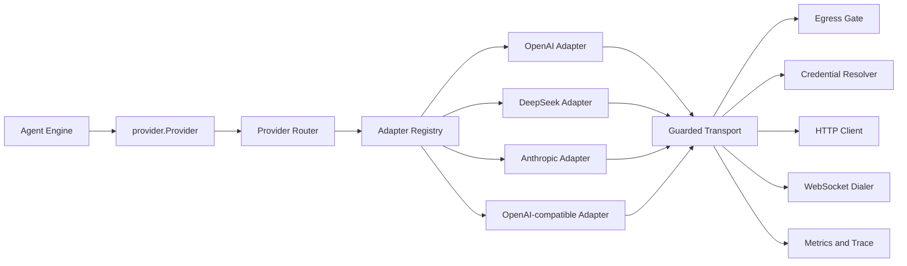

# Provider Architecture Upgrade

[Simplified Chinese](../zh-CN/provider-architecture-upgrade.md) | English

> Status: P6 `accepted`. Versioned evidence:
> [`provider-architecture-p0-baseline.json`](../provider-architecture-p0-baseline.json)
> [`provider-architecture-p1-evidence.json`](../provider-architecture-p1-evidence.json),
> [`provider-architecture-p2-evidence.json`](../provider-architecture-p2-evidence.json),
> [`provider-architecture-p3-evidence.json`](../provider-architecture-p3-evidence.json),
> [`provider-architecture-p4-evidence.json`](../provider-architecture-p4-evidence.json),
> [`provider-architecture-p5-evidence.json`](../provider-architecture-p5-evidence.json),
> and [`provider-architecture-p6-evidence.json`](../provider-architecture-p6-evidence.json).
>
> Scope: model route metadata, provider-neutral request and stream contracts,
> wire adapters, HTTP and WebSocket transport, DeepSeek-specific behavior,
> provider failures, retry ownership, replay state, usage accounting,
> diagnostics, fixtures, and acceptance gates.
>
> Reference: DeepSeek Harness `0.1.0-rc.5`, upstream commit
> `47f943859bef60e4160492346772ded9b24f765a`.

## 1. Executive Summary

CodeHelper currently has a sound provider-neutral Engine boundary:
`provider.Provider.Stream(context.Context, ModelRequest)` returns a normalized
`provider.Stream`. The implementation behind that boundary is not separated
cleanly enough.

`internal/adapter/provider/httpclient.Client` currently owns all of these
responsibilities:

1. concurrency and rate limits;
2. credential resolution and authentication headers;
3. egress-gated HTTP execution;
4. request retry and backoff;
5. OpenAI Chat serialization;
6. OpenAI Responses serialization;
7. Anthropic serialization;
8. OpenAI and DeepSeek compatibility conditions;
9. stream decoder selection;
10. Responses WebSocket continuation;
11. HTTP failure classification;
12. idle timeout and health accounting; and
13. redacted diagnostic dumps.

The result is a 1,117-line production file whose generic OpenAI paths contain
DeepSeek-only behavior. A provider-specific fix can therefore change request
bytes, cache prefixes, replay behavior, or error semantics for unrelated
OpenAI-compatible routes.

This upgrade introduces four explicit layers:

```text
Engine logical request
        |
        v
Provider Router (AdapterID selection)
        |
        v
Provider-owned Wire Adapter
        |
        v
Single-attempt guarded Transport
        |
        v
Provider-normalized Stream / Failure
```

DeepSeek becomes a first-class adapter with two wire modes:

- DeepSeek Chat Completions for `deepseek-chat` and
  `deepseek-reasoner`;
- DeepSeek Responses for the current `deepseek-v4-flash` route.

The change does not add another model loop, provider side channel, or Host
execution path. The Engine continues to depend only on
`provider.Provider`; construction remains in `internal/runtime/app/wire`;
egress, credentials, usage, traces, and durable Turn effects remain mandatory.

## 2. Goals

The upgrade must:

1. isolate provider semantics from shared transport;
2. route through explicit adapter metadata, never provider or model name
   heuristics;
3. give DeepSeek one authoritative request, stream, usage, and failure
   implementation;
4. keep one network attempt visible to one durable Provider attempt;
5. preserve provider-private replay data only for its owning adapter;
6. make every provider failure machine-routable without parsing human text in
   the Engine;
7. preserve complete logical requests while keeping transport optimizations
   capability-gated;
8. keep credentials as references and preserve egress enforcement;
9. improve conformance tests from substring checks to exact wire contracts;
10. delete displaced generic branches, avoid unnecessary duplication, and
    record production-size trends without using net line growth as a
    correctness gate; and
11. pass the architecture ratchet and add Provider-specific hotspot limits.

## 3. Non-Goals

This upgrade does not:

- replace the Runtime, Turn Kernel, or Agent Engine;
- adopt an "everything is a plugin" runtime;
- let provider plugins bypass policy, approval, journal, sandbox, or egress;
- infer providers from model names;
- enable incremental Responses for DeepSeek;
- claim token savings from request-byte savings;
- introduce a public provider SDK;
- add automatic model discovery;
- add pre-release compatibility migrations;
- move provider execution into CLI, TUI, VS Code, or ACP; or
- replace deterministic CodeHelper compaction with model-written summaries.

## 4. Current Implementation Audit

### 4.1 What Is Already Correct

The following foundations should be retained:

- `provider.ModelRequest` is provider-neutral and validates route, capability,
  image, tool, reasoning, output, and cache requirements.
- `provider.StreamEvent` normalizes text, reasoning, tool calls, search,
  citations, usage, response state, and terminal reasons.
- `provider.Usage` explicitly treats cached input as a subset of total input
  and reasoning as a subset of total output.
- `model.ReadyRoute` prevents callers from constructing unresolved routes.
- `model.RouteSet` freezes per-purpose route selection.
- `TurnSpec` freezes route, policy, context, tools, and extension snapshots for
  one Turn.
- `EffectSampleProvider` is a durable Turn effect.
- egress is fail-closed and constructed before the provider.
- credentials are references to environment, file, or keyring entries.
- large provider diagnostics are redacted before being written.
- incremental Responses transport is capability-gated and falls back to a
  complete logical request.

### 4.2 Responsibility Concentration

The main concentration is `internal/adapter/provider/httpclient/client.go`.
Encoding is selected only by `WireProtocol`, so a provider dialect cannot own
its own rules without adding conditions to a shared encoder.

The same concrete `*httpclient.Client` is stored in `providerBuildState` and is
used by both the Engine and model-sampling tools. This leaks the transport
implementation into the composition output instead of publishing the narrow
`provider.Provider` interface.

The model probe also constructs `httpclient.Client` directly. Consequently,
production sampling and probing can diverge when a new provider requires a
specialized adapter.

### 4.3 Route Metadata Conflates Two Axes

`model.ProviderKind` currently contains:

- `openai` and `anthropic`, which describe provider semantics;
- `local` and `custom`, which describe deployment origin.

DeepSeek and OpenRouter are therefore both `custom`, even though they require
different wire behavior. `WireProtocol` says Chat, Responses, or Anthropic, but
does not identify the provider dialect inside an OpenAI-compatible protocol.

This is why DeepSeek-only behavior appears in generic OpenAI code.

### 4.4 DeepSeek Conditions in Generic Code

The shared request encoder currently:

- emits `reasoning_content` for every assistant message with reasoning;
- inserts a DeepSeek reasoning placeholder before Responses function calls;
- accepts DeepSeek-specific Responses native-search spelling;
- drops or reconstructs reasoning items according to DeepSeek Responses
  failures observed in live traffic.

These rules are useful for DeepSeek but not authoritative for every
OpenAI-compatible endpoint. In particular, sending reasoning from
tool-call-free Chat turns adds input that the official DeepSeek passback rule
does not require.

### 4.5 Stream Contract Gaps

The generic Chat stream:

- accepts EOF after a `finish_reason` even without `[DONE]`;
- drops SSE comments without reporting transport activity;
- does not classify a successful stop with no content or tool calls as an
  empty response;
- reads `prompt_tokens_details.cached_tokens`, but not DeepSeek's native
  `prompt_cache_hit_tokens`; and
- maps in-stream failures to unstructured errors.

An empty successful response can reach completion policy as ordinary output
and trigger a completion repair instead of provider recovery.

### 4.6 Failure Classification Is Too Coarse

Non-2xx responses currently become:

- `invalid_argument` for most non-429 4xx responses;
- `unavailable` for other statuses.

The response stores HTTP status and rate-limit headers, but loses stable
provider facts such as:

- authentication failure;
- exhausted quota or balance;
- context-window overflow;
- invalid request;
- transient rate limit;
- server failure;
- provider request ID;
- malformed stream;
- truncated stream; and
- empty completion.

The Engine therefore cannot make a precise recovery decision without parsing
the human message.

### 4.7 Retry Has Two Owners

`httpclient.Client` retries transport failures and selected HTTP statuses.
`Engine.modelStep` separately retries failures that occur before meaningful
stream output.

The effective network-attempt budget can multiply across the two layers.
HTTP-level attempts are not individual durable attempt facts, although the
outer Provider retry count is retained in the Turn Kernel.

### 4.8 Replay State Has No Adapter Provenance

`ContentBlock.ProviderType` and `ProviderData` carry provider-private response
items, and `EventResponseState` carries Responses continuation state. These are
useful mechanisms, but they do not bind the data to the adapter instance or
adapter identity that produced it.

The shared encoder recognizes string values such as
`openai_responses.reasoning`. A route change can therefore expose private
replay data to a semantically different adapter unless every caller remembers
to filter it.

### 4.9 Fixture Coverage Is Broad but Not Wire-Exact

Provider fixtures cover many complete product journeys. The fixture server
mainly checks:

- path and model;
- `stream: true`;
- one expected prompt substring; and
- optional request substrings.

This is insufficient for fields whose absence matters, canonical message
ordering, request headers, exact tool shape, reasoning passback, and cache
prefix stability.

## 5. DeepSeek Harness Design Lessons

The useful lessons are architectural, not a direct source port.

### 5.1 Provider-Owned Translation

DeepSeek Harness keeps these concerns in the DeepSeek package:

- request serialization;
- SSE framing;
- wire-chunk translation;
- model metadata;
- usage normalization;
- error classification; and
- request-specific headers.

CodeHelper should use the same ownership rule while keeping its Go transport,
egress Gate, credential resolver, and durable Runtime.

### 5.2 One Attempt per Adapter Call

The Harness adapter makes one provider request. Retry policy runs at an
agent-step recovery boundary. This prevents hidden SDK retries and makes each
attempt observable.

CodeHelper already has the stronger durable Effect foundation. It should
remove inner HTTP retries and finish moving retry facts into that foundation.

### 5.3 Stable Stream Ordering

The Harness adapter guarantees:

```text
block deltas
block completion
usage
finish
end of stream
```

It treats missing `[DONE]`, malformed payloads, and empty successful
completions as distinct failures.

### 5.4 Provider-Private Replay

Harness replay state is available only when the historical provider and target
provider are owned by the same adapter instance. Provider-neutral content
survives adapter changes; private replay state does not.

### 5.5 Operation-Local Configuration Snapshot

Connection facts are resolved once per operation and remain immutable during
that operation. CodeHelper already freezes most route facts in `TurnSpec`; the
new Router must preserve that property and must not re-resolve adapter identity
or endpoint during a stream.

### 5.6 What CodeHelper Should Not Copy

CodeHelper should not make the Agent loop, session authority, or security
components replaceable provider plugins. Static Go composition is appropriate
for its guarded-runtime objective.

The useful subset is:

- explicit adapter registration;
- duplicate detection;
- immutable selection for one operation;
- provider-owned wire behavior;
- normalized failure facts; and
- real-API conformance tests.

## 6. Target Architecture



### 6.1 Ownership

| Concern | Owner |
| --- | --- |
| Logical messages, tools, usage, stream events | `internal/adapter/provider` |
| Provider/model/adapter route metadata | `internal/adapter/model` |
| Adapter interface and prepared wire call | `internal/adapter/provider/wire` |
| OpenAI semantics | `internal/adapter/provider/openai` |
| DeepSeek semantics | `internal/adapter/provider/deepseek` |
| Anthropic semantics | `internal/adapter/provider/anthropic` |
| Generic OpenAI-compatible fallback | parameterized `internal/adapter/provider/openai` |
| HTTP/WebSocket, egress, credentials, concurrency | `internal/adapter/provider/httpclient` |
| Retry decision and attempt lifecycle | `internal/runtime/agent` |
| Concrete registry and transport construction | `internal/runtime/app/wire` |
| Usage persistence and reporting | `internal/observability` |

## 7. Route and Adapter Identity

### 7.1 Add `AdapterID`

Provider semantics become an explicit closed value:

```go
type AdapterID string

const (
    AdapterOpenAI          AdapterID = "openai"
    AdapterDeepSeek        AdapterID = "deepseek"
    AdapterAnthropic       AdapterID = "anthropic"
    AdapterOpenAICompatible AdapterID = "openai_compatible"
)
```

`model.Provider` and `model.ReadyRoute` carry `AdapterID`.

`WireProtocol` remains separate:

```text
AdapterID       = who owns semantic translation
WireProtocol    = which external protocol family is used
ProviderID      = which configured route and credential domain is selected
ModelID         = which model within that route is selected
```

Examples:

| Provider | AdapterID | WireProtocol |
| --- | --- | --- |
| OpenAI Chat | `openai` | `openai_chat` |
| OpenAI Responses | `openai` | `openai_responses` |
| DeepSeek Chat | `deepseek` | `openai_chat` |
| DeepSeek V4 Responses | `deepseek` | `openai_responses` |
| Anthropic | `anthropic` | `anthropic` |
| OpenRouter | `openai_compatible` | `openai_chat` |
| Unknown custom Chat endpoint | `openai_compatible` | `openai_chat` |

### 7.2 Remove `ProviderKind`

`ProviderKind` currently mixes semantics with deployment origin. The target
design removes it instead of keeping two overlapping fields.

- Adapter semantics move to `AdapterID`.
- Catalog/config/CLI provenance stays in `Provenance`.
- Local deployment remains represented by endpoint and provenance.

This is a pre-release contract replacement, not a compatibility migration.

### 7.3 No Name-Based Inference

The following are prohibited:

- `strings.HasPrefix(provider, "deepseek")`;
- `strings.HasPrefix(model, "deepseek")`;
- endpoint-host matching inside the Engine; and
- inferring an adapter from a response payload after dispatch.

A known provider endpoint override preserves the catalog adapter. An unknown
custom endpoint defaults from its explicit protocol:

- `anthropic` protocol selects the Anthropic adapter;
- OpenAI protocols select `openai_compatible`.

Using DeepSeek semantics for a custom route requires explicit DeepSeek adapter
metadata once custom provider profiles expose that field.

## 8. Provider-Neutral Contract

The Engine-facing interface remains:

```go
type Provider interface {
    Stream(context.Context, ModelRequest) (Stream, error)
}
```

The Engine must not import:

- `httpclient`;
- `openai`;
- `deepseek`;
- `anthropic`;
- wire request structs; or
- provider error-body structs.

`provider.ModelRequest` remains the complete logical request. It never carries:

- bearer tokens;
- HTTP headers;
- serialized wire JSON;
- WebSocket response IDs; or
- connection handles.

### 8.1 Assistant Provenance

Assistant messages gain explicit producer provenance:

```go
type AssistantProvenance struct {
    Adapter  model.AdapterID `json:"adapter"`
    Provider string          `json:"provider"`
    Model    string          `json:"model"`
    Replay   *ReplayState    `json:"replay,omitempty"`
}

type ReplayState struct {
    Version uint32          `json:"version"`
    Data    json.RawMessage `json:"data"`
}
```

Only assistant messages produced by a model carry this value. User, system,
and tool messages do not.

Provider-neutral reasoning text remains in content blocks. Adapter-private
response IDs, signatures, and native response items move to `ReplayState`.

The Router removes `ReplayState` before dispatch unless its `Adapter` equals
the target route's `AdapterID`. The target adapter still validates version,
provider/model consistency, and content consistency.

## 9. Wire Adapter Contract

The new `internal/adapter/provider/wire` package defines the narrow contract
between semantic adapters and transport.

```go
type Adapter interface {
    ID() model.AdapterID
    Prepare(provider.ModelRequest) (PreparedCall, error)
    OpenStream(io.ReadCloser, PreparedCall) (provider.Stream, error)
    ClassifyHTTP(HTTPFailure) provider.Failure
}
```

The exact Go names may change during implementation, but the ownership must
not.

### 9.1 `PreparedCall`

`PreparedCall` is detached, immutable request data:

```go
type PreparedCall struct {
    Method      string
    Path        string
    Body        []byte
    Headers     http.Header
    Auth        AuthStyle
    Stream      StreamKind
    Adapter     model.AdapterID
    Protocol    model.WireProtocol
}
```

Requirements:

- `Body` is the exact request payload used for digest and transport.
- `Headers` contains only non-secret adapter headers.
- authorization is described by `AuthStyle`; the raw credential is applied by
  transport after resolution.
- the adapter cannot mutate `ModelRequest`.
- `Prepare` performs semantic validation before network I/O.
- the prepared adapter, endpoint, properties, and body stay fixed for one
  attempt.

### 9.2 Adapter Registry

The registry is immutable after construction:

```go
type Registry struct {
    adapters map[model.AdapterID]wire.Adapter
}
```

Construction validates:

- no empty adapter ID;
- no duplicate adapter ID;
- `adapter.ID()` equals the registration key;
- every active route has an adapter;
- every adapter supports the route's protocol; and
- no adapter is silently replaced.

Unlike DeepSeek Harness, the production Registry does not support hot unload.
CodeHelper has one static Runtime composition and gains no safety or product
value from dynamic provider replacement.

### 9.3 Provider Router

`provider.Router` implements `provider.Provider`:

1. validate the logical request;
2. select the adapter from `ReadyRoute.AdapterID`;
3. filter replay state for that adapter;
4. ask the adapter to prepare the call;
5. resolve the route credential;
6. execute exactly one transport attempt;
7. ask the adapter to classify a non-success response;
8. ask the adapter to open the stream; and
9. attach transport metadata and common lifecycle accounting.

`providerBuildState` publishes `provider.Provider`, not
`*httpclient.Client`.

The same Router is injected into:

- the main Engine;
- `ToolSampler`;
- model capability probes; and
- any future summary or judge purpose.

## 10. Shared Transport

`httpclient` becomes transport infrastructure, not a protocol implementation.

It owns:

- `http.Client`;
- egress wrapping;
- credential resolution;
- authentication header application;
- concurrency limits;
- request-rate limits;
- one-attempt request execution;
- response body limits for failures;
- cancellation;
- idle watchdog;
- transport metadata;
- health counters;
- metrics;
- static application attribution; and
- redacted diagnostic persistence.

It does not own:

- messages or tool serialization;
- provider-specific headers beyond applying declared auth;
- reasoning policy;
- response-event translation;
- provider failure codes;
- retry loops;
- context-overflow text matching; or
- replay-state conversion.

### 10.1 One Attempt

`Transport.Do` makes one network attempt. It never sleeps and retries.

`MaxAttempts`, `BaseDelay`, `MaxRetryDelay`, `Random`, and `Sleep` are removed
from `httpclient.Client`.

Idempotency keys remain stable facts of the prepared logical attempt. A later
durable retry can reuse or replace one only according to the adapter's
documented provider contract.

### 10.2 Idle Activity

Idle timeout measures provider inactivity while a read is outstanding. It does
not count:

- time before a consumer asks for the next event; or
- time spent processing a previously returned event.

SSE comments and protocol heartbeats reset the read watchdog but never become
model-visible events.

The watchdog uses one cancellation source for request and body reads.
Cancellation requested earlier by the Turn remains authoritative over a later
timeout.

### 10.3 Responses WebSocket

Incremental Responses remains an optional OpenAI adapter capability.

- The common transport exposes guarded WebSocket dial/read/write primitives.
- OpenAI owns `previous_response_id`, property digest, strict-extension
  comparison, replay-output conversion, and continuation commit.
- DeepSeek never enters this path while
  `incremental_responses=false`.
- compaction, retry uncertainty, route changes, property changes, non-strict
  extension, or connection reset force a complete request.
- logical and transport digests remain distinct.

Generic transport must not inspect or rewrite the `input` JSON array.

## 11. Stream Contract

Every adapter must satisfy one normalized contract.

### 11.1 Ordering

For a successful stream:

```text
message_start exactly once
zero or more content/tool/search/citation events
zero or more usage events
message_stop exactly once
EOF
```

Additional rules:

- usage totals are finalized before `message_stop`;
- nothing is emitted after `message_stop`;
- tool arguments remain raw JSON fragments;
- block/tool indexes are stable within one stream;
- an unknown provider finish reason is not silently mapped to success;
- a provider-native terminal marker is mandatory when its adapter requires
  one; and
- closing the stream terminates the underlying read and releases capacity
  exactly once.

### 11.2 Empty Completion

A normal stop with none of these is `empty_response`, not success:

- text;
- reasoning;
- a complete tool call;
- search result; or
- citation.

Reasoning-only output is meaningful. An empty initial
`reasoning_content` chunk is not.

Classifying empty output at the adapter boundary prevents completion policy
from treating provider failure as an Agent completion defect.

### 11.3 Partial Output

A failure after meaningful output is not automatically retried. The Engine
retains the existing rule that only a failure before meaningful output is
eligible for transparent Provider retry.

Max-token and incomplete terminal reasons remain output-continuation concerns,
not transport retry.

## 12. Provider Failure Contract

### 12.1 Failure Facts

Add a provider-neutral, serializable failure:

```go
type FailureCode string

const (
    FailureAuth                  FailureCode = "auth"
    FailureQuota                 FailureCode = "quota"
    FailureRateLimit             FailureCode = "rate_limit"
    FailureContextWindowExceeded FailureCode = "context_window_exceeded"
    FailureInvalidRequest        FailureCode = "invalid_request"
    FailureServer                FailureCode = "server"
    FailureTransport             FailureCode = "transport"
    FailureTimeout               FailureCode = "timeout"
    FailureAborted               FailureCode = "aborted"
    FailureMalformedResponse     FailureCode = "malformed_response"
    FailureStreamClosed          FailureCode = "stream_closed"
    FailureEmptyResponse         FailureCode = "empty_response"
    FailureUnsupportedContent    FailureCode = "unsupported_content"
    FailureUnknown               FailureCode = "unknown"
)

type Failure struct {
    Code         FailureCode `json:"code"`
    Message      string      `json:"message"`
    HTTPStatus   int         `json:"http_status,omitempty"`
    RetryAfterMS uint64      `json:"retry_after_ms,omitempty"`
    RequestID    string      `json:"request_id,omitempty"`
}
```

`Failure` records facts only. It does not decide retry.

### 12.2 Problem Projection

At the Runtime boundary:

| Provider failure | Runtime problem |
| --- | --- |
| auth, invalid request, unsupported content | `invalid_argument` |
| quota | `resource_exhausted`, non-retryable |
| context window exceeded | `resource_exhausted`, recovery-eligible |
| rate limit, server, transport, stream closed, empty response | `unavailable` |
| timeout | `deadline_exceeded` |
| aborted | `canceled` |
| malformed response, unknown | `unavailable` unless an invariant failed |

The original `Failure.Code` remains in durable sample/retry facts and
diagnostics. Runtime code must route on the stable code, never message text.

### 12.3 DeepSeek HTTP Classification

DeepSeek classifies:

- 401/403 as `auth`;
- quota/balance/credit exhaustion as `quota`;
- other 429 responses as `rate_limit`;
- explicit 400 context-capacity errors as
  `context_window_exceeded`;
- other 400 responses as `invalid_request`;
- 5xx as `server`; and
- other statuses as `unknown` with the status retained.

It reads request identity from `x-request-id` and
`x-deepseek-request-id`. `Retry-After` accepts positive integer seconds or a
future HTTP date.

## 13. Retry Ownership and Durability

### 13.1 Policy Separation

Adapters classify failures and may publish default retry policy metadata.
The Engine/Turn Kernel decides whether to retry.

At minimum, policy considers:

- failure code;
- whether meaningful output was emitted;
- provider-requested delay;
- configured maximum attempts;
- Turn cancellation;
- attempt history; and
- whether recovery changed model-visible state.

### 13.2 Durable Attempt Lifecycle

The target lifecycle is:

```text
Sample requested
Effect requested
Attempt started and persisted
Provider call
Attempt succeeded -> Sample result persisted
or
Attempt failed -> Failure persisted
Retry scheduled and persisted
Delay
Effect requeued
Next attempt started and persisted
```

`ProviderRetryRequested` gains:

- normalized `Failure`;
- retry number;
- effective delay;
- policy digest or revision; and
- attempt identity.

A crash during delay or after requeue resumes from durable state without
inventing a new retry budget.

### 13.3 Default Retry Matrix

| Failure | Default |
| --- | --- |
| auth, quota, invalid request, unsupported content | never retry |
| context window exceeded | compact/prune, retry only after visible history changes |
| rate limit | bounded retry, honor valid `Retry-After` |
| server, transport, stream closed | bounded retry before meaningful output |
| timeout | bounded retry when Turn is not canceled |
| empty response | one bounded retry before completion policy |
| malformed response | no retry by default |
| aborted | never retry |

## 14. Replay-State Ownership

### 14.1 Capture

An adapter may return versioned replay state only after a valid successful
terminal event. Incomplete, filtered, malformed, or canceled output does not
commit replay state.

### 14.2 Dispatch

Before dispatch:

1. preserve provider-neutral blocks;
2. preserve signatures only when their neutral contract requires it;
3. retain replay state only for the same `AdapterID`;
4. let the target adapter validate provider/model compatibility; and
5. reject malformed state before network I/O.

### 14.3 Content Consistency

If an extension, compaction, steering merge, or recovery path rewrites an
assistant message, its old replay state is dropped unless the rewriting owner
can regenerate and validate a matching state.

### 14.4 Responses Continuation State

WebSocket response IDs and connection objects never enter durable history.
Durable replay state may retain provider response items needed to reconstruct
a complete request, but connection-local continuation evidence remains
transport state and is discarded on uncertainty.

## 15. Usage Accounting

CodeHelper keeps its existing inclusive convention:

```text
CachedTokens <= InputTokens
ReasoningTokens <= OutputTokens
UncachedInputTokens = InputTokens - CachedTokens
```

This avoids a persisted-data semantic migration and matches current cost and
reporting code.

Each adapter normalizes its provider:

### 15.1 DeepSeek Chat

```text
InputTokens     = prompt_tokens
CachedTokens    = prompt_tokens_details.cached_tokens
                  or prompt_cache_hit_tokens
OutputTokens    = completion_tokens
ReasoningTokens = completion_tokens_details.reasoning_tokens
```

When both cache spellings exist, they must agree or diagnostics records a
protocol anomaly. `prompt_cache_miss_tokens` may be retained as diagnostic
evidence and checked against total input, but is not a fifth additive usage
field.

### 15.2 OpenAI

OpenAI continues to use the nested input/output detail fields defined by its
API.

### 15.3 Anthropic

Anthropic continues to add cache read and creation input to the provider's
ordinary input count so `InputTokens` remains total input. Only cache reads
enter `CachedTokens`.

### 15.4 Ordering and Persistence

Usage must arrive before terminal success. The final sample result persists:

- logical input/output usage;
- cache and reasoning subsets;
- logical request digest;
- transport payload digest;
- serialized request bytes; and
- incremental transport flag.

Missing usage remains explicitly missing; adapters must not fabricate token
counts from request bytes.

## 16. DeepSeek Adapter

### 16.1 Package Layout

```text
internal/adapter/provider/deepseek/
  adapter.go
  chat_request.go
  chat_stream.go
  responses_request.go
  responses_stream.go
  failure.go
  usage.go
  replay.go
```

Files may be consolidated when the result is clearer, but Chat and Responses
wire types and tests must remain distinguishable.

### 16.2 Shared DeepSeek Rules

The adapter owns:

- bearer authentication style;
- DeepSeek request headers;
- model reasoning-effort validation;
- text-only capability rejection where applicable;
- cache usage fields;
- DeepSeek error bodies;
- request ID extraction;
- empty-response classification;
- strict stream termination;
- reasoning passback; and
- provider-private replay validation.

### 16.3 Chat Request Rules

DeepSeek Chat:

- uses `/chat/completions`;
- always streams with usage enabled;
- emits tools in function-tool form;
- sends assistant `content` as an empty string, never `null`, for tool-only or
  reasoning-only historical turns;
- returns `reasoning_content` only on assistant turns that also contain tool
  calls;
- omits reasoning on tool-call-free historical turns;
- serializes empty tool output as an explicit non-empty sentinel;
- rejects images before transport; and
- maps `off` to `thinking.type=disabled` without sending
  `reasoning_effort=off`.

Supported effort values are adapter/model metadata. Generic Engine code does
not rewrite `xhigh` to `max`.

### 16.4 Chat Stream Rules

The decoder:

- ignores the initial empty `reasoning_content`;
- emits reasoning before visible text when that is the wire order;
- correlates parallel tool calls by wire index;
- supports usage on a finish chunk or trailing usage-only chunk;
- keeps the latest valid usage snapshot;
- requires `[DONE]`;
- treats EOF before `[DONE]` as `stream_closed`; and
- maps a normal empty stop to `empty_response`.

### 16.5 Responses Rules

DeepSeek Responses owns the behavior currently embedded in generic OpenAI
code:

- plaintext reasoning-item reconstruction;
- dropping empty reasoning shells;
- inserting a non-empty reasoning placeholder only when DeepSeek requires one
  before a function call;
- preserving tool call/result pairing;
- translating DeepSeek native search spelling;
- harvesting final reasoning snapshots without duplicating deltas; and
- rejecting malformed native replay state.

These rules no longer run for OpenAI or arbitrary Responses gateways.

DeepSeek Responses stays complete HTTP/SSE:

```text
incremental_responses = false
previous_response_id  = absent
WebSocket             = disabled
```

### 16.6 Purpose-Specific Behavior

Provider purpose is available to the adapter for non-model-visible transport
or request policy. Any purpose-specific request field must be explicit and
tested.

The first implementation must not add model-visible prose. Compaction, title,
vision, subquery, and main sampling all retain the logical request assembled by
their owning Runtime component.

## 17. OpenAI, Anthropic, and Compatible Adapters

### 17.1 OpenAI

OpenAI owns:

- Chat and Responses native request shapes;
- encrypted reasoning replay;
- OpenAI native search tools;
- OpenAI finish/error events; and
- capability-gated Responses WebSocket continuation.

No DeepSeek placeholder or DeepSeek error wording remains.

### 17.2 Anthropic

Anthropic moves request serialization from `httpclient` beside its existing
stream decoder. It owns:

- system blocks;
- cache-control placement;
- thinking budget;
- tool-use JSON decoding;
- native search; and
- Anthropic usage normalization.

### 17.3 OpenAI-Compatible

The compatible adapter is intentionally conservative:

- supports standard OpenAI Chat and Responses fields;
- does not emit provider-specific thinking toggles;
- does not synthesize DeepSeek placeholders;
- does not assume encrypted reasoning;
- accepts only capabilities explicitly present in route metadata; and
- classifies failures from status and standard error fields without
  provider-name heuristics.

Provider-specific behavior requires a first-class adapter instead of another
compatibility flag.

## 18. Diagnostics and Security

### 18.1 Credentials

Adapters receive no credential values in configuration or replay state.
Transport:

1. resolves the route credential reference;
2. validates it for header use;
3. applies it according to `AuthStyle`;
4. never includes it in `PreparedCall`, trace attributes, dumps, or errors; and
5. preserves current file ownership and permission checks.

Endpoint and credential reference come from the same frozen route snapshot.

### 18.2 Egress

Every HTTP and WebSocket connection uses the existing egress-wrapped client.
An adapter cannot supply an alternate client or dial around the Gate.

Redirect policy remains transport-owned and must not allow a redirect to a
host absent from the granted route set.

### 18.3 Diagnostic Dumps

Diagnostic summaries become adapter-extensible without exposing raw bodies:

```go
type DiagnosticSummarizer interface {
    Summarize(PreparedCall) []InputSummary
}
```

Dump invariants:

- no credentials or authorization headers;
- no raw prompt text;
- no raw replay data;
- bounded provider error text;
- owner-only directory and file permissions;
- adapter, provider, model, protocol, path, sizes, and block kinds retained;
- request ID retained when safe; and
- a human review warning before sharing.

### 18.4 Application Attribution

All adapters send one shared CodeHelper `User-Agent` value generated from
build metadata. Provider-specific attribution headers require an explicit
adapter contract and must contain no user, session, path, prompt, or credential
data.

## 19. Context Recovery Integration

Provider classification enables precise recovery without moving context policy
into adapters.

### 19.1 Context Overflow

On `context_window_exceeded`:

1. preserve the failed attempt fact;
2. invoke the existing token-native compaction path in
   `internal/runtime/agent`;
3. run deterministic tool-result pruning before summary replacement once that
   separate context feature is implemented;
4. remeasure the complete logical request;
5. retry only if model-visible history changed and now fits policy; and
6. preserve the original failure when no safe reduction occurred.

The adapter never edits history.

### 19.2 Empty Response

`empty_response` receives one bounded Provider retry before any
completion-repair decision. If it repeats, the Turn fails with the provider
failure instead of asking the model to repair content it never produced.

### 19.3 Tool-Result Pruning

Tool-result surface pruning is related but remains owned by
`internal/runtime/agent`, not Provider. It should:

- retain full durable original results;
- replace only the model-visible projection;
- preserve call/result pairing;
- retain bounded head and tail plus retrieval handle;
- remeasure after pruning; and
- avoid an LLM summary when pruning alone relieves pressure.

This feature can land after the Provider failure taxonomy because precise
context-overflow recovery is its strongest trigger.

## 20. Construction and Lifecycle

`providerModule.Build` constructs in this order:

```text
resolve routes
grant route hosts to egress
construct credential resolver
construct guarded transport
construct concrete adapters
construct immutable adapter registry
construct Provider Router
construct ToolSampler over Router
publish provider.Provider and catalogs
```

Partial construction uses the existing resource stack. Any adapter or
transport resource registers a closer there.

`providerBuildState` becomes:

```go
type providerBuildState struct {
    routes            model.RouteSet
    route             model.ReadyRoute
    egress            *egress.Gate
    provider          provider.Provider
    toolSampler       *agentengine.ToolSampler
    providerCatalog   protocol.ProviderCatalog
    modelCatalog      protocol.ModelCatalog
    modelCapabilities protocol.ModelCapabilities
}
```

No later module receives the concrete Router, Registry, adapter, or transport
unless it owns a construction-only requirement.

## 21. Proposed File Changes

### 21.1 Add

```text
internal/adapter/provider/wire/
internal/adapter/provider/router.go
internal/adapter/provider/deepseek/
```

The planned `provider/openaicompat` wrapper was removed in P6 because it only
forwarded construction to the parameterized OpenAI adapter.

### 21.2 Move or Rewrite

| Current owner | Target owner |
| --- | --- |
| OpenAI request encoding in `httpclient/client.go` | `provider/openai` |
| Anthropic request encoding in `httpclient/client.go` | `provider/anthropic` |
| DeepSeek Chat conditions in OpenAI encoding | `provider/deepseek` |
| DeepSeek Responses conditions in generic Responses encoding | `provider/deepseek` |
| protocol stream dispatch in `httpclient` | Adapter Registry |
| HTTP failure wording/classification | each adapter |
| Responses continuation semantics | `provider/openai` |
| shared request execution | reduced `provider/httpclient` |

### 21.3 Delete

The completed migration deletes:

- `encodeRequest` protocol switch from `httpclient`;
- `decodeStream` protocol switch from `httpclient`;
- DeepSeek comments and placeholders from OpenAI generic code;
- HTTP retry loop and its test hooks from `httpclient`;
- direct `*httpclient.Client` storage in `providerBuildState`;
- direct `httpclient.New()` use in model probing; and
- `ProviderKind` if no remaining host contract requires it.

No legacy and new provider paths remain in parallel after default enablement.

## 22. Migration Plan

Each stage must be independently reviewable and pass focused tests and
Architecture Ratchet. Production size is recorded as a trend signal; stage
acceptance is based on ownership, dependency direction, logic, duplication,
and hotspot limits rather than a mechanical net-line target.

### P0: Characterization Baseline

Status target: `baseline_frozen`.

Work:

- add exact request goldens for OpenAI Chat, OpenAI Responses, Anthropic,
  DeepSeek Chat, and DeepSeek Responses;
- add stream-order goldens;
- record failure classification fixtures;
- record logical and transport digests;
- add DeepSeek live control runs through repository commands;
- record provider request count separately from model sample count; and
- add a production-size baseline for Provider packages.

No production behavior changes.

Exit:

- current requests and known defects are reproducible;
- no test depends on the ignored local credential runbook;
- all secretless fixtures pass; and
- live tests self-report as skipped when credentials are unavailable.

### P1: Adapter Identity and Router

Status: `infrastructure_ready`.

Work:

- add `AdapterID`;
- replace `ProviderKind`;
- carry adapter identity through Provider, ReadyRoute, descriptors, and
  goldens;
- add immutable Registry and Router;
- publish `provider.Provider` from `providerBuildState`;
- route ToolSampler and probes through Router; and
- preserve current protocol encoders temporarily behind adapters.

Exit:

- Engine and probes use one Provider path;
- duplicate or missing adapters fail at construction;
- no provider/model-name inference exists;
- behavior goldens are unchanged; and
- old concrete client does not escape composition.

Result:

- all 28 bundled providers declare a closed `AdapterID`;
- DeepSeek Chat and Responses select `deepseek` without name inference;
- the immutable Registry rejects duplicate and missing active adapters;
- Engine, ToolSampler, and capability probes share the Router;
- P0 wire, stream, failure, and request-count goldens are unchanged; and
- Provider ownership production size is net `-41` lines from P0.

### P2: Extract Wire Adapters

Status: `generic_paths_isolated`.

Work:

- move OpenAI request encoding beside OpenAI decoding;
- move Anthropic request encoding beside Anthropic decoding;
- add conservative OpenAI-compatible adapter;
- reduce `httpclient` to transport concerns;
- remove HTTP inner retries; and
- preserve complete HTTP/SSE behavior.

Exit:

- `httpclient` imports no concrete provider adapter;
- adapters do not construct unguarded clients;
- one Router call produces one network attempt;
- OpenAI and Anthropic goldens remain equivalent; and
- `httpclient/client.go` is no longer a repository hotspot.

Result:

- OpenAI and Anthropic own exact request serialization and stream opening;
- OpenAI owns Responses WebSocket continuation and replay state;
- `openai_compatible` is an explicit conservative adapter;
- `httpclient` imports no concrete adapter and performs one HTTP attempt;
- P0 request, stream, and failure goldens remain byte-for-byte equivalent;
- `httpclient/client.go` fell from 1,087 to 406 lines; and
- Provider ownership production size is net `0` lines from P1.

### P3: Dedicated DeepSeek Adapter

Status target: `deepseek_isolated`.

Status: complete on the P3 branch.

Work:

- implement DeepSeek Chat request and stream;
- implement DeepSeek Responses request and stream;
- move all existing DeepSeek branches out of OpenAI generic code;
- add native cache accounting;
- add strict terminal and empty-response handling;
- add DeepSeek failure classification;
- preserve full HTTP/SSE for V4; and
- update bundled DeepSeek routes to `AdapterDeepSeek`.

Exit:

- generic OpenAI packages contain no DeepSeek condition;
- DeepSeek Chat reasoning passback follows the tool-call-only rule;
- DeepSeek native cache usage is visible;
- V4 sends no `previous_response_id`;
- every DeepSeek wire scenario passes fixture and live control; and
- capability and token benchmarks do not regress.

Result:

- `provider/deepseek` owns DeepSeek request policy, stream validation, native
  cache accounting, strict completion, and HTTP failure classification;
- generic OpenAI code contains reusable codec policy but no DeepSeek identity
  or model-name condition;
- V4 remains complete HTTP/SSE and sends neither `previous_response_id` nor
  encrypted-reasoning requests;
- redacted provider dumps are owned by `internal/observability/providerdump`;
  and
- P0 characterization remains unchanged while P3 fixtures cover the dedicated
  contract.

### P4: Replay Provenance

Status target: `replay_owned`.

Status: complete on the P4 branch.

Work:

- add assistant provenance and versioned replay state;
- migrate OpenAI Responses reasoning/private items;
- migrate Anthropic signatures where adapter-private state is required;
- validate replay before I/O;
- strip replay on adapter change or content rewrite; and
- remove stringly typed replay dispatch from generic encoding.

Exit:

- cross-adapter tests prove private state is absent;
- same-adapter replay is lossless;
- malformed replay fails before network I/O;
- restart and context-fork reconstruction remain valid; and
- no raw provider object enters Host protocol.

Result:

- assistant history carries explicit Adapter, Provider, and Model provenance;
- versioned Replay State is content-digested and rejected before I/O when its
  route, version, JSON shape, or neutral content no longer matches;
- Router removes Replay State whenever the target Adapter changes;
- OpenAI and DeepSeek Responses native reasoning items and Anthropic thinking
  signatures are captured only after successful completion;
- block-level `ProviderType`, `ProviderData`, `Signature`, and
  `ContentProvider` channels are deleted;
- compaction, checkpoint/fork replacement history, and context-fork projection
  strip private Replay State after content rewriting; and
- the obsolete Host `reasoning.signature` event is removed from the generated
  Go, schema, and VS Code protocol contracts.

### P5: Durable Retry and Recovery

Status: `attempts_durable`.

Work:

- persist normalized Provider failures;
- persist retry schedule before waiting;
- requeue Provider effects for the next attempt;
- honor provider delay within configured bounds;
- route context overflow through compaction;
- route empty response through bounded Provider retry; and
- separate provider attempts, model samples, and completion repairs in usage
  reports.

Exit:

- no hidden network retry exists;
- restart during retry does not reset the budget;
- permanent failures never retry;
- retryable failures never execute tools twice;
- context-overflow retry requires visible context progress; and
- read-only empty failures cannot become completion repair.

Result:

- normalized terminal and retryable Provider failures are retained in the
  durable Sample Ledger;
- a retry command atomically persists failure, attempt, retry number, effective
  delay, `RetryAt`, and policy revision while returning the Provider Effect to
  Requested;
- the same Effect starts each later Attempt monotonically, and restart preserves
  both retry budget and delay;
- cancellation during delay closes the scheduled Sample without another
  Provider call;
- the Runtime retry matrix prevents retry for permanent and malformed failures,
  prevents transparent stream retry after meaningful output, caps Provider
  delay, and gives empty responses one bounded retry;
- context overflow retries only when forced token-native compaction measurably
  reduces model-visible history; and
- execution receipts report Provider Attempts, logical Model Samples, and
  Completion Repairs separately.

### P6: Context Pruning and Final Enablement

Status: `accepted`.

Work:

- add deterministic tool-result surface pruning;
- run T0/T6-compatible token comparisons;
- delete all obsolete provider code and compatibility branches;
- tighten architecture baselines;
- update English and Chinese product docs; and
- enable the Router and DeepSeek adapter without an experimental toggle.

Exit:

- all acceptance gates below pass;
- no dual provider path remains;
- production-size movement is documented and material growth has an ownership
  or behavior justification;
- obsolete branches and unnecessary duplication are removed; and
- the branch is ready for no-ff integration.

Result:

- the token-window gate prunes closed Tool Result surfaces from oldest to
  newest before summary replacement and remeasures after every projection;
- the Tool layer retains each complete original in the durable Content Store
  and exposes one stable `result_get` handle with bounded head and tail excerpts;
- pruning preserves call/result pairing and skips malformed and retrieval-tool
  results;
- summary replacement is skipped when pruning alone restores the window;
- reasoning effort levels are explicit Model Capability data, removing the last
  Provider-name inference from Runtime sampling;
- the forwarding-only `provider/openaicompat` package is deleted while the
  compatible `AdapterID` remains available through the parameterized OpenAI
  adapter;
- the immutable Router and dedicated DeepSeek adapter are the unconditional
  production path, and DeepSeek continues to advertise no incremental
  responses; and
- the architecture ratchet is tightened to 54 live targets after deleting the
  obsolete package.

## 23. Test Strategy

### 23.1 Pure Adapter Tests

Every adapter tests:

- exact canonical request JSON;
- required and forbidden fields;
- headers excluding credentials;
- text, reasoning, tool, image, and tool-result mapping;
- empty and mixed content;
- parallel tool calls;
- finish reason mapping;
- usage normalization;
- malformed payloads;
- terminal-marker rules;
- empty completions; and
- failure classification.

Tests compare decoded structured JSON and exact serialized bytes where cache
identity depends on bytes.

### 23.2 Transport Tests

Transport tests cover:

- egress denial;
- credential resolution and redaction;
- one network attempt;
- cancellation before headers;
- cancellation during body read;
- idle timeout;
- SSE heartbeat activity;
- response-body failure limit;
- concurrency release;
- rate-limit admission;
- HTTP and WebSocket use of the same egress client;
- cleanup and close idempotence; and
- transport metadata digests.

Transport tests use a fake adapter and do not repeat provider wire tests.

### 23.3 Router Tests

Router tests cover:

- explicit AdapterID selection;
- unknown and duplicate adapter rejection;
- route snapshot immutability;
- replay filtering;
- Provider failure projection;
- probe and ToolSampler use of the same path; and
- no fallback by provider/model name.

### 23.4 Durable Retry Tests

Tests cover:

- retry fact before delay;
- cancellation during delay;
- restart during delay;
- restart after requeue;
- provider delay cap;
- policy exhaustion;
- no retry after meaningful output;
- no retry for quota/auth/invalid request;
- one retry for empty response;
- compaction progress requirement; and
- exact Provider request counts.

### 23.5 Product Fixtures

Extend the fixture schema with optional:

```json
{
  "expected_method": "POST",
  "expected_headers": {},
  "forbidden_headers": [],
  "expected_request": {},
  "forbidden_json_paths": [],
  "expected_adapter": "deepseek"
}
```

Secrets are represented only by header presence or a fixed test value.
Fixture validation uses JSON decoding and JSON-path-aware comparison, not raw
substring matching.

### 23.6 Live DeepSeek Tests

Live tests use repository-owned commands and credential wrappers. They never
read or print the ignored owner runbook.

Required scenarios:

1. plain visible answer;
2. reasoning then answer;
3. one tool call and result passback;
4. parallel tool calls;
5. reasoning-only historical turn followed by a new prompt;
6. empty tool result;
7. cache usage reporting;
8. HTTP rate-limit/error fixture through the same adapter;
9. mid-stream cancellation;
10. long stream with heartbeat activity;
11. context-overflow classification; and
12. V4 full HTTP/SSE confirmation with no incremental fields.

### 23.7 Validation Commands

At minimum:

```bash
go test ./internal/adapter/model
go test ./internal/adapter/provider/...
go test ./internal/runtime/agent/turnkernel
go test ./internal/runtime/agent/engine
go test ./internal/runtime/app/wire
make architecture-ratchet
make docs-check
git diff --check
```

Broaden to capability, benchmark, VS Code, and live DeepSeek gates based on the
stage.

## 24. Acceptance Metrics

### 24.1 Correctness

| Gate | Requirement |
| --- | --- |
| Logical request equivalence | non-DeepSeek fixtures unchanged unless correcting a documented defect |
| DeepSeek request conformance | all required/forbidden wire fields pass |
| Stream ordering | usage before one stop, no event after stop |
| Tool pairing | 100% call/result pairing after retry, restart, and compaction |
| Replay isolation | zero private-state crossings between adapters |
| Egress | zero unguarded provider connections |
| Credentials | zero raw secrets in config, logs, dumps, fixtures, or docs |
| Recovery | no tool side effect from a failed Provider attempt |

### 24.2 Efficiency and Observability

| Gate | Requirement |
| --- | --- |
| Hidden attempts | zero |
| Network-attempt count | equals durable Provider-attempt count |
| DeepSeek plain-turn reasoning passback | zero bytes |
| DeepSeek cache fields | native and compatible spellings covered |
| Unsupported incremental DeepSeek | zero incremental requests |
| Usage arithmetic | cached <= input; reasoning <= output |
| Diagnostic request bytes | exact and bounded |

### 24.3 Architecture

| Gate | Requirement |
| --- | --- |
| Engine dependency | only `provider.Provider` |
| Construction | only `runtime/app/wire` builds concrete adapters |
| Transport dependency | imports no concrete adapter |
| Generic OpenAI code | contains no DeepSeek condition |
| Provider production size | record trend; justify material growth by ownership or behavior |
| Architecture Ratchet | all targets pass |
| Hotspot | no Provider production file above the agreed limit |

After P2, add ratchet targets for:

- `internal/adapter/provider/httpclient`;
- `internal/adapter/provider/openai`;
- `internal/adapter/provider/deepseek`;
- `internal/adapter/provider/anthropic`;
- `internal/adapter/provider/wire`; and
- `internal/runtime/app/wire/modules_provider.go`.

## 25. Risks and Controls

| Risk | Control |
| --- | --- |
| Request-byte drift invalidates cache | exact byte goldens and paired cache lane |
| Adapter identity duplicates protocol | separate definitions and route table tests |
| DeepSeek behavior leaks into OpenAI-compatible | import and text ratchets plus adapter tests |
| Retry refactor duplicates calls after restart | durable attempt identity and effect requeue tests |
| Replay state survives content rewrite | provenance validation and rewrite tests |
| Error classifier parses unrelated 400 as overflow | explicit code/type/message matcher with negative corpus |
| SSE strictness rejects a legal provider stream | adapter-specific terminal policy, not global policy |
| Transport abstraction grows too broad | keep one prepared-call and one-attempt interface |
| New packages increase production size | delete displaced generic code in the same stage |
| Probe path diverges | inject the same Router |
| Custom endpoints lose behavior | explicit compatible fallback and documented adapter metadata |

## 26. Rejected Alternatives

### 26.1 Keep Adding Provider Conditionals

Rejected because one provider fix keeps changing generic request bytes and
tests cannot establish ownership.

### 26.2 Fork the Whole HTTP Client per Provider

Rejected because it duplicates egress, credential, concurrency, timeout,
diagnostic, and transport security behavior.

### 26.3 Infer DeepSeek from Provider or Model Name

Rejected because aliases, proxies, renamed models, and custom routes make the
result non-deterministic.

### 26.4 Treat DeepSeek as Standard OpenAI-Compatible

Rejected because reasoning passback, thinking controls, native usage fields,
Responses replay, and failure semantics are materially different.

### 26.5 Put Retry Back in Each Adapter

Rejected because retries become invisible to durable Turn state and can
multiply across layers.

### 26.6 Expose Raw Provider Errors to the Engine

Rejected because runtime policy would parse provider text and become coupled
to wire schemas.

### 26.7 Adopt the Harness Plugin Runtime

Rejected because CodeHelper requires one guarded execution authority. Static
composition plus a narrow immutable Registry provides the useful extensibility
without replacing security or loop ownership.

## 27. Completion Checklist

The upgrade is complete only when:

- [x] every Provider route has explicit `AdapterID`;
- [x] `ProviderKind` is removed or has one non-overlapping documented purpose;
- [x] Engine, ToolSampler, and probes use the same Router;
- [x] `httpclient` owns no request serialization or provider error mapping;
- [x] transport makes one attempt;
- [x] DeepSeek Chat and Responses have dedicated request and stream code;
- [x] generic OpenAI code contains no DeepSeek special case;
- [x] DeepSeek Chat passback includes reasoning only with tool calls;
- [x] DeepSeek V4 remains complete HTTP/SSE with incremental disabled;
- [x] empty responses and truncated streams have stable failure codes;
- [x] DeepSeek native cache usage is persisted;
- [ ] retry facts and delays are durable;
- [x] replay state is adapter-bound and versioned;
- [ ] context overflow invokes Runtime-owned recovery;
- [ ] no raw secret enters tracked or diagnostic material;
- [x] exact fixtures, restart tests, and live DeepSeek scenarios pass;
- [x] English and Chinese documentation agree;
- [x] architecture gates and documented size review pass; and
- [ ] obsolete code and unnecessary duplication are deleted.
