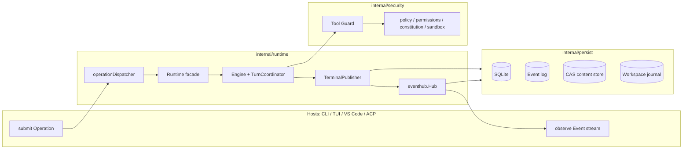
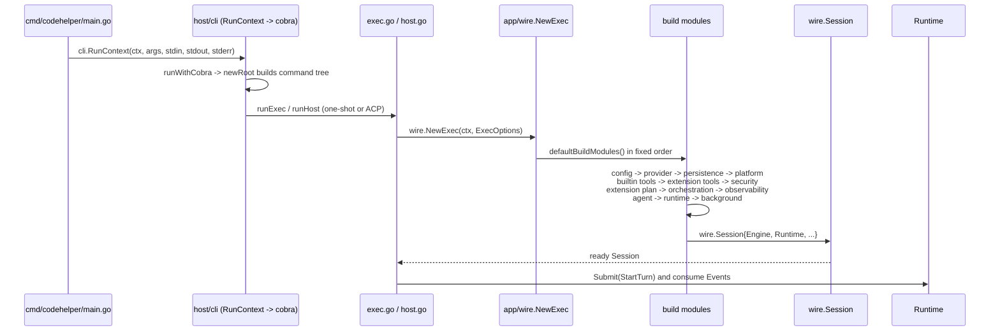
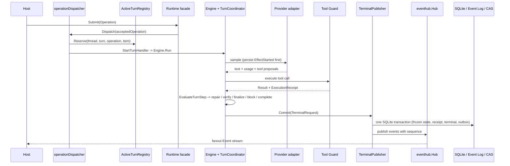
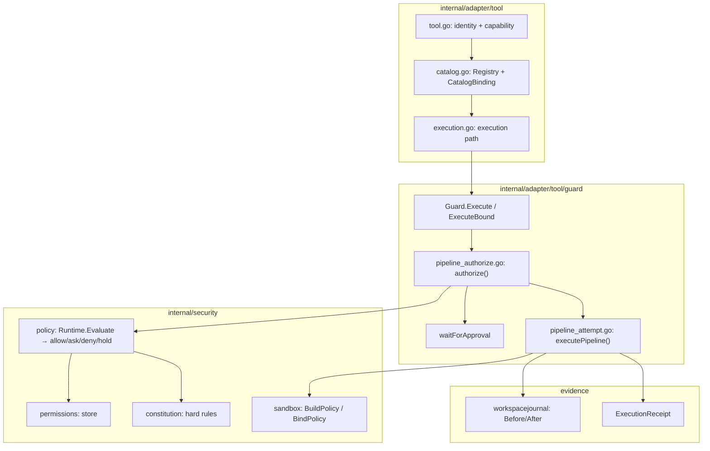
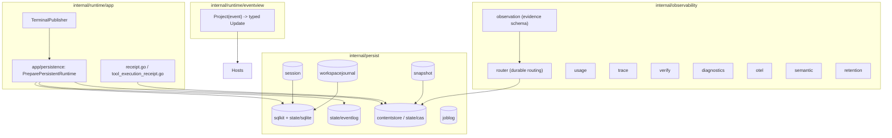
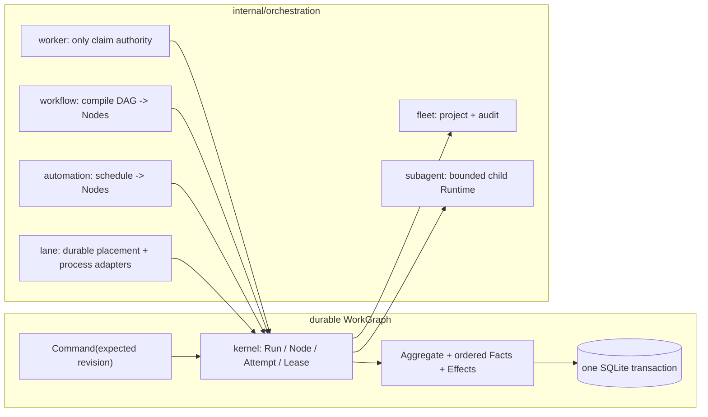

# Reading the CodeHelper Source Code

[简体中文](../zh-CN/reading-guide.md) | English

CodeHelper is a large Go codebase (1800+ files). This guide gives you a
progressive reading route so you can go from "where do I start" to "I
understand one full turn of work end to end" without trying to read every file
in order.

Read [architecture.md](./architecture.md) first. This guide assumes you already
grasp the layered model and the hard dependency rules; it answers the practical
question of which file to open next.

> Tip: pair each package below with its `*_test.go`. CodeHelper's tests are
> excellent documentation: they pin down contracts that the docs only describe.
> Every route below calls out the specific test files that demonstrate the
> behavior, so you can watch the loop run instead of just reading it.

## The Shape of the System

One mental model ties everything together:

> Hosts submit Operations; the Runtime turns them into Events; the Engine does
> the agent work; every consequential tool call passes through the Guard; all
> durable state lands in SQLite / Event Log / CAS; and hosts project Events
> back into UI.



The layers, top to bottom:

```text
cmd/codehelper            process entry
internal/host             CLI, TUI, ACP presentation
internal/runtime          protocol, app state, agent loop, wiring
internal/adapter          providers, models, tools, MCP, skills, plugins
internal/security         policy, permission, constitution, sandbox
internal/orchestration    tasks, workers, workflows, lanes, fleet, subagents
internal/persist          SQLite, events, sessions, journals
internal/observability    usage, traces, verification, diagnostics
internal/platform         processes, PTY, OS integration
internal/config           defaults, TOML, env, validation
extensions/vscode         TypeScript editor extension
```

If you want concept-level background before code, the
[Agent engineering book](../book/en/README.md) chapters
[System Architecture](../book/en/02-codehelper-overview/02-system-architecture.md),
[Package Ownership](../book/en/02-codehelper-overview/03-package-ownership.md),
and [Runtime Vocabulary](../book/en/02-codehelper-overview/04-runtime-vocabulary.md)
map one-to-one onto the layers above.

## Route 1 — Entry and Composition (smallest surface)

**Goal:** understand how a binary becomes a running runtime, and where every
concrete dependency is constructed.



1. `cmd/codehelper/main.go` — ~15 lines. It only installs
   `signal.NotifyContext` for SIGINT and forwards to `cli.RunContext`.
   Everything else lives below the `internal/` boundary; there is no business
   logic in `main`.

2. `internal/host/cli/run.go` — `RunContext` is the real process entry. It
   detects `--error-format=json` (machine-readable errors), then delegates to
   `runWithCobra`. Exit codes are normalized into `protocol.Problem` values for
   machine consumers.

3. `internal/host/cli/cobra.go` — `newRoot` builds the command tree. Commands
   are mostly "passthrough" groups (`config`, `plugin`, `skill`) plus direct
   commands (`exec`, `host --adapter acp`, `runtime-observe`, `auth`, `model`,
   `thread`, `fleet`, `automation`, `worker`, `workflow`, `lane`, `sandbox`,
   `tui`, ...). `exec.go` is the one-shot command and the best end-to-end
   example: it parses flags, calls `wire.NewExec`, submits a `StartTurn`
   operation, and consumes the event stream.

4. `internal/host/cli/host.go` — `runHost` is the persistent host path. It
   wires a `PersistentStore` into `wire.NewExec` and serves the ACP adapter
   (`internal/host/runtimeapi/acp/server.go`). This is the surface VS Code
   talks to.

5. `internal/runtime/app/wire/` — the composition root. `runtime.go` defines
   `ExecOptions`, `Session`, and `NewExec`. `defaultBuildModules()` is the
   closed module sequence:

   ```text
   config -> provider -> persistence -> platform -> builtin tools
          -> extension contributors -> security -> extension plan
          -> orchestration -> observability -> agent -> runtime
          -> background services
   ```

   Read `modules_core.go` first (config/provider/persistence/platform/builtin
   tools/security), then `modules_runtime.go` (agent + runtime), then
   `modules_extensions.go`, `modules_observability.go`,
   `modules_orchestration.go`, and `module_background.go`. Each module owns one
   construction boundary and publishes only what later modules need through
   `buildState`; modules never retain `buildState` afterwards.

6. `internal/runtime/app/wire/module_background.go` — `backgroundModule.Build`
   performs the initial MCP refresh, starts Runtime recovery
   (`application.Start`), starts MCP prewarm, reconciles Automations, then
   builds and starts the Worker Scheduler. Construction fails closed: a failed
   step aborts the build and the `assembly.ResourceStack` rolls back.

7. `internal/runtime/app/wire/background_executors.go` — background task
   executors that run outside a Turn: `shellCommandExecutor` and
   `workflowRunExecutor`. These are how scheduled tasks and workflow steps
   eventually call back into the same Runtime/tool/security boundaries.

**Key symbols:** `RunContext`, `newRoot`, `runExec`, `runHost`, `NewExec`,
`defaultBuildModules`, `buildState`, `backgroundModule`.

**Tests to read:** `wire/bootstrap_test.go`, `wire/persistent_test.go`,
`wire/background_executors_test.go`, `cli/run_test.go`.

**Route 1 answers:** "how does a binary become a running runtime?"

## Route 2 — One Operation End to End (core loop)

**Goal:** follow one user request (an Operation) from the host's `Submit`
through the Engine, the Guard, terminal commit, and event publication.



1. `internal/runtime/app/operation_dispatch.go` — `operationDispatcher.Dispatch`
   switches on the typed Operation payload. Turn operations map to handlers:
   `StartTurnHandler`, `CancelTurnHandler`, `SteerTurnHandler`,
   `ApprovalHandler`, `InputHandler`, `CompactThreadHandler`,
   `ForkThreadHandler`, `RevertTurnHandler`. Orchestration payloads
   (`SubmitRun`, `CancelRun`, `ResumeRun`, `RetryNode`, `SkipNode`) go to
   `OrchestrationHandler`. Handlers return `OperationOutcome`
   (`committed` / `rejected` / `async` / `terminal`); only the Dispatcher
   applies synchronous commit and rejection.

2. `internal/runtime/app/active_turn_registry.go` — `Reserve` atomically binds
   one Thread to one active Turn with an in-memory token; a Thread cannot run
   two Turns concurrently. `Release` requires the matching token, so stale
   releases are rejected.

3. `internal/runtime/app/runtime.go` — the Runtime facade. Large, but it is a
   hub, not a god object: skim the method names first (`Submit`, `SubmitWithKey`,
   `Events`, `ReplayEvents`, `Snapshot`, `Close`, `loop`, `dispatch`). It owns
   the accepted-operation channel, the event loop, session/artifact services,
   and the `TerminalPublisher`.

4. `internal/runtime/agent/engine/engine.go` — the Engine. `Options` carries
   the provider, route set, tool registry, static context, budgets, guard
   factory, workspace, journal, verification options, and the
   `TurnCoordinatorRuntime`. The exported `State` constants are the engine's
   public state machine: `Preparing`, `Compacting`, `CallingModel`,
   `Streaming`, `PreparingTools`, `RunningTools`, `AwaitingApproval`,
   `AwaitingInput`, `FeedingResults`, `Verifying`, `Completed`, `Failed`,
   `Canceled`.

   ```mermaid
   stateDiagram-v2
       [*] --> Preparing
       Preparing --> CallingModel
       CallingModel --> Streaming
       Streaming --> PreparingTools: tool calls
       PreparingTools --> RunningTools
       RunningTools --> AwaitingApproval
       AwaitingApproval --> RunningTools
       RunningTools --> FeedingResults
       FeedingResults --> CallingModel
       Streaming --> Verifying: final answer
       Verifying --> Completed
       Verifying --> Failed
       Preparing --> Canceled
       CallingModel --> Canceled
   ```

5. `internal/runtime/agent/engine/turn_kernel.go` — the adapter between the
   classic Engine loop and the authoritative `turnkernel.TurnCoordinator`.
   `newEngineTurnKernelForTurn` builds a fresh `State`, opens a coordinator
   handle from `CoordinatorRuntime`, applies `StartTurn` +
   `PreparationFinished`, and thereafter the kernel is the single source of
   truth. `turn_scope.go` holds the per-Turn `Scope` (frozen `TurnSpec`,
   kernel, scheduler, diff tracker, world state, catalog snapshots).

6. `internal/runtime/agent/turnkernel/` — the pure state machine. `state.go`
   defines the phases (`created`, `preparing`, `sampling`,
   `executing_tools`, `awaiting_approval`, `awaiting_input`, `verifying`,
   `committing`, `completed`, `failed`, `canceled`). `coordinator.go` is the
   only production entry to `Reducer.Apply`: `Submit(command)` validates the
   transition, appends Domain Facts, and returns a `Transition`.
   `reducer.go` is the pure `Apply(current, command) -> Transition` function;
   `effect_dispatcher.go` persists `EffectStarted` before the provider is
   called. Read `coordinator_test.go` and `reducer_test.go` together with the
   kernel — they encode every transition invariant.

7. `internal/runtime/agent/engine/turn_handler.go` and `model_handler.go` —
   `Scope.Run` is the actual loop: journal draft recovery, kernel creation,
   then repeated `modelStep` (build request, stream, fold usage) and tool
   execution. `EvaluateTurnStep` makes the Reducer choose
   Repair / Verification / Finalize / Block / Complete. The terminal path
   submits `TerminalRequested`, and the journal Commit/Suspend/Rollback runs as
   a durable Effect. Read `turn_handler.go` around the `StepAction*` constants
   and the terminal-decision switch.

8. `internal/runtime/app/terminal_publisher.go` — `TerminalPublisher.Commit`
   validates that the frozen state is terminal, that the receipt and terminal
   material exist, then persists the operation + receipt + terminal + outbox in
   one transaction and publishes through the hub. This is the atomic "end of
   turn" boundary.

9. `internal/runtime/app/eventhub/hub.go` — owns sequence assignment, append,
   replay, subscription fanout, slow-consumer policy, and close. `Publish`
   assigns the next sequence, appends to the durable Store, then fans out to
   subscribers; `Events` streams from a cursor; `Replay` bounds a page.

**Key symbols:** `OperationOutcome`, `StartTurnHandler`, `ActiveTurnRegistry`,
`TurnCoordinator`, `Reducer.Apply`, `Engine.Run`, `Scope.Run`, `modelStep`,
`TerminalPublisher.Commit`, `Hub.Publish`.

**Tests to read:** `app/application_e2e_test.go` (the full loop),
`app/runtime_test.go`, `engine/engine_test.go` (114 KB of contract tests),
`engine/turn_kernel_test.go`, `turnkernel/coordinator_test.go`,
`turnkernel/reducer_test.go`, `app/terminal_publisher` (via runtime tests).

**Route 2 answers:** "what happens to my prompt, end to end?"

## Route 3 — Guarded Tool Execution (security, the differentiator)

**Goal:** understand the single decision point every consequential tool call
must pass, and how policy, approvals, the journal, and the OS sandbox compose.



1. `internal/adapter/tool/tool.go` — the vocabulary of tool identity and
   capability: `Capability`, `AccessMode`, `SandboxRequirement`,
   `ParallelPolicy`, `RepeatPolicy`, plus error taxonomy
   (`invalidArguments`, `Precondition`, `RecoveryHint`).

2. `internal/adapter/tool/catalog.go` — the `Registry` (sealed after
   construction), `Registration`, `CatalogBinding`, `CatalogSnapshot`, and
   `Materialize`. Tools are referenced by stable `CatalogToolID`; the binding
   pins name, source, and revision so a Turn cannot silently run a different
   tool than the one the model was shown.

3. `internal/adapter/tool/execution.go` — the execution path that funnels into
   the guard: `ToolRef`, `PreparedInvocation`, `Outcome`, `OutcomeFacts`,
   `WorkspaceChange`, `ExecutionDisposition`.

4. `internal/adapter/tool/guard/guard.go` — the pipeline
   `policy -> approval -> journal -> sandbox`. `Execute` / `ExecuteBound` is
   the entry; it stamps `InvocationIdentity` and calls `executePipeline`.
   The Guard also prepares file writes (fingerprint before), records file
   changes after, handles egress host approval, and keeps approval state with
   expiry and replacement rules. `pipeline_authorize.go` implements
   `authorize`: evaluate policy, consult grants/approvals, wait for human
   approval when asked, and (for file writes) revalidate the approved edit
   plan. `pipeline_attempt.go` runs the retry loop for
   `additional_permission` and `egress_approval` escalations.

5. `internal/security/policy/` — `policy.go` defines the rule engine:
   `Runtime.Evaluate(Invocation) -> Decision` with actions
   `allow / ask / deny / hold`. Rules are ordered Grants, User, Repository, and
   permission ceilings tighten the result. `effect.go`, `granular.go`,
   `network.go`, `command.go`, `approval.go` split the policy surface.

6. `internal/security/permissions/` — the durable permission store that
   remembers what a user allowed for a specific workspace. Read
   `permissions.go` + `store.go`; permissions are workspace-bound and narrower
   than global authority.

7. `internal/security/constitution/` — hard, non-bypassable constraints loaded
   from user and repository `constitution.json` (`deny_write_globs`,
   `hold_tools`, `deny_tools`, prompt). Ordinary session configuration cannot
   override it; `constitution.go` compiles it into policy rules + prompt.

8. `internal/security/sandbox/` — OS isolation. `policy.go` builds a
   `Policy` (read/write roots, network policy, temp dirs); `backend.go` maps
   platform capability to a backend: `seatbelt` (macOS), `bwrap+landlock`
   (Linux), `restricted-token` (Windows), or fail-closed `unavailable`.
   Platform specifics live in `workspace_fs_unix.go`,
   `workspace_fs_windows.go`, `seccomp_linux.go`, and
   `landlock_helper_linux.go`. If a required boundary is unavailable,
   execution fails closed.

Then read how models and providers plug in (Route 3 continues):

- `internal/adapter/provider/` — the provider abstraction; read `types.go`
  (messages, tool calls, stream events, usage), then one concrete provider
  such as `openai/` or `deepseek/`, then `router/` (immutable route table) and
  `wire/` (protocol-specific request builders).
- `internal/adapter/model/` — model catalog (`catalog.go`, `catalog.v1.json`),
  capability negotiation (`capability.go`), purpose-based routing
  (`route.go`, `routeset.go`, `purpose.go`).
- `internal/adapter/mcp/` — protocol adapter for external MCP servers:
  `config.go`, `connection.go`, `health.go`, `http.go`, `stdio.go`, `pool.go`,
  `server.go`, `oauth.go`. Health, timeouts, circuit breakers, and tool
  binding isolation keep one failing server from corrupting all tools.
- `internal/adapter/skill/` — skill discovery, manifests, locks, selection,
  and enablement; `selection.go` preserves exactly named/required/previously
  used skills before applying the bounded lexical candidate limit.
- `internal/adapter/plugin/` — the activation chain: registry signatures,
  publisher trust, immutable staging, receipts, enablement, rollback,
  revocation (`registry.go`, `trust.go`, `staging.go`, `distribution.go`,
  `lifecycle.go`).
- `internal/adapter/hooks/` — bounded lifecycle observers/gates; they can
  never become an alternate unguarded execution path.

**Key symbols:** `tool.Capability`, `Registry`, `CatalogBinding`,
`guard.Guard`, `executePipeline`, `authorize`, `policy.Runtime.Evaluate`,
`constitution.Load`, `sandbox.BuildPolicy`, `sandbox.BindPolicy`,
`workspacejournal.Before/After`.

**Tests to read:** `guard/guard_test.go`, `guard/pipeline_test.go`,
`guard/changes_test.go`, `guard/concurrency_test.go`,
`policy/policy_test.go`, `sandbox/backend_test.go`,
`sandbox/workspace_test.go`, `permissions/permissions_test.go`,
`constitution/constitution_test.go`.

**Route 3 answers:** "what stops a tool call from doing something
unauthorized?"

## Route 4 — State, Persistence, and Observability

**Goal:** understand how runtime state survives restarts and how you can
explain what happened after the fact.



1. `internal/persist/sqlkit/` — the SQLite foundation (open, schema,
   ownership, WAL handling). Everything below builds on it.
2. `internal/persist/contentstore/` and `internal/persist/state/cas/` —
   content-addressed immutable payload storage. Tool results keep the complete
   original here and hand the model a bounded excerpt + `result_get` handle.
3. `internal/persist/state/eventlog/` — the ordered durable runtime fact log
   (the Event source behind `eventhub`).
4. `internal/persist/session/`, `internal/persist/snapshot/`,
   `internal/persist/joblog/` — session metadata, explicit thread checkpoints /
   plan artifacts, and job logs.
5. `internal/persist/workspacejournal/` — before-images and edit recovery:
   `Before` / `After` fingerprints, draft recovery, rollback.
6. `internal/runtime/app/persistence/runtime.go` — `PreparePersistentRuntime`
   builds the durable Runtime: injects the SQLite Turn Coordinator Store before
   any Engine is created, wires repositories, and runs lifecycle recovery with
   renewable active-Turn leases.
7. `internal/runtime/app/receipt.go` and `tool_execution_receipt.go` —
   structured evidence: context selections, tools used, workspace changes,
   approvals, verification attempts, cost, and the final gate action. The
   execution receipt is the explanation artifact hosts project.
8. `internal/observability/` — the non-authoritative evidence plane:
   - `observation/` — versioned `ObservationEnvelope` schema and traits.
   - `router/` — durable routing that applies privacy policy before any
     journal/CAS write, with bounded queues for normal/bulk records.
   - `usage/`, `trace/` — token/cost rollups and W3C Trace Context.
   - `verify/` — verification executor evidence (attempts, categories,
     repairs, gate action).
   - `diagnostics/` — diagnostics runner receipts.
   - `otel/`, `semantic/`, `retention/`, `privacy/`, `supportbundle/` —
     OTLP export, explainable-graph rebuild, retention classes, redaction,
     and support-bundle construction.
   Capture is controlled by `CODEHELPER_OBSERVATION_CAPTURE`
   (`off` / `metadata` / `failure` / `full`).
9. `internal/runtime/eventview/view.go` — one typed interpretation of Event
   payloads for Go hosts: `Project(event) -> Update` returns
   `TextUpdate`, `ToolUpdate`, `InteractionUpdate`, `AccountingUpdate`,
   `EvidenceUpdate`, `LifecycleUpdate`, `ArtifactUpdate`, `AgentUpdate`,
   `OrchestrationUpdate`, `TerminalUpdate`, or `IgnoredUpdate`.

**Key symbols:** `sqlkit`, `contentstore.Store`, `eventlog`, `snapshot`,
`workspacejournal.Manager`, `PreparePersistentRuntime`, `ExecutionReceipt`,
`ObservationEnvelope`, `eventview.Project`.

**Tests to read:** `persist/sqlkit/sqlkit_test.go`,
`persist/state/eventlog/log_test.go`, `persist/workspacejournal/journal_test.go`,
`app/persistence` (via `wire/persistent_test.go`), `app/receipt_test.go`,
`observability/router/router_test.go`, `observability/verify/verify_test.go`,
`runtime/eventview/view_test.go`.

**Route 4 answers:** "where does state live, and how do I explain what
happened?"

## Route 5 — Orchestration and the VS Code Extension

**Goal:** understand the longer-lived, multi-step side of the product: durable
Runs/Workflows/Subagents, and how the editor projects runtime Events.



1. `internal/orchestration/kernel/kernel.go` — the pure WorkGraph state
   machine: Run, Node, Attempt, Lease Epoch, and Effect transitions, with no
   I/O. `store/store.go` commits transitions atomically, deduplicates command
   IDs, and detects snapshot/fact drift.
2. `internal/orchestration/worker/worker.go` — the only claim authority;
   heartbeats and settlement are fenced by owner, Lease Epoch, authority
   digest, and revision. `fairqueue/` provides fair claim ordering.
3. `internal/orchestration/workflow/` — `spec.go` / `compiler.go` /
   `controller.go` / `runtime.go` compile DAG work into WorkGraph Nodes rather
   than a second checkpoint state machine.
4. `internal/orchestration/automation/` — scheduled work compiled into
   WorkGraph Nodes (`schedule.go`, `repository.go`).
5. `internal/orchestration/lane/` — durable placement records and inline or
   tmux-backed process adapters; placement is not lifecycle authority.
6. `internal/orchestration/fleet/` — projects and audits WorkGraph state; it
   cannot enqueue, claim, settle, or resume work.
7. `internal/orchestration/subagent/` — a bounded child Runtime with a durable
   Agent Tree, Mailbox, Result, Budget Ledger, worktree ownership, approval
   routing, and journaled integration (`subagent.go`, `graph.go`,
   `lifecycle.go`, `worktree.go`, `control.go`).
8. `internal/orchestration/task/` — durable task state and the executor
   contract used by `background_executors.go`.
9. `extensions/vscode/src/chat/projector/` — `index.ts` owns `ChatProjector`:
   it tracks sequence and Turn identity, applies each Event in order, and
   exposes `snapshot()`, `pendingApprovals()`, `pendingInputs()`.
   `turn-projector.ts` exhaustively dispatches every Event Class; domain
   modules handle stream, tool, interaction, evidence, terminal, and snapshot
   behavior (`tool-projector.ts`, `stream-projector.ts`,
   `interaction-projector.ts`, `evidence-projector.ts`,
   `terminal-projector.ts`, `snapshot.ts`, `model.ts`, `helpers.ts`).
10. `internal/host/tui/` and `internal/host/runtimeapi/` — other host
    surfaces. The TUI (`host.go`, `app.go`, `view.go`, `reducer.go`,
    `projection.go`) is a pure projection of Events; `runtimeapi/` contains
    the ACP server (`acp/server.go`), thread lifecycle (`thread/`), and the
    typed view (`view/`).

**Key symbols:** `kernel`, `Attempt`, `Lease`, `worker`, `workflow.Compiler`,
`subagent`, `ChatProjector.apply`, `projectTurnEvent`, `eventview.Project`.

**Tests to read:** `orchestration/kernel/kernel_test.go`,
`orchestration/store/store_test.go`, `orchestration/worker/worker_test.go`,
`orchestration/workflow/workflow_test.go`, `orchestration/subagent/*_test.go`,
`extensions/vscode/src/chat/projector.test.ts`.

**Route 5 answers:** "how do tasks, workflows, and subagents stay durable, and
how does the editor render all of it?"

## Mini Glossary

- **Operation** — a requested state transition (`StartTurn`, `CancelTurn`,
  `SteerTurn`, `ApprovalDecision`, `InputReply`, `SubmitRun`, ...).
- **Event** — an immutable, sequenced observation emitted by a transition;
  the host protocol.
- **Receipt** — structured evidence about context, tools, changes, approvals,
  verification, or cost.
- **Projection** — query-oriented state reconstructed from events and
  relational records (TUI/VS Code never own runtime truth).
- **Turn / Thread** — a Turn is one agent execution; a Thread is the
  conversation container it belongs to.
- **Sample** — one provider request/response cycle inside a Turn.
- **Effect** — a durable side effect (provider call, tool execution,
  verification, journal commit) tracked by the Turn Kernel.
- **Domain Fact** — an accepted transition record appended before state
  commit or effect dispatch; the basis for recovery.
- **Lease** — an ownership token (active Turn in-memory, or durable WorkGraph
  Lease Epoch) that makes stale releases/claims fail closed.
- **Guard** — the policy -> approval -> journal -> sandbox pipeline every
  consequential tool call passes through.

## Suggested Reading Order

- **Session 1 (1–2 hours):** README -> architecture.md -> Route 1
  (entry + wiring). You should be able to explain `defaultBuildModules()`.
- **Session 2 (2–3 hours):** Route 2, following `application_e2e_test.go`.
  Trace one StartTurn from `Submit` to terminal commit.
- **Session 3 (2–3 hours):** Route 3 — the guard pipeline and sandbox.
  Read `guard_test.go` and one policy test to see allow/ask/deny in action.
- **Session 4 (1–2 hours):** Route 4 — persistence and observability.
  Read `wire/persistent_test.go` for how durable recovery works.
- **Session 5 (2 hours):** Route 5 — orchestration kernel, then the VS Code
  projector. Optionally repeat Route 2 while watching events flow in the
  TUI/extension.

If you prefer concept-first learning, interleave the
[book](../book/en/README.md): read
[Turn Lifecycle](../book/en/02-codehelper-overview/05-turn-lifecycle.md)
before Session 2, [Application Runtime](../book/en/03-runtime-kernel/02-application-runtime.md)
with Session 2, [Agent Loop](../book/en/03-runtime-kernel/03-agent-loop.md)
with Session 3, [Dependency Wiring](../book/en/03-runtime-kernel/04-dependency-wiring.md)
with Session 1, and [Resume and Recovery](../book/en/03-runtime-kernel/06-resume-and-recovery.md)
with Session 4.

## Tools That Make This Easier

- `go doc <package>` for signatures.
- `go test ./path/to/package` to run a package's contract tests.
- `go test -run <TestName> -v ./path/to/package` to watch one behavior.
- In an editor with the repo indexed, `search_definition` /
  `search_references` on a symbol (`TurnCoordinator`, `operationDispatcher`,
  `guard.Guard`, `TerminalPublisher`, `eventview.Project`) to trace ownership.
- `go list -deps ./cmd/codehelper` to see the whole dependency graph.
- `go test ./internal/runtime/agent/turnkernel ./internal/runtime/agent/engine`
  for the convergence/transition baseline tests.
- `./codehelper exec --help` and `./codehelper <command> --help` to confirm
  what a host actually exposes (CLI names and flags are owned by
  `internal/host/cli`).
