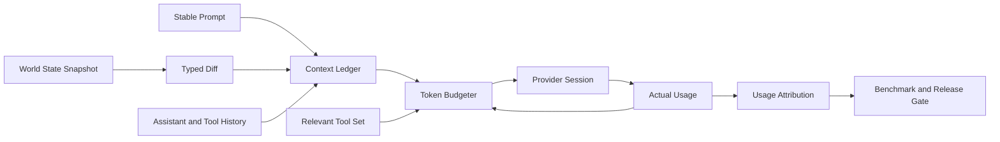

# Token Efficiency Architecture Upgrade

[简体中文](../zh-CN/token-efficiency-architecture-upgrade.md) | English

> Status: `in_progress`. T0 is accepted. T1 is implemented with
> `implemented_validation_mixed`, and T2 has started; see
> [`token-efficiency-t0-baseline.json`](../token-efficiency-t0-baseline.json)
>, [`token-efficiency-t1-evidence.json`](../token-efficiency-t1-evidence.json),
> and [`token-efficiency-t2-evidence.json`](../token-efficiency-t2-evidence.json).
>
> Scope: prompt context, history, compaction, tool catalogs, tool results,
> provider sessions, reasoning budgets, completion protocol, usage accounting,
> and token benchmarks.

## 1. Executive Summary

CodeHelper's high token consumption is not caused by one unusually large
prompt. It is the combined effect of:

1. resending the complete logical history for every model sample;
2. rendering the tool catalog, repository map, working set, evidence, and plan
   again after history;
3. sending provider `tools[]` schemas in addition to the textual tool catalog;
4. retaining tool results, assistant output, and repair feedback in every later
   request;
5. compacting primarily at a 256 KiB history threshold or near the hard model
   window;
6. allowing 256 steps while main-agent, subagent, and worker token budgets
   default to unlimited;
7. selecting maximum reasoning effort and raising the default reasoning output
   limit to at least 16,384 tokens; and
8. requiring `turn_complete` for read-only tool turns, which can add finish and
   repair samples.

If fixed context and tool definitions cost `B`, each step adds `g` history
tokens on average, and a turn makes `N` model calls, cumulative input is:

```text
cumulative_input(N) ~= N * B + g * N * (N - 1) / 2
```

With `B=15K`, `g=2K`, and `N=20`, the final request is about 53K tokens while
cumulative input is about 680K tokens, or 12.8 times the final request.

This upgrade must not save tokens by shortening required work, reducing
correctness, or bypassing safety protocols. It will:

- inject unchanged state once and append only typed state diffs;
- manage context windows with actual token usage;
- make tool schemas and results token-aware, bounded, and relevant;
- reduce low-value samples, repairs, and excessive reasoning;
- preserve verified incremental requests and cache continuity where supported;
- compare baseline and candidate with identical prompt bytes, models, and
  fixtures.

## 2. Measurement Semantics

Every report must include all of these metrics:

| Metric | Definition | Purpose |
| --- | --- | --- |
| `input_tokens` | cumulative provider-reported input | total consumption |
| `cached_tokens` | cached subset of input | cache effectiveness |
| `uncached_input_tokens` | input minus cached input | expensive input |
| `output_tokens` | provider output including reasoning | output consumption |
| `reasoning_tokens` | reasoning subset of output | reasoning policy |
| `active_context_tokens` | latest complete visible context | window pressure |
| `cumulative_tokens` | all sample input plus output | turn consumption |
| `request_bytes` | serialized transport size | transport pressure |
| `sample_count` | provider inference calls | loop efficiency |
| `cached_share` | cached input divided by input | cache continuity |

Cached tokens are already part of input, and reasoning tokens are already part
of output. They must not be added twice. Prompt caching can reduce price and
latency without removing those tokens from model context.

## 3. Current Implementation Findings

### 3.1 Every Sample Rebuilds the Full Request

`internal/runtime/agent/engine/model_handler.go` assembles:

```text
stable turn context
  + complete durable history
  + current tool catalog
  + repository map
  + working set
  + evidence
  + plan
  + output continuation
```

The provider adapter then serializes all messages and tool definitions.
OpenAI Responses defaults to `store=false` and has no `previous_response_id`
or turn-scoped provider session.

The main cache problem is the placement of dynamic state:

```text
sample 1: stable + H1 + dynamic
sample 2: stable + H1 + new_history + dynamic
```

The second request is not a strict extension of the first. Prefix matching can
stop where the old dynamic tail began.

### 3.2 Dynamic Tail Cost

Default per-sample partition limits are:

| Partition | Token limit |
| --- | ---: |
| Tool catalog | 4,096 |
| Repository map | 2,048 |
| Working-set ledger | 2,048 |
| Evidence | 1,024 |
| Total excluding plan | 9,216 |

The current default catalog benchmark observes 62 tools, 54 available tools,
5,735 rendered bytes, and about 1,434 heuristic tokens. This excludes the full
descriptions and input schemas in provider `tools[]`.

### 3.3 Duplicate Tool Context

The model receives both:

1. a textual catalog with names, capability, and availability; and
2. native provider definitions with names, descriptions, and JSON schemas.

Provider requests permit 128 definitions and 128 KiB of schemas. Tool search
finds deferred tools, but eager and materialized tools remain in every native
request, so the default tool set is not reduced enough.

### 3.4 History and Tool Results

Assistant output, tool calls, and serialized `tool.Result` values enter
transaction history. The shared result store already spills content above
32 KiB and returns a `result_get` handle, so tool output is not unbounded.

Remaining problems are:

- the limit is byte-based rather than token-based;
- model-irrelevant result metadata is serialized with content;
- retained output is resent in every later sample.

### 3.5 Compaction Targets the Wrong Limit

The default threshold is
`context.compact.max_history_bytes=262144`. Token estimation is used mainly to
avoid crossing the hard model window.

The gate does not fully include the current dynamic tail, provider tool
definitions, native search definitions, protocol framing, and all
provider-specific content. Its estimator divides Unicode rune count by four,
which is not reliable for Chinese text, code, JSON, schemas, images, or
encrypted reasoning.

### 3.6 Steps, Reasoning, and Repairs

Defaults permit:

- 256 main-agent steps;
- 24 subagent steps with no token budget;
- no worker token budget;
- no session token budget.

Reasoning models use `xhigh`, while DeepSeek V4 uses `max`. A default 4K output
limit is raised to at least 16,384 when the route supports reasoning.

Enabling tools also enables completion declarations for all turns. A read-only
tool task can therefore need a completion call, a user-facing finish sample,
and declaration, completion, workspace, or verification repair samples.

### 3.7 Accounting Gap

CodeHelper persists input, output, reasoning, and cached tokens and can report
cache share. Model pricing only represents ordinary input and output, however,
so cached input is costed at the ordinary input rate. This does not increase
real tokens but can overstate cost and obscure optimization results.

## 4. Codex Comparison

### 4.1 Incremental World State

Codex models environment, permissions, tools, AGENTS instructions, plugins, and
model settings as typed world-state sections:

- full state is injected at session or compaction-window initialization;
- later snapshots produce only changed context fragments;
- fragments enter history and become part of the stable prefix;
- snapshot and turn context survive restart;
- each fragment has typed markers and a hard bound.

CodeHelper already has receipts, digests, working-set state, and catalog
snapshots, but they are split between stable prompt and volatile-tail paths.

### 4.2 Token-native Compaction

Codex tracks provider usage for full active context, compaction-window prefix,
body after prefix, auto-compact limit, hard context limit, and fallback buffer.
CodeHelper primarily tracks history bytes and estimates tokens only near the
hard limit. The latter prevents rejection but does not control cumulative cost.

### 4.3 Tool Output Policy

Codex applies a token truncation policy before tool output enters history and
estimates serialized model-visible response items. It has special handling for
images, audio, and encrypted reasoning.

CodeHelper's result store solves durable large-content retrieval, but Engine
lacks one uniform policy for model-visible tool-result tokens.

### 4.4 Incremental Responses Transport

Codex reuses a Responses WebSocket request only when:

- non-input request properties are unchanged;
- current input strictly extends prior input plus server response items;
- a valid `previous_response_id` exists.

It otherwise falls back to a full request. Logical rollout history remains
complete. This mainly improves transport, latency, and cache continuity; any
billed-token benefit must be proven from provider usage rather than inferred
from payload bytes.

## 5. Target Architecture



### 5.1 Context Ledger

The Context Ledger remains owned by `internal/runtime/agent` and becomes the
single assembly fact for:

- stable prompt;
- user, assistant, and tool history;
- world-state full snapshots and diffs;
- compaction summaries;
- tool-definition token receipts;
- provider-framing receipts.

Implementation must converge existing `promptcontext.Receipt`,
`ContextBudgetSnapshot`, and usage events rather than add a parallel receipt
hierarchy.

### 5.2 Durable World State

Initial sections are tool catalog, repository map, working set, evidence, plan,
and runtime mode. Required invariants:

1. unchanged sections emit no message;
2. diffs append to history instead of being rebuilt after history;
3. diff and snapshot derive from the same state;
4. visible diff is persisted before advancing the durable baseline;
5. compaction injects one full snapshot and opens a new baseline;
6. restart, fork, and task capsules retain the authoritative revision;
7. one fragment is at most 4K tokens, and fragments above 1K require review.

### 5.3 Token Budgeter

Default operating levels:

| Active window | Default action |
| --- | --- |
| 55% | stop low-value exploration and narrow result budgets |
| 65% | automatic compaction |
| 85% | allow only completion, verification, or explicit failure |

Budgets include stable context, retained history, pending world-state delta,
provider tool definitions, provider framing, and reserved output. Actual
provider usage is authoritative for the next sample; estimation predicts the
next request and is calibrated against actual usage.

### 5.4 Relevant Tool Set

The default provider tool set contains:

- core tools required by turn intent;
- tools proven relevant by the task, working set, or recent calls;
- `tool_search`;
- `turn_complete` only when mutation completion is required;
- `result_get` only when content handles exist.

Text catalogs describe deferred namespaces and state changes, not descriptions
already represented by native schemas. Selection can only narrow visibility;
catalog authority, role allowlists, Guard, policy, and approval still apply.

### 5.5 Token-aware Tool Results

The result store retains complete content. Model-visible projection contains
status, structured summary, head, tail, original and retained token estimates,
content handle, and retrieval guidance.

Suggested defaults:

| Result type | Token budget |
| --- | ---: |
| Search/list/metadata | 1,024 |
| File read | 4,096 |
| Test/build output | 4,096 |
| Generic result | 2,048 |
| Per-item hard limit | 10,000 |

Truncation must preserve head, tail, and structure and must not present invalid
truncated JSON as complete JSON.

### 5.6 Provider Session

Provider sessions belong to `internal/adapter/provider`:

- Engine submits a complete logical request;
- the adapter decides whether incremental transport is valid;
- capable Responses routes may use WebSocket, delta input, and
  `previous_response_id`;
- unsupported routes continue using full requests;
- route, property, retry, compaction, or recovery uncertainty forces fallback;
- journal, trace, and replay retain the logical request digest and receipts.

Enabling server-side storage must be explicit about capability, configuration,
retention, and privacy.

### 5.7 Adaptive Reasoning and Completion

Initial reasoning effort:

| Scenario | Effort |
| --- | --- |
| Read-only lookup or simple explanation | low |
| Normal coding or local repair | medium |
| Multi-module architecture or difficult debugging | high |
| Prior level failed with budget remaining | xhigh/max |

Output reserve becomes stage- and capability-aware. Completion declaration is
required only for observed mutation, `workspace_change` intent, or pending
durable integration. Mutation, verification, journal, and approval guarantees
remain unchanged.

## 6. Observability

Each sample records a low-cardinality reason:

```text
normal
output_continuation
completion_repair
declaration_repair
verification_repair
provider_retry
```

Context attribution covers stable context, user history, assistant history,
tool calls, tool results, world-state full and delta, tool definitions,
provider framing, and unattributed overhead.

Production telemetry must not record raw prompts, file content, paths, tool
arguments, credentials, or results. Benchmark prompts are tracked public test
data and are referenced by digest.

Model pricing gains an optional cached-input rate:

```text
uncached_input * input_price
+ cached_input * cached_input_price
+ output * output_price
```

Unknown cached pricing remains explicitly unknown or bounded.

## 7. Identical-Prompt Before/After Protocol

### 7.1 Measurement Lanes

Acceptance includes:

1. **Hermetic Attribution Lane** for exact request-component comparison;
2. **Live No-cache Lane** for real uncached provider usage;
3. **Live Cache Lane** for cache share, uncached input, and real cost;
4. **Long-output Lane** for result truncation;
5. **Compaction Lane** for long-session window and summary quality.

Hermetic evidence identifies why usage changed. Live evidence proves that
provider-reported usage changed.

### 7.2 Frozen Fixture

T0 adds:

```text
testdata/benchmarks/token-efficiency/
  fixture/
  prompt.txt
  manifest.json
  expected.json
  provider-script.jsonl
```

The isolated Go fixture contains a configuration loader with relative nested
include, stable deduplication, and cycle-reporting defects; fixed unit tests;
enough files to require search, read, edit, test, and completion; and a
deterministic 100 KiB test-log scenario.

Every sample copies a read-only template to a fresh temporary directory. It
must never reset or clean the user's existing worktree.

### 7.3 Canonical Prompt

Both arms read the exact UTF-8 LF bytes from `prompt.txt`:

```text
Fix the config loader in this repository.

Requirements:
1. Resolve nested include directives relative to the file that declares them.
2. Preserve the first-seen order while removing duplicate entries.
3. Return a clear error for include cycles and include the cycle path.
4. Keep the public API backward compatible.
5. Add or update focused tests for the changed behavior.
6. Run the relevant tests and report the exact verification performed.

Do not modify unrelated files. Complete the implementation, verification, and
final summary in this turn.
```

The manifest fixes its SHA-256. Any byte change invalidates comparison.

### 7.4 A/B Environment

Every report fixes:

| Field | Requirement |
| --- | --- |
| Baseline | Git commit before optimization |
| Candidate | stage or final Git commit |
| Dirty state | both execution worktrees clean |
| Model | identical provider, model ID, and snapshot |
| Configuration | identical except the tested feature |
| Security | identical mode, posture, and sandbox |
| Fixture and prompt | identical tracked digests |
| Tool catalog | identical business capabilities |
| Warmup | one independent uncounted run per arm |
| Samples | at least five valid runs per arm |
| Ordering | alternating `A B B A` |
| Concurrency | one |
| Failures | retained and reported |

Cache arms use separate stable cache keys to prevent cross-arm warming.
No-cache arms use the same route without prompt-cache capability. A model
version change invalidates the experiment.

### 7.5 Correctness Gate

Token results are valid only when:

- all fixture tests pass;
- changed paths satisfy the expected contract;
- forbidden files are untouched;
- the final answer reports changes, verification, and remaining work;
- mutation has valid completion, verification, and journal receipts;
- policy, approval, sandbox, and authority are preserved;
- baseline and candidate have equal task completion rates.

An incomplete candidate with lower usage fails before efficiency comparison.

### 7.6 Artifacts and Statistics

Each run produces:

```text
artifacts/token-efficiency/<run-id>/
  manifest.json
  samples.ndjson
  context-breakdown.ndjson
  report.json
  report.md
```

The manifest records commits, dirty state, environment, model, configuration
digest, prompt digest, fixture digest, ordering, and time, but no credentials.

Reports use median as primary and also show min, P75, P90, max, and MAD. They
show absolute and relative deltas and never select the best run. If five-run
MAD exceeds 15% of median, the experiment expands to ten runs. Continued
instability is `inconclusive`, not passed.

## 8. Stage Attribution

The canonical prompt is rerun after every stage:

| Stage | Change | Primary metric |
| --- | --- | --- |
| T0 | attribution only | estimator error and partition shares |
| T1 | token-native window | active peak and compaction tokens |
| T2 | world-state diff | dynamic delta and cache share |
| T3 | tool context | definition and result tokens |
| T4 | reasoning and completion | calls, repairs, reasoning |
| T5 | provider session | bytes, latency, cache continuity |

Reports preserve all prior stages as one waterfall. Interacting changes require
benchmark-only ablation; temporary toggles must not become permanent production
dual paths.

## 9. Execution Plan

Every stage uses a dedicated branch and merges through `--no-ff` after
acceptance. Production code net growth must be `<= 0` per stage. New behavior
must replace and delete the corresponding old path.

### T0: Baseline and Attribution

- freeze fixture, prompt, expected contract, and provider script;
- extend existing usage samples and receipts with partition tokens;
- measure serialized tool definitions and sample reason;
- represent cached pricing and unknown-cost semantics;
- add repository commands for hermetic, live, and comparison runs;
- collect at least five baseline live samples.

Exit: repeatable report, estimator P95 error at most 10%, A/A median drift at
most 5%, failures retained, and production code net growth at most zero.

Acceptance evidence (T0, `accepted`):

- canonical prompt SHA-256:
  `8b61b8edfa5f01e3cebb659eb994a3ade736b0abd71c7a4df4d80dc069e51b1e`;
- hermetic 5/5 passed with input P50 147,770, MAD 0, and estimator P95 error
  4.00%;
- two hermetic A/A batches had zero delta in input, uncached input, output, and
  sample count;
- DeepSeek live 10/10 passed with input P50 394,163, P90 621,434, and MAD
  45,542;
- live uncached-input P50 was 64,520 and cache-share P50 was 80.26%;
- output P50 was 11,964, reasoning P50 was 7,838, and sample-count P50 was 12;
- all 125 live samples lacked an explicit cached-input price, so cost is
  correctly unknown and 122,454 microunits is only the P50 upper bound;
- sample reasons captured 112 normal, 9 tool-failure-repair, and 4
  declaration-repair calls;
- the architecture size closure fell from 27,955 to 27,946 production lines,
  for a net change of `-9`.

### T1: Token-native Window

- replace byte-only history limits with auto-compact token limits;
- support total and body-after-prefix scope;
- include pending delta, tool definitions, framing, and output reserve;
- calibrate prediction with prior actual usage;
- apply 55%, 65%, and 85% operating levels;
- delete duplicate byte-only decisions and obsolete snapshot fields.

Exit: no context rejection, compaction within five percentage points of target,
summary contract preserved, no correctness regression, and no input increase.

Current T1 evidence (`implemented_validation_mixed`):

- byte gates are deleted; `auto_compact_tokens=0` derives 65% of the model
  window and supports `total` and `body_after_prefix`;
- 55% injects convergence guidance, 65% compacts, and 85% exposes only
  completion and verification tools;
- candidates are selected only by full-request active tokens; bytes remain
  audit fields;
- hermetic 5/5 passed at input P50 147,770, with zero delta from frozen T0;
- DeepSeek live 10/10 passed with MAD/P50 13.93%, but input P50 increased 9.17%
  against frozen T0, so the strict comparison failed;
- a contemporary T0 control measured input P50 545,009 versus 460,999 for the
  adjacent T1 batch, a 15.41% decrease, while uncached input increased 23.03%;
- all three compaction capability fixtures and the token-efficiency fixture
  pass independently;
- Architecture Ratchet passed 43/43 and production size fell from 27,946 to
  27,943 lines, a net `-3`.

The implementation and deterministic non-regression gates pass, but frozen and
contemporary live comparisons disagree. T1 is not marked unconditionally
`accepted` before proceeding to T2.

### T2: Durable World-state Diff

- converge prompt sections, turn context, and receipts into Context Ledger;
- add snapshots and diffs for tools, repository, working set, evidence, plan;
- append diffs to history;
- recover baselines through compaction, restart, and child forks;
- delete unconditional volatile-tail rendering.

Exit: unchanged state adds fewer than 256 tokens, post-third-sample cache share
is at least 80%, restart visibility is equivalent, no-cache input falls at least
20% from T1, and production code net growth is at most zero.

Current T2 progress (`in_progress`):

- the frozen tool catalog is now a Scope-level snapshot in the stable prefix
  instead of a per-sample dynamic tail, and recovery rebuilds it
  deterministically from the same `TurnSpec.Catalog`;
- canonical hermetic runs passed 5/5, with input P50 moving from 147,770 to
  147,762;
- stable-context P50 moved from 22,456 to 43,488 while dynamic-context P50 fell
  from 22,090 to 1,056, moving about 21K tokens into the cacheable prefix;
- all three compaction capability scenarios pass and Architecture Ratchet is
  43/43;
- this slice changes production size by `-8` lines relative to T1.

### T3: Tool Context

- select provider tools from intent and relevance;
- retain core tools, relevant tools, and tool search;
- render namespace and state diffs instead of repeated descriptions;
- add token-aware model projection to the result store;
- apply typed budgets to read, test, build, and generic output;
- retain only model-required metadata.

Exit: initial definitions at most 4K tokens, steady-state definition delta zero,
100 KiB visible output falls at least 70%, full handle retrieval works, and
unadvertised tools fail closed.

### T4: Loop and Reasoning

- derive completion requirement from mutation, intent, and integration facts;
- finish read-only tool turns without completion declaration;
- adapt reasoning and escalate only after failure;
- reserve output by execution stage;
- converge structurally at 70% and 85% token budget;
- account repairs, continuation, and retry separately.

Exit: zero declaration repairs in read-only lane, canonical sample count falls
at least 15% from T3, reasoning falls at least 30% from baseline, and mutation
safety and difficult-task quality do not regress.

### T5: Provider Incremental Session

- add provider-session capability below Runtime;
- implement strict extension checks, response IDs, and WebSocket deltas;
- fall back on any uncertain state;
- separate logical and transport request digests;
- make storage, retention, and privacy explicit.

Exit: logical equivalence, cache-lane bytes fall at least 60% from T4, byte
savings are not counted as token savings, reset/retry/resume never duplicate
tool execution, and unsupported providers remain unchanged.

### T6: Final Acceptance and Default Enablement

- rerun all lanes on baseline and final commits;
- produce a stage waterfall and raw JSON;
- run Runtime, provider, tool, persistence, multi-agent, security, and host
  suites;
- update architecture, configuration, benchmark book, and release evidence;
- remove experiment toggles and old implementations.

## 10. Final Acceptance Thresholds

### 10.1 Efficiency

| Metric | Target |
| --- | ---: |
| No-cache canonical cumulative input median | at least 50% lower |
| Cache canonical uncached-input median | at least 60% lower |
| Cache share after third sample | at least 80% |
| Canonical sample count | at least 20% lower |
| Reasoning-token median | at least 30% lower |
| Visible tokens for 100 KiB output | at least 70% lower |
| Incremental Responses request bytes | at least 60% lower |
| Estimator P95 error | at most 10% |
| Context-window rejection | zero |

Zero baselines use absolute gates rather than percentages.

### 10.2 Correctness and Safety

- canonical fixture completion and test pass rate are 100%;
- mutation receipt, verification, and journal completeness are 100%;
- authority, policy, approval, constitution, and sandbox bypasses are zero;
- duplicate tool execution after restart is zero;
- unadvertised tool execution is zero;
- tasks passed by baseline do not lose quality.

No valid fixture may regress cumulative tokens by more than 5% unless it fixes
a documented correctness or security defect, includes causal evidence, keeps
overall gates passing, and receives explicit review.

## 11. Validation Matrix

| Layer | Required evidence |
| --- | --- |
| Context unit | snapshot/diff, digest, bound, ordering |
| Engine | attribution, budget, compaction, repair |
| Provider | full/incremental equivalence, fallback, usage decode |
| Tool | schema selection, result projection, handle |
| Persistence | baseline, compaction, restart, replay |
| Multi-agent | task-capsule budget, child baseline, tree usage |
| Security | no Guard, policy, approval, or journal bypass |
| Hermetic benchmark | identical-prompt partition comparison |
| Live benchmark | identical-prompt provider usage comparison |
| Architecture | ratchet 43/43, size budget, imports |
| Documentation | bilingual parity, docs, book, diff check |

Target commands after implementation:

```bash
make token-bench
make token-bench-live
make token-bench-compare
go test ./internal/runtime/agent/...
go test ./internal/adapter/provider/...
go test ./internal/adapter/tool/...
make architecture-ratchet
make architecture-size-budget
make docs-check
make book-check
git diff --check
```

Live commands must be explicitly enabled. Missing credentials report
`unavailable`; they must not silently use a fixture provider and claim that a
live token gate passed.

## 12. Risks and Rollback

| Risk | Mitigation |
| --- | --- |
| world-state diff loses a fact | same-source snapshot/diff and full fallback |
| tool selection hides a capability | intent core set, search, fail-closed receipt |
| early compaction reduces quality | summary contract and quality gate |
| low reasoning fails difficult work | budgeted escalation |
| provider usage is noisy | fixed snapshot, ABBA order, MAD gate |
| cache arms contaminate each other | independent stable cache keys |
| incremental session repeats work | idempotency and replay/retry tests |
| estimator is biased | actual calibration and unattributed bucket |
| abstractions increase code size | replace old paths; net production growth `<= 0` |

Rollback is conservative:

- T1 may use a conservative token limit, but not restore parallel byte-only
  decisions;
- T2 uncertainty injects a full snapshot;
- T3 uncertainty widens to the authoritative catalog;
- T4 uncertainty escalates reasoning or completes explicitly, without skipping
  verification;
- T5 uncertainty sends a full request.

Rollback must never widen authority, disable sandboxing, discard journals, or
fabricate a benchmark pass.

## 13. Definition of Done

The upgrade is complete only when:

1. baseline and candidate run the identical canonical prompt, fixture, model,
   and configuration;
2. hermetic and live raw artifacts are auditable;
3. cache and no-cache lanes meet final thresholds;
4. every major saving is explained by partition attribution or stage ablation;
5. correctness, security, recovery, and multi-agent behavior do not regress;
6. budget, compaction, and tool results use token-native policies;
7. unchanged world state is no longer injected per sample;
8. read-only turns do not pay mutation-completion protocol cost;
9. incremental transport does not alter Runtime logical history;
10. T0-T6 each keep production code net growth `<= 0` and pass the architecture
    ratchet.
