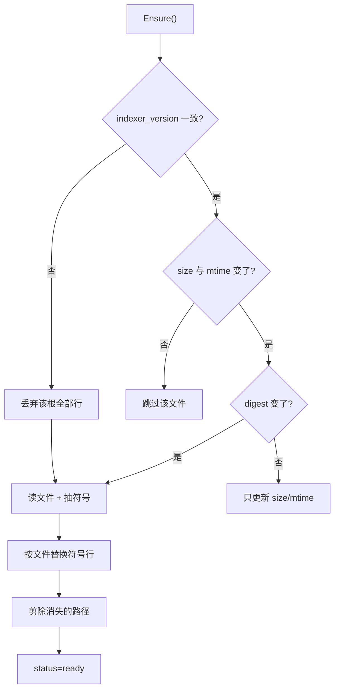
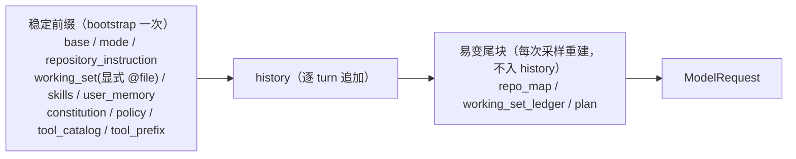

# RFC-001：Repo Context（Repo Index + Repo Map / WorkingSet + EvidenceSet）

> 状态：Implemented（M1 第三条主线 Repo Index，§2–§9；第四条主线 Repo Map / WorkingSet，§10；第五条主线 EvidenceSet 与 coding policy，§11）
> 关联：[ROADMAP §4.1 / §4.2 / §4.3 / §4.4 / §5.5 / §8.3](../ROADMAP.zh-CN.md)、[RFC-002 Verify Gate](RFC-002-verify-gate.zh-CN.md)、[RFC-005 Edit Transaction](RFC-005-edit-transaction.zh-CN.md)、[ARCHITECTURE](../ARCHITECTURE.zh-CN.md)、[USAGE](../USAGE.zh-CN.md)
> 影响面：`internal/platform/repowalk`、`internal/platform/symbols`、`internal/persist/repoindex`、`internal/persist/state/sqlite`、`internal/adapter/tool`、`internal/adapter/tool/search`、`internal/adapter/tool/interact`、`internal/adapter/tool/builtin`、`internal/observability/verify`、`internal/config`、`internal/observability/telemetry`、`internal/runtime/app/wire`、`internal/host/bench`、`internal/runtime/agent/workingset`、`internal/runtime/agent/repomap`、`internal/runtime/agent/evidence`、`internal/runtime/agent/repocontext`、`internal/runtime/agent/promptcontext`、`internal/runtime/agent/engine`、`internal/runtime/protocol`、`internal/host/cli`、`internal/host/tui`

本 RFC 决定 **agent 用什么方式"找到代码"**：仓库文件怎么枚举、符号索引存什么、精度诚实到什么程度、索引不可用时的契约是什么，Verify Gate 的 `affected` scope 凭什么敢给结论，**这些知识怎么进到每一次采样的 prompt 里**（§10），以及 **agent 凭什么认为自己的改动是对的**（§11）。

---

## 1. 问题

前两条主线做实了"改了什么"（Edit Transaction）与"验证了什么"（Verify Gate）。剩下的短板是**找对代码**：

- 仓库里没有任何符号索引，没有 AST，`go.mod` 里没有 tree-sitter。LSP 只接了 `publishDiagnostics`（`internal/adapter/lsp/check.go`），`workspace/symbol` 与 `textDocument/definition` 一个都没用。
- 也**不存在**任何"源文件 → 测试文件"的映射，所以 `verify` 的 `affected` scope 在配置加载期就直接报错。
- 三个搜索工具走纯 Go `filepath.WalkDir`；`project_map` **另有一套遍历规则**：不认 gitignore、不跳 `vendor`、不查二进制与大小。同一个仓库，两个工具看到两个不同的文件集合。

还有一笔当场就得还的性能债：旧的搜索对**每个目录和每个文件**各起一次 `git check-ignore` 子进程，并且要求强沙箱。索引必须遍历全仓库，沿用这条路径不可行。

## 2. 遍历层：一次 `git ls-files`，不写 gitignore 解析器

新增 `internal/platform/repowalk`，一次

```
git ls-files --cached --others --exclude-standard -z
```

拿到全部未忽略文件。nested `.gitignore`、`.git/info/exclude`、全局 excludes 的语义**全部由 git 保证**——我们不自己实现 gitignore 匹配，那是一个出名难写对的东西。非 git 仓库（或 git 不可用、命令失败）退回 `filepath.WalkDir` + 显式跳过表，结果里带 `source: git | walk`，调用方元数据也报 `enumeration`。

**已知限制：submodule 内的文件不出现在列表里。** `git ls-files` 不递归子模块，因此子模块里的代码既不进索引也不进搜索。这是本期接受的代价，记在这里而不是留给使用者自己发现。

三条实现上的取舍：

- **`vendor` / `node_modules` / `.git` / `.codehelper` 留在显式跳过表里**，即使 git 认为它们被跟踪。Go 项目 checked-in 的 vendor 目录一旦进搜索结果，模型会读到依赖的副本而不是仓库代码。代价是 `skipped_ignored` 元数据的口径变了：它现在数的是"按名字跳过的条目"，而 git 忽略的文件根本不会出现，因此不计数。
- **cached 条目仍要 stat**：索引里的文件可能已经删除。这一步和取大小/mtime 合并，顺带把符号链接排除（不跟随）。
- **文件策略集中在一处**：大小上限、二进制探测、UTF-8 校验，`SkipReason` 明确区分被拒原因。搜索、索引、`project_map` 从此共用同一份判定。

## 3. 符号抽取用语言启发式，不引 tree-sitter

遵循 ROADMAP §4.1 的"首期语言启发式 + LSP，可选 tree-sitter"。`internal/platform/symbols` 为 Go / Python / JS+TS / Rust / Java 各写一张行级规则表，产出 `name / kind / line / container / exported`；其余语言只进文件表，不进符号表。

kind 词汇跨语言统一（`function` / `method` / `type` / `class` / `interface` / `const` / `var`）：Python class 与 TS class 都是 `class`，Go struct 与 Rust enum 都是 `type`。跨语言查询才有意义。

**精度是明确标注出来的**：每个工具结果都带 `resolution: "lexical"`，`codehelper diagnostics` 的 maturity 里 `repo_index` 报 `lexical`。这不是免责声明，而是让读者知道：

- 字符串与注释里长得像声明的文本会被抽出来（有测试钉住这个已知边界）。
- 没有类型解析、没有 import 解析、没有继承关系、没有调用图。
- 因此**否定结论不可信**："索引里没有"不等于"仓库里没有"。

扫描有行数上界（每文件 50000 行），超过的部分不扫——一个几十万行的生成文件不该主导一次刷新。

## 4. 存储：SQLite v5，键是 `root_path`

schema v4 → v5 只加表：`repo_index_files`、`repo_index_symbols`（`ON DELETE CASCADE` 挂在 `(root_path, path)` 上）、`repo_index_meta`。

**不外键到 `workspaces`**：不带 `--data-dir` 的会话把索引放在 ephemeral 库里，那个库根本没有 workspace 行。用 `root_path` 文本键还顺带让一个库能存多个根，给以后的 VS Code multi-root 留了位置（本期仍只索引单根）。

写入**分批提交**（默认 128 个文件一个事务）。索引与 tasks / automations 共用同一个单连接串行库（`MaxOpenConns(1)` + WAL，`busy_timeout` 5s），一个大事务会让首次全量构建与任务写入互相等待。

## 5. 刷新：惰性、增量、可取消



- **第一次查询才构建**，不在 startup 付这笔钱：从不搜索的会话不该为索引等待。
- **便宜的新鲜度检查在前**：size + mtime 没动就不读文件；动了才算 digest 确认，digest 一致就只更新元数据不重写符号。
- **有界并发**（默认 `min(4, NumCPU)`）读文件与抽符号，`ctx` 取消**不记录完成**——中断的构建下次继续，不会留下一个自称 ready 的半成品。
- `IndexerVersion` 是抽取规则的版本号。规则一改就抬它，下次刷新整根重建，而不是让新旧行互相矛盾。

## 6. 降级契约：不可用要说出来，且不阻塞

这条是 ROADMAP §4.1 第 3 点的硬要求，有测试钉住。

| 状态 | 含义 | 符号工具 | 文本搜索 |
| --- | --- | --- | --- |
| `pending` | 已配置，尚未构建 | 正常（第一次调用触发构建） | 不受影响 |
| `ready` | 行与工作区一致 | 正常 | 不受影响 |
| `degraded` | 打不开 / 行读坏 / 构建被中断 | `AvailabilityUnavailable` + 原因 | **不受影响** |
| `disabled` | 本会话没有配索引 | `AvailabilityUnavailable` + 原因 | **不受影响** |

两个细节：

- **不可用是"报告"，不是"报错"**。调用一个索引没就绪的工具，返回的是带 `status: unavailable` 与原因的结果，模型会自然退回 `search_text`；同时 descriptor 把自己标成不可用，模型下一轮就不再计划这类调用。`ErrToolUnavailable` 属于可恢复失败，turn 不会因此终止。
- **失败两次就不再重试**。库连续两次不可信之后索引在本会话内保持 degraded，而不是每次调用都尝试重建——一个坏两次的数据库不会自己好起来。

## 7. 四个一等工具

| 工具 | 语义 | 边界 |
| --- | --- | --- |
| `search_symbol` | 按名字**子串**查声明，可按 kind / 路径前缀 / 是否导出过滤 | 只匹配符号名，不匹配 container |
| `search_definition` | 按名字**精确**查声明 | 同名多处全部返回，不做"最可能的那个"排序 |
| `search_references` | 在索引列出的文件里做**词边界**扫描，默认排除定义点 | 词法：注释与字符串里的同名文本会命中 |
| `search_related_tests` | 按语言命名约定把源文件映射到测试文件 | 无约定的语言不出现在结果里，与"有约定但没有测试"分开报 |

`search_references` **不建反向索引**：用索引给出的文件清单做扫描（省掉重新遍历与 ignore 判定），token 反向索引的存储代价与它能多带来的召回不匹配，留到基准证明不足之后再说。

四个工具的资源都声明为 repo tree read，走 Guard 的常规中介。

## 8. `affected` scope：只在能诚实映射时给结论

`verify.ScopeAffected` 的规则表刻意很短：

| 语言 | 映射 | 依据 |
| --- | --- | --- |
| Go | 改动文件的目录 → `go test ./dir/...`（多个目录合并成一条命令） | Go 的测试单元是包，改一个文件就是改一个包 |
| Python | 索引映射出的测试文件 → `python3 -m pytest <files>` | Python 有文件级命名约定 |
| 其他 | 进 `unmapped` | 猜一个 JS 或 Java 项目的测试命令，只会产生一个什么都没验证的 pass |

- **全都映射不出来 → `StatusUnavailable` 并列出路径**，不静默判过。
- **部分映射不出来 → 跑能跑的，收据 message 点名剩下的**。一个未被覆盖的改动必须在结论里可见。
- **配了 `command` 就以 command 为准**，并支持 `{paths}`（改动路径，按 shell 规则引用）与 `{packages}`（Go 包模式）占位。这既让用户能覆盖规则表，也让 benchmark 能像 `verify-gate-pass` 那样保持 hermetic。

映射本身来自 `repoindex.RelatedTests`：Go 按包收集目录里所有 `_test.go`（命名无法判断是哪个测试覆盖了哪个文件），Python / JS+TS / Java 按各自的命名与目录约定（含 `src/main/java` → `src/test/java`）。索引不 ready 时 mapper 返回错误，scope 报 unavailable——**没有证据就不给结论**。

配置校验随之放开：`scope` 接受 `affected`，`command` 允许配在 `repository` 与 `affected` 两个 scope 上，`TestVerifyGateConfigRejectsUnimplementedValues` 的 `affected` 子测试翻成"接受并生效"（`ask` 子测试保留）。

## 9. 装配

- **`openDurableRepositories` 提前到工具注册之前**。索引复用会话已有的 store 句柄：有 persistent 用 `persistent.SQLite()`，没有就用 ephemeral 库。这样**bench 也有真索引**，基准才能证明工具有效，而不是测一个永远 unavailable 的空壳。
- 索引句柄经 `builtin.NewWithIndex` 传到 search 包；`NewWithDependencies` 保持旧签名并传 nil，于是没有索引的调用方拿到的是"明确不可用"而不是"工具消失"。
- 新增 `[context.index]` 配置段（`enabled` / `max_file_bytes` / `max_files`），走常量、默认值、TOML、env、provenance、校验全套。索引默认**开**：符号工具就是为它存在的，而不能索引的仓库会自己降级。
- `telemetry` 的快照报 `repo_index_state`，`diagnostics` 的 maturity 报 `repo_index: lexical`。
- 顺手给 `promptcontext` 的 `tool_catalog` 分区补了默认预算：目录随注册工具（含 MCP 与插件）增长，本来没有上界。

## 10. Repo Map / WorkingSet：把索引与足迹送进每一次采样

前九节让 agent **能查**代码，这一节让它**开局就知道仓库长什么样、手里有哪些文件**。

出发点是一个硬卡点：`promptcontext.Assemble` 在 bootstrap 只调一次，结果拷进 `engine.Options.PromptContext` 后每次采样原样重放，唯一能在之后变的分区是 `plan`。因此 `wire.ExecOptions.WorkingSet` 那条链路虽然实现完整（`FileContext`、预算、截断、回执），却**没有任何 host 填过它**——是死代码。本节把 PromptContext 从"bootstrap 冻结"改成"**稳定前缀 + 每次采样重建的易变尾块**"。

### 10.1 结构：尾块，而不是插在中间



易变内容一律放在 history **之后**。prefix cache 的命中条件是"前缀逐字节相同"，把每次都变的内容插在中间，等于每次上下文变化都作废其后整段 history；放尾部只损失尾块自身。**`plan` 也一并从中间移到尾部**——每次 `update_plan` 原本都会抖一次缓存，这是顺带还掉的一笔债。这正是 ROADMAP §8.3 写明的目标顺序（`policy → repository instruction → tools → volatile turn`）。

尾块以**请求局部切片**追加，不写 history、不参与 replay，沿用预算提醒（`maybeInjectBudgetReminder`）已经证明可行的做法。注入点在 `checkBudget` **之前**，所以尾块参与超限判断；代价是极端情况下尾块自身可能触发 compact，因此预算上限必须留余量。

### 10.2 角色选 `RoleSystem`，以及 Anthropic 的约束

尾块是系统提供的上下文而不是用户发言，语义上就该是 `RoleSystem`。更实际的理由：Anthropic 会把所有系统消息抽到顶层 `system` 字段；用 `RoleUser` 会在 messages 里造出连续 user 角色。

encode 已把 `system` 发成 text block 数组（§8.3）：第一个非 system 角色之前为稳定前缀（末块可带 `cache_control`），其后的 turn 尾块各自成 block、不加断点——避免每 turn 击穿前缀。

### 10.3 两种刷新频率：尾块每采样重建，索引快照每 turn 取一次

- **工作集账本是内存结构**，重渲染近乎免费，所以**每次采样都重建**。好处是同一 turn 内刚读过、刚改过的文件当次就出现在工作集里（`working-set-evolution` 基准断言的正是同 turn 第二个请求）。
- **`Index.Ensure` 要 stat 全仓库**，所以仓库地图**每 turn 只取一次快照**，由 `repocontext.Provider` 按 turn 号缓存。

由此产生一个可预期的不对称：**同 turn 内新读的文件立刻进工作集，但它的符号轮廓要等下一 turn**。这是"不为每次采样走一遍工作区"的价格，写在这里以免被当成 bug。

### 10.4 自动工作集只给路径与来源，不注入内容

对齐 §4.2 的 L2「按需文件内容」：内容由模型自己用 `file_read` 取。它读过的内容本来就在 history 里，再注入是重复计费且没有上限。**显式 `@file` / `--file` 仍走 bootstrap 的内容注入**（`active_file` 语义不变），两条路径职责分明：一条是用户点名要模型看的内容，另一条是运行时对"哪些路径还相关"的提醒。

### 10.5 相关分：来源权重 + turn 衰减，critical 不衰减

账本（`internal/runtime/agent/workingset`）记 `Path / Sources / FirstTurn / LastTurn / Critical`，五类来源各有权重：

| 来源 | 从哪来 | 语义 |
| --- | --- | --- |
| `pinned` | CLI `--file`、编辑器附件 | 用户点名，critical |
| `plan` | `update_plan` 的 `critical_files` | 计划点名，critical |
| `edited` | `TurnDiffTracker` 观测到的写入 | 权重最高的非 critical 来源 |
| `diagnostic` | post-edit 诊断报出的路径 | 改错了的地方 |
| `verified` | 验证门禁跑过的路径 | 验过的地方 |
| `read` | 工具结果元数据 `canonical_path` | 看过的地方 |

分数 = 来源权重之和（有上界，避免"来源全中"的路径压死其余）÷ 距 `LastTurn` 的 turn 数衰减，整数运算保证排序可复现。`critical` 抬到所有会衰减的条目之上，且**不占 `max_entries` 配额**——pin 两个文件把刚编辑的文件挤出去，正好与 pin 的意图相反。

账本**跨 turn 存活**（区别于每 turn 重置的 `turnDiff`），`Engine.Fork` 深拷，compaction 摘要与 `turn.receipt` 都改读实时账本而不是冻结的 `options.WorkingSet`。**不持久化**：`--resume` 之后账本从空重建，因为历史事件里没有足够信息还原每条路径的来源。这是已知缺口。

### 10.6 降级：尾块只会变短，不会消失，也不会失败 turn

与 §6 的契约一致，且更严格——尾块在**每一个**请求里，任何失败都不能传播：

| 情况 | 尾块表现 |
| --- | --- |
| 索引 `disabled` / `degraded` / `pending` | `repo_map` 段替换成一行原因说明，并告诉模型"没列出不等于不存在，可用 `search_text` 核实" |
| 索引 ready 但仓库为空 | 该段不产出消息，只留回执 |
| 某段被配置关掉 | 该段既无消息也无回执（"没请求"与"请求了但为空"是两件事） |
| 预算截断 | 保留前缀 + 一行"本段被预算截断"的说明，说明的长度**预先从预算里扣掉**，否则前缀截断会把它自己切掉 |
| 工作集为空（会话刚开始） | 该段不产出消息 |

### 10.7 可观测

- `turn.receipt` 新增 `context_sections`（每段的 `kind` / `digest` / `original_bytes` / `retained_bytes` / `truncated` / `truncation_reason`）与 `read_paths`。后者顺带关掉了一个已知缺口：`protocol.UncollectedReceiptSections` 里的 `"read_paths"` 之所以未采集，就是因为没有地方汇总读过的路径——账本天然产出它。
- `telemetry` 快照报尾块字节数与截断次数，长会话的上下文成本因此可量化。
- TUI `/context` 从桩改成打印最近一次上下文回执的摘要行（不新增面板）。

### 10.8 配置

新增 `[context.repo_map]`（`enabled` / `max_bytes` / `max_directories`）与 `[context.working_set]`（`enabled` / `max_entries` / `max_bytes`），走常量、默认值、TOML、env、provenance、校验全套（仿 `[context.index]`）。两段默认**开**，默认预算各 8 KiB：尾块进入每一次采样，没有上限的话长会话的 input token 会失控。

### 10.9 与计划的偏离

- 计划里的尾块标记头是单一的 `[repo_context turn=N index=<status>]`；实现给了**每段各自的标记头**（`[repo_map turn=N index=<status>]`、`[working_set turn=N]`）。原因是两段各自成消息、各自有预算与回执，共用一个头会让被截断的段落归属不明。基准断言随之改成按段头匹配。
- 计划未写截断说明的预算处理；实现**预先扣除说明长度**，否则保留前缀的截断会连说明一起切掉，模型就分不清"被截断"和"不存在"。

## 11. EvidenceSet 与 coding policy：把"知道什么"和"还没证明什么"分开

§10 让 agent 知道**手里有哪些文件**。这一节回答更尖的一个问题：**它凭什么认为自己的改动是对的**。

出发点是一次检查的结果：`rg EvidenceSet internal/` 零命中，但 §4.4 列的五条 policy 里**已有三条由机制保证**，不需要再实现一遍——第 1 条"先读仓库约定与构建入口"由 `repository_instruction` 分区与仓库地图的构造保证；第 3 条"改前必须有 read"由 guard 的三处 `ValidateWrite` 硬拦（失败按可恢复失败回灌模型）；第 4 条"先受影响范围再扩大"随 `affected` scope 打开（§8）。所以本节只做剩下的两条，加上把证据本身结构化。

### 11.1 三个取舍

**（a）只记观测到的，不记模型自述的。** §4.4 把"当前假设"列在第一项，但假设无法观测——要它就得新加一个 `record_evidence` 工具或扩 `update_plan`，让模型自己申报。本仓库的既有纪律是反过来的：收据的 `Changes` 来自前后指纹而不是工具参数，`MaturityStub` 宁可自曝也不假装。一个会自述证据的模型同样会自述"我已经验证过了"，那样的账本比没有账本更危险。因此 EvidenceSet 只装两样东西：

- **事实**：某个工具在某个 turn 报出了某个路径/符号，属定义、引用、测试、配置还是纯文本命中；
- **风险**：从事实的**差集**推出来的——改了但没验证、改了但没读过、改了但诊断未清。风险是派生的，所以证据一到就自己消失，不需要谁去清除。

**「模型自述的假设」明确记为不做。**

**（b）提醒是软的。** §4.4 第 5 条自己就写了"软提醒"。同一次搜索换个 `max_results` 重跑是合理行为，拦下来只会让模型多绕一圈。所以重复调用不拦，只在尾块里说一句"这次搜索和上次参数完全相同，答案不会变"。**唯一的硬约束仍然只有 read-before-edit。**

**（c）静态方法进稳定前缀，易变证据进尾块。** coding policy 正文是常量，进 `Assemble` 的稳定前缀，字节恒定因此不伤 prefix cache；事实/风险/提醒每次采样都变，进 §10 建好的易变尾块。**尾块内部顺序是"提醒 → 风险 → 事实"**——截断保前缀，所以最该被读到的必须排最前：一句"你还没验证 server.py"比又一遍路径清单值钱。

### 11.2 工具元数据契约：分类信息终于有地方放

分类必须**由工具产出**，因为只有工具知道自己在回答哪个问题：`search_definition` 报出来的就是定义，`search_references` 报出来的就是引用，这是语义而不是猜测。

`tool.Result` 因此新增 `MetadataEvidence = "evidence"` 与 `EvidenceHit{Kind, Path, Line, Symbol}`，放在 `tool` 包而不是 `search` 包：多个生产者要设它，engine 已经在读 `tool` 的类型。命中放在**元数据**而不是只在 JSON 正文里，是为了让想记账的调用方不必去解析每个工具各不相同的 payload 形状——正文是模型的视角，元数据是运行时的视角。

| 工具 | 分类 | 依据 |
| --- | --- | --- |
| `search_definition` / `search_symbol` | `definition`（带 `Symbol` 与行号） | 工具语义 |
| `search_references` | `reference`（每文件一条：一个符号在同一文件里用四十次，仍然只是一处要看的地方） | 工具语义 |
| `search_related_tests` | `test` | 工具语义 |
| `search_text` / `search_project` / `search_files` | `IsTestPath` → `test`，`IsConfigPath` → `config`，其余 `text_match` | **路径名启发式** |

最后一行是本节精度最弱的一环，也因此写在这里：`IsConfigPath` 与仓库地图的 build 名单**共用同一份清单**（`repoindex.IsBuildManifest`），免得同一个 `go.mod` 在两处得到两种答案；而通用数据格式（`.json`、`.csv`）**故意不算配置**——它们同样常是 fixture，标错比不标更糟。每次调用进账本的命中数另有上限（32），一次 grep 不该灌满账本。

**这同时补掉了 §4.3 挂着的"search/LSP 命中未计入工作集来源"**：命中路径以新的 `SourceSearch` 进工作集，权重低于 `read`——一次 grep 的命中比一次真读弱。

### 11.3 跨 turn 的账，和只算一个 turn 的账

两类东西的生命周期刻意不同：

- **事实、改动、读过的指纹、发出的 handle 跨 turn 累积**。"第 3 turn 改的、第 5 turn 还没验证"正是这个账本存在的理由；指望 `turnDiff` 不行，它每 turn 清零。
- **调用计数每 turn 清零**。新 turn 里重复一次搜索通常是新问题，把它当浪费会制造噪音。

一次新的写入**作废该路径上一次的验证结论**：两个 turn 前验过的东西，对刚刚替换掉它的内容什么都没说。

三类提醒各有一条止损：重复读只在**当前 turn** 发生时才说（旧的已成往事，占位只会挤掉活的建议）；未消费的 handle 只在**发放它的 turn 之后**才说（发放当次的工具结果自己已经带了通知），且最多说两个 turn——模型决定不要的东西不该被念一整个会话。

### 11.4 观测点

全部挂在 `runTools` 已有的观测循环上（紧邻 `turnDiff.Record` / `observePath`），因此不新增任何一次工具调用、一次文件读或一次子进程：

| 观测 | 来源 | 记什么 |
| --- | --- | --- |
| 事实 | `Metadata[evidence]` | `Observe` + `observePath(SourceSearch)` |
| 重复读 | `Metadata[content_sha256]` + `canonical_path` | 同内容重读（这两个键引擎本来就拿到了却没用） |
| handle | `Metadata[handle]` 与 `result_get` 的参数 | 发放 / 消费 |
| 重复调用 | 调用前的 `name` + `arguments` | 原始串 `TrimSpace` 后比较 |
| 改动 | 写工具成功 | `MarkChanged(path, turn, hadRead)`，`hadRead` 查账本里该路径有没有 `SourceRead` |
| 验证 | `verifyGate.evaluate` **通过**时 | `MarkVerified`——失败的门禁证明的恰好是相反的事 |
| 诊断 | `recordTurnDiagnostics` | `MarkDiagnostics(path, open)`，干净的一次会把标记清掉 |

**已知局限：重复调用比较的是模型写下的参数串。** 语义等价但键序或空格不同的两次调用不算重复。规范化 JSON 能修掉一部分，但不同工具对参数缺省值的解释不同，规范化会带来假阳性——一个漏报的提醒无害，一个假阳性会让模型不敢重试。

### 11.5 两个新分区

- **稳定前缀 `coding_policy`**：正文 ≤700 字节，五条写成模型能照做的祈使句。其中**已被机制强制的两条明说自己是机制**（"改前先读。这条是强制的：未读或指纹过期的写入会失败，错误里会说要重读什么"）——一个知道规则是机械的模型会停止为它花推理，并在踩到时直接相信错误消息。只在 `execution.Tools` 为真时注册（与 `ToolPrefix` 同条件）：没有工具的会话读一份工具使用方法是纯浪费。
- **易变尾块 `evidence`**：段头 `[evidence turn=N]`，三小节分别是 `wasted effort:` / `unproved, and yours to close:` / `what lookups established:`。风险以人话呈现（`changed, nothing verified it`）而不是标识符——被要求补上一个缺口的模型不该先去解码一个枚举值。

尾块要拿到证据，`RepoContext` 的入参收成了一个结构体（`promptcontext.TurnState{Turn, WorkingSet, Evidence}`）而不是继续加参数：每个尾块消费方要的都是同一份 turn 快照，往里加东西不该逼所有实现改签名。

### 11.6 收据、compact 与遥测

- `protocol.ExecutionReceiptData.Evidence` 新增 `{facts, risks, reminders}`，`UncollectedReceiptSections` 里的 `"evidence"` 随之划掉（只剩 `unreverted_side_effects`）。这份收据现在能回答"这次改动凭什么"，而不只是"改了什么"。
- **compact 只做最小改动**：`formatContextSummary` 末尾追加一行 `UnverifiedChanges:`。摘要正是模型丢失这类知识的时刻，不能等——但完整的"目标/事实/改动/失败/待办"重写属于结构化 compact，留给下一条主线，本节不动 `summarizeMessages`。
- `telemetry` 加 `EvidenceRisks` / `PolicyReminders` 两个计数器，在尾块**实际渲染**时计入：记"说出去了几条"而不是"内部攒了几条"。

### 11.7 与计划的偏离

- 计划写 `MarkDiagnostic(path)` 是单向标记；实现是 `MarkDiagnostics(path, open bool)`。单向标记会让一个已经修好的文件在剩下的会话里一直被报为诊断未清，而 post-edit 诊断本来就会给出干净结论，双向标记是免费的。
- 计划把提醒和风险的呈现留白；实现给风险配了**自然语言标签**，理由同 §10.6 的截断说明：一个模型分不清 `changed_without_read` 和"这文件没读过就被改了"时，会把前者当成噪音跳过。

## 12. 明确不做
- embedding / 语义检索（ROADMAP §4.5 明确"只在符号索引与基准证明不足后引入"）。
- LSP `workspace/symbol` / `definition` / `references`：索引先立住，LSP 作为以后的精度补强。
- 跨文件调用图、类型解析、继承关系。
- 文件系统 watch 增量（本期为按需比对刷新）。
- 多 workspace root 并行索引（表结构已留位）。
- submodule 内容（见 §2）。
- **符号轮廓的依赖邻域 / 调用图**：§10 的 L1 只给工作集文件自身的声明轮廓，跨文件邻域需要真解析，而索引是词法的。
- **L3 handle 延迟读取的新通道**（已有 `tool.ResultStore`，本期不扩展）。
- **账本持久化与 `--resume` 还原**（见 §10.5）。
- **Anthropic `cache_control` / system block 数组化**、OpenAI Chat 的 `prompt_cache_key`（见 §10.2 的约束）。
- **VS Code 的 selection / 当前文件作为工作集来源**（RFC-004 范围）；HTTP / ACP 的工作集操作码。
- **模型自述的假设与证据申报工具**（见 §11.1a）。
- **LSP / 类型级的引用与定义判定**：分类仍然是词法 + 路径启发式。
- **命令输出作为证据**：shell stdout 无结构，解析出来的"事实"不比没有更可信。
- **证据持久化与跨会话恢复**：与工作集账本同一个缺口（§10.5）。
- **把重复调用升级成硬拦**（见 §11.1b）。
- **结构化 compact**（"目标/事实/改动/失败/待办"重写，下一条主线）。

## 13. benchmark 覆盖

| 任务 | 锁定的性质 |
| --- | --- |
| `symbol-lookup` | 一次 `search_symbol` 定位声明，结果带 kind 与 `lexical` 标注 |
| `symbol-references` | 词边界生效（`Subtotal` 不算 `Total` 的使用），定义点被排除 |
| `related-tests-affected` | `search_related_tests` 映射出 `_test.go`；`affected` scope 把改动收敛到 `./pkg/...` 并把 `{packages}` 交给命令 |
| `index-degraded` | 索引关掉时符号工具报错说明原因，`search_text` 照常工作，turn 仍然完成 |
| `repo-map-orientation` | "auth 代码在哪个目录"**零工具调用**答出，fixture 断言仓库地图确实到了 provider（否则会变成"恰好猜对") |
| `working-set-evolution` | 第一步读的文件出现在**同 turn 第二个请求**的工作集里，并带 `read` 来源与 turn 号 |
| `context-budget-truncation` | `max_bytes` 压到下限时该段报截断、请求里带截断说明、turn 仍然完成 |
| `evidence-search-classification` | 定义与引用**分列**在下一次采样的尾块里，各带产出它的工具；收据的 `evidence.facts` 报两种 kind |
| `evidence-unverified-change` | 门禁关闭下的改动被报为 `changed_without_verification`（尾块与收据各一处），且 `not_collected` 不再含 `evidence`；改动读过在先，所以 `changed_without_read` 不得同时出现 |
| `policy-repeat-search-reminder` | 同参数搜索连发两次**照常执行、turn 照常完成**，只在下一次采样里挨一句提醒——软提醒的边界 |

`related-tests-affected` 用 `test "{packages}" = "./pkg/..."` 而不是真跑 `go test`：基准必须 hermetic（不依赖工具链），而这条命令恰好证明了映射结果确实到达了命令行。

## 14. 未决问题

- **首次全量构建的耗时没有基准**。惰性构建把它推到第一次符号查询上，那一次调用在大仓库上可能明显变慢；需要一个"索引冷启动"基准来决定是否要后台预热。
- **`skipped_ignored` 语义变更的外部影响**。它现在只数按名字跳过的条目，读这个字段做判断的宿主 UI 需要跟着改口径。
- **词法抽取的误报率没有量化**。字符串/注释里的假阳性有测试记录为已知边界，但没有测出它在真实仓库上的比例，也就无法判断何时该上 tree-sitter。
- **尾块的净收益没有量化**。它抬高每次采样的 input token（有预算上限、回执可见），换来的是少几次探索性工具调用；要判断这笔交换是否划算，需要一个"同一任务开/关尾块"的对照基准，目前没有。
- **衰减系数是凭直觉定的**。"一 turn 沉默掉三分之一"没有数据支撑，只有排序可复现这一条保证；真实长会话上是否该更慢或更快，同样要基准说话。
- **路径名分类的准确率没有量化**。`test` / `config` 靠命名约定判定，一个只放配置的 `.go` 文件仍会读成代码；错标的比例没有测过，因此也无法判断何时该改成读文件内容。
- **coding policy 是否真被遵守没有量化**。`PolicyReminders` 数的是"提醒说了几次"，不是"提醒之后行为变了没有"；要回答后者，需要一个"同一任务开/关 policy"的对照基准。

## 15. 验收

- `gofmt` / `go vet` 干净，`go test ./...` 与 `go test -race -p 1 ./...` 全绿。
- benchmark 套件 20/20 通过，且 `CachedTokens` 断言未退化（尾块放在最后、policy 放在稳定前缀，正是为了不打穿前缀缓存）。
- 关键断言：git 决定 ignore 语义、非 git 仓库退回 walk、`vendor` 仍被跳过、增量只重扫变更文件、删除文件被剪除、取消不留半状态、索引不可用不影响文本搜索、`affected` 映射不出来时不判过。
- §10 的关键断言：尾块不进 history、同 turn 第二次采样能看到刚读的文件、`RepoContext` 为 nil 时行为不变、`canonical_path` 元数据键被钉住（改它会静默让工作集变空）、critical 不被 `max_entries` 挤出、截断说明进得去且不超预算。
- §11 的关键断言：`nil *Set` 接受一切观测且什么都不报（接线缺一处不会 panic）、新的写入作废旧的验证结论、诊断转干净后风险消失、发放 handle 的当次不提醒、`Fork` 继承证据但不共享后续、预算切到最小时**提醒仍在**（顺序就是为此定的）、证据为空时该段连回执都不产出。
